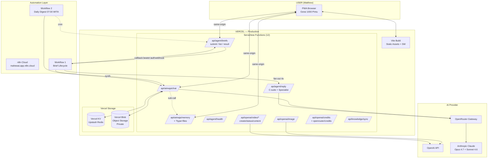
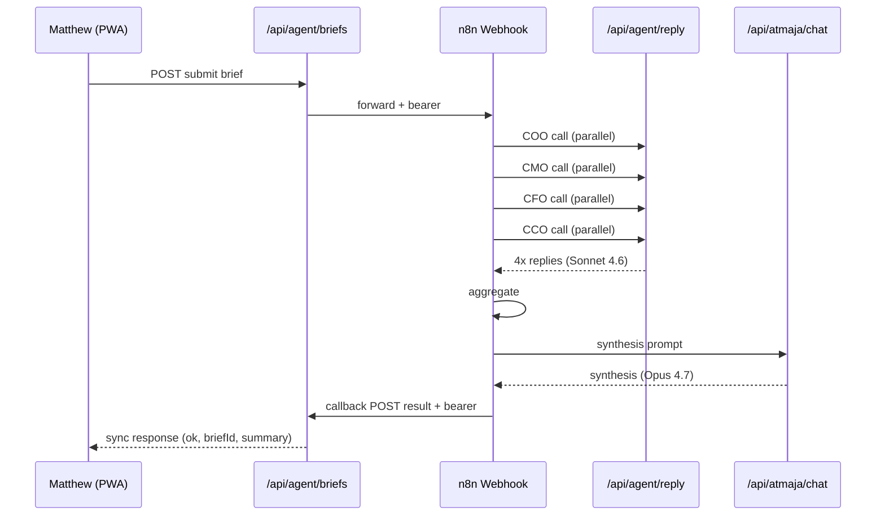
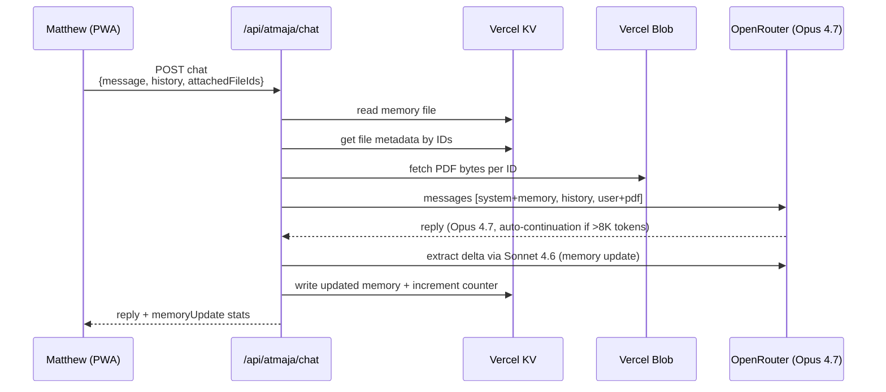
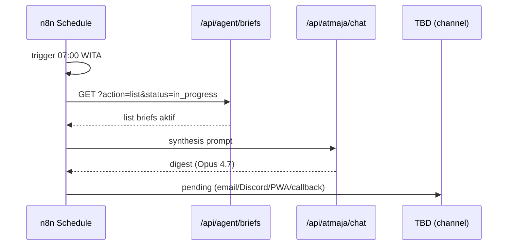
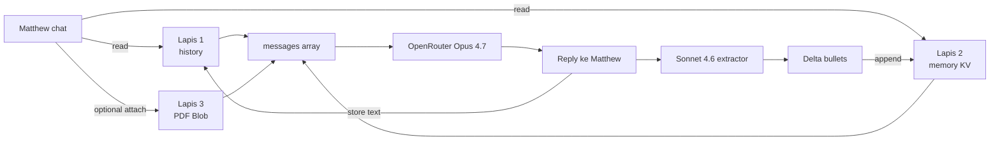

# Gerai 1000 Pintu — AI Department

**Arsitektur, Memori, Workflow, dan Roadmap Pengembangan**

| Versi | 1.0 |
|-------|-----|
| Tanggal | 24 Mei 2026 |
| Pemilik | Matthew (mattlouai@gmail.com) |
| Status | Production live di https://gerai.mahewwork.com |
| Mode | Solo-tenant — hanya Matthew yang pakai |

---

## Daftar Isi

1. Ringkasan Eksekutif
2. Identitas & Konteks Bisnis
3. Arsitektur Saat Ini (Live)
4. Memory Stack 3-Lapis
5. Security Architecture
6. AI Personas (Struktur Organisasi AI)
7. n8n Workflow Orchestration
8. Reference Lengkap (Endpoints, URL, IDs)
9. Roadmap & Arah Pengembangan
10. Gap Analysis — Yang Masih Kurang
11. Skill Assistant yang Tersedia
12. Operating Procedures
13. Lampiran (Cost, Token Reference)

---

## 1. Ringkasan Eksekutif

**Gerai 1000 Pintu** adalah platform retail destination "Dunia Pintu Indonesia" yang dibangun Matthew sebagai solo founder. Untuk mengoperasikan bisnis multi-pilar (Product, Knowledge, Service) dengan tim kecil (lean store 2 orang per toko + Door Expert generalist terpusat), Matthew bangun **AI Department** sebagai partner berpikir yang menggantikan fungsi tim level menengah-atas.

**AI Department** = Atmaja (CEO) + 4 C-suite (orchestrator) + 12 specialist, berjalan di atas stack web app modern (Vite/React PWA + Vercel serverless + OpenRouter LLM).

**Status saat ini (24 Mei 2026):**

- ✅ PWA live, Atmaja chat dengan vision + native PDF reading
- ✅ Memory persistent 3-lapis (working memory 100 pesan, long-term file KV, PDF library Blob)
- ✅ 2 n8n workflow live (Brief Lifecycle synchronous + Daily Digest scheduled)
- ✅ 12 endpoint server-hardened (strict origin + bearer auth)
- ⏳ Pending: 2FA, channel output Daily Digest, workflow #3-5

**Cost steady-state estimate:** $30-45 per bulan untuk solo intensive use.

---

## 2. Identitas & Konteks Bisnis

### 2.1 Bisnis Gerai 1000 Pintu

| Aspek | Detail |
|-------|--------|
| Nama lengkap | Gerai 1000 Pintu |
| Tagline | Dunia Pintu Indonesia |
| Entitas hukum | PT Selaras Lawang Sewu (SLS) |
| Brand pertama | AMK (di bawah SLS) |
| Lokasi pilot | Balikpapan, Kalimantan Timur |
| Founder | Matthew |
| Tim | Solo (Matthew) + AI Department |
| 3 Pilar | Product (katalog) · Knowledge (edukasi) · Service (Door Expert + Cash & Delivery) |
| Differentiator | Lean Store 2 orang, Self-Ordering Kiosk, Konsultasi Terpusat |
| Brand canon | Calm refined premium curated retail. NO em-dash. "Tempat" bukan "rumah". Nama "Gerai 1000 Pintu" lengkap. |
| Target Q3 2026 | Launching AMK wave 1 di Balikpapan minggu ke-2 Juli |
| Vendor pintu kayu | PT Selaras Lawang Sewu (lead time 21 hari, NET 30) |
| Budget marketing wave 1 | Rp 50 juta (Meta Ads + IG influencer mikro Kaltim) |

### 2.2 Aplikasi Gerai

| Aspek | Detail |
|-------|--------|
| Production URL | https://gerai.mahewwork.com |
| Alternate URLs | https://gerai-app-topaz.vercel.app · https://gerai-app-git-main-mahewais-projects.vercel.app |
| Repo | https://github.com/MahewAi/Mahew (private, branch main) |
| Tech stack | Vite + React 18 + TypeScript + Tailwind CSS + framer-motion |
| Routing | react-router-dom (PWA mode) |
| Hosting | Vercel (Hobby plan, Fluid Compute enabled) |
| Auto-deploy | Push ke main → Vercel build + deploy ~1 menit |
| PWA features | Service worker (Workbox), manifest, offline cache |
| Mobile-first | Iya — primary target Matthew gunakan dari iPhone/iPad |

### 2.3 AI Department (Struktur)

```
Atmaja (CEO)
├── Opus 4.7 via OpenRouter (content tier)
├── Chat: /atmaja
└── Synthesis: Daily digest + brief result
    │
    ├── COO (Sonnet 4.6) — Operations
    ├── CMO (Sonnet 4.6) — Marketing
    ├── CFO (Sonnet 4.6) — Finance
    └── CCO (Sonnet 4.6) — Creative & Content
        │
        └── 12 Specialist (Sonnet 4.6)
            ├── HR Systems
            ├── Production Manager
            ├── Curator
            ├── Brand Strategist
            ├── Market Researcher
            ├── Sales Strategist
            ├── Innovation Scout
            ├── Business Designer
            ├── Financial Analyst
            ├── Document Writer
            ├── Editorial
            └── Web Researcher
```

---

## 3. Arsitektur Saat Ini (Live)

### 3.1 Diagram Tingkat Tinggi



### 3.2 Komponen Per Layer

**Frontend (Vite + React)**
- Path: `src/`
- Entry: `src/main.tsx`
- Routes: `/`, `/atmaja`, `/inbox`, others
- Key components: `Atmaja.tsx` (chat dengan library drawer), `Inbox.tsx` (briefs list)
- Lib helpers:
  - `atmajaClient.ts` — wrap chat API call
  - `atmajaFilesClient.ts` — wrap file library calls
  - `briefStore.ts` — localStorage brief management
  - `learningMemory.ts` — interaction lessons (local)
  - `privacyGuard.ts` — feature flags (VITE_GERAI_*)

**Backend (Vercel Serverless Functions)**

Total **12 functions** (di Hobby plan cap). Daftar lengkap di section 8.

**AI Runtime**
- Primary gateway: OpenRouter (`https://openrouter.ai/api/v1/chat/completions`)
- Model floor: **anthropic/claude-sonnet-4.6** minimum (per arahan Matthew, tidak boleh di bawah)
- Content tier: Opus 4.7 (Atmaja CEO synthesis + brief analysis)
- Orchestration tier: Sonnet 4.6 (C-suite + specialist replies + memory extractor)
- Fallback: kalau primary kosong/timeout, retry ke Sonnet 4.6
- Native PDF reading: Claude Opus/Sonnet 4.x baca PDF langsung via OpenRouter file content block
- Image: OpenAI gpt-image-1 family + dall-e-3 (legacy)
- Video: OpenAI Sora 2 (async, polling)

**Storage**
- **Vercel KV (Upstash Redis)** — long-term memory file + file index + counters
- **Vercel Blob (private store)** — PDF binary storage
- **localStorage browser** — chat thread + brief list per device

**Orchestration**
- **n8n Cloud** (`mahewai.app.n8n.cloud`) — workflow automation
- OAuth via MCP (already authenticated)
- 2 workflow live, 3 lainnya planned

### 3.3 Data Flow Per Use Case

**A. Brief Lifecycle (synchronous request/response)**



**B. Atmaja Chat dengan Memory + PDF**



**C. Daily Digest (scheduled cron)**



---

## 4. Memory Stack 3-Lapis (DETAILED)

Atmaja punya memory yang efektif kayak Claude.ai — terus berkembang dan tidak hilang antar sesi. Implementasi: 3 lapis terpisah dengan tanggung jawab berbeda.

### 4.1 Lapis 1 — Working Memory (Per Session)

| Property | Value |
|----------|-------|
| Storage | localStorage browser + payload chat |
| Capacity | 100 pesan terakhir × 15.000 karakter per pesan |
| Persist | Survives close tab/browser/OS restart (browser yang sama) |
| Cross-device | TIDAK (per device) |
| Total context window utilization | ~1.5 MB worst case (200K token Opus budget masih lebar) |
| Implementation file | `api/atmaja/chat.js` `normalizeHistory()` + `src/lib/atmajaClient.ts` `stripHistory()` |

**Effect:** Dalam 1 hari kerja, Atmaja tidak lupa konteks yang baru dibahas di session aktif.

### 4.2 Lapis 2 — Long-term Memory File (Cross-Session)

| Property | Value |
|----------|-------|
| Storage | Vercel KV (Upstash Redis) |
| Key | `atmaja:memory:matthew` (+ `:version` + `:turns`) |
| Format | Markdown file, sectioned by topic |
| Capacity | 50.000 karakter total (sufficient untuk hundreds of facts) |
| Auto-update | Iya — tiap turn substantive, Sonnet 4.6 extract delta + append |
| Skip trivial | User < 30 char ATAU Atmaja reply < 200 char → skip extractor |
| Persistence | Permanent across device/browser/session |
| Endpoint | `GET/PUT/DELETE /api/atmaja/memory` (bearer atau same-origin) |
| Implementation | `api/atmaja/memory.js` |

**Struktur memory file:**

```markdown
# Atmaja Memory — Gerai 1000 Pintu

## Strategi & Keputusan
- ...

## Brand Canon
- ...

## Operations & Vendor
- ...

## Tim & People
- ...

## Briefs Aktif
- ...

## TODO / Pending
- ...

## Misc / Konteks Personal
- ...

## Files / Dokumen
- (file metadata bullets)
```

**Auto-update flow:**

1. User kirim pesan ke `/api/atmaja/chat`
2. Server **READ** memory dari KV, inject ke system prompt Atmaja
3. Atmaja (Opus 4.7) jawab dengan konteks penuh
4. Server kirim ke Sonnet 4.6 extractor: _"ekstrak info baru worth disimpan"_
5. Sonnet output **delta** (section + bullets baru) — bukan full rewrite
6. Server parse delta, merge ke memory file, dedupe, update timestamp
7. **WRITE** kembali ke KV, increment version + turn counter
8. Response include `memoryUpdate` field untuk visibility

**Cost extractor:** ~$0.03 per turn substantive (Sonnet 4.6 dengan small output). Skip trivial turns auto-cut cost.

### 4.3 Lapis 3 — File Library (PDF Persistence)

| Property | Value |
|----------|-------|
| Storage | Vercel Blob (private store) |
| Index | Vercel KV key `atmaja:files:matthew:index` (array) |
| Capacity | 50 files max × 2.6 MB raw PDF each (~3.5 MB base64 cap) |
| File MIME | application/pdf only (untuk MVP) |
| Auth fetch | SDK `get()` dengan `access: 'private'` + BLOB_READ_WRITE_TOKEN |
| Endpoint | `GET/POST/DELETE /api/atmaja/memory?type=files` |
| Reference dari chat | Payload field `attachedFileIds: ['file_xxx']` (max 3 per turn) |
| Auto-extracted metadata | page count (via regex parser), uploaded timestamp, size, description |
| Memory integration | Auto-append entry ke section "## Files / Dokumen" di memory file |

**Magic moment:**
- Hari 1: Matthew upload PDF business plan via Library drawer di PWA
- Hari 2-N: Matthew tanya Atmaja tentang Bab 5 → Atmaja ingat ada file di library + isinya dari memory + bisa fetch ulang dari Blob

**Implementation:**
- Upload via PWA: drawer Library → tombol Upload PDF → base64 → POST `/api/atmaja/memory?type=files`
- Attach ke chat: drawer → tombol Attach (max 3) → fileId masuk ke payload chat
- Server `chat.js` resolve `attachedFileIds`: `getFileById` → `fetchFileBase64` (via blob SDK) → inject sebagai PDF content block ke OpenRouter
- OpenRouter pass ke Opus 4.7 native PDF reading

### 4.4 Memory Stack Lifecycle



---

## 5. Security Architecture

### 5.1 Auth Pattern (`api/_shared.js`)

Semua 12 endpoint pakai shared helper `isRequestAllowed(req)`:

```
Path 1: Bearer token valid → allowed (server-to-server, admin curl, n8n callback)
Path 2: Browser same-origin (gerai.mahewwork.com) OR configured allowlist → allowed
Else: 403 reject dengan reason
```

**Token tunggal:**
- `N8N_WEBHOOK_TOKEN` (= `ATMAJA_BRIDGE_TOKEN`, same value) — 64 hex chars
- Stored di Vercel env vars (Production + Preview + Development, scope "Sensitive")
- Match either env var name

### 5.2 Endpoint Hardening (All 12 Endpoints)

| Endpoint | Method | Auth | Rate Limit |
|----------|--------|------|------------|
| `/api/atmaja/chat` | POST | bearer OR same-origin | 12/min/IP |
| `/api/atmaja/memory` | GET/PUT/DELETE | bearer OR same-origin | none |
| `/api/atmaja/memory?type=files` | POST/GET/DELETE | bearer OR same-origin | none |
| `/api/agent/reply` | POST | bearer OR same-origin | 24/min/IP |
| `/api/agent/briefs` (submit) | POST | bearer OR same-origin | 20/min/IP |
| `/api/agent/briefs?action=result` | POST | bearer only | 30/min/IP |
| `/api/agent/briefs?action=list` | GET | bearer only | n/a |
| `/api/agent/health` | GET | public | n/a |
| `/api/knowledge/sync` | POST/GET | bearer | 20/min/IP |
| `/api/openai/image` | POST | bearer OR same-origin | 6/min/IP |
| `/api/openai/video/*` | various | bearer OR same-origin | varies |
| `/api/openai/credits` | GET | bearer OR same-origin | n/a |
| `/api/openrouter/credits` | GET | bearer OR same-origin | n/a |

### 5.3 Storage Privacy

- **Vercel KV**: encrypted at rest, only accessible via SDK + injected env var
- **Vercel Blob (private)**: URLs include auth signature, not anonymously accessible
- **GitHub repo**: private (only Matthew + collaborators)
- **`.env.local`**: gitignored, only on dev machine

### 5.4 Content Security Policy

`vercel.json` configures CSP strict:
- `default-src 'self'`
- `script-src 'self'` (no inline scripts, no external CDNs)
- `connect-src 'self'` (PWA only call own API, no cross-origin from browser)
- `img-src 'self' data: blob:` (allow inline + Blob URLs)
- `frame-src 'none'`, `object-src 'none'`, `form-action 'none'`

---

## 6. AI Personas (Per BP Bab Tech Stack)

### 6.1 Atmaja CEO

| Property | Value |
|----------|-------|
| Role | CEO AI Department, partner berpikir Matthew |
| Model | anthropic/claude-opus-4.7 (content tier) |
| Fallback | anthropic/claude-sonnet-4.6 (kalau Opus kosong/timeout) |
| Max tokens per call | 8.192 (Opus standard ceiling) |
| Auto-continuation | Iya — kalau finish_reason=length, auto-call lagi sampai 2x ekstra (total 24.576 tokens = ~18.000 kata per turn) |
| Vision | Aktif (JPG/PNG/WEBP/GIF) |
| PDF native reading | Aktif via OpenRouter file content block |
| Long-term memory | Read tiap call, auto-update tiap turn |
| System prompt language | Bahasa Indonesia, ringkas langsung, brand canon Gerai |
| Endpoint | `/api/atmaja/chat` |

### 6.2 4 C-suite (Orchestration Tier)

| Role | Domain | Model |
|------|--------|-------|
| COO | Operations | Sonnet 4.6 |
| CMO | Marketing | Sonnet 4.6 |
| CFO | Finance | Sonnet 4.6 |
| CCO | Creative & Content | Sonnet 4.6 |

Dipanggil parallel oleh n8n Workflow #1 untuk brief lifecycle. Endpoint `/api/agent/reply` route by `role` parameter.

### 6.3 12 Specialist (Domain Experts)

| Specialist | C-suite parent |
|-----------|----------------|
| HR Systems | COO |
| Production Manager | COO |
| Curator | COO/CCO |
| Brand Strategist | CMO |
| Market Researcher | CMO |
| Sales Strategist | CMO |
| Innovation Scout | CMO/CCO |
| Business Designer | CCO |
| Financial Analyst | CFO |
| Document Writer | CCO |
| Editorial | CCO |
| Web Researcher | CMO/CCO |

Same endpoint `/api/agent/reply`, route by `role`. Same model floor Sonnet 4.6.

---

## 7. n8n Workflow Orchestration

### 7.1 Workflow #1 — Gerai 01 - Brief Lifecycle (LIVE v3)

| Property | Value |
|----------|-------|
| ID | `hrhkPoiON79oO7un` |
| URL | https://mahewai.app.n8n.cloud/workflow/hrhkPoiON79oO7un |
| Active version | `b1ec2a95-0384-4b59-ba3c-6aab0698eb91` |
| Trigger | POST webhook `https://mahewai.app.n8n.cloud/webhook/gerai-brief-submit` |
| Auth | Header `Authorization: Bearer <token>` (verified di Validate node) |
| Body shape support | Direct `{title, summary, contributors}` ATAU payload-wrapped `{jobId, source, schema, payload: {...}}` |
| Nodes | 11 + 3 sticky note: Webhook → Validate (auth + dual-shape) → Split per Contributor → Call C-Suite 4× (bearer) → Aggregate → Build Synth → Atmaja Synth (bearer) → Build Envelope → Callback to App (bearer) → Prepare Response → Respond OK |
| Retry | 3× with 5s delay di semua HTTP node |
| neverError | Iya, supaya 4xx/5xx tidak block chain |
| Smoke test result | Pass 30.3s end-to-end, callback ok |
| Cost per execution | ~$0.03 (4× Sonnet 4.6 + 1× Opus 4.7) |

### 7.2 Workflow #2 — Gerai 02 - Daily Digest (LIVE, channel pending)

| Property | Value |
|----------|-------|
| ID | `mUdhpkz8zmNVDbM6` |
| URL | https://mahewai.app.n8n.cloud/workflow/mUdhpkz8zmNVDbM6 |
| Trigger | Schedule cron `0 0 23 * * *` UTC = 07:00 WITA Asia/Makassar |
| Nodes | 6: Schedule → Fetch Active Briefs (bearer) → Build Digest Prompt → Skip If Empty (If) → Atmaja Digest (Opus 4.7) → Format Output |
| Status | Active, jalan auto setiap pagi |
| Output | Format JSON di n8n execution log — **belum ada channel output ke Matthew** (pending pilih) |
| Cost per execution | ~$0.005 (1× Opus 4.7), $0.15/bulan running 30 hari |

### 7.3 Planned (Belum dibuat)

| Workflow | Trigger | Purpose | Effort |
|----------|---------|---------|--------|
| #3 Notion Knowledge Sync | Notion webhook | Pull brand canon + SOP + persona updates dari Notion ke server cache, hot-swap tanpa redeploy | 1-2 jam |
| #4 Image Generation Batch | Manual atau cron | Generate catalog product images via gpt-image-2 (Sora 2 video opsional) | 2-3 jam |
| #5 Market Radar | Cron Senin 06:00 WITA | Pull kompetitor info + tren industri via Tavily/Brightdata search, sintesis ke Matthew | 2-3 jam |

---

## 8. Reference Lengkap (Endpoints, URL, IDs)

### 8.1 App Endpoints (Vercel Production)

| Endpoint | Method | Purpose |
|----------|--------|---------|
| `https://gerai.mahewwork.com/` | GET | PWA frontend (Vite static) |
| `https://gerai.mahewwork.com/atmaja` | GET | Atmaja chat UI |
| `https://gerai.mahewwork.com/api/agent/health` | GET | Status check + capabilities |
| `https://gerai.mahewwork.com/api/atmaja/chat` | POST | Atmaja chat dengan vision + PDF + library |
| `https://gerai.mahewwork.com/api/atmaja/memory` | GET/PUT/DELETE | Read/edit/reset long-term memory file |
| `https://gerai.mahewwork.com/api/atmaja/memory?type=files` | POST/GET/DELETE | Upload/list/delete PDF library |
| `https://gerai.mahewwork.com/api/agent/reply` | POST | C-suite + specialist reply (orchestration tier) |
| `https://gerai.mahewwork.com/api/agent/briefs` | POST | Submit brief (forward ke n8n) |
| `https://gerai.mahewwork.com/api/agent/briefs?action=result` | POST | Callback dari n8n setelah workflow done |
| `https://gerai.mahewwork.com/api/agent/briefs?action=list` | GET | List briefs aktif (untuk Daily Digest) |
| `https://gerai.mahewwork.com/api/openai/image` | POST | Generate image (gpt-image-1/2, dall-e-3) |
| `https://gerai.mahewwork.com/api/openai/video/create` | POST | Sora 2 video generation |
| `https://gerai.mahewwork.com/api/openai/video/status?id=X` | GET | Poll video job status |
| `https://gerai.mahewwork.com/api/openai/video/content?id=X` | GET | Download MP4 binary |
| `https://gerai.mahewwork.com/api/openai/credits` | GET | OpenAI key validity check |
| `https://gerai.mahewwork.com/api/openrouter/credits` | GET | OpenRouter credit balance |
| `https://gerai.mahewwork.com/api/knowledge/sync` | POST/GET | Knowledge sync cache (untuk workflow #3) |

### 8.2 n8n URLs

| Service | URL |
|---------|-----|
| n8n workspace | https://mahewai.app.n8n.cloud |
| Brief webhook prod | https://mahewai.app.n8n.cloud/webhook/gerai-brief-submit |
| Brief webhook test | https://mahewai.app.n8n.cloud/webhook-test/gerai-brief-submit |
| Workflow #1 | https://mahewai.app.n8n.cloud/workflow/hrhkPoiON79oO7un |
| Workflow #2 | https://mahewai.app.n8n.cloud/workflow/mUdhpkz8zmNVDbM6 |
| Executions log | https://mahewai.app.n8n.cloud/executions |

### 8.3 External Services

| Service | URL | Purpose |
|---------|-----|---------|
| Vercel dashboard | https://vercel.com/mahewais-projects/gerai-app | Hosting + env vars + deploy |
| Vercel Storage tab | https://vercel.com/mahewais-projects/gerai-app/storage | KV + Blob management |
| Vercel Deployments | https://vercel.com/mahewais-projects/gerai-app/deployments | Deploy history |
| GitHub repo | https://github.com/MahewAi/Mahew | Source code |
| OpenRouter dashboard | https://openrouter.ai/credits | Top-up credit |
| OpenAI dashboard | https://platform.openai.com/usage | Image/video usage |

### 8.4 Env Variables (Vercel)

| Variable | Scope | Sensitive | Purpose |
|----------|-------|-----------|---------|
| `OPENROUTER_API_KEY` | Production+Preview | Yes | Chat completions (Opus + Sonnet) |
| `OPENAI_API_KEY` | Production | Yes | Image + video gen |
| `ATMAJA_OPENROUTER_ENABLED` | Production+Preview | No | Feature flag `true`/`false` |
| `N8N_WEBHOOK_TOKEN` | Production | Yes | Bearer auth all hardened endpoints |
| `ATMAJA_BRIDGE_TOKEN` | Production | Yes | Alias N8N_WEBHOOK_TOKEN (same value) |
| `ATMAJA_BRIEF_WEBHOOK_URL` | Production | No | Pointer ke n8n webhook |
| `BLOB_READ_WRITE_TOKEN` | All | Yes | Vercel Blob SDK auth |
| `BLOB_STORE_ID` | All | Yes | Vercel Blob store identifier |
| `BLOB_WEBHOOK_PUBLIC_KEY` | All | Yes | Vercel Blob webhook signature |
| `KV_REST_API_URL` | All | Yes | Upstash Redis REST endpoint |
| `KV_REST_API_TOKEN` | All | Yes | Upstash Redis full access |
| `KV_REST_API_READ_ONLY_TOKEN` | All | Yes | Upstash Redis read-only |
| `KV_URL` | All | Yes | Upstash Redis Redis protocol |
| `VITE_GERAI_AGENT_BRIDGE` | All | No | Frontend feature flag (`on`) |
| `VITE_GERAI_PRIVACY_LOCK` | All | No | Frontend privacy flag (`off`) |

---

## 9. Roadmap & Arah Pengembangan

### 9.1 Short-term (1-2 minggu) — Quick Wins

| Priority | Item | Effort | Cost impact |
|----------|------|--------|-------------|
| 1 | **2FA Vercel + n8n + GitHub** | 15 menit total | Free |
| 2 | **Channel output Daily Digest** — pilih: callback app endpoint, atau email/Telegram/PWA push | 1-2 jam (callback paling cepat) | Free-$5/bulan |
| 3 | **Rotate token** N8N_WEBHOOK_TOKEN baru, update Vercel + n8n + .env.local + workflow | 30 menit | Free |
| 4 | **Workflow #3 Notion Knowledge Sync** — kalau Matthew sudah pakai Notion untuk brand canon/SOP | 1-2 jam | Free (Notion gratis) |

### 9.2 Medium-term (1-3 bulan) — Capability Expansion

| Priority | Item | Effort | Notes |
|----------|------|--------|-------|
| 1 | **Workflow #4 Image Gen Batch** — bulk product catalog images via gpt-image-2 | 2-3 jam | Cost ~$0.04 per image |
| 2 | **Workflow #5 Market Radar** — Tavily/Brightdata pull Senin 06:00 | 2-3 jam | Tavily $20/bulan free tier |
| 3 | **Persona hot-swap** — server baca brand canon + persona prompt dari KV/Notion (bukan hardcode di kode), tanpa redeploy | 1 hari | Free |
| 4 | **Cost tracking dashboard** — real-time monitoring OpenRouter + OpenAI + Vercel cost di PWA | 1 hari | Free |
| 5 | **Backup memory file** — daily auto-backup ke Vercel Blob, restore on demand | 4 jam | ~$0.10/bulan storage |
| 6 | **Multi-thread chat per topik** — strategi, vendor, brand, dll terpisah di Atmaja UI | 2 hari | Free |

### 9.3 Long-term (3-12 bulan) — Strategic Expansion

| Priority | Item | Effort | Notes |
|----------|------|--------|-------|
| 1 | **Vector DB + RAG** — Upstash Vector untuk semantic search di memory + PDF library, query relevant section per pertanyaan (lebih hemat token Opus call) | 1 minggu | Upstash Vector free tier 10K vectors |
| 2 | **Image generation aktif di PWA** — quick command `/image foto pintu kayu jati premium` dari chat | 3 hari | Cost variable ~$0.04/image |
| 3 | **Sora 2 video gen** — quick command `/video showcase pintu kayu 4 detik` | 3 hari | Cost ~$1.00 per 4-detik video |
| 4 | **Mobile native app** (selain PWA) — React Native atau Flutter | 1 bulan | Effort tinggi, ROI rendah untuk solo |
| 5 | **Multi-language EN/ID** — untuk customer luar Indonesia | 1 minggu | Free, butuh translation pipeline |
| 6 | **Storefront e-commerce** — kalau Gerai mau jual online direct via PWA | 2 minggu | Butuh Stripe/Xendit + cart logic |
| 7 | **Upgrade Vercel Hobby → Pro** | Instant | $20/bulan, unlock >12 functions + faster build |

### 9.4 Business-Side Expansion

Yang bisa difasilitasi oleh AI Department setelah scale lebih besar:

- **Onboarding karyawan baru** — kalau toko fisik buka, Atmaja jadi training material interaktif
- **Door Expert tools** — knowledge base + consultation script per persona buyer
- **Customer chatbot publik** — kalau Gerai punya chatbot website, beda dari Atmaja internal
- **Marketing campaign generator** — sintesis brief jadi caption IG + visual brief sekaligus
- **Vendor negotiation simulator** — Atmaja main role-play vendor untuk Matthew latihan negotiate

---

## 10. Gap Analysis — Yang Masih Kurang

### 10.1 Security Gaps

| Gap | Risiko | Severity | Fix |
|-----|--------|----------|-----|
| 2FA belum aktif di Vercel + n8n + GitHub | Account compromise = token leak | HIGH | Aktifkan 2FA (5 menit) |
| 1 token forever, belum ada rotation policy | Kalau leak, exposure permanent | MEDIUM | Rotate per 3 bulan |
| Tidak ada audit log siapa akses apa kapan | Tidak ke-detect kalau ada incident | LOW | Vercel access logs sudah ada (basic), enrich kalau perlu |
| Memory file tidak ada backup | Data loss kalau KV down/corrupted | MEDIUM | Daily backup ke Blob |
| Brand canon hardcoded di system prompt code | Update brand = git push + redeploy | LOW | Workflow #3 Notion sync = hot-swap |
| Token saya (Claude) tahu — saya saja yang accountable | Saya bisa di-reset/lupa, kamu jadi tidak punya jalan inquiry | LOW | Rotate token setelah scope kerja Claude selesai |

### 10.2 Operational Gaps

| Gap | Severity | Fix |
|-----|----------|-----|
| Daily Digest tidak ada channel output | MEDIUM (defeat purpose) | Pilih channel (rekomendasi callback app endpoint) |
| Tidak ada monitoring uptime gerai.mahewwork.com | LOW (Vercel auto-monitor) | Bisa tambah Better Uptime / Uptime Robot free |
| Tidak ada error alerting | LOW | Vercel ada notifications, bisa enable Slack/email webhook |
| Tidak ada cost dashboard real-time | MEDIUM (bisa surprise di akhir bulan) | Build di PWA (medium effort) |
| Brief lifecycle workflow synchronous = max 5 menit | LOW | Switch ke async + polling kalau ada brief super besar |

### 10.3 Feature Gaps

| Gap | Severity | Fix |
|-----|----------|-----|
| Cross-device sync | MEDIUM (kalau Matthew mulai pakai banyak device) | Memory di KV sudah cross-device, tinggal localStorage thread sync ke server |
| Multi-thread chat per topik | LOW (sekarang 1 thread linear) | UI redesign di PWA |
| Search di memory file | LOW (sekarang Atmaja baca full setiap turn) | Pagination atau semantic search via Vector DB |
| PDF tidak hanya bahasa Indonesia | LOW (Opus 4.7 native multi-language) | Already supported |
| Bulk PDF upload | LOW | Tambah multi-file picker di Library drawer |
| Image generation di PWA UI | MEDIUM (sudah ada endpoint, belum ada UI nyaman) | Tambah button "Generate image" di composer |
| Video generation di PWA UI | LOW (Sora 2 mahal, fitur belum prioritas) | Tambah kalau ada use case spesifik |

### 10.4 Architectural Gaps

| Gap | Severity | Fix |
|-----|----------|-----|
| Hobby plan = 12 functions limit | MEDIUM (hampir mentok, sulit tambah endpoint) | Upgrade ke Pro ($20/bulan) atau konsolidasi lebih agresif |
| Tidak ada test suite | MEDIUM | Tambah Vitest unit tests per endpoint |
| Tidak ada CI/CD checks | LOW (Vercel auto-build catch most) | GitHub Actions untuk run tests + typecheck pre-merge |
| Storage cost belum di-monitor | LOW | Set Vercel budget alert |
| Single region (Asia Pacific via Vercel global edge) | LOW | Vercel sudah multi-region, no fix needed |

---

## 11. Skill Assistant (Claude) yang Tersedia

### 11.1 Akses Infra Gerai (Aktif)

| Akses | Capability |
|-------|------------|
| Repo Gerai (PC ini) | Read + edit + commit + push ke `MahewAi/Mahew` main branch |
| Vercel project | Trigger redeploy via git push, monitor via API curl |
| Vercel KV (Upstash Redis) | Memory storage + file index R/W |
| Vercel Blob | PDF storage R/W via SDK |
| n8n MCP | Create/update/test/publish workflow via SDK code (OAuth-ed) |
| OpenRouter | Opus 4.7 + Sonnet 4.6 runtime |
| GitHub | Git operations, gh CLI untuk PR/issue (kalau perlu) |

### 11.2 Engineering Capabilities

- TypeScript/JavaScript editing (React, Node, ES modules)
- Vite + React 18 patterns
- Serverless function design (Vercel runtime)
- API design (REST endpoints, auth pattern, rate limiting)
- Database integration (KV, Blob)
- LLM integration (OpenRouter, Anthropic patterns)
- Security audit + hardening
- Testing (typecheck, smoke test via curl)
- Git workflow (commit pattern, push, conflict resolution)

### 11.3 Domain Skill Ter-load (Claude Code Skills)

**Relevan untuk Gerai:**
- `engineering:*` — architecture, code-review, debug, testing-strategy, incident-response, tech-debt
- `brand-voice:*` — discover-brand, enforce-voice, generate-guidelines (formalkan brand canon)
- `design:*` — design-critique, design-system, ux-copy, accessibility-review
- `marketing:*` — brand-review, campaign-plan, draft-content, email-sequence, seo-audit
- `product-management:*` — write-spec, roadmap-update, brainstorming
- `sales:*` — call-prep, account-research, draft-outreach (kalau Matthew jualan B2B)
- `searchfit-seo:*` — SEO audit untuk gerai.mahewwork.com kalau jadi public-facing
- `productivity:*` — task-management, memory-management

**Available kalau scope expand:**
- `customer-support:*` — kalau Gerai punya pelanggan
- `human-resources:*` — kalau ada karyawan
- `finance:*` — pembukuan + reconciliation
- `legal:*` — review kontrak vendor (mis. PT Selaras Lawang Sewu agreement)
- `operations:*` — runbook, capacity-plan, change-request
- `claude-api` — kalau mau migrate dari OpenRouter ke Anthropic direct
- `update-config` — modify Claude Code settings (permission rules, hooks)
- `security-review` — audit kode lebih dalam

### 11.4 MCP Plugin Available

| MCP | Status | Use case Gerai |
|-----|--------|---------------|
| n8n | OAuth ✓ (in use) | Workflow automation |
| Notion | Tools available | Workflow #3 Notion Knowledge Sync, brand canon source of truth |
| ClickUp | Tools available | Task management Gerai expansion |
| Sanity | Available | CMS untuk website kalau pindah dari Vite static |
| Figma | Available | Design file integration |
| Box | Available | Document storage alternatif Blob |
| Postiz | Available | Social media posting (IG, Twitter, dll) |
| Vanta | Available | Compliance dashboards |
| Cloudinary | Available | Image CDN + transformation |
| Brightdata | Available | Web scraping untuk Workflow #5 Market Radar |
| Zoom | Available | Door Expert konsultasi via Zoom (per BP bab 6) |
| Sanity | Available | CMS alternatif |
| Adobe | Available | Creative tools (Photoshop, Illustrator integration) |
| Searchfit SEO | Available | SEO audit komprehensif |
| Bigdata.com | Available | Financial research kalau Gerai expand ke retail data |
| LSEG | Available | Market data |
| Daloopa | Available | Financial modeling kalau Gerai cari investor |
| Bio-research | Available | Tidak relevan untuk Gerai (medical research) |
| Bright Data | Available | Web scraping |
| Common Room | Available | Community management |
| Apollo | Available | Sales prospecting |
| ZoomInfo | Available | B2B sales data |
| Intercom | Available | Customer support chat |

### 11.5 Built-in Tools

- File operations (Read/Write/Edit/Glob/Grep)
- Bash + PowerShell execution
- Web search + fetch
- Task management (track progress multi-step)
- Git via Bash
- Agent spawning untuk parallel research
- PDF skill (view + manipulate)
- DOCX skill (create + edit Word docs)
- PPTX skill (create slides)
- XLSX skill (spreadsheets)
- Canvas design (visual art)

### 11.6 Yang TIDAK Saya Punya

- Akses Vercel dashboard UI (saya tidak bisa klik tombol)
- Akses email Matthew
- Akses payment gateway
- Akses social media accounts (perlu connect via MCP)
- Cross-device memory (saya context per PC ini)
- Authority untuk approve/reject decisions — saya advisor, Matthew yang decide

---

## 12. Operating Procedures

### 12.1 How to Add New Endpoint

1. Cek count current functions di `api/` — kalau sudah 12, harus konsolidasi
2. Create file `api/path/endpoint.js`
3. Import shared: `import { isRequestAllowed } from '../_shared.js'` (atau '../../_shared.js' tergantung depth)
4. Implement handler dengan auth check + rate limit
5. Add capability ke `api/agent/health.js` (kalau public-facing)
6. Test local: `npm run build` + `npx tsc --noEmit`
7. Push ke main → Vercel auto-deploy
8. Verify via curl `/api/agent/health`

### 12.2 How to Update Memory File Manually

```powershell
$token = "<N8N_WEBHOOK_TOKEN>"
$current = (Invoke-RestMethod -Uri 'https://gerai.mahewwork.com/api/atmaja/memory' -Headers @{Authorization="Bearer $token"}).memory
# Edit $current dengan markdown editor
$payload = @{ memory = $current } | ConvertTo-Json -Compress
Invoke-RestMethod -Uri 'https://gerai.mahewwork.com/api/atmaja/memory' -Method PUT -Body $payload -ContentType 'application/json' -Headers @{Authorization="Bearer $token"}
```

### 12.3 How to Add New n8n Workflow

1. Buka n8n MCP via session Claude
2. Call `get_sdk_reference` untuk SDK syntax
3. Call `get_suggested_nodes` untuk pattern hints
4. Call `search_nodes` + `get_node_types` untuk node spesifik
5. Tulis SDK code
6. Call `validate_workflow` sampai pass
7. Call `create_workflow_from_code` di project `GnHxDTaU3opJH22b` (MahewAI personal)
8. Call `publish_workflow` untuk activate
9. Smoke test via curl webhook URL

### 12.4 How to Rotate Token

```powershell
# Generate token baru
$newToken = -join ((48..57) + (97..102) | Get-Random -Count 64 | ForEach-Object { [char]$_ })

# Update Vercel env vars:
# 1. Dashboard → gerai-app → Settings → Environment Variables
# 2. Edit N8N_WEBHOOK_TOKEN + ATMAJA_BRIDGE_TOKEN, paste $newToken
# 3. Redeploy

# Update n8n workflow #1:
# Pakai MCP update_workflow, replace all hardcoded "Bearer decbcce5..." dengan "Bearer $newToken"

# Update .env.local PC ini:
# Edit file N8N_WEBHOOK_TOKEN line

# Update Atmaja memory (atau wipe + rebuild):
# Token tidak ada di memory file, jadi tidak perlu

# Verify via curl:
# curl -H "Authorization: Bearer $newToken" https://gerai.mahewwork.com/api/atmaja/memory
```

### 12.5 How to Deploy Hot Fix (Production Down Scenario)

1. Identify issue via Vercel Deployments tab (status Error/Failed)
2. Click failed deployment → Build Logs → cari baris merah
3. Fix di lokal: edit file, `npm run build` to verify
4. `git commit -m "hotfix: <description>"`
5. `git push origin main` → Vercel auto-rebuild
6. Poll `/api/agent/health` sampai status sehat lagi

---

## 13. Lampiran

### A. Cost Estimation Bulanan (Worst Case Solo Use)

| Component | Monthly cost |
|-----------|--------------|
| Vercel Hobby plan | $0 |
| Vercel KV free tier | $0 |
| Vercel Blob storage (1 GB) | $0.15 |
| OpenRouter (Atmaja Opus 4.7) | $15-30 (depending pertanyaan) |
| OpenRouter (Sonnet 4.6 extractor + C-suite) | $5-15 |
| OpenAI Image gen | $0-20 (cuma kalau dipakai) |
| OpenAI Video gen Sora 2 | $0-50 (cuma kalau dipakai) |
| n8n Cloud Starter | $0 (kalau workflow execution < 5K/bulan) |
| GitHub | $0 (private repo free) |
| Domain mahewwork.com | $12/tahun = $1/bulan |
| **Total realistic** | **$25-45/bulan** |
| **Worst case (heavy AI use)** | **$80-100/bulan** |

### B. Token + Credential Reference (HANYA UNTUK MATTHEW)

> ⚠️ JANGAN SHARE dokumen ini secara public — section ini berisi token aktif.

| Credential | Value (last 8 chars only) | Location |
|------------|--------------------------|----------|
| `N8N_WEBHOOK_TOKEN` | `...43bf26c` | Vercel env + `.env.local` PC + n8n Workflow #1 |
| `OPENROUTER_API_KEY` | `...d982777e` | Vercel env + `.env.local` PC |
| `OPENAI_API_KEY` | `...bkJ-UA` | Vercel env + `.env.local` PC |
| `BLOB_READ_WRITE_TOKEN` | auto-managed Vercel | Vercel env only |
| `KV_REST_API_TOKEN` | auto-managed Vercel | Vercel env only |
| n8n MCP OAuth session | bound ke Claude session ini | Local Claude state |

### C. Quick Reference Card

**Sering dipakai (bookmark ini):**

- PWA Matthew: https://gerai.mahewwork.com/atmaja
- Vercel dashboard: https://vercel.com/mahewais-projects/gerai-app
- n8n workspace: https://mahewai.app.n8n.cloud
- GitHub repo: https://github.com/MahewAi/Mahew

**Test commands (admin curl dari PC):**

```powershell
$token = (Get-Content .env.local | Select-String 'N8N_WEBHOOK_TOKEN=' | ForEach-Object { ($_ -split '=', 2)[1].Trim() })

# Health check
Invoke-RestMethod 'https://gerai.mahewwork.com/api/agent/health'

# Read memory
Invoke-RestMethod -Uri 'https://gerai.mahewwork.com/api/atmaja/memory' -Headers @{Authorization="Bearer $token"}

# List PDF library
Invoke-RestMethod -Uri 'https://gerai.mahewwork.com/api/atmaja/memory?type=files' -Headers @{Authorization="Bearer $token"}

# Test n8n workflow #1
$body = @{ title='Test'; summary='Test brief' } | ConvertTo-Json
Invoke-RestMethod -Uri 'https://mahewai.app.n8n.cloud/webhook/gerai-brief-submit' -Method POST -Body $body -ContentType 'application/json' -Headers @{Authorization="Bearer $token"}
```

---

## Penutup

Dokumen ini adalah **snapshot per 24 Mei 2026** dari arsitektur dan kapabilitas AI Department Gerai 1000 Pintu. Untuk update terbaru, cek:

- Repo: `MahewAi/Mahew` branch `main` (commit terbaru)
- Memory file Atmaja: `GET /api/atmaja/memory` (auto-updated tiap chat)
- Capabilities live: `GET /api/agent/health`

**Pemegang dokumen:** Matthew (solo founder, single-tenant app).

**Untuk diskusi lanjut atau update:** chat dengan Atmaja di `/atmaja` — dia akan ingat semua keputusan + konteks dari memory file + bisa kasih saran berdasarkan posisi sekarang.

---

*Dokumen disusun oleh Claude (Opus 4.7, 1M context) sebagai bagian dari kerjaan setup AI Department Matthew. Untuk regenerate dokumen ini dengan info terbaru: minta Claude session aktif untuk update versi 1.1.*
