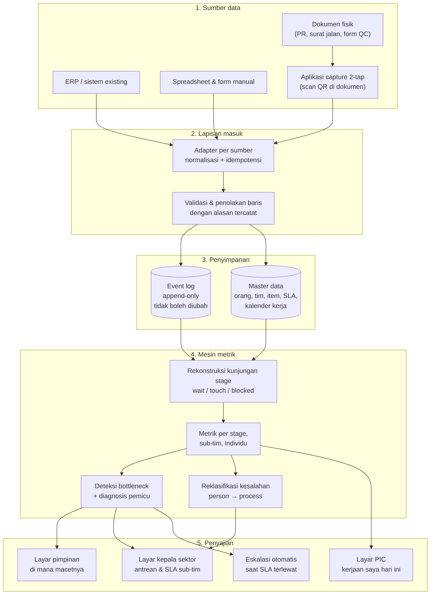

# 01 — Arsitektur Sistem

## Bentuk keseluruhan



## Lapisan 1 — Sumber data

Empat kemungkinan sumber, dan hampir pasti keempatnya ada bersamaan di perusahaan besar:

| Sumber | Cara ambil | Catatan |
| --- | --- | --- |
| ERP / sistem existing | Baca database langsung (read-only) atau API | Terbaik. Tidak menambah beban kerja siapa pun. |
| Spreadsheet | Impor berkala + folder pantauan | Rawan berubah struktur. Perlu validasi ketat. |
| Aplikasi capture 2-tap | Buat baru | Satu-satunya cara realistis mendapat timestamp *masuk antrean* dan *mulai dikerjakan* kalau ERP tidak menyimpannya. |
| Dokumen fisik | Tempel QR di dokumen, scan lewat HP | Tanpa ini, tahap yang masih pakai kertas jadi lubang buta di dashboard. |

**Aturan penting soal aplikasi capture:** hanya **dua tap** — "saya terima" dan "saya
selesai". Tidak ada form panjang. Setiap kolom tambahan yang harus diisi manual akan
menurunkan kepatuhan pencatatan, dan data yang tidak lengkap merusak seluruh perhitungan.
Data lain (nomor dokumen, nilai, item) diambil dari sistem atau dari QR, bukan diketik ulang.

## Lapisan 2 — Lapisan masuk (ingestion)

Tiga hal yang wajib ada dan sering dilupakan:

**Idempotensi.** Kunci unik = `sourceSystem` + `externalId`. Sinkronisasi yang dijalankan
dua kali tidak boleh menghasilkan data dobel. Tanpa ini, angka throughput akan naik palsu
setiap kali sinkronisasi diulang setelah gangguan jaringan.

**Penolakan yang tercatat, bukan yang dibuang diam-diam.** Setiap baris yang tidak bisa
diproses masuk `IngestionRun.rejections` beserta alasannya. Daftar inilah yang nanti
dipakai membenahi kualitas data di sumbernya — dan tanpa daftar itu, dashboard akan
menampilkan "stage ini aman" padahal sebenarnya "data stage ini tidak masuk".

**Satu jam acuan.** Semua timestamp disimpan UTC, ditampilkan Asia/Jakarta. Membandingkan
jam antar departemen mustahil kalau ada yang pakai jam server lokal dan ada yang pakai jam
komputer operator yang tidak pernah disinkronkan.

## Lapisan 3 — Penyimpanan

Dua tabel inti, dua sifat yang berbeda:

**Event log — append-only, tidak boleh di-UPDATE atau DELETE.** Ini yang membuat sistem
bisa menjawab "dokumen ini menganggur 6 hari di mana" dan sekaligus jadi jejak audit yang
tidak bisa dibantah. Kalau sebuah event salah, cara memperbaikinya adalah menambah event
koreksi, bukan mengubah yang lama. Dengan begitu riwayat koreksi juga terlihat — dan
frekuensi koreksi itu sendiri metrik yang berguna.

**Master data — boleh berubah, tapi berversi.** SLA berubah, orang pindah tim, jabatan
naik. Semua perubahan itu perlu punya `effectiveFrom` supaya perhitungan bulan lalu tetap
memakai SLA yang berlaku bulan lalu. Kalau tidak, angka historis akan berubah sendiri
setiap kali target direvisi, dan tidak ada yang percaya laporan lagi.

### Kenapa event-sourced dan bukan tabel status biasa

| | Tabel status (status terakhir saja) | Event log (dipakai di sini) |
| --- | --- | --- |
| "Berapa lama menganggur di finance?" | Tidak bisa dijawab | Bisa, per stage, per orang |
| "Siapa yang memegang saat telat?" | Tidak bisa dijawab | Bisa |
| Definisi metrik direvisi | Data lama tidak bisa dihitung ulang | Hitung ulang dari awal, kapan saja |
| Perdebatan "saya sudah kirim kok" | Tidak ada bukti | Ada timestamp, ada pencatat |
| Biaya penyimpanan | Kecil | Lebih besar, tapi tidak signifikan pada skala transaksi perusahaan |

## Lapisan 4 — Mesin metrik

Seluruhnya fungsi murni: masuk data, keluar angka. Tidak ada state, tidak ada
`Date.now()` — waktu acuan selalu `dataset.snapshotAt`. Konsekuensinya:

- Hasilnya bisa diuji (46 pemeriksaan otomatis, jalankan `npm run opsflow:check`).
- Bisa dihitung ulang untuk periode masa lalu — "bagaimana kondisinya bulan lalu?"
- Dua kali jalan pasti menghasilkan angka identik. Tidak ada angka yang berubah sendiri.

Alurnya:

```
event log
   ↓  buildStageVisits()
kunjungan stage (wait / touch / blocked / rework per kunjungan)
   ↓  computeStageMetrics()
metrik per stage (WIP, antrean, p50/p90, pelanggaran SLA, rework)
   ↓  detectBottlenecks()
peringkat titik macet + diagnosis pemicu + nilai rupiah tertahan
```

Cabang lain dari kunjungan stage yang sama: kartu skor sub-tim, kartu skor individu,
metrik kesalahan, lead time end-to-end, dan penilaian kualitas data.

Detail rumus setiap metrik ada di [04 — Katalog Metrik](./04-KATALOG-METRIK.md).

## Lapisan 5 — Penyajian

Tiga layar berbeda karena tiga kebutuhan berbeda. Satu dashboard untuk semua orang selalu
berakhir jadi dashboard yang tidak dipakai siapa pun.

**Layar pimpinan.** Satu kalimat di paling atas: di mana macetnya, kenapa, berapa nilai
yang tertahan. Contoh keluaran nyata dari mesin pada data simulasi:

> Titik macet utama: Persetujuan Berjenjang (Manajer / Direktur) dengan 8 item tertahan.
> Nilai tertahan di titik ini Rp 654,8 juta. Secara keseluruhan hanya 36% dari waktu
> proses dipakai untuk bekerja — sisanya menunggu. 93% kesalahan baru ketahuan di stage
> berikutnya, rata-rata 4,3 stage setelah terjadi.

Di bawahnya: peta 4 sektor dengan tebal-tipis panah sesuai antrean, dan 5 titik macet
teratas.

**Layar kepala sektor.** Antrean sub-tim miliknya, diurutkan dari yang paling tua. Daftar
item yang lewat SLA beserta PIC-nya. Kesalahan yang bersumber di sektornya, dipisah antara
yang sistemik dan yang individu.

**Layar PIC.** Hanya kerjaan dia: yang masuk hari ini, yang sudah lewat SLA, dan tombol
"terima" / "selesai". Ini sekaligus jadi sumber timestamp — layar yang berguna untuk
dipakai, bukan hanya untuk dilaporkan.

**Eskalasi otomatis.** Setiap stage punya `escalateAfterHours`. Lewat batas itu, notifikasi
naik ke pemimpin sub-tim — bukan ke pimpinan puncak. Eskalasi yang langsung ke atas akan
dimatikan orang dalam dua minggu.

## Cara membuatnya "live"

Live tidak berarti setiap perubahan muncul dalam sedetik. Untuk pemantauan proses bisnis,
data berumur beberapa menit sudah cukup, dan jauh lebih murah.

| Komponen | Frekuensi | Cara |
| --- | --- | --- |
| Adapter ERP | 5–15 menit | Tarik berkala berdasarkan kolom `updated_at` |
| Aplikasi capture | Seketika | Event langsung dikirim saat tap |
| Mesin metrik | 5 menit | Hitung ulang snapshot, simpan hasilnya (cache) |
| Dashboard | 30–60 detik | Polling ke snapshot yang sudah dihitung |
| Eskalasi | 15 menit | Pemeriksaan berkala terhadap SLA yang terlewat |

Yang penting: **dashboard tidak menghitung apa pun saat dibuka.** Ia hanya membaca
snapshot yang sudah dihitung. Kalau dashboard menghitung sendiri, ia akan lambat begitu
data setahun menumpuk, dan orang berhenti membukanya.

Setiap snapshot menyertakan `snapshotAt` dan penilaian kualitas data per stage, sehingga
di layar selalu jelas: angka ini per jam berapa, dan stage mana yang datanya belum bisa
dipercaya.

## Hak akses

| Peran | Bisa lihat |
| --- | --- |
| PIC | Kerjaan sendiri + metrik sub-tim (agregat) |
| Pemimpin sub-tim | Semua anggota sub-tim, termasuk angka individu |
| Kepala sektor | Semua sub-tim di sektornya |
| Direksi | Semua sektor; angka individu hanya lewat kepala sektor |
| Audit internal | Baca seluruh event log, tanpa hak ubah |

Angka individu **tidak** dibuka lintas sektor. Bukan karena disembunyikan, tapi karena
angka tanpa konteks pekerjaannya akan salah dibaca oleh orang yang tidak memahami beban
kerja sub-tim itu.

## Pilihan teknologi

Skema dan mesin metrik sudah ditulis dalam TypeScript murni tanpa dependensi, jadi bisa
dipasang di mana saja. Rekomendasi paling hemat untuk memulai:

| Bagian | Pilihan | Alasan |
| --- | --- | --- |
| Event log + master data | PostgreSQL | Andal, murah, mudah dicari orangnya di Indonesia |
| Adapter ingestion | Node.js terjadwal, atau n8n kalau tim lebih nyaman visual | n8n sudah dipakai di repo ini |
| Mesin metrik | Kode yang sudah ada di `src/opsflow/` | Sudah teruji, tanpa dependensi |
| API snapshot | Satu endpoint yang menyajikan snapshot dari cache | Sederhana |
| Dashboard | React + Tailwind (sudah ada di repo ini) | Tidak perlu tumpukan baru |
| Aplikasi capture | PWA — buka di browser HP, bisa dipasang ke home screen | Tidak perlu instalasi dari toko aplikasi |

Yang **tidak** saya sarankan di awal: mengganti ERP, membeli platform BI, atau membangun
data warehouse. Ketiganya proyek bertahun-tahun, dan tidak satu pun menjawab pertanyaan
"di mana macetnya" lebih cepat daripada pendekatan di atas.
