# 02 — Peta Alur & Sub-Tim

> **Dokumen ini yang perlu divalidasi kepala tiap sektor.**
>
> Susunan di bawah saya buat dari pola perusahaan manufaktur pada umumnya, **bukan dari
> perusahaan Anda**. Yang perlu dikoreksi: nama sub-tim, stage yang tidak ada di
> perusahaan Anda, stage yang kurang, dan angka SLA-nya.
>
> Dokumen ini dihasilkan otomatis dari `src/opsflow/taxonomy.ts`. Jangan diedit
> langsung — ubah taksonominya lalu jalankan `npm run opsflow:docs`.

## Ringkasan

| | Jumlah |
| --- | --- |
| Sektor | 4 |
| Stage total | 35 |
| Stage jalur utama (di luar jalur tidak normal) | 32 |
| Sub-tim | 33 |
| Total target SLA jalur utama | 386 jam kerja (~48.3 hari kerja) |

Angka terakhir itu penting untuk dibaca bersama: **kalau setiap stage berjalan tepat
sesuai target, satu permintaan barang selesai sampai terkirim dalam ~48 hari kerja.**
Selisih antara angka itu dan lead time nyata di perusahaan Anda adalah ukuran kasar
berapa banyak waktu yang hilang di antrean. Selisih 3–5 kali adalah hal yang biasa
ditemukan sebelum pembenahan.

## Kenapa 4 sektor dipecah jadi 35 stage

Anda benar bahwa "pembelian → finance → produksi → pengiriman" tidak sesederhana itu,
karena tiap sektor punya banyak sub-tim. Konsekuensinya pada dashboard:

| Kalau hanya 4 sektor | Kalau dipecah per sub-tim |
| --- | --- |
| "Macet di finance" | "Macet di persetujuan berjenjang — 8 dokumen menunggu 1 penyetuju yang sedang dinas luar" |
| Kepala finance disalahkan | Masalahnya jelas: tidak ada delegasi wewenang |
| Tindakan: rapat | Tindakan: tetapkan aturan delegasi otomatis |

Pemecahan ini juga yang membuat akuntabilitas jadi adil: setiap stage punya satu
sub-tim pemilik, jadi tidak ada pekerjaan yang "milik semua orang" — yang dalam
praktik berarti milik tidak seorang pun.

## Jalur utama end-to-end

```mermaid
flowchart LR
    subgraph PROC["1. PEMBELIAN"]
        direction TB
        PROC10["PROC-10<br/>Permintaan Barang (PR)<br/><small>Departemen peminta</small>"]
        PROC20["PROC-20<br/>Validasi & Konsolidasi PR<br/><small>Admin Purchasing</small>"]
        PROC30["PROC-30<br/>Sourcing & Permintaan Penawaran<br/><small>Sourcing / Buyer</small>"]
        PROC40["PROC-40<br/>Negosiasi & Persetujuan Harga<br/><small>Lead Purchasing / Manajer</small>"]
        PROC50["PROC-50<br/>Penerbitan PO<br/><small>Admin Purchasing</small>"]
        PROC60["PROC-60<br/>Konfirmasi & Pemantauan Vendor<br/><small>Purchasing Expediting</small>"]
        PROC70["PROC-70<br/>Penerimaan Barang (GRN)<br/><small>Gudang Inbound</small>"]
        PROC80["PROC-80<br/>QC Barang Masuk<br/><small>QC Incoming</small>"]
        PROC10 --> PROC20
        PROC20 --> PROC30
        PROC30 --> PROC40
        PROC40 --> PROC50
        PROC50 --> PROC60
        PROC60 --> PROC70
        PROC70 --> PROC80
    end
    subgraph FIN["2. FINANCE"]
        direction TB
        FIN10["FIN-10<br/>Cek Ketersediaan Anggaran<br/><small>Budget Control</small>"]
        FIN20["FIN-20<br/>Verifikasi Dokumen & 3-Way Match<br/><small>Accounts Payable</small>"]
        FIN30["FIN-30<br/>Verifikasi Pajak & Faktur<br/><small>Tax</small>"]
        FIN40["FIN-40<br/>Persetujuan Berjenjang<br/><small>Manajer / Direktur</small>"]
        FIN50["FIN-50<br/>Penjadwalan Pembayaran<br/><small>Treasury</small>"]
        FIN60["FIN-60<br/>Eksekusi Pembayaran<br/><small>Treasury / Kasir</small>"]
        FIN70["FIN-70<br/>Pencatatan & Alokasi Biaya<br/><small>Accounting</small>"]
        FIN80["FIN-80<br/>Rekonsiliasi & Penutupan Periode<br/><small>Accounting</small>"]
        FIN10 --> FIN20
        FIN20 --> FIN30
        FIN30 --> FIN40
        FIN40 --> FIN50
        FIN50 --> FIN60
        FIN60 --> FIN70
        FIN70 --> FIN80
    end
    subgraph PRD["3. PRODUKSI"]
        direction TB
        PRD10["PRD-10<br/>Perencanaan Produksi<br/><small>PPIC</small>"]
        PRD20["PRD-20<br/>Cek Ketersediaan & Alokasi Material<br/><small>PPIC + Gudang</small>"]
        PRD30["PRD-30<br/>Pengeluaran Material ke Line<br/><small>Gudang Produksi</small>"]
        PRD40["PRD-40<br/>Setup Mesin & Cek Kesiapan<br/><small>Maintenance / Teknik</small>"]
        PRD50["PRD-50<br/>Eksekusi Produksi per Shift<br/><small>Produksi (per line & shift)</small>"]
        PRD60["PRD-60<br/>QC Dalam Proses<br/><small>QC In-Process</small>"]
        PRD80["PRD-80<br/>QC Akhir<br/><small>QC Final</small>"]
        PRD90["PRD-90<br/>Serah Terima ke Gudang Barang Jadi<br/><small>Gudang Finished Goods</small>"]
        PRD10 --> PRD20
        PRD20 --> PRD30
        PRD30 --> PRD40
        PRD40 --> PRD50
        PRD50 --> PRD60
        PRD60 --> PRD80
        PRD80 --> PRD90
    end
    subgraph DEL["4. PENGIRIMAN"]
        direction TB
        DEL10["DEL-10<br/>Sales Order & Konfirmasi Stok<br/><small>Admin Sales</small>"]
        DEL20["DEL-20<br/>Penerbitan Surat Jalan / DO<br/><small>Admin Logistik</small>"]
        DEL30["DEL-30<br/>Picking & Packing<br/><small>Gudang Finished Goods</small>"]
        DEL40["DEL-40<br/>Penjadwalan Ekspedisi / Armada<br/><small>Logistik</small>"]
        DEL50["DEL-50<br/>Loading & Keberangkatan<br/><small>Gudang + Driver</small>"]
        DEL60["DEL-60<br/>Perjalanan & Pemantauan<br/><small>Ekspedisi</small>"]
        DEL70["DEL-70<br/>Serah Terima & Bukti Terima (POD)<br/><small>Driver / Customer Service</small>"]
        DEL90["DEL-90<br/>Penagihan & Piutang<br/><small>Finance AR</small>"]
        DEL10 --> DEL20
        DEL20 --> DEL30
        DEL30 --> DEL40
        DEL40 --> DEL50
        DEL50 --> DEL60
        DEL60 --> DEL70
        DEL70 --> DEL90
    end
    PROC80 --> FIN20
    PROC20 --> FIN10
    FIN60 --> PRD10
    PRD90 --> DEL20
    DEL70 --> DEL90
```

Perhatikan sambungan antar sektornya tidak berurutan rapi. Itu memang keadaan nyata:
cek anggaran (FIN-10) terjadi di awal, jauh sebelum pembayaran (FIN-60); dan verifikasi
tagihan (FIN-20) baru bisa jalan setelah barang diterima dan lolos QC (PROC-80).
Sistem yang memaksa alurnya lurus akan selalu berbeda dari kenyataan, dan bedanya itu
yang bikin datanya tidak dipercaya.

## 1. Pembelian (`PROC`)

**Mandat:** Mengubah kebutuhan internal menjadi barang yang diterima dan lolos QC masuk.

**Sub-tim yang terlibat (8):** Departemen peminta · Admin Purchasing · Sourcing / Buyer · Lead Purchasing / Manajer · Purchasing Expediting · Gudang Inbound · QC Incoming · Purchasing + Gudang

| Kode | Stage | Sub-tim | Jenis | SLA tunggu | SLA kerja | Eskalasi |
| --- | --- | --- | --- | --- | --- | --- |
| `PROC-10` | Permintaan Barang (PR) | Departemen peminta | Kerja | 4 j | 4 j | 16 j |
| `PROC-20` | Validasi & Konsolidasi PR | Admin Purchasing | Kerja | 8 j | 3 j | 24 j |
| `PROC-30` | Sourcing & Permintaan Penawaran | Sourcing / Buyer | Kerja | 8 j | 16 j | 48 j |
| `PROC-40` | Negosiasi & Persetujuan Harga | Lead Purchasing / Manajer | Persetujuan | 16 j | 2 j | 48 j |
| `PROC-50` | Penerbitan PO | Admin Purchasing | Serah terima | 4 j | 2 j | 16 j |
| `PROC-60` | Konfirmasi & Pemantauan Vendor | Purchasing Expediting | Tunggu pihak luar | 8 j | 4 j | 72 j |
| `PROC-70` | Penerimaan Barang (GRN) | Gudang Inbound | Serah terima | 2 j | 3 j | 8 j |
| `PROC-80` | QC Barang Masuk | QC Incoming | Pemeriksaan | 8 j | 4 j | 24 j |
| `PROC-90` | Retur / Klaim ke Vendor *(opsional)* | Purchasing + Gudang | Jalur tidak normal | 8 j | 8 j | 72 j |

### `PROC-10` Permintaan Barang (PR)

- **Sub-tim pemilik:** Departemen peminta
- **Jenis:** Kerja — dinilai dari waktu pengerjaan
- **Masuk:** Kebutuhan operasional / rencana produksi / stok di bawah titik minimum
- **Keluar:** Purchase Request bernomor, dengan spesifikasi dan tanggal dibutuhkan
- **Gerbang:** Spesifikasi lengkap & tanggal dibutuhkan realistis
- **Target:** maksimum 4 jam kerja mengantre + 4 jam kerja dikerjakan; eskalasi setelah 16 jam kerja
- **Kesalahan di sini biasanya baru ketahuan di:** `PROC-30`, `PROC-80`, `PRD-30`

Kesalahan yang paling sering terjadi di stage ini:

- Spesifikasi tidak lengkap atau ambigu
- Tanggal dibutuhkan diisi mundur (sudah telat sejak diminta)
- Kode item salah / pakai nama pasaran, bukan kode master
- Permintaan dobel karena tidak cek PR yang sudah jalan

### `PROC-20` Validasi & Konsolidasi PR

- **Sub-tim pemilik:** Admin Purchasing
- **Jenis:** Kerja — dinilai dari waktu pengerjaan
- **Masuk:** PR mentah dari berbagai departemen
- **Keluar:** PR tervalidasi, dikelompokkan per kategori/supplier
- **Gerbang:** Kode item valid, tidak dobel, kategori benar
- **Target:** maksimum 8 jam kerja mengantre + 3 jam kerja dikerjakan; eskalasi setelah 24 jam kerja
- **Kesalahan di sini biasanya baru ketahuan di:** `PROC-50`, `FIN-20`

Kesalahan yang paling sering terjadi di stage ini:

- PR dobel lolos jadi dua PO
- PR mendesak tidak diprioritaskan karena diproses berurutan
- Konsolidasi terlalu lama sampai PR mendesak ikut tertahan

### `PROC-30` Sourcing & Permintaan Penawaran

- **Sub-tim pemilik:** Sourcing / Buyer
- **Jenis:** Kerja — dinilai dari waktu pengerjaan
- **Masuk:** PR tervalidasi
- **Keluar:** Minimal 2–3 penawaran vendor terbanding
- **Gerbang:** Jumlah penawaran memenuhi kebijakan pengadaan
- **Target:** maksimum 8 jam kerja mengantre + 16 jam kerja dikerjakan; eskalasi setelah 48 jam kerja
- **Kesalahan di sini biasanya baru ketahuan di:** `PROC-60`, `FIN-40`

Kesalahan yang paling sering terjadi di stage ini:

- Hanya 1 penawaran, kebijakan banding harga dilewati
- Vendor tidak balas, tidak ada follow-up terjadwal
- Penawaran kedaluwarsa saat approval baru turun
- Bandingkan harga tapi lupa bandingkan lead time

### `PROC-40` Negosiasi & Persetujuan Harga

- **Sub-tim pemilik:** Lead Purchasing / Manajer
- **Jenis:** Persetujuan — hampir selalu waktu tunggu, bukan waktu kerja
- **Masuk:** Perbandingan penawaran
- **Keluar:** Vendor & harga terpilih, disetujui sesuai matriks wewenang
- **Gerbang:** Nilai di dalam batas wewenang penyetuju
- **Target:** maksimum 16 jam kerja mengantre + 2 jam kerja dikerjakan; eskalasi setelah 48 jam kerja
- **Kesalahan di sini biasanya baru ketahuan di:** `FIN-40`, `FIN-20`

Kesalahan yang paling sering terjadi di stage ini:

- Approval menggantung karena penyetuju cuti tanpa delegasi
- Nilai melewati batas wewenang tapi tetap disetujui level bawah
- Keputusan verbal (WhatsApp) tanpa jejak di sistem

### `PROC-50` Penerbitan PO

- **Sub-tim pemilik:** Admin Purchasing
- **Jenis:** Serah terima — titik paling rawan kesalahan data
- **Masuk:** Keputusan vendor & harga
- **Keluar:** Purchase Order terkirim ke vendor
- **Gerbang:** PO merujuk PR yang benar; harga, qty, termin, alamat kirim sesuai
- **Target:** maksimum 4 jam kerja mengantre + 2 jam kerja dikerjakan; eskalasi setelah 16 jam kerja
- **Kesalahan di sini biasanya baru ketahuan di:** `PROC-70`, `PROC-80`, `FIN-20`

Kesalahan yang paling sering terjadi di stage ini:

- Qty atau satuan salah ketik (pcs vs box vs kg)
- Termin pembayaran di PO beda dengan kesepakatan
- Alamat/tanggal kirim salah
- PO tidak terhubung ke nomor PR — jejak audit terputus

### `PROC-60` Konfirmasi & Pemantauan Vendor

- **Sub-tim pemilik:** Purchasing Expediting
- **Jenis:** Tunggu pihak luar — SLA internal dijeda di sini
- **Masuk:** PO terkirim
- **Keluar:** Konfirmasi vendor + estimasi kedatangan terpantau sampai barang jalan
- **Gerbang:** Vendor konfirmasi tanggal kirim
- **Target:** maksimum 8 jam kerja mengantre + 4 jam kerja dikerjakan; eskalasi setelah 72 jam kerja
- **Kesalahan di sini biasanya baru ketahuan di:** `PRD-20`, `PRD-30`, `DEL-40`

Kesalahan yang paling sering terjadi di stage ini:

- PO terkirim tapi tidak pernah dikonfirmasi vendor, ketahuan saat barang tidak datang
- Tidak ada follow-up berkala, keterlambatan baru diketahui di hari jatuh tempo
- Vendor ubah tanggal kirim tapi produksi tidak diberi tahu

### `PROC-70` Penerimaan Barang (GRN)

- **Sub-tim pemilik:** Gudang Inbound
- **Jenis:** Serah terima — titik paling rawan kesalahan data
- **Masuk:** Barang fisik + surat jalan vendor
- **Keluar:** Goods Receipt Note, stok tercatat
- **Gerbang:** Fisik cocok dengan PO (qty, item, kondisi)
- **Target:** maksimum 2 jam kerja mengantre + 3 jam kerja dikerjakan; eskalasi setelah 8 jam kerja
- **Kesalahan di sini biasanya baru ketahuan di:** `FIN-20`, `PRD-30`

Kesalahan yang paling sering terjadi di stage ini:

- Barang diterima tapi GRN dibuat belakangan (stok sistem beda dengan fisik)
- Terima barang tanpa PO acuan
- Selisih jumlah dicatat sesuai surat jalan vendor, bukan hitungan fisik
- Barang masuk gudang tanpa lewat QC

### `PROC-80` QC Barang Masuk

- **Sub-tim pemilik:** QC Incoming
- **Jenis:** Pemeriksaan — dinilai dari tingkat lolos pertama & kesalahan yang lolos
- **Masuk:** Barang ter-GRN, status karantina
- **Keluar:** Keputusan terima / tolak / terima bersyarat
- **Gerbang:** Sesuai spesifikasi PR
- **Target:** maksimum 8 jam kerja mengantre + 4 jam kerja dikerjakan; eskalasi setelah 24 jam kerja
- **Kesalahan di sini biasanya baru ketahuan di:** `PRD-60`, `PRD-80`, `DEL-80`

Kesalahan yang paling sering terjadi di stage ini:

- Barang dipakai produksi sebelum QC keluar (SOP dilewati)
- Sampling tidak sesuai standar karena diburu produksi
- Hasil QC tidak dicatat, hanya lisan
- Barang tolak tidak dipisah fisik, ikut terpakai

### `PROC-90` Retur / Klaim ke Vendor

- **Sub-tim pemilik:** Purchasing + Gudang
- **Jenis:** Jalur tidak normal — tidak dihitung dalam lead time normal, tapi frekuensinya dipantau
- **Masuk:** Barang ditolak QC atau selisih jumlah
- **Keluar:** Nota retur / klaim, penggantian atau nota kredit
- **Target:** maksimum 8 jam kerja mengantre + 8 jam kerja dikerjakan; eskalasi setelah 72 jam kerja
- **Kesalahan di sini biasanya baru ketahuan di:** `FIN-20`, `FIN-60`

Kesalahan yang paling sering terjadi di stage ini:

- Retur tidak diklaim ke vendor, jadi kerugian sendiri
- Nota kredit vendor tidak dikaitkan ke invoice, tetap dibayar penuh
- Barang retur menumpuk di gudang tanpa status jelas

## 2. Finance (`FIN`)

**Mandat:** Memverifikasi, menyetujui, membayar, dan membukukan kewajiban tanpa kebocoran.

**Sub-tim yang terlibat (7):** Budget Control · Accounts Payable · Tax · Manajer / Direktur · Treasury · Treasury / Kasir · Accounting

| Kode | Stage | Sub-tim | Jenis | SLA tunggu | SLA kerja | Eskalasi |
| --- | --- | --- | --- | --- | --- | --- |
| `FIN-10` | Cek Ketersediaan Anggaran | Budget Control | Persetujuan | 8 j | 2 j | 24 j |
| `FIN-20` | Verifikasi Dokumen & 3-Way Match | Accounts Payable | Kerja | 16 j | 3 j | 48 j |
| `FIN-30` | Verifikasi Pajak & Faktur | Tax | Kerja | 16 j | 2 j | 48 j |
| `FIN-40` | Persetujuan Berjenjang | Manajer / Direktur | Persetujuan | 24 j | 1 j | 48 j |
| `FIN-50` | Penjadwalan Pembayaran | Treasury | Kerja | 8 j | 3 j | 24 j |
| `FIN-60` | Eksekusi Pembayaran | Treasury / Kasir | Kerja | 4 j | 2 j | 12 j |
| `FIN-70` | Pencatatan & Alokasi Biaya | Accounting | Kerja | 24 j | 4 j | 72 j |
| `FIN-80` | Rekonsiliasi & Penutupan Periode | Accounting | Pemeriksaan | 24 j | 24 j | 120 j |

### `FIN-10` Cek Ketersediaan Anggaran

- **Sub-tim pemilik:** Budget Control
- **Jenis:** Persetujuan — hampir selalu waktu tunggu, bukan waktu kerja
- **Masuk:** PR tervalidasi atau permintaan harga
- **Keluar:** Konfirmasi anggaran tersedia + kode akun biaya
- **Gerbang:** Ada pos anggaran & sisa cukup
- **Target:** maksimum 8 jam kerja mengantre + 2 jam kerja dikerjakan; eskalasi setelah 24 jam kerja
- **Kesalahan di sini biasanya baru ketahuan di:** `FIN-70`, `FIN-80`

Kesalahan yang paling sering terjadi di stage ini:

- PO diterbitkan dulu, anggaran dicek belakangan
- Kode akun biaya salah, laporan biaya per departemen jadi ngawur
- Anggaran dipakai dua kali karena komitmen PO tidak dibukukan

### `FIN-20` Verifikasi Dokumen & 3-Way Match

- **Sub-tim pemilik:** Accounts Payable
- **Jenis:** Kerja — dinilai dari waktu pengerjaan
- **Masuk:** Invoice vendor + PO + GRN
- **Keluar:** Invoice tervalidasi siap approval
- **Gerbang:** PO = GRN = Invoice (item, qty, harga)
- **Target:** maksimum 16 jam kerja mengantre + 3 jam kerja dikerjakan; eskalasi setelah 48 jam kerja
- **Kesalahan di sini biasanya baru ketahuan di:** `FIN-60`, `FIN-80`

Kesalahan yang paling sering terjadi di stage ini:

- Invoice masuk tapi GRN belum dibuat gudang — invoice menganggur berhari-hari
- Selisih harga kecil diloloskan tanpa persetujuan
- Invoice fisik hilang / tertahan di meja seseorang
- Invoice dobel dibayar karena nomor invoice tidak diperiksa

### `FIN-30` Verifikasi Pajak & Faktur

- **Sub-tim pemilik:** Tax
- **Jenis:** Kerja — dinilai dari waktu pengerjaan
- **Masuk:** Invoice tervalidasi + faktur pajak
- **Keluar:** Faktur pajak sah & tercatat
- **Gerbang:** Faktur pajak valid dan periodenya benar
- **Target:** maksimum 16 jam kerja mengantre + 2 jam kerja dikerjakan; eskalasi setelah 48 jam kerja
- **Kesalahan di sini biasanya baru ketahuan di:** `FIN-80`

Kesalahan yang paling sering terjadi di stage ini:

- Faktur pajak belum diterima tapi pembayaran jalan
- Faktur beda periode, kredit pajak hilang
- NPWP / data vendor salah

### `FIN-40` Persetujuan Berjenjang

- **Sub-tim pemilik:** Manajer / Direktur
- **Jenis:** Persetujuan — hampir selalu waktu tunggu, bukan waktu kerja
- **Masuk:** Invoice tervalidasi
- **Keluar:** Persetujuan bayar sesuai matriks wewenang
- **Gerbang:** Penyetuju sesuai batas nilai; ada delegasi saat tidak di tempat
- **Target:** maksimum 24 jam kerja mengantre + 1 jam kerja dikerjakan; eskalasi setelah 48 jam kerja
- **Kesalahan di sini biasanya baru ketahuan di:** `FIN-60`, `FIN-80`

Kesalahan yang paling sering terjadi di stage ini:

- Dokumen menumpuk menunggu satu orang (single point of approval)
- Tidak ada delegasi saat penyetuju cuti/dinas luar
- Disetujui tanpa dibaca karena volume terlalu banyak
- Urutan approval dilewati

### `FIN-50` Penjadwalan Pembayaran

- **Sub-tim pemilik:** Treasury
- **Jenis:** Kerja — dinilai dari waktu pengerjaan
- **Masuk:** Invoice disetujui
- **Keluar:** Masuk daftar payment run sesuai jatuh tempo & posisi kas
- **Gerbang:** Kas cukup pada tanggal jatuh tempo
- **Target:** maksimum 8 jam kerja mengantre + 3 jam kerja dikerjakan; eskalasi setelah 24 jam kerja
- **Kesalahan di sini biasanya baru ketahuan di:** `PROC-60`

Kesalahan yang paling sering terjadi di stage ini:

- Invoice lewat jatuh tempo karena masuk batch berikutnya
- Prioritas pembayaran berdasarkan tekanan vendor, bukan jatuh tempo
- Diskon pembayaran cepat hangus

### `FIN-60` Eksekusi Pembayaran

- **Sub-tim pemilik:** Treasury / Kasir
- **Jenis:** Kerja — dinilai dari waktu pengerjaan
- **Masuk:** Daftar payment run
- **Keluar:** Transfer terkirim + bukti bayar terarsip
- **Gerbang:** Rekening tujuan terverifikasi (dual control)
- **Target:** maksimum 4 jam kerja mengantre + 2 jam kerja dikerjakan; eskalasi setelah 12 jam kerja
- **Kesalahan di sini biasanya baru ketahuan di:** `FIN-80`

Kesalahan yang paling sering terjadi di stage ini:

- Salah rekening tujuan / salah nominal
- Bukti transfer tidak diarsip, vendor mengklaim belum terima
- Perubahan rekening vendor tidak diverifikasi ulang (rawan fraud)
- Bayar dobel untuk invoice yang sama

### `FIN-70` Pencatatan & Alokasi Biaya

- **Sub-tim pemilik:** Accounting
- **Jenis:** Kerja — dinilai dari waktu pengerjaan
- **Masuk:** Pembayaran & dokumen pendukung
- **Keluar:** Jurnal terbukukan, biaya teralokasi ke pusat biaya / order produksi
- **Gerbang:** Alokasi sesuai objek biaya
- **Target:** maksimum 24 jam kerja mengantre + 4 jam kerja dikerjakan; eskalasi setelah 72 jam kerja
- **Kesalahan di sini biasanya baru ketahuan di:** `FIN-80`

Kesalahan yang paling sering terjadi di stage ini:

- Biaya masuk pusat biaya yang salah
- Biaya produksi tidak dialokasikan ke order produksi, HPP per produk tidak akurat
- Pembukuan menumpuk di akhir bulan

### `FIN-80` Rekonsiliasi & Penutupan Periode

- **Sub-tim pemilik:** Accounting
- **Jenis:** Pemeriksaan — dinilai dari tingkat lolos pertama & kesalahan yang lolos
- **Masuk:** Semua transaksi periode
- **Keluar:** Buku tertutup, selisih teridentifikasi & terjelaskan
- **Gerbang:** Selisih nol atau terjelaskan
- **Target:** maksimum 24 jam kerja mengantre + 24 jam kerja dikerjakan; eskalasi setelah 120 jam kerja

Kesalahan yang paling sering terjadi di stage ini:

- Selisih ditutup dengan jurnal penyesuaian tanpa cari akar masalah
- Penutupan telat, manajemen ambil keputusan dengan angka basi
- Selisih stok gudang vs buku tidak pernah tuntas

## 3. Produksi (`PRD`)

**Mandat:** Mengubah material jadi barang jadi sesuai spesifikasi, jadwal, dan biaya.

**Sub-tim yang terlibat (9):** PPIC · PPIC + Gudang · Gudang Produksi · Maintenance / Teknik · Produksi (per line & shift) · QC In-Process · Produksi · QC Final · Gudang Finished Goods

| Kode | Stage | Sub-tim | Jenis | SLA tunggu | SLA kerja | Eskalasi |
| --- | --- | --- | --- | --- | --- | --- |
| `PRD-10` | Perencanaan Produksi | PPIC | Kerja | 8 j | 8 j | 24 j |
| `PRD-20` | Cek Ketersediaan & Alokasi Material | PPIC + Gudang | Kerja | 4 j | 4 j | 16 j |
| `PRD-30` | Pengeluaran Material ke Line | Gudang Produksi | Serah terima | 2 j | 2 j | 8 j |
| `PRD-40` | Setup Mesin & Cek Kesiapan | Maintenance / Teknik | Kerja | 2 j | 3 j | 8 j |
| `PRD-50` | Eksekusi Produksi per Shift | Produksi (per line & shift) | Kerja | 1 j | 8 j | 8 j |
| `PRD-60` | QC Dalam Proses | QC In-Process | Pemeriksaan | 1 j | 2 j | 4 j |
| `PRD-70` | Rework / Perbaikan *(opsional)* | Produksi | Jalur tidak normal | 8 j | 8 j | 48 j |
| `PRD-80` | QC Akhir | QC Final | Pemeriksaan | 4 j | 4 j | 12 j |
| `PRD-90` | Serah Terima ke Gudang Barang Jadi | Gudang Finished Goods | Serah terima | 2 j | 2 j | 8 j |

### `PRD-10` Perencanaan Produksi

- **Sub-tim pemilik:** PPIC
- **Jenis:** Kerja — dinilai dari waktu pengerjaan
- **Masuk:** Sales order / forecast / titik minimum stok
- **Keluar:** Production order terjadwal per line & shift
- **Gerbang:** Kapasitas line & tenaga tersedia
- **Target:** maksimum 8 jam kerja mengantre + 8 jam kerja dikerjakan; eskalasi setelah 24 jam kerja
- **Kesalahan di sini biasanya baru ketahuan di:** `PRD-30`, `PRD-50`, `DEL-10`

Kesalahan yang paling sering terjadi di stage ini:

- Jadwal dibuat tanpa cek ketersediaan material
- Jadwal berubah harian, line kehilangan waktu untuk setup ulang
- Order mendesak diselipkan tanpa menggeser jadwal resmi — jadwal sistem tidak lagi mencerminkan realita
- Kapasitas dihitung 100%, tanpa cadangan untuk gangguan

### `PRD-20` Cek Ketersediaan & Alokasi Material

- **Sub-tim pemilik:** PPIC + Gudang
- **Jenis:** Kerja — dinilai dari waktu pengerjaan
- **Masuk:** Production order terjadwal + BOM
- **Keluar:** Material teralokasi, kekurangan tereskalasi ke Purchasing
- **Gerbang:** Semua komponen BOM tersedia atau ada tanggal kedatangan pasti
- **Target:** maksimum 4 jam kerja mengantre + 4 jam kerja dikerjakan; eskalasi setelah 16 jam kerja
- **Kesalahan di sini biasanya baru ketahuan di:** `PRD-30`, `PRD-50`

Kesalahan yang paling sering terjadi di stage ini:

- Stok sistem ada, fisik tidak ada (akurasi stok rendah)
- Material dialokasikan dua kali untuk dua order
- Kekurangan material ketahuan pas mau produksi, bukan saat perencanaan
- BOM tidak diperbarui setelah perubahan desain

### `PRD-30` Pengeluaran Material ke Line

- **Sub-tim pemilik:** Gudang Produksi
- **Jenis:** Serah terima — titik paling rawan kesalahan data
- **Masuk:** Alokasi material + permintaan line
- **Keluar:** Material di line, stok berkurang di sistem
- **Gerbang:** Material lolos QC masuk & jumlah sesuai BOM
- **Target:** maksimum 2 jam kerja mengantre + 2 jam kerja dikerjakan; eskalasi setelah 8 jam kerja
- **Kesalahan di sini biasanya baru ketahuan di:** `PRD-60`, `PRD-80`, `FIN-80`

Kesalahan yang paling sering terjadi di stage ini:

- Material keluar tanpa dokumen, stok sistem tidak berkurang
- Ambil material yang statusnya masih karantina QC
- Jumlah keluar tidak sama dengan yang tercatat, selisih baru ketahuan saat stock opname
- Salah batch / salah nomor lot, ketelusuran hilang

### `PRD-40` Setup Mesin & Cek Kesiapan

- **Sub-tim pemilik:** Maintenance / Teknik
- **Jenis:** Kerja — dinilai dari waktu pengerjaan
- **Masuk:** Jadwal produksi + spesifikasi produk
- **Keluar:** Mesin siap, parameter terset, checklist kesiapan terisi
- **Gerbang:** Checklist kesiapan lolos
- **Target:** maksimum 2 jam kerja mengantre + 3 jam kerja dikerjakan; eskalasi setelah 8 jam kerja
- **Kesalahan di sini biasanya baru ketahuan di:** `PRD-50`, `PRD-60`

Kesalahan yang paling sering terjadi di stage ini:

- Perawatan preventif dilewati karena line dikejar target
- Checklist ditandatangani tanpa benar-benar diperiksa
- Parameter mesin diubah operator tanpa dicatat
- Kerusakan berulang tidak dianalisis akar masalahnya, hanya diperbaiki sementara

### `PRD-50` Eksekusi Produksi per Shift

- **Sub-tim pemilik:** Produksi (per line & shift)
- **Jenis:** Kerja — dinilai dari waktu pengerjaan
- **Masuk:** Material di line + mesin siap
- **Keluar:** Output produksi + catatan hasil per shift
- **Gerbang:** Output sesuai target shift
- **Target:** maksimum 1 jam kerja mengantre + 8 jam kerja dikerjakan; eskalasi setelah 8 jam kerja
- **Kesalahan di sini biasanya baru ketahuan di:** `PRD-60`, `PRD-80`, `DEL-80`

Kesalahan yang paling sering terjadi di stage ini:

- Output dicatat di akhir shift dari ingatan, bukan saat kejadian
- Downtime tidak dicatat atau dicatat dengan alasan generik
- Serah terima antar shift tidak lengkap, shift berikutnya salah lanjut
- Produk cacat dicampur dengan yang bagus

### `PRD-60` QC Dalam Proses

- **Sub-tim pemilik:** QC In-Process
- **Jenis:** Pemeriksaan — dinilai dari tingkat lolos pertama & kesalahan yang lolos
- **Masuk:** Output produksi sedang berjalan
- **Keluar:** Hasil inspeksi + instruksi lanjut/setop
- **Gerbang:** Parameter mutu dalam batas kendali
- **Target:** maksimum 1 jam kerja mengantre + 2 jam kerja dikerjakan; eskalasi setelah 4 jam kerja
- **Kesalahan di sini biasanya baru ketahuan di:** `PRD-80`, `DEL-80`

Kesalahan yang paling sering terjadi di stage ini:

- Frekuensi sampling dikurangi saat produksi padat
- Temuan tidak menghentikan line, produksi lanjut sampai satu batch penuh cacat
- Data inspeksi diisi belakangan / diseragamkan

### `PRD-70` Rework / Perbaikan

- **Sub-tim pemilik:** Produksi
- **Jenis:** Jalur tidak normal — tidak dihitung dalam lead time normal, tapi frekuensinya dipantau
- **Masuk:** Produk tidak lolos QC
- **Keluar:** Produk diperbaiki atau dinyatakan scrap
- **Gerbang:** Hasil rework lolos inspeksi ulang
- **Target:** maksimum 8 jam kerja mengantre + 8 jam kerja dikerjakan; eskalasi setelah 48 jam kerja
- **Kesalahan di sini biasanya baru ketahuan di:** `PRD-80`, `DEL-80`

Kesalahan yang paling sering terjadi di stage ini:

- Rework tidak dicatat, biaya dan waktunya tidak terlihat di laporan
- Produk rework tidak diinspeksi ulang
- Akar masalah tidak diperbaiki, rework yang sama terulang setiap batch

### `PRD-80` QC Akhir

- **Sub-tim pemilik:** QC Final
- **Jenis:** Pemeriksaan — dinilai dari tingkat lolos pertama & kesalahan yang lolos
- **Masuk:** Barang jadi
- **Keluar:** Sertifikat lolos / keputusan tahan
- **Gerbang:** Sesuai spesifikasi pelanggan
- **Target:** maksimum 4 jam kerja mengantre + 4 jam kerja dikerjakan; eskalasi setelah 12 jam kerja
- **Kesalahan di sini biasanya baru ketahuan di:** `DEL-30`, `DEL-80`

Kesalahan yang paling sering terjadi di stage ini:

- Barang dikirim sebelum QC akhir keluar karena dikejar jadwal kirim
- Sertifikat lolos diterbitkan berdasarkan sampel batch sebelumnya
- Barang tahan tidak dipisah fisik, ikut terkirim

### `PRD-90` Serah Terima ke Gudang Barang Jadi

- **Sub-tim pemilik:** Gudang Finished Goods
- **Jenis:** Serah terima — titik paling rawan kesalahan data
- **Masuk:** Barang jadi lolos QC
- **Keluar:** Stok barang jadi tercatat & siap dikirim
- **Gerbang:** Jumlah fisik = jumlah dokumen serah terima
- **Target:** maksimum 2 jam kerja mengantre + 2 jam kerja dikerjakan; eskalasi setelah 8 jam kerja
- **Kesalahan di sini biasanya baru ketahuan di:** `DEL-30`, `FIN-80`

Kesalahan yang paling sering terjadi di stage ini:

- Barang jadi masuk gudang tanpa dokumen serah terima
- Selisih jumlah antara laporan produksi dan penerimaan gudang tidak direkonsiliasi
- Penempatan tanpa lokasi tercatat, barang "hilang" di gudang sendiri

## 4. Pengiriman (`DEL`)

**Mandat:** Menyerahkan barang jadi ke pelanggan tepat waktu, utuh, dan tertagih.

**Sub-tim yang terlibat (9):** Admin Sales · Admin Logistik · Gudang Finished Goods · Logistik · Gudang + Driver · Ekspedisi · Driver / Customer Service · Customer Service + Logistik · Finance AR

| Kode | Stage | Sub-tim | Jenis | SLA tunggu | SLA kerja | Eskalasi |
| --- | --- | --- | --- | --- | --- | --- |
| `DEL-10` | Sales Order & Konfirmasi Stok | Admin Sales | Kerja | 4 j | 2 j | 12 j |
| `DEL-20` | Penerbitan Surat Jalan / DO | Admin Logistik | Kerja | 4 j | 1 j | 12 j |
| `DEL-30` | Picking & Packing | Gudang Finished Goods | Kerja | 4 j | 3 j | 12 j |
| `DEL-40` | Penjadwalan Ekspedisi / Armada | Logistik | Kerja | 8 j | 2 j | 24 j |
| `DEL-50` | Loading & Keberangkatan | Gudang + Driver | Serah terima | 2 j | 2 j | 6 j |
| `DEL-60` | Perjalanan & Pemantauan | Ekspedisi | Tunggu pihak luar | 0 j | 24 j | 12 j |
| `DEL-70` | Serah Terima & Bukti Terima (POD) | Driver / Customer Service | Serah terima | 1 j | 1 j | 8 j |
| `DEL-80` | Retur / Klaim Pelanggan *(opsional)* | Customer Service + Logistik | Jalur tidak normal | 4 j | 8 j | 24 j |
| `DEL-90` | Penagihan & Piutang | Finance AR | Kerja | 8 j | 2 j | 24 j |

### `DEL-10` Sales Order & Konfirmasi Stok

- **Sub-tim pemilik:** Admin Sales
- **Jenis:** Kerja — dinilai dari waktu pengerjaan
- **Masuk:** Pesanan pelanggan
- **Keluar:** Sales order terkonfirmasi + tanggal kirim yang dijanjikan
- **Gerbang:** Stok tersedia atau produksi terjadwal sebelum tanggal janji
- **Target:** maksimum 4 jam kerja mengantre + 2 jam kerja dikerjakan; eskalasi setelah 12 jam kerja
- **Kesalahan di sini biasanya baru ketahuan di:** `DEL-30`, `DEL-70`, `DEL-90`

Kesalahan yang paling sering terjadi di stage ini:

- Tanggal kirim dijanjikan tanpa cek kapasitas produksi
- Alamat / kontak penerima salah
- Perubahan pesanan pelanggan tidak diteruskan ke produksi & gudang
- Order pelanggan diterima meski limit kredit terlampaui

### `DEL-20` Penerbitan Surat Jalan / DO

- **Sub-tim pemilik:** Admin Logistik
- **Jenis:** Kerja — dinilai dari waktu pengerjaan
- **Masuk:** Sales order siap kirim
- **Keluar:** Delivery order / surat jalan bernomor
- **Gerbang:** Barang tersedia & lolos QC akhir
- **Target:** maksimum 4 jam kerja mengantre + 1 jam kerja dikerjakan; eskalasi setelah 12 jam kerja
- **Kesalahan di sini biasanya baru ketahuan di:** `DEL-70`, `DEL-80`, `DEL-90`

Kesalahan yang paling sering terjadi di stage ini:

- Surat jalan dibuat untuk barang yang belum lolos QC
- Isi surat jalan beda dengan fisik yang dimuat
- Nomor surat jalan tidak terhubung ke sales order

### `DEL-30` Picking & Packing

- **Sub-tim pemilik:** Gudang Finished Goods
- **Jenis:** Kerja — dinilai dari waktu pengerjaan
- **Masuk:** Delivery order
- **Keluar:** Barang terkemas, siap muat
- **Gerbang:** Jumlah & item cocok dengan DO
- **Target:** maksimum 4 jam kerja mengantre + 3 jam kerja dikerjakan; eskalasi setelah 12 jam kerja
- **Kesalahan di sini biasanya baru ketahuan di:** `DEL-70`, `DEL-80`

Kesalahan yang paling sering terjadi di stage ini:

- Salah ambil varian / ukuran yang mirip
- Kemasan kurang pelindung, barang rusak di jalan
- Picking berdasarkan hafalan, bukan daftar
- Barang diambil dari lot yang salah, FIFO terlanggar

### `DEL-40` Penjadwalan Ekspedisi / Armada

- **Sub-tim pemilik:** Logistik
- **Jenis:** Kerja — dinilai dari waktu pengerjaan
- **Masuk:** Barang terkemas + tujuan
- **Keluar:** Armada/ekspedisi terjadwal dengan rute & jam muat
- **Gerbang:** Kapasitas armada cukup untuk tanggal janji
- **Target:** maksimum 8 jam kerja mengantre + 2 jam kerja dikerjakan; eskalasi setelah 24 jam kerja
- **Kesalahan di sini biasanya baru ketahuan di:** `DEL-50`, `DEL-60`

Kesalahan yang paling sering terjadi di stage ini:

- Barang siap tapi armada baru dicari hari itu
- Muatan tidak dikonsolidasi, biaya kirim membengkak
- Ekspedisi dipilih tanpa cek rekam jejak ketepatan waktu

### `DEL-50` Loading & Keberangkatan

- **Sub-tim pemilik:** Gudang + Driver
- **Jenis:** Serah terima — titik paling rawan kesalahan data
- **Masuk:** Barang terkemas + armada di dock
- **Keluar:** Kendaraan berangkat, jam keberangkatan tercatat
- **Gerbang:** Muatan diverifikasi dua pihak (gudang & driver)
- **Target:** maksimum 2 jam kerja mengantre + 2 jam kerja dikerjakan; eskalasi setelah 6 jam kerja
- **Kesalahan di sini biasanya baru ketahuan di:** `DEL-70`

Kesalahan yang paling sering terjadi di stage ini:

- Jam keberangkatan tidak dicatat, tidak bisa hitung keterlambatan di jalan
- Muatan tidak dicek ulang saat dimuat
- Kendaraan berangkat tidak penuh padahal ada order tujuan sama

### `DEL-60` Perjalanan & Pemantauan

- **Sub-tim pemilik:** Ekspedisi
- **Jenis:** Tunggu pihak luar — SLA internal dijeda di sini
- **Masuk:** Kendaraan berangkat
- **Keluar:** Posisi terpantau + estimasi tiba terkini
- **Gerbang:** Tiba sesuai estimasi
- **Target:** maksimum 0 jam kerja mengantre + 24 jam kerja dikerjakan; eskalasi setelah 12 jam kerja
- **Kesalahan di sini biasanya baru ketahuan di:** `DEL-70`, `DEL-80`

Kesalahan yang paling sering terjadi di stage ini:

- Tidak ada pemantauan, keterlambatan diketahui dari komplain pelanggan
- Driver ubah rute/urutan tanpa memberi tahu
- Kendala di jalan tidak dilaporkan ke pelanggan

### `DEL-70` Serah Terima & Bukti Terima (POD)

- **Sub-tim pemilik:** Driver / Customer Service
- **Jenis:** Serah terima — titik paling rawan kesalahan data
- **Masuk:** Barang tiba di lokasi pelanggan
- **Keluar:** Surat jalan bertanda tangan / bukti terima digital
- **Gerbang:** Pelanggan menerima tanpa keberatan
- **Target:** maksimum 1 jam kerja mengantre + 1 jam kerja dikerjakan; eskalasi setelah 8 jam kerja
- **Kesalahan di sini biasanya baru ketahuan di:** `DEL-90`

Kesalahan yang paling sering terjadi di stage ini:

- Bukti terima tidak kembali ke kantor berhari-hari, penagihan tertahan
- Surat jalan ditandatangani tanpa nama & jabatan penerima jelas
- Penolakan sebagian tidak dicatat di surat jalan
- Bukti terima hilang, pelanggan menolak bayar

### `DEL-80` Retur / Klaim Pelanggan

- **Sub-tim pemilik:** Customer Service + Logistik
- **Jenis:** Jalur tidak normal — tidak dihitung dalam lead time normal, tapi frekuensinya dipantau
- **Masuk:** Keluhan / penolakan pelanggan
- **Keluar:** Keputusan klaim + tindakan perbaikan
- **Gerbang:** Akar masalah teridentifikasi & ditugaskan ke stage sumber
- **Target:** maksimum 4 jam kerja mengantre + 8 jam kerja dikerjakan; eskalasi setelah 24 jam kerja
- **Kesalahan di sini biasanya baru ketahuan di:** `FIN-80`

Kesalahan yang paling sering terjadi di stage ini:

- Klaim diselesaikan tanpa mencatat stage sumber kesalahan — pola tidak pernah terlihat
- Retur barang tidak masuk kembali ke stok
- Keluhan diselesaikan lisan, tidak masuk sistem

### `DEL-90` Penagihan & Piutang

- **Sub-tim pemilik:** Finance AR
- **Jenis:** Kerja — dinilai dari waktu pengerjaan
- **Masuk:** Bukti terima pelanggan
- **Keluar:** Invoice terkirim, jatuh tempo terpantau
- **Gerbang:** Invoice sesuai barang yang benar-benar diterima
- **Target:** maksimum 8 jam kerja mengantre + 2 jam kerja dikerjakan; eskalasi setelah 24 jam kerja
- **Kesalahan di sini biasanya baru ketahuan di:** `FIN-80`

Kesalahan yang paling sering terjadi di stage ini:

- Invoice terlambat dibuat karena menunggu bukti terima fisik
- Invoice tidak sesuai barang diterima, pelanggan menahan pembayaran
- Jatuh tempo tidak dipantau, piutang menua tanpa penagihan

## Cara memvalidasi dokumen ini

Untuk setiap sektor, duduk bersama kepala sektornya dan jawab lima pertanyaan:

1. **Ada stage yang tidak ada di perusahaan kita?** Tandai untuk dihapus.
2. **Ada langkah yang kita lakukan tapi tidak tertulis di sini?** Tambahkan, sebutkan sub-tim pemiliknya.
3. **Nama sub-timnya sudah benar?** Pakai nama yang dipakai orang sehari-hari, bukan nama struktur organisasi resmi.
4. **Siapa PIC-nya, dan siapa penggantinya saat dia tidak ada?** Yang kedua ini biasanya belum pernah ditetapkan — dan itu penyebab macet approval nomor satu.
5. **Angka SLA-nya realistis?** Kalau ragu, kosongkan saja. Setelah 3 bulan data masuk, angka SLA akan diturunkan dari data historis dan itu jauh lebih tepat daripada menebak sekarang.

Yang paling berharga dari sesi ini bukan koreksi tabelnya, tapi jawaban atas pertanyaan
terakhir ke tiap kepala sektor: **"tiga hal apa yang paling sering membuat pekerjaan
Anda tertahan?"** Jawabannya dipakai untuk mengalibrasi daftar kesalahan di atas.

