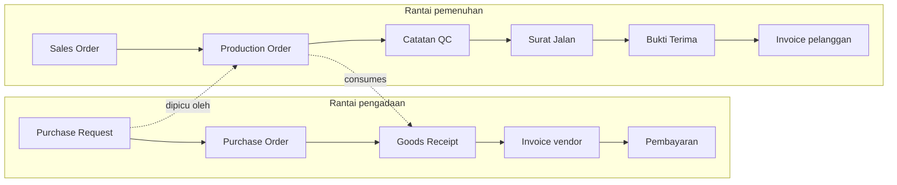

# 03 — Skema Data

Dokumen ini untuk tim IT / pengembang. Skema yang mengikat ada di
`src/opsflow/schema.ts`; yang di bawah adalah penjelasan alasan di balik
keputusannya.

## Kesalahpahaman yang harus dihindari dulu

Saat merancang sistem seperti ini, hampir semua orang mengira ada **satu "order"** yang
mengalir dari pembelian sampai pengiriman. Itu tidak benar, dan kalau skemanya dibuat
begitu, sistem akan gagal menjawab pertanyaan terpentingnya.

Kenyataannya ada **dua rantai objek kerja** yang berjalan bersamaan:



Keduanya bertemu di **item, supplier, dan pelanggan** — dan di tautan `consumes` antara
order produksi dan barang yang dibeli.

Tautan itulah yang membuat pertanyaan ini bisa dijawab:

> "Kenapa order pelanggan A telat?"
> → Karena order produksinya menunggu material B
> → Material B dari PO-2026-04821
> → PO itu tertahan 9 hari kerja di FIN-40 Persetujuan Berjenjang
> → Karena penyetujunya dinas luar dan tidak ada delegasi.

Tanpa tautan antar objek kerja, jawabannya berhenti di "produksi telat" — dan yang
disalahkan jadi orang yang salah. Ini juga alasan sistemnya disebut dashboard *ekosistem*,
bukan empat dashboard terpisah yang ditaruh berdampingan. Pada uji mandiri, penelusuran
satu surat jalan menghasilkan 31 langkah yang menembus keempat sektor.

## Tabel inti

| Entitas | Sifat | Isi |
| --- | --- | --- |
| `WorkItem` | Berubah (turunan) | Objek kerja: PR, PO, GRN, invoice, pembayaran, SO, WO, catatan QC, surat jalan, retur, invoice pelanggan |
| `WorkEvent` | **Append-only** | Setiap kejadian: masuk antrean, mulai, selesai, disetujui, ditolak, tertahan, dikembalikan, data diubah |
| `Incident` | Berubah | Kesalahan dengan jenis, tingkat, atribusi, akar masalah, dampak |
| `Person`, `Team` | Berversi | Organisasi & sub-tim |
| `ApprovalRule`, `Delegation` | Berversi | Matriks wewenang & delegasi |
| `WorkCalendar` | Berversi | Jam kerja, shift, hari libur |
| `SlaTarget` | Berversi | Target per stage, boleh berbeda per kategori/prioritas |
| `Item`, `Supplier`, `Customer`, `BomLine` | Berversi | Master data referensi |
| `IngestionRun` | Append-only | Catatan setiap sinkronisasi, termasuk baris yang ditolak |

## Bagian paling penting: tiga timestamp per stage

```
arrived   : pekerjaan MASUK antrean stage ini
started   : seseorang MULAI mengerjakannya
completed : diserahkan ke stage berikutnya

waktu tunggu = started   − arrived
waktu kerja  = completed − started
```

Kalau sistem lama hanya punya satu tanggal per stage, mesin metrik tetap jalan — tapi
hanya bisa melaporkan total durasi. Ia tidak bisa memisahkan "tidak ada yang pegang" dari
"dikerjakan tapi lambat", dan itu perbedaan yang menentukan tindakan.

`assessDataQuality()` melaporkan cakupan `arrived` dan `started` per stage, dan menandai
stage yang datanya belum cukup sebagai `insufficient` — bukan memberi angka yang terlihat
meyakinkan padahal tidak berdasar.

## Kolom yang paling sering dilupakan, dan akibatnya

| Kolom | Kalau tidak ada |
| --- | --- |
| `occurredAt` **dan** `recordedAt` terpisah | Tidak bisa mengukur disiplin pencatatan. Tim yang mencatat 3 hari setelah kejadian akan terlihat sama baiknya dengan yang mencatat seketika. |
| `blocked` / `unblocked` | Orang dihukum atas waktu menunggu vendor. Dalam sebulan, tim akan berhenti mempercayai dashboard. |
| `WorkCalendar` | PO Jumat sore terlihat telat 64 jam padahal 1,5 jam kerja. |
| `links` antar objek kerja | "Kenapa order ini telat?" hanya terjawab sampai batas sektor. |
| `externalId` + `sourceSystem` | Sinkronisasi ulang menghasilkan data dobel dan throughput naik palsu. |
| `field_changed` event | Perubahan qty/harga **setelah** disetujui tidak terlihat. Ini celah kontrol yang serius. |
| `IngestionRun.rejections` | Dashboard menampilkan "stage ini aman" padahal artinya "data stage ini tidak masuk". |
| `SlaTarget.effectiveFrom` | Angka historis berubah sendiri setiap target direvisi. |

## Jenis event

| Event | Kapan dikirim | Wajib |
| --- | --- | --- |
| `arrived` | Pekerjaan masuk antrean sebuah stage | ya |
| `started` | Seseorang mulai mengerjakan | ya |
| `completed` | Diserahkan ke stage berikutnya | ya |
| `approved` / `rejected` | Keputusan di gerbang persetujuan | untuk stage approval |
| `blocked` / `unblocked` | Mulai / berhenti menunggu pihak luar | sangat disarankan |
| `returned` | Dikembalikan ke stage sebelumnya | sangat disarankan — sumber angka rework |
| `field_changed` | Data diubah setelah dokumen jadi | disarankan |
| `reassigned` | Ganti PIC | opsional |
| `cancelled` | Dibatalkan | ya |
| `incident_logged` | Kesalahan dicatat | ya |
| `note` | Catatan bebas | opsional |

## Jenis kesalahan

Daftarnya **tertutup dan sengaja pendek** (13 jenis). Kalau kategorinya puluhan, orang
akan memilih sembarangan dan datanya tidak berguna.

`data_error` · `document_missing` · `document_late` · `approval_delay` ·
`authority_violation` · `spec_mismatch` · `quantity_variance` · `procedure_skipped` ·
`unrecorded_work` · `duplicate_entry` · `communication_gap` · `external_cause` ·
`system_limitation`

Dua di antaranya perlu penjelasan khusus:

- **`unrecorded_work`** — pekerjaan dilakukan tapi tidak dicatat di sistem. Ini jenis
  kesalahan yang paling merusak, karena ia membuat semua metrik lain salah. Barang masuk
  gudang tanpa GRN membuat stok sistem berbeda dari fisik, dan tagihan vendor menganggur
  menunggu dokumen yang tidak pernah dibuat.
- **`authority_violation`** — disetujui oleh yang tidak berwenang, atau urutan approval
  dilewati. Bisa dideteksi otomatis dengan membandingkan `Person.authorityLevel` terhadap
  `ApprovalRule` untuk nilai transaksi itu. Ini satu-satunya jenis kesalahan yang tidak
  perlu dilaporkan siapa pun — sistem bisa menemukannya sendiri.

## Atribusi kesalahan

Lima nilai: `person`, `process`, `system`, `external`, `unknown`.

Aturan yang dipasang di kode (`reclassifySystemicIncidents()`), dan sebaiknya juga
ditetapkan sebagai kebijakan tertulis:

> Jenis kesalahan yang sama, di stage yang sama, dilakukan oleh **3 orang berbeda** dalam
> 30 hari → atribusi otomatis dipindah ke `process`, dan nama orangnya dihapus.

Alasannya bukan kelembutan, tapi ketepatan: kalau tiga orang berbeda melakukan kesalahan
yang sama di tempat yang sama, mengganti orangnya tidak akan menghentikannya.

Satu hal yang perlu diperhatikan pada implementasinya: karena `personId` dikosongkan saat
reklasifikasi, bukti bahwa polanya sistemik bisa ikut hilang dari laporan. Karena itu
`Incident` punya `systemicPattern` dan `systemicDistinctPeople` yang tetap menyimpan
jumlah orangnya — polanya tetap terlihat sebagai temuan proses, tanpa menunjuk individu.

## Kualitas data disajikan, bukan disembunyikan

`StageDataQuality` per stage: cakupan `arrived`, cakupan `started`, median jeda
pencatatan, dan kesimpulan kepercayaan (`high` / `medium` / `low` / `insufficient`).

Ini harus tampil di layar, bukan disimpan di laporan teknis. Dashboard yang menampilkan
angka meyakinkan dari data setengah kosong lebih berbahaya daripada tidak punya dashboard:
keputusan diambil atas dasar yang salah, dan ketika kesalahannya ketahuan, seluruh sistem
kehilangan kepercayaan sekaligus.

## Contoh bentuk data

`src/opsflow/example.ts` membangun dataset lengkap yang bisa dijadikan acuan bentuk:
298 objek kerja, 4.160 event, 120 insiden, lintas 35 stage. Inilah bentuk yang harus
dihasilkan adapter ingestion nanti. Kalau ragu isi sebuah kolom, lihat contohnya di situ.

Satu event terlihat seperti ini:

```json
{
  "id": "E000412",
  "workItemId": "WI-INV-18",
  "stageCode": "FIN-40",
  "type": "arrived",
  "occurredAt": "2026-07-14T09:12:00+07:00",
  "recordedAt": "2026-07-14T09:41:00+07:00",
  "actorPersonId": null,
  "recordedBy": "erp-sync",
  "recordingLagHours": 0.48
}
```
