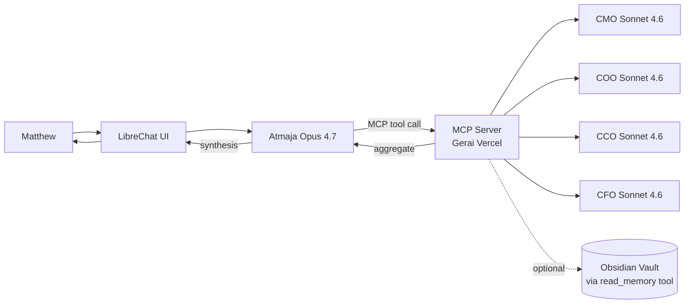
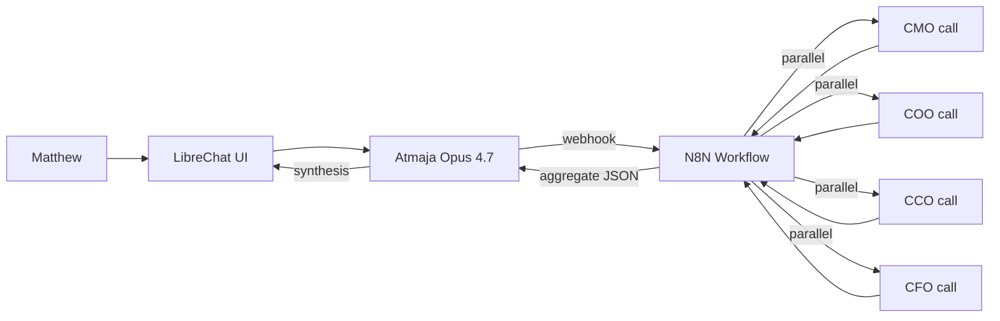
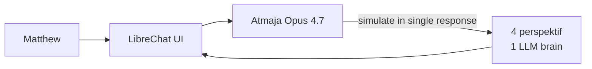
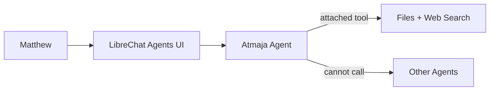
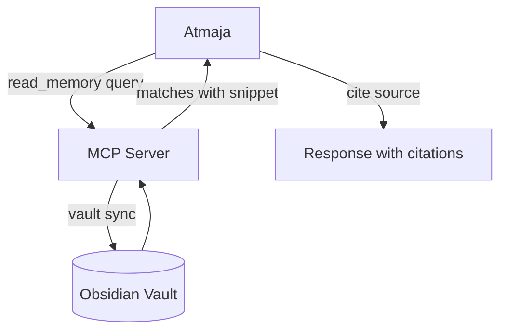

# AI Department Architecture — Workflow Design

**Status:** Draft v1
**Date:** 2026-05-29
**Owner:** Matthew
**Purpose:** Definitive architectural model untuk AI Department 1000 Pintu. Atmaja + 4 C-level (CMO/COO/CCO/CFO) discussion + synthesis workflow.

---

## 1. Current State (As-Is)

### Apa yang sudah jalan
- **LibreChat** hosted di Railway (luminous-amazement project)
- **5 Model Spec presets** di librechat.yaml:
  - Atmaja → Claude Opus 4.7 (orchestrator)
  - CMO → Claude Sonnet 4.6 (marketing)
  - COO → Claude Sonnet 4.6 (operations)
  - CCO → Claude Sonnet 4.6 (brand)
  - CFO → Claude Sonnet 4.6 (financial)
- Each agent BP-aligned system prompt LOCKED
- **122 skill catalog** di repo (referensi doc)
- **Obsidian vault gerai-memory** (founding docs + working memory)

### Limitasi sekarang
- **Setiap agent silo** — gak ada inter-agent communication
- Matthew **manual switch** antar agent (copy-paste)
- Atmaja **tidak punya akses** ke perspektif CMO/COO/CCO/CFO real-time
- **No memory persistence** lintas chat (chat history simpan tapi gak auto-recall)
- Agent **tidak baca vault Obsidian** (knowledge cuma yang di system prompt)

### Current workflow saat brief lintas-fungsi
```
1. Matthew brief Atmaja: "Decision X butuh CMO + COO input"
2. Atmaja jawab BEST GUESS (gak tanya CMO/COO real)
3. Matthew open new chat CMO, paste context
4. CMO respond
5. Matthew open new chat COO, paste context
6. COO respond
7. Matthew aggregate manually, paste ke Atmaja
8. Atmaja synthesize
```

Friction: **5-7x switch + copy-paste per decision**. Slow + error-prone + context loss.

---

## 2. Target State (Matthew Vision)

### Workflow yang diinginkan
```
1. Matthew brief Atmaja saja
2. Atmaja autonomously call CMO/COO/CCO/CFO per kebutuhan
3. C-level respond dengan perspektif independent + dissent
4. Atmaja aggregate semua + synthesize
5. Atmaja deliver final brief ke Matthew (single response thread)
6. Optional: Matthew push back, Atmaja triggers round-2 discussion
```

Matthew interface: **1 chat dengan Atmaja**. Behind scenes: orchestrated multi-agent.

### Capabilities yang harus ada
- ✅ Atmaja can call C-level as tools
- ✅ C-level can dissent (genuine independent perspective)
- ✅ Atmaja aggregate + synthesize transparent (show working)
- ✅ Brand canon LOCKED preserved per agent
- ✅ Memory: Atmaja access vault Obsidian (founding docs + decisions)
- ⚠️ Optional: multi-round (Atmaja → C-level → Atmaja → C-level revise)
- ⚠️ Optional: Matthew interrupt mid-discussion

---

## 3. Architecture Options Comparison

### Option A: MCP Server Orchestration (Native LibreChat)



**Pros:**
- Native LibreChat protocol (MCP first-class)
- Tool call display visible to Matthew (transparency)
- Stateless backend (easy scale)
- Future-proof (MCP becoming industry standard)
- Cleanest separation of concerns

**Cons:**
- Need build MCP HTTP server
- Each consult = separate Anthropic API call (cost compound)
- Initial setup 1-2 hari work

**Cost per discussion:** ~$0.50-2.00 depending complexity (4 C-level × Sonnet 4.6 + Atmaja Opus synthesis)

### Option B: N8N Workflow Orchestration



**Pros:**
- Leverage existing n8n infra (Matthew sudah punya)
- Visual workflow editor (easy modify)
- Built-in retry + error handling
- Can integrate with other systems (Notion, Slack, etc.)

**Cons:**
- Atmaja need OpenAI-compat shim untuk trigger webhook
- N8N execution count usage (cost)
- Less native to LibreChat
- Need build OpenAI shim juga (1 day extra)

### Option C: In-Prompt Multi-Perspective (No external)



**Pros:**
- Zero build effort
- Lowest cost
- Fast response

**Cons:**
- 1 LLM brain = no genuine dissent
- Atmaja may bias one perspective
- Brand canon for CCO/CFO precision lost (Opus thinking mode)
- Limited scalability

### Option D: LibreChat Native Agents (Built-in feature)



**Pros:**
- Built-in feature (no build)
- Files + code interpreter included

**Cons:**
- Agents **can't call other agents** natively
- No inter-agent workflow
- Defeats Matthew's vision

---

## 4. Recommended: Option A (MCP Server)

### Why MCP wins
1. **Closest match** ke vision Matthew (autonomous Atmaja orchestration)
2. **Native to LibreChat** (MCP first-class support)
3. **Future-proof** (industry direction)
4. **Transparency** (tool calls visible ke Matthew = trust)
5. **Composable** (memory tools + consult tools sama protocol)
6. **Stateless** (easy maintain + debug)

### Phased rollout
- **Phase 1 (Today, 3 jam):** MVP — 4 consult_* tools, basic auth, deploy
- **Phase 2 (Next week):** Memory tools (read_memory, search_files, get_brief)
- **Phase 3 (Later):** Multi-round discussion, structured output schema, cost guardrails

---

## 5. Component Detail (Option A — Recommended)

### 5.1 MCP Server

**Location:** `gerai.mahewwork.com/api/mcp` (existing Vercel app)
**Stack:** Node.js, MCP SDK, Anthropic SDK
**Auth:** Bearer token (existing `GERAI_BEARER_TOKEN`)
**Protocol:** Streamable HTTP

### 5.2 Tools Exposed

**Phase 1 Tools (build today):**

| Tool | Input | Output |
|---|---|---|
| `consult_cmo` | `{question, context}` | `{response, recommendation, dissent}` |
| `consult_coo` | `{question, context}` | idem |
| `consult_cco` | `{question, context}` | idem |
| `consult_cfo` | `{question, context}` | idem |

**Phase 2 Tools (next iteration):**

| Tool | Input | Output |
|---|---|---|
| `read_memory` | `{query, vault_path}` | `{matches: [{file, snippet, relevance}]}` |
| `search_files` | `{query}` | `{files: [{path, summary}]}` |
| `get_brief` | `{brief_id}` | `{full_brief}` |
| `list_briefs` | `{filter}` | `{briefs: [{id, title, date}]}` |

### 5.3 Atmaja System Prompt Update

Add to Atmaja prompt:

```
TOOL AWARENESS (MCP via gerai.mahewwork.com/api/mcp):

When user request lintas-fungsi atau strategic decision:
1. Decompose problem ke per-fungsi components
2. Call consult_{cmo|coo|cco|cfo} dengan context relevant
3. Wait for response
4. Synthesize: aggregate + identify dissent + recommendation
5. Present ke user: structured output dengan working visible

When user ask about past decisions or vault context:
1. Call read_memory dengan query
2. Reference findings di response

DECISION HIERARCHY tetap LOCKED:
1. Brand canon (LOCKED)
2. Strategic direction (Matthew/Atmaja)
3. Financial sustainability (CFO veto)
4. Operational feasibility (COO veto)
5. Customer experience (CMO+CCO joint)

Show working: cite which tool called + why + what response.
```

### 5.4 LibreChat yaml Integration

Uncomment + activate `mcpServers` section:

```yaml
mcpServers:
  gerai:
    type: "streamable-http"
    url: "https://gerai.mahewwork.com/api/mcp"
    headers:
      Authorization: "Bearer ${GERAI_BEARER_TOKEN}"
    timeout: 30000
    iconPath: "https://gerai.mahewwork.com/icon.svg"
    serverInstructions: "Tools: consult_cmo, consult_coo, consult_cco, consult_cfo (Phase 1). Memory tools coming Phase 2."
```

---

## 6. Workflow Examples (3 Real Use Case Matthew)

### Use Case 1: Strategic Decision — Phase 2 Expansion

**Matthew brief:**
> "Atmaja, decision: Buka cabang Samarinda Q3 2027 atau enhance Mother Store Balikpapan dulu? Berikan rekomendasi dengan perspektif CMO + COO + CFO."

**Atmaja workflow:**
1. Decompose:
   - CMO: market readiness Samarinda + demand signal
   - COO: operational capacity Door Expert + supply chain Samarinda
   - CFO: cash position + capex Samarinda vs enhancement budget
2. Call `consult_cmo(question="Samarinda market readiness Q3 2027?", context="Wave 1 Balikpapan stable, persona Arsitek dominan. Samarinda demographics + competitive landscape?")`
3. CMO respond: market data + persona match + KOL availability + 4 Marketing Plan applicability
4. Call `consult_coo(question="Operational capacity buka Samarinda Q3?", context="Door Expert utilisasi current X%, Lean Store 2-staf, supply chain AMK")`
5. COO respond: capacity assessment + risk + scaling plan + Door Expert hire timeline
6. Call `consult_cfo(question="Cash position untuk Samarinda capex Q3?", context="Year 1 actual + Year 2 projection, capex estimate Rp X")`
7. CFO respond: cash position + capex breakdown + IRR + ROI + financing options
8. **Atmaja synthesize:**
   - Aggregate matrix
   - Identify dissent (e.g., CFO concern cash burn vs COO ready)
   - Final recommendation
   - Risk + contingency
9. Present ke Matthew (1 structured response)

**Time:** ~30-60 detik (4 parallel calls + Atmaja synthesis)
**Cost:** ~$1-2 per discussion

### Use Case 2: Crisis Response — Customer Viral Complaint

**Matthew brief:**
> "Customer viral di IG, complaint install jelek (false claim). Atmaja kasih action plan."

**Atmaja workflow:**
1. Decompose:
   - CCO: response copy + brand canon + crisis communication
   - COO: SOP review + Door Expert training adjust + service recovery
   - CMO: PR positioning + IG response strategy
2. Parallel call: `consult_cco`, `consult_coo`, `consult_cmo`
3. CCO: 3-tier response (public statement + DM personal + internal brief), advisor tone, premium hangat
4. COO: SOP audit + root cause + service recovery offer + Door Expert reminder
5. CMO: IG response timing + transparency level + KOL response narrative
6. **Atmaja synthesize:**
   - Sequence action: T+0 (CCO copy ready) → T+15min (CMO IG response) → T+30min (COO contact customer) → T+24h (debrief Matthew)
   - Risk: kalau customer terus push, escalate to Matthew
7. Present plan ke Matthew

### Use Case 3: Annual Budget — Year 2 Planning

**Matthew brief:**
> "Atmaja, mulai cycle budget Year 2. Aggregate request masing-masing fungsi."

**Atmaja workflow:**
1. Decompose:
   - CMO: marketing budget request per channel + KPI + ROI projection
   - COO: OpEx request (people + tools + showroom + supply)
   - CCO: brand asset budget (photography + content production + redesign)
   - CFO: consolidate + alignment dengan revenue forecast + cash flow
2. Sequential (bukan parallel — CFO need others first):
   - Call CMO, COO, CCO parallel
   - Then call CFO dengan input aggregated
3. CFO consolidate + variance check + recommend allocation
4. **Atmaja synthesize:** budget proposal terstruktur
5. Present ke Matthew untuk approve

---

## 7. Memory Integration (Phase 2)

Vault Obsidian (`gerai-memory/`) jadi knowledge layer untuk semua agent.



**Mechanism:**
- Vault synced to MCP backend storage (S3 atau Vercel KV)
- `read_memory` performs semantic search + return top matches
- Atmaja cite vault docs di response: `[vault: 00-founding/brand-canon.md]`

**Why Phase 2 (not today):**
- Vault sync mechanism need design (push from local? GitHub webhook?)
- Embedding model + vector store decisions
- Authentication + access control to vault

---

## 8. Cost Model

### Per discussion (Use Case 1 estimate)
| Component | Calls | Tokens | Cost |
|---|---|---|---|
| Atmaja Opus initial decompose | 1 | 2k in / 1k out | $0.10 |
| 3 C-level Sonnet consult | 3 | 4k in / 2k out each | $0.30 |
| Atmaja Opus synthesis | 1 | 8k in / 3k out | $0.35 |
| **Total** | **5** | **~30k** | **~$0.75** |

### Monthly estimate (solo Matthew usage)
- 10 strategic discussions/week × 4 weeks = 40 discussions
- Cost: 40 × $0.75 = **$30/bulan**
- Plus existing LibreChat solo chat cost: ~$10-20/bulan
- **Total: $40-50/bulan untuk full AI Department**

### Cost guardrail (Phase 3)
- Per-discussion max budget: $5
- Daily cap: $20
- Auto-abort kalau overrun

---

## 9. Implementation Roadmap

### Phase 1: MCP MVP (3 jam today)
- [x] Architecture document (this)
- [ ] MCP server `/api/mcp/index.js` scaffolding
- [ ] 4 consult_* tools implementation
- [ ] Auth via Bearer token
- [ ] Deploy ke Vercel
- [ ] Update librechat.yaml mcpServers
- [ ] Integration test (Atmaja call CMO)
- [ ] Documentation

**Acceptance:**
- Atmaja chat: "Brief Wave 1 marketing per persona Arsitek dengan input CMO + CCO"
- Atmaja autonomously call consult_cmo + consult_cco
- CMO + CCO respond independently
- Atmaja synthesize visible ke Matthew

### Phase 2: Memory Layer (Next week, 1-2 hari)
- Vault sync mechanism (GitHub webhook → Vercel KV)
- Embedding pipeline (OpenAI text-embedding-3)
- read_memory + search_files + get_brief + list_briefs tools
- Atmaja prompt update untuk cite vault

### Phase 3: Advanced (Later)
- Multi-round discussion (Atmaja → C-level → Atmaja revise → C-level)
- Structured output schema
- Cost guardrails + budget alerts
- Async long-running discussions (Matthew can leave + come back)
- UI customization (handoff display)

---

## 10. Trade-offs + Limitations

### Trade-offs Accepted
| Decision | Why |
|---|---|
| Sonnet 4.6 untuk C-level (bukan Opus) | Cost. Operational tasks don't need Opus depth |
| Synchronous (bukan async) untuk Phase 1 | Simpler. Async = Phase 3 |
| Stateless MCP (no conversation state) | Atmaja maintains context. MCP just compute |
| Max 4 parallel consult calls | Avoid rate limit + bloated synthesis |

### Limitations Phase 1
- ❌ Memory tools belum (vault gak ke-access)
- ❌ Single round (no Atmaja → C-level → Atmaja revise)
- ❌ No persistent state across sessions
- ❌ No multi-Matthew (solo only)
- ❌ No analytics dashboard

### Risks
| Risk | Likelihood | Mitigation |
|---|---|---|
| MCP timeout (long C-level response) | Medium | 30s timeout, retry once |
| Anthropic rate limit | Low | Solo usage = unlikely |
| Cost runaway | Low | Solo usage capped naturally |
| Brand canon drift in C-level response | Medium | System prompt LOCKED, validate output |

---

## Appendix A: Why NOT Other Approaches

### Why NOT pure prompt engineering Atmaja?
Single LLM = no genuine diversity. Atmaja biased. CCO precision (temp 0.5 logic) lost in Opus thinking mode.

### Why NOT use Atmaja PWA + n8n existing?
Atmaja PWA gak terintegrasi dengan LibreChat. Matthew would need 2 different UIs. Plus n8n shim build = 1 day extra.

### Why NOT custom backend (no MCP)?
MCP becoming industry standard. Lock-in to custom protocol = technical debt. Tools won't work with other clients (Claude Desktop, Cursor, etc.).

### Why NOT wait for LibreChat native multi-agent?
LibreChat roadmap doesn't include this. Indefinite wait.

---

## Sign-off

Decision to build (yes/no) + scope confirm di Matthew. Setelah konfirm, eksekusi Phase 1 3 jam.

**Next:** Matthew review dokumen ini, kasih feedback (revisi / approve scope), lalu eksekusi.
