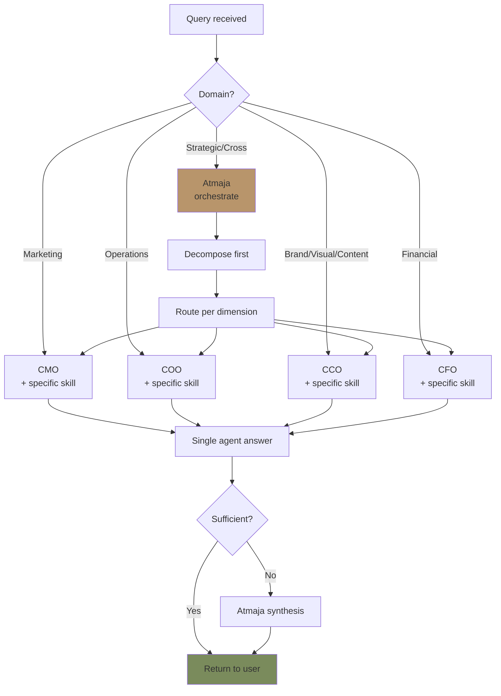
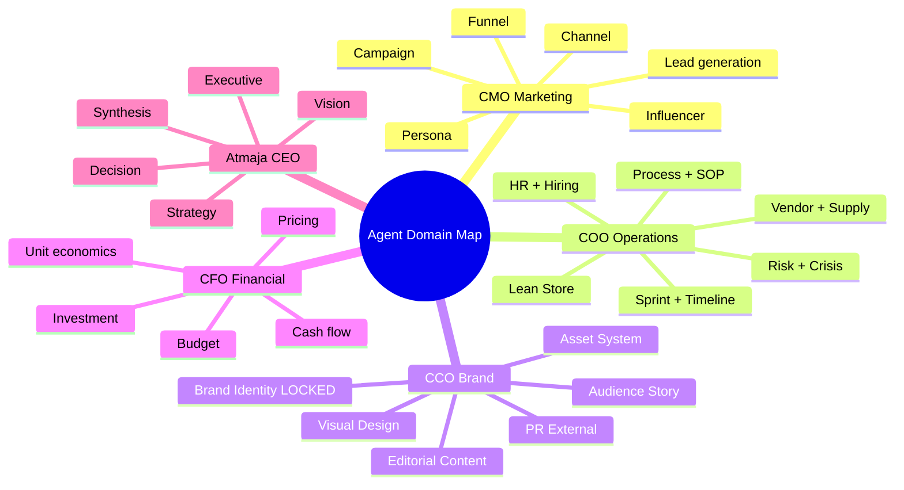

# Agent Router (Route to Right C-Level Agent)

Route question / task Gerai 1000 Pintu ke C-Level agent yang tepat: CMO (marketing), COO (operations), CCO (brand/communication), CFO (financial), Atmaja (strategic/orchestrate). Smart classification + handoff with context.

## Triggers

Primary:
- "route to agent"
- "which agent"
- "best agent for"

Secondary:
- "delegate to"
- "agent selection"

## Input Required

| Field | Type | Required | Default |
|---|---|---|---|
| query | string | yes | (question or task to route) |
| context | string | no | (additional context) |
| urgency | enum | no | (default normal) |

## Output Template

```markdown
# Agent Router: {QUERY}

**Routing decision:** {Agent name + skill}
**Confidence:** {High / Medium / Low}
**Rationale:** {Why this agent}

## Query Classification

### Domain Detected
- Primary domain: {Marketing / Operations / Brand / Financial / Strategic}
- Secondary domain (kalau cross-functional): {if any}
- Specific skill area: {detail}

### Intent Detected
- Action: {Generate / Analyze / Validate / Plan / Decide}
- Output expected: {Document / Decision / Analysis / Validation}

## Routing Logic

### Primary Route: {Agent + Skill}

**Agent:** {CMO / COO / CCO / CFO / Atmaja}
**Skill invoked:** {specific skill from catalog}
**Rationale:** {Why this is best fit}

### Alternative routes (kalau ambigu)
- Option B: {Agent + Skill} — kalau focus shift
- Option C: {Agent + Skill} — kalau scope expand

## Agent Domain Specialization

### CMO (Chief Marketing Officer)
**Domain:** Marketing, lead generation, conversion, campaign, persona engagement

**Routes for:**
- Lead generation strategy → cmo.lead-generation
- Campaign planning → cmo.campaign-planning
- Channel performance → cmo.channel-strategy
- Persona analysis → cmo.persona-deep-dive
- Funnel optimization → cmo.funnel-analysis
- Marketing budget → cmo.marketing-budget
- Influencer vetting → cmo.influencer-vetting
- Content gap → cmo.content-gap-analysis
- Email marketing → cmo.email-marketing
- SEO strategy → cmo.seo-strategy
- Performance marketing → cmo.performance-marketing
- Customer acquisition → cmo.customer-acquisition
- Marketing report → cmo.marketing-report

**Trigger keywords:** lead, kampanye, persona, channel, funnel, conversion, marketing budget, influencer, KOL, ads, SEO, performance

### COO (Chief Operating Officer)
**Domain:** Operations, supply chain, sprint, HR, Lean Store, risk, showroom

**Routes for:**
- Vendor selection → coo.vendor-scorecard
- Vendor onboarding → coo.vendor-onboarding
- PO management → coo.po-management
- Quality control → coo.quality-control
- Logistics → coo.logistics-optimizer
- Sprint planning → coo.sprint-planner
- Capacity planning → coo.capacity-planning
- Critical path → coo.critical-path
- SOP generation → coo.sop-generator
- Workflow design → coo.workflow-design
- Process audit → coo.process-audit
- Hiring plan → coo.hiring-plan
- Job description → coo.job-description
- Onboarding → coo.onboarding-roadmap
- Training → coo.training-curriculum
- Performance review → coo.performance-review-framework
- Lean Store design → coo.lean-store-design
- Door Expert → coo.door-expert-operating-model
- Showroom → coo.showroom-experience-design
- Risk register → coo.risk-register
- Contingency → coo.contingency-plan
- Weekly ops → coo.weekly-ops-report

**Trigger keywords:** vendor, PO, supplier, sprint, capacity, SOP, workflow, hire, training, performance, Lean Store, Door Expert, showroom, risk, crisis, operations

### CCO (Chief Creative & Communication Officer)
**Domain:** Brand, editorial, visual design, content, audience emotion, PR

**Routes for:**
- Brand canon validation → cco.brand-canon-enforcer
- Visual identity → cco.visual-identity-system
- Brand positioning → cco.brand-positioning
- Brand architecture → cco.brand-architecture
- Brand audit → cco.brand-audit
- Editorial style guide → cco.editorial-style-guide
- Copywriting → cco.copywriting-framework
- Long-form article → cco.long-form-writer
- Caption social → cco.caption-generator
- Content calendar → cco.content-calendar-strategy
- Design brief → cco.design-brief-generator
- Photography direction → cco.photography-direction
- Iconography → cco.iconography-system
- Mockup spec → cco.mockup-spec
- Audience emotional mapping → cco.audience-emotional-mapping
- Brand storytelling → cco.brand-storytelling
- Testimonial → cco.testimonial-curation
- Press release → cco.press-release-writer
- Crisis communication → cco.crisis-communication
- Influencer brief → cco.influencer-creative-brief
- Asset library → cco.asset-library-organization
- Template system → cco.template-system
- Brand health → cco.brand-health-dashboard

**Trigger keywords:** brand, canon, em-dash, "tempat" "rumah", Gerai 1000 Pintu lengkap, visual, palette, typography, editorial, caption, article, design brief, photography, mockup, brand audit, press, crisis comm, influencer brief, testimonial

### CFO (Chief Financial Officer)
**Domain:** Financial planning, budget, cash flow, unit economics, investment

**Routes for:**
- Budget planning → cfo.budget-planning
- Cash flow analysis → cfo.cash-flow
- Unit economics → cfo.unit-economics
- Revenue forecast → cfo.revenue-forecast
- Cost optimization → cfo.cost-optimization
- Investment ROI → cfo.investment-roi
- Financial reporting → cfo.financial-reporting
- Pricing strategy → cfo.pricing-strategy
- Working capital → cfo.working-capital
- Phase 2 financial model → cfo.phase-2-financial-model

**Trigger keywords:** budget, anggaran, cash flow, kas, revenue, biaya, ROI, investasi, harga, pricing, financial, unit economics

### Atmaja (CEO Orchestrator)
**Domain:** Strategic decomposition, multi-agent synthesis, executive decision, vision

**Routes for:**
- Strategic decomposition → atmaja.strategic-decomposition
- Decision framework → atmaja.decision-framework
- SWOT + OKR → atmaja.swot-okr-integration
- Vision roadmap → atmaja.vision-roadmap
- Scenario planning → atmaja.scenario-planning
- Multi-agent synthesis → atmaja.multi-agent-synthesis
- Executive summary → atmaja.executive-summary
- Stakeholder briefing → atmaja.stakeholder-briefing
- Founder briefing → atmaja.founder-briefing
- Company KPI → atmaja.company-kpi-dashboard

**Trigger keywords:** strategi, vision, roadmap, OKR, SWOT, scenario, decision, executive, board, founder briefing, multi-agent, synthesis, KPI company

## Classification Decision Tree

### Step 1: Identify primary domain
**Question type → Primary domain:**

| Question type | Primary domain |
|---|---|
| "Bagaimana attract customer baru?" | CMO |
| "Vendor mana untuk AMK Premium?" | COO |
| "Apa palette warna yang tepat?" | CCO |
| "Berapa budget Wave 1?" | CFO |
| "Should we expand Phase 2 sekarang?" | Atmaja |

### Step 2: Confirm specificity
- Spesifik skill area? → Direct route
- Broad strategic? → Atmaja first decompose
- Cross-functional? → Atmaja multi-agent

### Step 3: Detect cross-functional
**Cross-functional indicators:**
- "Bagaimana launch yang sukses?" (CMO + CCO + COO + CFO)
- "Should we change Lean Store?" (COO + CFO + CCO + Atmaja)
- "Wave 1 review" (all C-Level + Atmaja synthesis)

**For cross-functional:**
- Atmaja decompose first
- Then route per dimension
- Aggregate via multi-agent-synthesis

## Routing Confidence Tier

### High confidence (direct route)
- Clear domain match
- Specific skill area identifiable
- Single C-Level sufficient

### Medium confidence (route with note)
- Domain identified but skill area ambiguous
- Single agent likely sufficient
- Note: agent may further classify

### Low confidence (Atmaja decompose first)
- Cross-functional
- Strategic level
- Multiple domain involved
- Atmaja takes first

## Routing Anti-Pattern

### Avoid
- ❌ Route to multiple agent simultaneously kalau bisa single (overhead)
- ❌ Route to Atmaja kalau spesifik C-Level sufficient (over-orchestration)
- ❌ Skip domain detection (random route)
- ❌ Force route to specific agent (bias)

### Embrace
- ✅ Single agent when sufficient
- ✅ Multi-agent only when truly cross-functional
- ✅ Atmaja when strategic OR ambiguous
- ✅ Direct skill name when clear

## Sample Routing

### Sample 1: Direct route CMO
**Query:** "Bikin lead funnel analysis Q4 2026 Wave 1"
**Route:** CMO + skill `funnel-analysis`
**Confidence:** High
**Rationale:** Single-domain marketing question, specific skill

### Sample 2: Direct route COO
**Query:** "PO baru untuk AMK Premium 500 unit Q1 2027"
**Route:** COO + skill `po-management`
**Confidence:** High
**Rationale:** Operations + supply chain, specific skill

### Sample 3: Direct route CCO
**Query:** "Validate Instagram caption ini untuk em-dash + tempat"
**Route:** CCO + skill `brand-canon-enforcer`
**Confidence:** High
**Rationale:** Brand canon validation, direct skill match

### Sample 4: Cross-functional → Atmaja first
**Query:** "Wave 1 launch readiness assessment"
**Route:** Atmaja first decompose → CMO + COO + CCO + CFO answer → Atmaja synthesis
**Confidence:** High (for orchestration pattern)
**Rationale:** Strategic multi-functional, requires synthesis

### Sample 5: Strategic decision
**Query:** "Should we delay Cabang #2 Samarinda 6 month?"
**Route:** Atmaja + skill `decision-framework`
**Confidence:** High
**Rationale:** Strategic Type C decision, needs framework + multi-agent input

## Edge Case Handling

### Vague query
- Atmaja classify first
- May ask clarifying question
- Default to Atmaja for synthesis

### Multi-domain explicit
- "Marketing + Operations" → Atmaja synthesis pattern
- Multi-agent-synthesis skill activated

### Unknown / not in catalog
- Atmaja general assessment
- Identify gap
- Recommend skill creation OR external resource

### Out of scope
- "Politics", "investment trading", etc → out of scope
- Polite refuse + explain scope
```

## Visual Output

Agent routing decision tree:



Domain coverage map:



## Knowledge Dependency

- All C-Level skill catalog (CMO + COO + CCO + CFO)
- All Atmaja skill (self-reference)
- Matthew priorities
- Cross-functional pattern recognition

## Mode

Default: EXECUTION (route immediately)
Switch: NEED_CLARIFICATION jika query ambigu

## Tools Required

- Skill catalog lookup
- artifacts (decision tree)

## Validation Criteria

- 5 agent domain coverage (CMO, COO, CCO, CFO, Atmaja)
- Skill keyword trigger per agent
- Classification decision tree 3-step
- Confidence tier (High / Medium / Low)
- Cross-functional handling
- Anti-pattern explicit
- Sample routing 5+ scenarios
- Edge case handling

## Sample I/O

**Input:** "Route: 'Bagaimana sebaiknya kita design konsultasi pod Showroom Balikpapan?'"

**Output:**
- Primary domain: COO (Operations + Showroom)
- Secondary domain: CCO (Visual aspect of pod)
- Recommended route: COO + skill `showroom-experience-design`
- Confidence: High
- Rationale: Showroom design = COO primary, but engage CCO for visual canon validation
- Optional secondary: CCO `visual-identity-system` cross-check after COO design
- Decision tree + domain map embedded

## Handoff

- All C-Level skill (per route)
- multi-agent-synthesis (kalau cross-functional)
- delegation-matrix (kalau complex)
- context-handoff (pass context cleanly)
