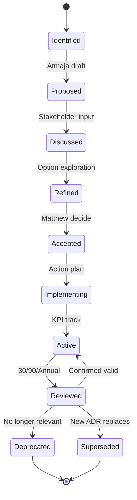
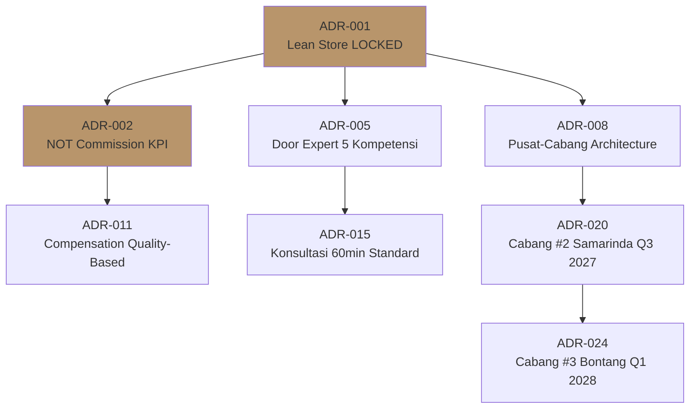
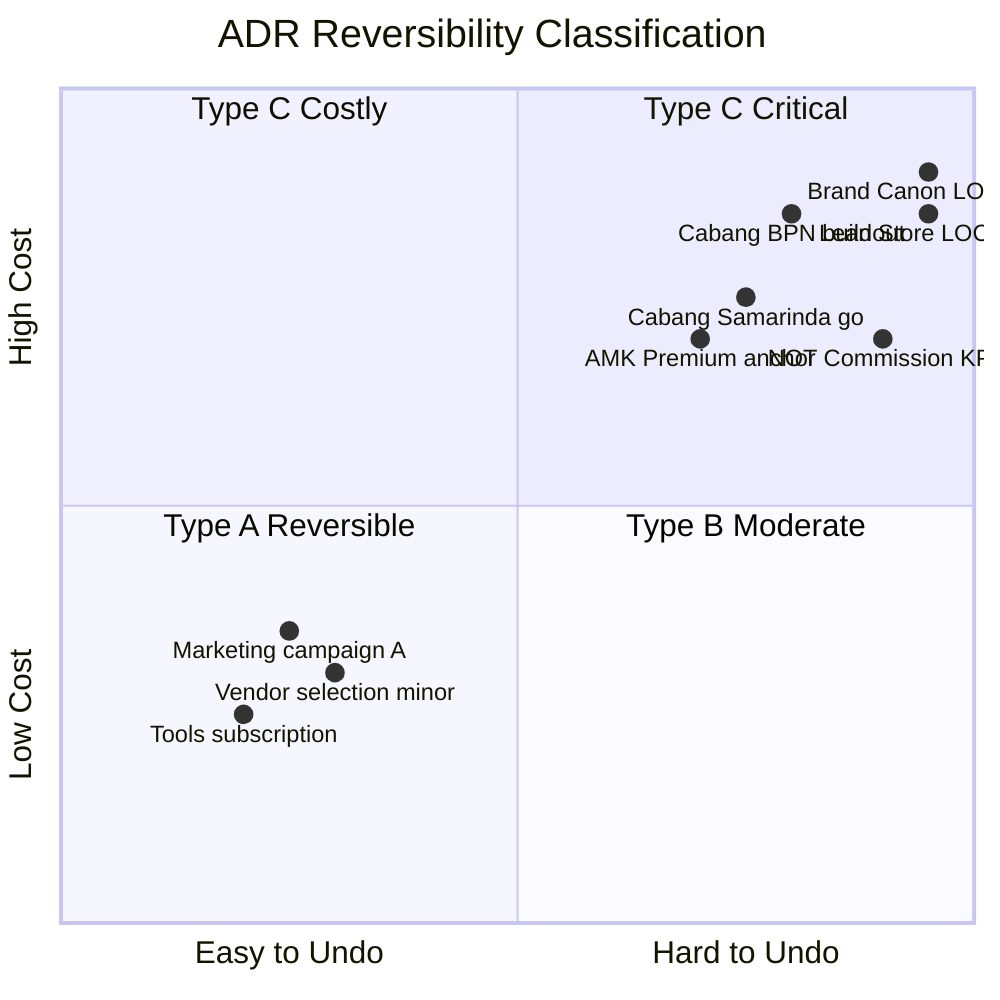

# Architectural Decision Record (ADR)

Document strategic + architectural decisions Gerai 1000 Pintu dengan ADR pattern. Structured context + decision + consequence. Track decision history, reversibility, evolution. Standar untuk Matthew + agent decision-making.

## Triggers

Primary:
- "ADR"
- "decision record"
- "architectural decision"

Secondary:
- "dokumentasi keputusan"
- "decision log"

## Input Required

| Field | Type | Required | Default |
|---|---|---|---|
| decision_title | string | yes | - |
| context | string | yes | (what triggered decision) |
| status | enum | yes | (proposed / accepted / deprecated / superseded) |
| reversibility | enum | yes | (high / medium / low — Type A/B/C) |

## Output Template

```markdown
# ADR-{NNN}: {DECISION TITLE}

**ADR Number:** GERAI-ADR-{YYYY}-{NNN}
**Status:** {Proposed / Accepted / Deprecated / Superseded}
**Date:** {Date decided}
**Decider:** {Matthew / Atmaja + Matthew / C-Level + Matthew}
**Reversibility:** {Type A High / Type B Medium / Type C Low}
**Supersedes:** {ADR-XXX if applicable}

## Context

### Situation
{What's happening that requires decision — 2-3 sentences}

### Forces at play
- **Force 1:** {strategic / financial / operational / customer / brand factor}
- **Force 2:** {tension or trade-off}
- **Force 3:** {constraint or opportunity}

### Why now
{Timing rationale — why decide now vs later}

### Stakeholders affected
- Customer: {how affected}
- Team: {how affected}
- Vendor: {how affected}
- Brand: {how affected}

## Decision

### Decision statement
{Specific decision in 1-2 sentences — clear + actionable}

### Rationale
1. **{Reason 1}** — connecting to strategy / values / capability
2. **{Reason 2}** — addressing forces at play
3. **{Reason 3}** — long-term consideration

### Options considered + rejected
- **Option A: {alternative}** — rejected because {reason}
- **Option B: {alternative}** — rejected because {reason}
- **Option C: Status quo** — rejected because {reason}

### Why chosen option
{Specific advantage that tipped decision}

## Consequence

### Positive
- {Outcome 1 — expected benefit}
- {Outcome 2}
- {Outcome 3}

### Negative
- {Trade-off accepted}
- {Cost to acknowledge}

### Neutral / Uncertain
- {Outcome that depends on execution}

### Long-term implication
- Phase 1 impact: {how Year 1 affected}
- Phase 2 impact: {how Year 2-3 affected}
- Phase 3+ impact: {long-term affected}

## Implementation

### Action items
| Step | Owner | Deadline | Status |
|---|---|---|---|
| {Step 1} | {role} | {date} | {pending/in-progress/done} |
| {Step 2} | {role} | {date} | {} |
| {Step 3} | {role} | {date} | {} |

### KPI to track post-decision
- {KPI 1}: target {value}
- {KPI 2}: target {value}

### Review cadence
- 30-day check: {what to validate}
- 90-day review: {what to assess}
- Annual review: {strategic alignment}

## Reversibility Analysis

### Type Classification
- **Type A High Reversibility:** Can undo within 30 day, low cost
- **Type B Medium Reversibility:** Can undo within 6 month, moderate cost
- **Type C Low Reversibility:** Cannot easily undo, high cost

### This decision: Type {A/B/C}

### Reversal triggers (if needed)
- {Condition 1 that would trigger review}
- {Condition 2}

### Reversal cost estimate
- Financial: Rp {N}
- Time: {N} month
- Relationship: {impact}
- Reputation: {impact}

## Risk + Mitigation

### Top risk this decision
1. **{Risk 1}** — Probability + Impact + Mitigation
2. **{Risk 2}**

### Pre-mortem
"Imagine 12 month from now this decision FAILED. What likely caused failure?"
- {Top failure mode}
- Pre-positioned action: {what to do NOW to prevent}

## Brand Canon Alignment

### Compliance check
- [ ] Brand canon maintained (no compromise)
- [ ] Premium curated standard preserved
- [ ] Lean Store concept LOCKED honored
- [ ] 5 Nilai applied
- [ ] BP Latest reference anchor consistent

### If decision affects brand
- CCO review required
- Visual + verbal canon implication noted

## Related ADRs

### Predecessor (supersedes)
- ADR-{XXX}: {Title} — {how related}

### Successor (superseded by)
- ADR-{YYY}: {Title} — {how related}

### Dependency
- ADR-{ZZZ}: {Title} — {dependency relationship}

### Influences
- ADR-{AAA}: {Title} — {influences this decision}

## Sample ADR Library

### Sample 1: ADR-001 Lean Store Concept LOCKED

```
ADR-001: Lean Store Concept 2-Staf + Door Expert Remote LOCKED

Status: Accepted
Date: 2026-05-01
Decider: Matthew
Reversibility: Type C Low

Context:
Building operating model for Gerai 1000 Pintu Cabang Balikpapan launch Q4 2026. 
Industry standard 5-10 staff per premium retail location. Indonesian market 
expectation similar. Question: how to scale quality while managing cost?

Forces:
- Quality consistency critical (premium tetapi inklusif positioning)
- Cost efficiency necessary (sustainable margin)
- Scalability requirement (Phase 2 cabang #2-3)
- BP Latest reference anchor (smaller intimate retail experience)

Decision:
Lock concept: 2-staf cabang (MA × 2 or MA + Gudang) + Door Expert remote 
centralized dari pusat. No deviation di Phase 1-3.

Rationale:
1. Premium curated experience compatible with intimate scale (BP Latest reference)
2. Centralized Door Expert ensures konsultasi quality consistent
3. Cost-efficient enabling Phase 2 expansion
4. Replicable model untuk cabang #2-3 dengan standard same

Options rejected:
- 3-5 staff traditional: cost prohibitive for cabang scale
- Single staff lean: insufficient customer coverage
- Distributed Door Expert per cabang: quality consistency risk

Consequence:
+ Scalability + cost efficiency + quality consistency
- Single Door Expert capacity ceiling (~120 konsultasi/month)
- Cross-training MA required (backup)

Reversibility: Type C — hard to undo (operating model + hiring + culture)
Reversal trigger: capacity sustained >150 konsultasi/month 2 quarter (hire Door Expert #2)

Risk: Door Expert burnout — Mitigation: capacity tracking + backup MA Senior
```

### Sample 2: ADR-002 NOT Commission-Based KPI

```
ADR-002: NOT Commission-Based KPI for Door Expert + MA LOCKED

Status: Accepted
Date: 2026-05-15
Decider: Matthew
Reversibility: Type C Low

Context:
Compensation model design for Door Expert + MA. Industry standard often 
commission + base. Question: how to incentivize quality + customer outcome?

Forces:
- Premium curated standard quality (NOT volume push)
- BP Latest reference retail experience (calm refined, not aggressive sales)
- Customer trust + long-term relationship
- 5 Nilai applied (especially Pelayanan Nyaman)
- Industry benchmark (commission common but aggressive)

Decision:
NOT commission-based. Base salary + quality KPI bonus. Bonus tied to:
- CSAT 9/10+ sustained
- 5 Nilai demonstrated
- Brand canon compliance
- Aftersales follow-through

NOT tied to:
- Sales volume
- Order value
- Conversion rate (alone)

Rationale:
1. Premium tetapi inklusif retail = quality > volume (compromise rejected)
2. BP Latest reference retail standard = calm refined, not aggressive
3. Long-term customer relationship > short-term transaction
4. Door Expert position = konsultan, not sales
5. Brand canon preserved (no aggressive language)

Options rejected:
- Pure commission: aggressive sales risk + brand canon violation
- Hybrid commission + quality: still incentivizes wrong behavior
- Variable based on order count: skews toward push, not pull

Consequence:
+ Premium hangat preserved + customer trust + long-term LTV
- Door Expert + MA may earn less peak month vs commission peers (acceptable)
- Industry hiring slightly harder (mitigate via culture + career path)

Reversibility: Type C — fundamental to brand DNA + culture
Reversal trigger: NONE (this is LOCKED — refer Brand Canon)
```

### Sample 3: ADR-003 Cabang #2 Samarinda Q3 2027

```
ADR-003: Proceed Cabang #2 Samarinda Q3 2027 Launch (Conditional)

Status: Proposed (pending Q2 2027 gate review)
Date: 2027-03-01 (projected)
Decider: Matthew + Atmaja synthesis
Reversibility: Type C Low

Context:
Phase 1 Wave 1 successful (NPS 48, awareness 30% Balikpapan, konsultasi 80+/Q). 
Vision-roadmap targets Phase 2 Kaltim scale starting Q4 2027 with Samarinda 
first. Need confirmation Q3 launch timing OR delay.

Forces:
- Phase 2 momentum (capture market while brand strong)
- Operational readiness (Door Expert #2 + SOP replicate)
- Financial readiness (capex Rp 280jt + cash tight Phase 2 prep)
- AMK supply chain scale (anchor vendor)
- Brand canon multi-cabang consistency

Decision:
PROCEED Q3 2027 Cabang Samarinda launch WITH conditions:
- Q2 gate review: AMK contract scale-ready + Door Expert #2 hired + cash buffer Rp 200jt minimum
- Fall-back: delay to Q1 2028 if any condition fails
- Marketing budget Rp 60jt Samarinda-specific allocated

Rationale:
1. Phase 1→2 gate criteria substantially met (momentum + readiness)
2. Demand Samarinda validated (CMO research)
3. Operational SOP proven scalable Cabang #1
4. Financial workable with conditions
5. Brand canon discipline preserved (CCO auto-validation)

Options:
- Proceed unconditional: rejected (too aggressive)
- Delay Q1 2028 6-month: rejected (momentum loss)
- Skip Samarinda go Bontang first: rejected (Samarinda market larger)

Consequence:
+ Phase 2 momentum + multi-cabang validation + revenue growth
- Cash flow tight (working capital line ready)
- Operations stretched (mitigation: hiring + cross-training)

Reversibility: Type C
Reversal trigger: AMK supply fail OR cash <Rp 150jt — delay decision Q2 gate

Risk:
- AMK scale supply chain — Mitigation: backup vendor + PO lock S4
- Door Expert capacity — Mitigation: hire #2 by Q2 + capacity tracking
- Cash flow — Mitigation: working capital line + conservative budget

Brand canon: Auto-validation cross-cabang + CCO oversight
Related: ADR-001 (Lean Store LOCKED + replicate)
```

## ADR Numbering + Catalog

### Numbering convention
- Format: `GERAI-ADR-{YYYY}-{NNN}` (sequential)
- 2026: ADR-001 through ADR-XXX
- 2027: ADR resets or continues per year preference
- Recommended: continuous sequential (easier reference)

### ADR Catalog Index
Maintained di Notion + Repository:
- ADR list with status
- Reversibility tier
- Cross-reference (supersedes / dependency)
- Searchable

### Categories per ADR
- Strategic (Phase, vision, brand)
- Operational (Lean Store, SOP, vendor)
- Financial (budget, pricing, investment)
- Brand (canon, visual, editorial)
- Technical (system, tools, AI Department)

## ADR Workflow

### Step 1: Identify need
Decision crosses threshold:
- Multi-stakeholder impact
- Long-term consequence
- Strategic implication
- Brand canon or LOCKED concept

### Step 2: Draft ADR (proposed status)
- Use template above
- Context + Forces + Options + Decision
- Atmaja can pre-draft for Matthew

### Step 3: Discussion + Refinement
- Stakeholder input (kalau perlu)
- Forces validation
- Option exploration

### Step 4: Decision + Accept
- Matthew decides (atau Atmaja autonomous within scope)
- Status: Proposed → Accepted
- Implementation plan activate

### Step 5: Implementation
- Action items execute
- KPI tracking
- Review cadence

### Step 6: Review + Evolution
- 30-day + 90-day + Annual review
- Update status kalau perlu (Deprecated / Superseded)
- New ADR kalau supersede

### Step 7: Document + Archive
- Permanent record
- Cross-reference maintained
- Learning loop applied

## When to Create ADR

### Mandatory ADR
- Phase transition decisions
- Brand canon major change
- Capex >Rp 50jt
- Vendor anchor change (AMK alternative)
- Operating model change (Lean Store deviation)
- Hire senior role (Door Expert, C-Level)
- Crisis P0/P1 response

### Optional ADR (recommended)
- Significant marketing campaign
- New product line consideration
- Process change material
- Tools major adoption

### Skip ADR
- Daily operational decision
- Within-budget tactical
- Standard process per SOP

## ADR Quality Standards

### Per ADR document
- [ ] Clear decision statement (no ambiguity)
- [ ] Context complete (situation + forces + timing)
- [ ] Options considered + rejected with reason
- [ ] Consequence (positive + negative + neutral)
- [ ] Reversibility classified
- [ ] Implementation plan + owner + KPI
- [ ] Risk + mitigation
- [ ] Brand canon alignment check
- [ ] Related ADRs cross-referenced
- [ ] Brand canon compliance (no em-dash, proper voice)

### Anti-pattern ADR
- ❌ Vague decision ("we should improve marketing")
- ❌ No context (what triggered)
- ❌ No alternative considered
- ❌ No consequence (only positive listed)
- ❌ No owner / accountability
- ❌ No review cadence
- ❌ Buried in document trail (not searchable)

## ADR Communication

### Internal
- Notion ADR catalog (public to Tim Pusat)
- WhatsApp notification kalau material new ADR
- Quarterly ADR review

### External (rare)
- Press / Investor: select ADR shared (Phase context)
- Vendor: relevant ADR communicate
- Customer: anonymized impact-summary kalau relevant

## Brand Canon Compliance (ADR Document)

- No em-dash
- "Gerai 1000 Pintu" lengkap di formal context
- Premium hangat tone (even technical decision)
- Direct + factual + warm
- Anchor reference BP Latest reference where applicable
```

## Visual Output

ADR lifecycle:



ADR relationship graph:



ADR reversibility classification:



## Knowledge Dependency

- decision-framework (Atmaja)
- delegation-matrix (Atmaja)
- governance-framework (Atmaja)
- All C-Level skill (decision context)
- Brand Canon LOCKED

## Mode

Default: EXECUTION (draft ADR per request)
Switch: DISCUSSION jika decision context evolving

## Tools Required

- file-search (ADR catalog + history)
- artifacts (ADR document + visual)

## Validation Criteria

- ADR template structured (Context + Decision + Consequence + Implementation)
- Reversibility classification (Type A/B/C)
- Options considered + rejected
- Risk + mitigation
- Brand canon alignment check
- Cross-reference (predecessor / successor / dependency)
- Sample ADR library (3+ examples)
- Workflow 7-step
- Quality standards explicit
- Anti-pattern avoided

## Sample I/O

**Input:** "ADR for: Lock Filosofi Dunia Pintu (4-negara cultural context) as proprietary brand framework Phase 1+"

**Output:**

ADR-{NNN}: Filosofi Dunia Pintu (4-negara cultural context, BUKAN mandatory archetype) as Proprietary Brand Framework

Status: Accepted
Date: 2026-05-27
Decider: Matthew
Reversibility: Type C Low (fundamental brand DNA)

Context: Building brand positioning. Need differentiated framework that customers, architects, and content can use to understand pintu character selection. Premium retail uses signature framework; Gerai needs equivalent IP framework.

Forces: Brand differentiation + customer education + content depth + Indonesia cultural relevance + scalability across cabang.

Decision: LOCK "Filosofi Dunia Pintu (4-negara cultural context)" (Jepang jiwa, Eropa seni, Amerika pernyataan, China gerbang rezeki) as proprietary framework. Brand asset + customer education + content pillar + Door Expert script.

Rationale: Cultural sensitivity Indonesia + BP-aligned style storytelling depth + replicable framework + IP compounding + manuscript "Pintu Berbicara" alignment.

Options rejected: Generic curation "style 1-4" (no story), Western-only reference (cultural mismatch), Per-archetype branding separately (dilutes master brand).

Consequence: + Brand IP + content depth + customer education + framework citable. - Requires consistent reinforcement.

Reversibility: Type C — would require brand pivot to reverse.

Cross-ref: ADR-001 (Lean Store), ADR-002 (NOT commission), Brand Canon LOCKED.

## Handoff

- decision-framework (paired)
- All C-Level (per function ADR impact)
- governance-framework (decision authority)
- Matthew (decision authority)
- Notion archive (ADR catalog)
