# Architectural Model (Universal Visualization Foundation)

Universal skill untuk render concept Gerai 1000 Pintu ke architectural model. Callable oleh setiap agent (Atmaja + CMO + COO + CCO + CFO) untuk menyajikan informasi secara visual architectural. Brand canon strict palette + typography.

## Triggers

Primary:
- "architectural model"
- "model arsitektur"
- "buat arsitektur"
- "render architectural"

Secondary:
- "sajikan arsitektural"
- "blueprint visual"
- "system diagram"

## Input Required

| Field | Type | Required | Default |
|---|---|---|---|
| concept | string | yes | (apa yang divisualisasi) |
| model_type | enum | yes | (12 type, refer below) |
| audience | enum | no | (Matthew / team / stakeholder / external) |
| detail_level | enum | no | (executive / detailed / deep) |

## 12 Architectural Model Types

### Type 1: System Architecture
**Best for:** Tech stack, AI Department, integration, infrastructure
**Mermaid:** `flowchart` dengan subgraph

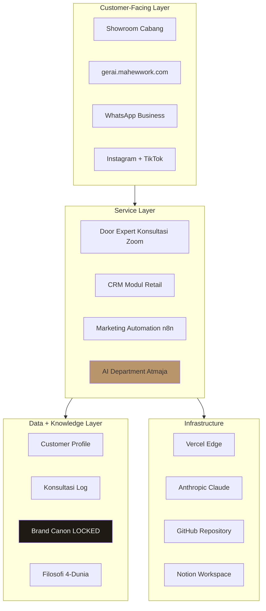

### Type 2: Business Architecture
**Best for:** Operating model, business unit, capability map

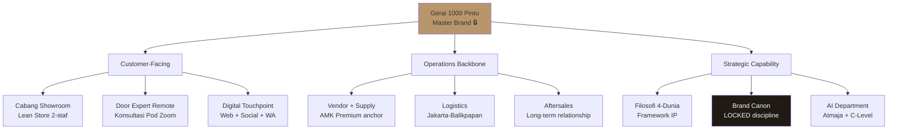

### Type 3: Strategic Architecture (3-Horizon)
**Best for:** Vision phase, growth horizon, time-based strategy

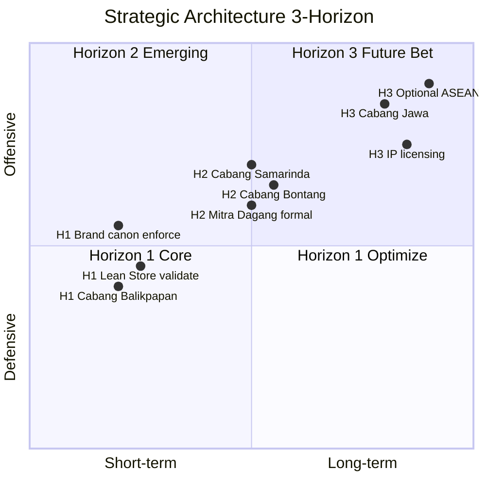

### Type 4: Decision Architecture
**Best for:** Decision flow, authority hierarchy, RACI

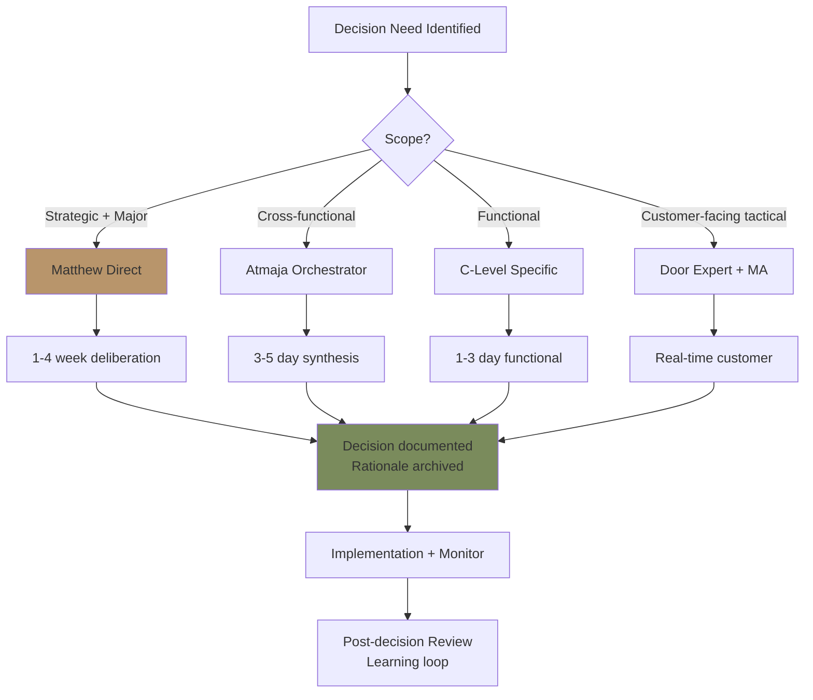

### Type 5: Data Architecture
**Best for:** Information flow, knowledge management, CRM data

```mermaid
flowchart LR
    subgraph Generate[Generate]
        A1[Walk-in interaction]
        A2[Konsultasi session]
        A3[Customer purchase]
        A4[Aftersales touch]
    end
    
    subgraph Capture[Capture + Tag]
        B1[CRM CRM Modul Retail]
        B2[Notion knowledge base]
        B3[Asset library Figma]
    end
    
    subgraph Synthesize[Synthesize]
        C1[Atmaja knowledge-orchestration]
        C2[Per persona insight]
        C3[Pattern recognition]
    end
    
    subgraph Apply[Apply + Decision]
        D1[Door Expert script update]
        D2[Marketing campaign]
        D3[Strategic decision]
    end
    
    Generate --> Capture
    Capture --> Synthesize
    Synthesize --> Apply
    Apply --> Generate
    
    style C1 fill:#B8956B
```

### Type 6: Process Architecture (Swimlane)
**Best for:** Cross-functional workflow, customer journey, handoff

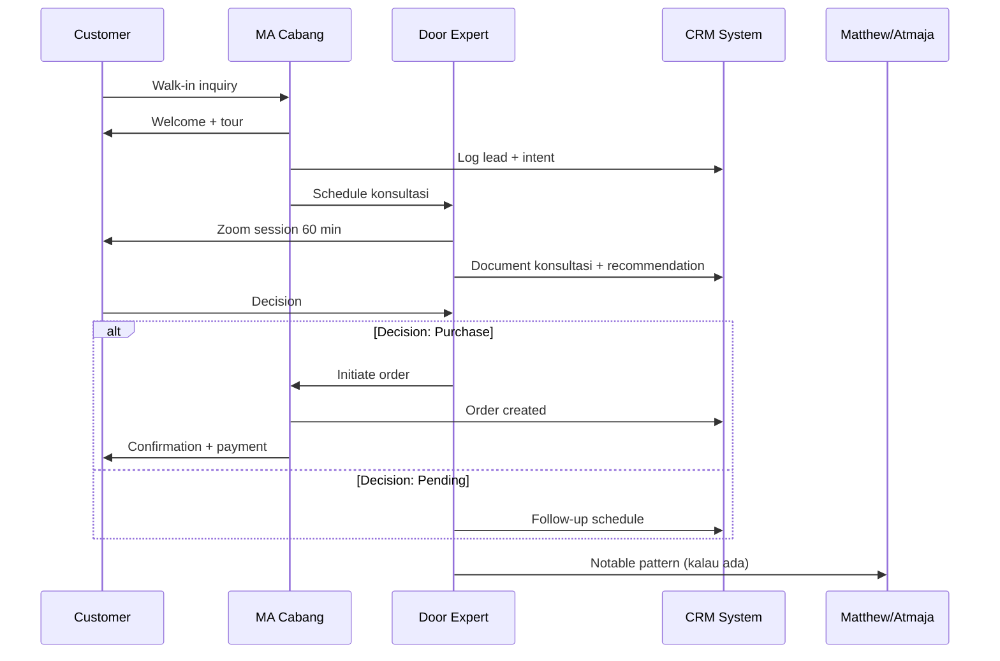

### Type 7: Organizational Architecture (Org Chart)
**Best for:** Team structure, reporting line, role mapping

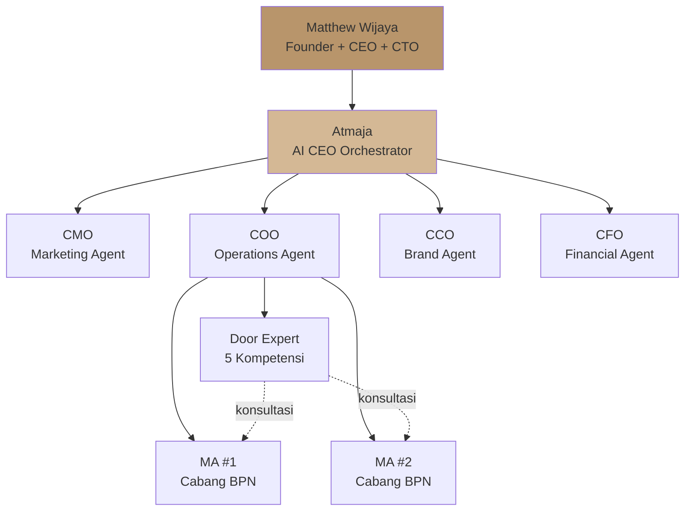

### Type 8: Brand Architecture
**Best for:** Master brand, product line, channel hierarchy

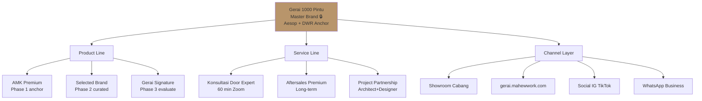

### Type 9: Capability Maturity Architecture
**Best for:** Skill maturity, capability assessment, gap analysis

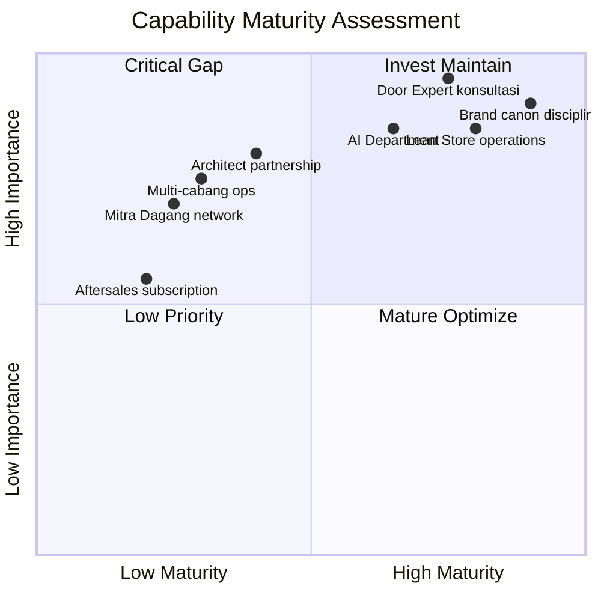

### Type 10: Customer Journey Architecture
**Best for:** Customer experience map, touchpoint, emotional arc

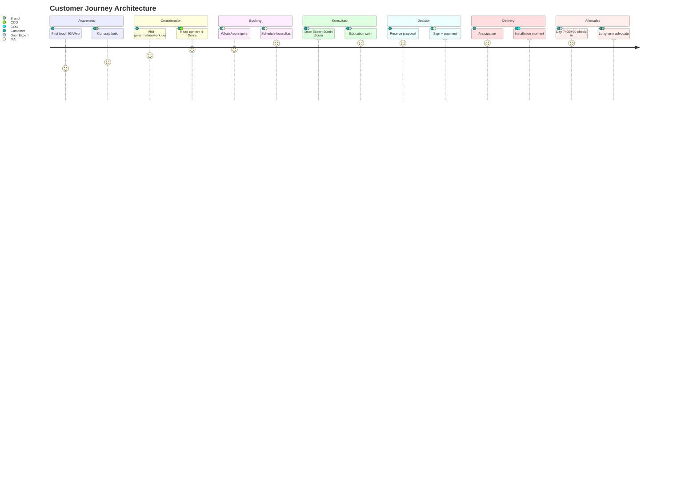

### Type 11: Risk Architecture
**Best for:** Risk portfolio, mitigation map, escalation

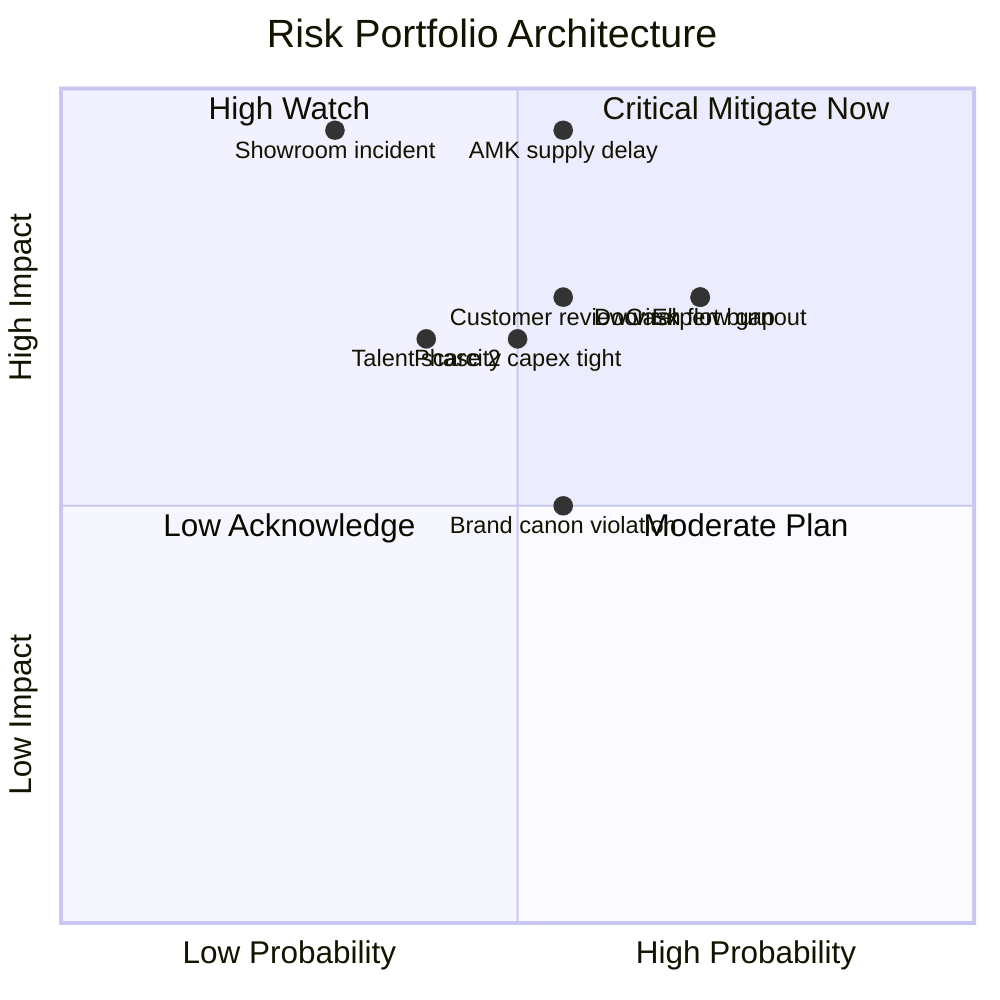

### Type 12: Knowledge Architecture
**Best for:** Knowledge tier, learning map, IP hierarchy

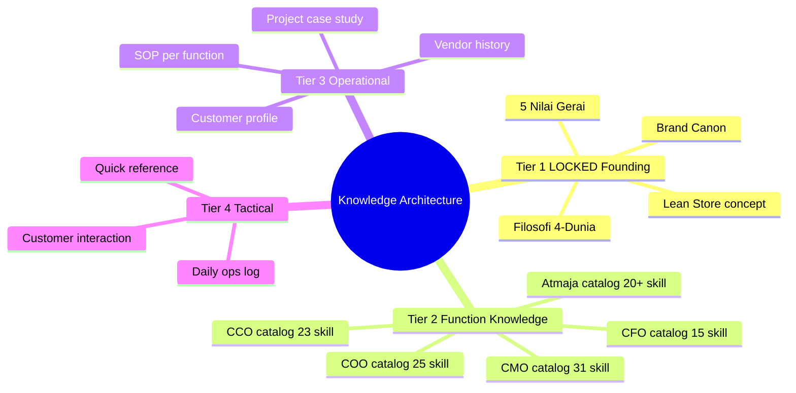

## Architectural Model Selection Decision

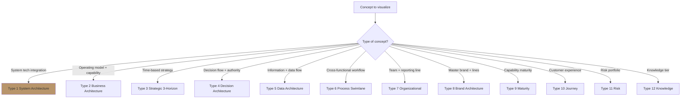

## Brand Canon Visual Style (Architectural Diagrams)

### Color Palette LOCKED
- **Brass `#B8956B`:** focal point, hero element, primary node
- **Charcoal `#1F1A14`:** text dominant, depth nodes (with Ivory text)
- **Ivory `#FAF8F4`:** background, breathing space
- **Warm Tan `#D4B895`:** secondary accent
- **Sage `#7A8B5C`:** positive signal, success
- **Rust `#A0522D`:** warning, attention rare

### Typography
- **Display:** Playfair Display (kalau title kalau platform support)
- **Label:** Inter sans-serif (Mermaid default acceptable)
- **Mono:** for code reference (rare di architectural)

### Layout Principles
- **Generous white space** 30-50% diagram area
- **Hero focal** 1 element brass (LOCKED key concept)
- **Hierarchy clear** dengan size + color
- **Annotation contextual** (helpful, not noisy)

### Anti-pattern Visual
- ❌ Drop shadow (semua node)
- ❌ Gradient flashy
- ❌ Multi-color rainbow
- ❌ 3D effect
- ❌ Excessive emoji
- ❌ Decoration without meaning

## Multi-Model Composition Patterns

### Pattern 1: Vertical Stack (Layered)
- 4-5 layer stacked vertically
- Each layer = different abstraction
- Example: System architecture (Client → Service → Data → Infrastructure)

### Pattern 2: Hub & Spoke
- Central concept + radiating connections
- Example: Brand architecture (Master + product/service/channel)

### Pattern 3: Sequential Flow
- Linear progression left-to-right or top-to-bottom
- Example: Customer journey, decision flow

### Pattern 4: Quadrant Matrix
- 2x2 grid dengan x/y axis
- Example: Strategic 3-horizon, risk, maturity, capability

### Pattern 5: Tree Hierarchy
- Root + branching children
- Example: Organizational, knowledge, brand

### Pattern 6: Network Graph
- Multiple nodes + multi-directional connections
- Example: Stakeholder map, dependency network

## Audience Adaptation

### For Matthew (Executive)
- High-level overview
- Hero focal clear
- 1-page summary preferred
- Strategic implication visible
- 5-15 nodes maximum

### For Tim Pusat (Operational)
- Detail layer accessible
- Annotation helpful
- 10-30 nodes acceptable
- Action item per node kalau perlu

### For External (Press / Investor)
- Polished brand canon strict
- Aesop + DWR refined feel
- Premium hangat tone in labels
- Minimal noise

### For Customer-facing (rare)
- Simplified
- Story-driven
- Visual metaphor
- Filosofi 4-Dunia integration

## Architectural Model Quality Standards

### Per diagram
- [ ] Title contextual (jelas apa yang divisualisasi)
- [ ] Brand palette compliance LOCKED
- [ ] Hero focal 1 element
- [ ] Hierarchy clear
- [ ] White space generous
- [ ] Annotation kalau perlu
- [ ] Readable at intended size
- [ ] Mermaid syntax valid

### Composition
- [ ] Right model type for concept
- [ ] Appropriate detail level for audience
- [ ] No noise / unnecessary node
- [ ] Logical flow direction
- [ ] Color used meaningfully (not decoratively)

## Universal Invocation Pattern

### Any agent can invoke:
```
architectural-model {
  concept: "{what to visualize}",
  model_type: "type-1 through type-12",
  audience: "Matthew / team / stakeholder / external",
  detail_level: "executive / detailed / deep"
}
```

### Output format
- Mermaid block rendered directly
- Brief caption (1-2 sentence context)
- Reading instruction (kalau complex)
- Related skill links (kalau perlu)

## Sample Use Cases

### Atmaja invoke (synthesis)
- Strategic decomposition → Type 4 Decision Architecture
- Multi-agent synthesis → Type 5 Data Architecture (flow of inputs)
- Quarterly business review → Type 11 Risk + Type 9 Maturity

### CMO invoke
- Funnel analysis → Type 6 Process (lead journey)
- Customer journey → Type 10 Journey Architecture
- Campaign rollout → Type 6 Process Sequence

### COO invoke
- Workflow design → Type 6 Process Swimlane
- Lean Store operations → Type 2 Business Architecture
- Risk register → Type 11 Risk Architecture

### CCO invoke
- Brand architecture → Type 8 Brand Architecture
- Visual identity system → Type 5 Data (asset hierarchy)
- Content calendar → Type 6 Process (publishing flow)

### CFO invoke
- Cash flow → Type 5 Data Architecture (flow)
- Budget allocation → Type 8 Brand (categorical)
- ROI portfolio → Type 9 Capability Maturity

## Architectural Model Compositions (Multi-Type Combo)

### Combo 1: Strategic + Risk
Type 3 Strategic (horizon) + Type 11 Risk (overlay)
- Where strategy intersects risk
- Phase transition decision context

### Combo 2: Customer Journey + Process
Type 10 Customer Journey + Type 6 Process Swimlane
- Customer side + internal side simultaneous

### Combo 3: Org + Decision Authority
Type 7 Organizational + Type 4 Decision
- Who reports to whom + who decides what

### Combo 4: Brand + Data
Type 8 Brand Architecture + Type 5 Data Flow
- How brand element propagates through system

## Pitfall to Avoid

### Common mistake
- ❌ Wrong model type for concept (force fit)
- ❌ Too many node (>30 cluttered)
- ❌ Too few node (<3 trivial)
- ❌ Brand palette violation (off-canon color)
- ❌ Decoration without information value
- ❌ Inconsistent style across diagrams
- ❌ Mermaid syntax error (un-rendered)

### Fix approach
- Start with right model type (decision tree above)
- Iterate to balance detail (3-15 nodes ideal for clarity)
- Brand canon validate before publish
- Test render before commit
```

## Visual Output

Architectural model type selector:

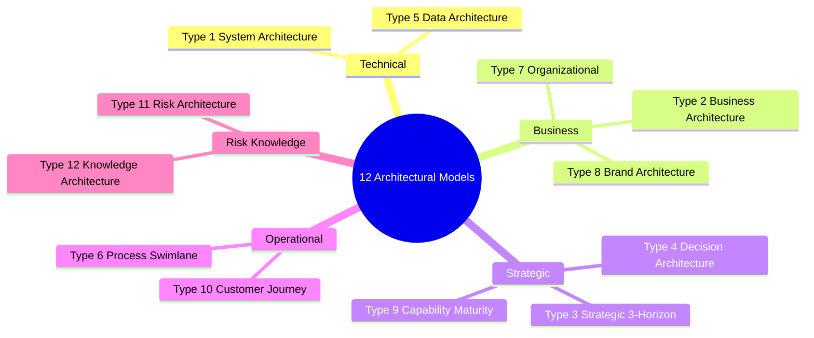

Brand canon visual hierarchy:

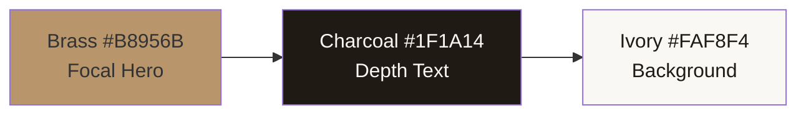

Composition pattern:

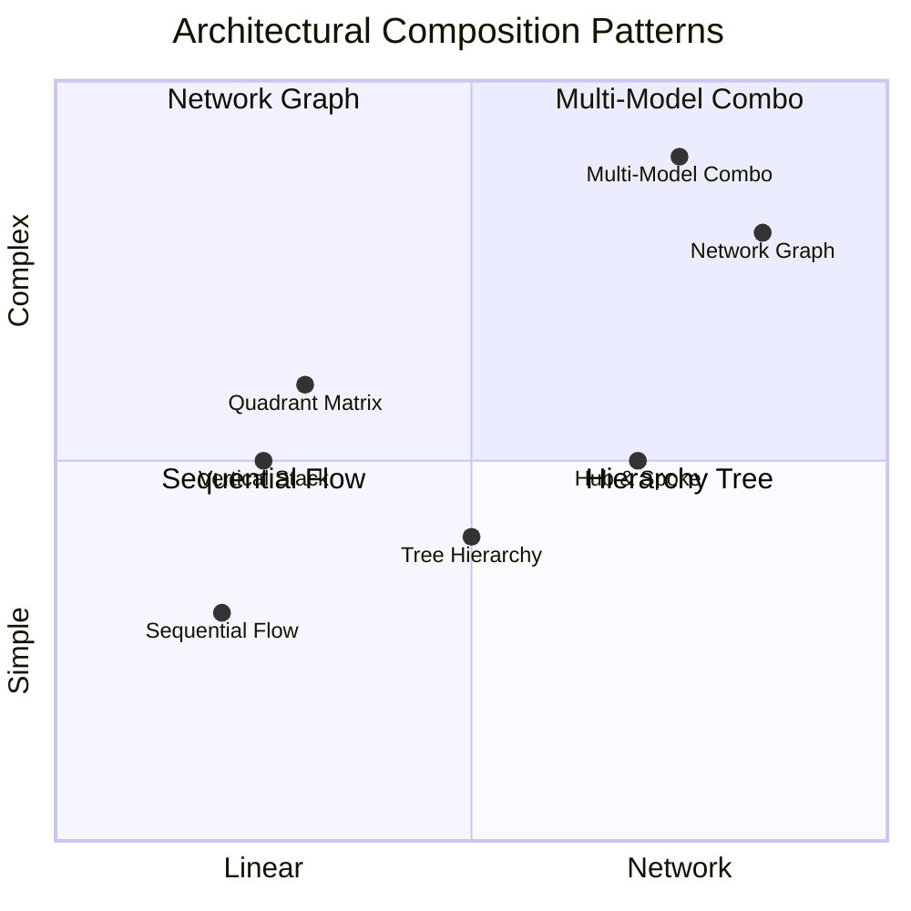

## Knowledge Dependency

- Brand Canon LOCKED (visual palette + typography)
- CCO visual-identity-system
- CCO visual-summary (paired universal)
- All C-Level skill (data input source)
- Mermaid syntax library

## Mode

Default: EXECUTION (generate architectural model immediately)
Switch: NEED_CLARIFICATION jika concept/type ambigu

## Tools Required

- artifacts (primary rendering)
- file-search (concept context)

## Validation Criteria

- 12 model type library
- Per type: best-for + Mermaid template + sample
- Brand canon visual style strict
- Multi-model composition patterns
- Audience adaptation
- Quality standards per diagram
- Universal invocation pattern
- Sample use case per agent
- Pitfall + fix approach

## Sample I/O

**Input:** "Architectural model: Lean Store operating model untuk Matthew executive view"

**Output:**
- Model type: Type 2 Business Architecture
- Detail level: Executive (5-10 nodes max)
- Brand canon: Brass on Master + Charcoal text + Ivory background
- Hero focal: "Gerai 1000 Pintu" master brand
- Branches: Customer-facing + Operations + Strategic Capability
- Annotation: "LOCKED" badge on Brand Canon + Lean Store concept
- Rendered Mermaid (refer Type 2 sample above)

## Handoff

- All agents (universal callable)
- architectural-decision-record (decision context)
- decision-architecture (decision logic detail)
- visual-thinking-toolkit (chart deep library)
- CCO visual-identity-system (canon source)
