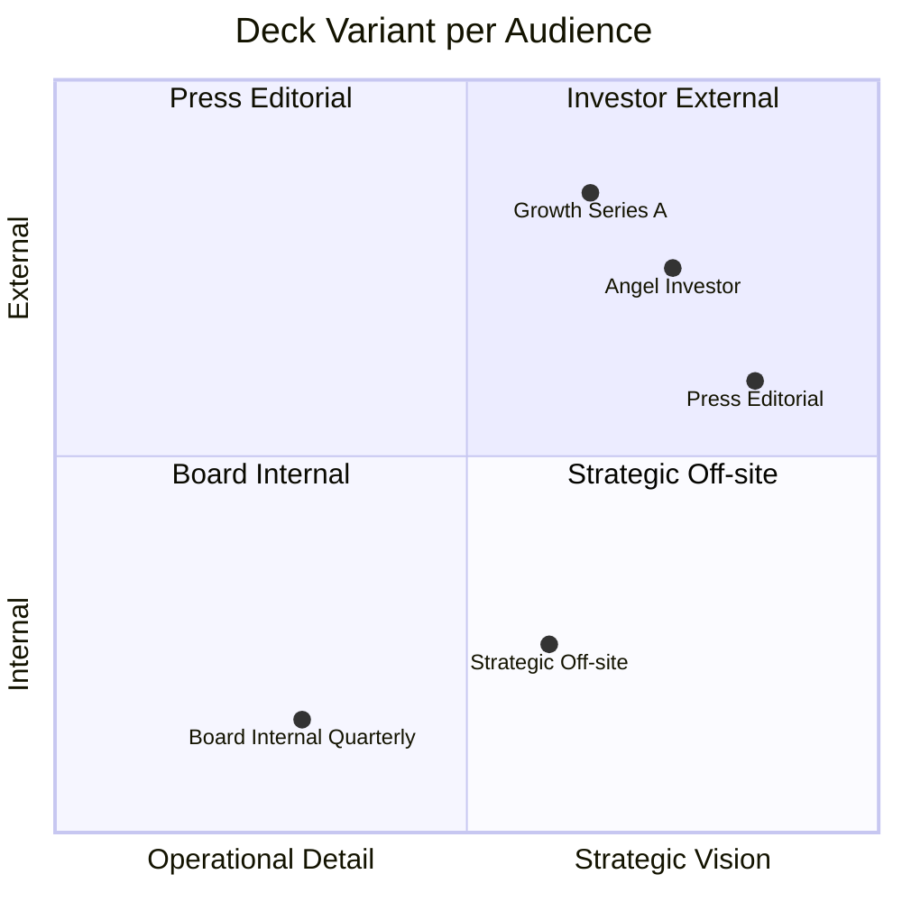
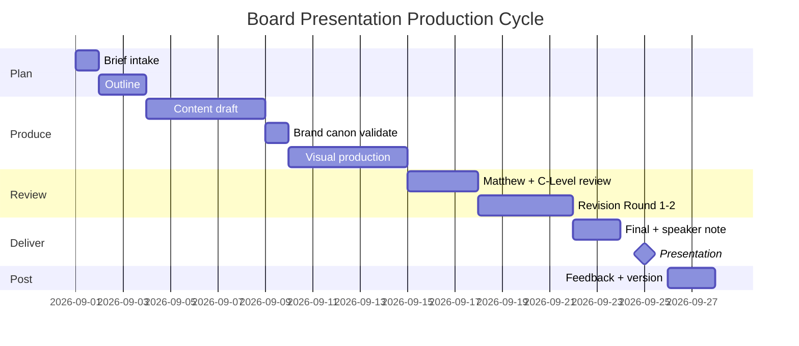

# Board / Investor Presentation

Build board / investor presentation Gerai 1000 Pintu: pitch deck premium hangat tone, brand canon strict, strategic narrative compelling. Phase-appropriate (early-stage internal vs growth-stage external).

## Triggers

Primary:
- "board presentation"
- "investor pitch"
- "board deck"

Secondary:
- "growth deck"
- "executive presentation"

## Input Required

| Field | Type | Required | Default |
|---|---|---|---|
| audience | enum | yes | (board / investor early / investor growth / press) |
| purpose | string | yes | (raise / update / strategic align) |
| slide_count | number | no | (10-20 typical) |
| period | string | yes | - |

## Output Template

```markdown
# Board / Investor Presentation: {AUDIENCE}

**Purpose:** {Raise capital / Quarterly update / Strategic alignment}
**Audience:** {Specific}
**Slide count target:** {10-20}
**Tone:** Premium hangat (brand canon strict)

## Deck Structure (Standard 15-slide)

### Slide 1: Cover
**Content:**
- Logo Gerai 1000 Pintu primary
- "Tempat impian dimulai dari pintu yang tepat."
- Audience-specific subtitle
- Date + presenter

**Design:** Hero photography (storefront atau product detail) + Playfair Display title

### Slide 2: Vision
**Content:**
- Vision statement
- Anchor reference Aesop + DWR + Kinfolk
- Why now (timing context)

**Tone:** Aspirational + grounded

### Slide 3: Problem / Opportunity
**Content:**
- Premium curated retail underserved Indonesia
- Mass-market vs aspirational gap
- Architect+Designer client pain point
- Customer journey friction premium pintu

**Format:** Visual contrast (current vs aspirational)

### Slide 4: Solution / Concept
**Content:**
- Gerai 1000 Pintu positioning
- Lean Store + Door Expert remote model
- Filosofi 4-Dunia framework
- AMK Premium anchor

**Format:** Visual concept diagram

### Slide 5: Filosofi 4-Dunia
**Content:**
- Jepang jiwa
- Eropa seni
- Amerika pernyataan
- China legacy

**Format:** 4-quadrant grid visual

### Slide 6: Lean Store Operating Model
**Content:**
- 2-staf cabang + Door Expert remote
- Cost efficiency vs traditional retail
- Scalability proof

**Format:** Architecture diagram + metric

### Slide 7: Customer Journey + Experience
**Content:**
- 6 Persona representation
- Customer journey stages
- Premium hangat touchpoint
- Aesop+DWR reference visible

**Format:** Journey diagram + sensory detail

### Slide 8: Market Opportunity
**Content:**
- TAM (Indonesia premium curated retail)
- SAM (Kaltim + Jawa expansion)
- SOM (Year 1-3 capture)
- Growth trajectory

**Format:** Funnel + chart

### Slide 9: Business Model + Unit Economics
**Content:**
- Revenue streams (product margin + service)
- Average konsultasi value
- Conversion rate
- Customer lifetime value
- Break-even path

**Format:** Numerical table + chart

### Slide 10: Phase Roadmap
**Content:**
- Phase 1: Foundation (Year 1) — current
- Phase 2: Kaltim Scale (Year 2)
- Phase 3: Jawa Expansion (Year 3-4)
- Phase 4: Optional (Year 5+)

**Format:** Gantt timeline

### Slide 11: Team
**Content:**
- Matthew Wijaya (Founder + CEO + CTO)
- Atmaja AI Department orchestrator
- C-Level AI agents (CMO + COO + CCO + CFO)
- Door Expert + MA structure
- Anchor reference Aesop+DWR org culture

**Format:** Team chart + key bio

### Slide 12: Traction (Year 1 achievement)
**Content:**
- Konsultasi count
- NPS sustained
- Brand awareness Balikpapan
- Press mention
- Customer testimonial (consent-cleared)

**Format:** Metric dashboard

### Slide 13: Financial Snapshot
**Content:**
- Year 1 revenue + actual vs target
- Year 2-3 forecast
- Margin profile
- Use of capital (kalau raise)

**Format:** Chart + summary table

### Slide 14: Ask / Vision Forward
**Content:**
- Year 2 priorities
- Phase 2 execution plan
- Decision needed (kalau raise: capital amount + use)
- Vision Year 5

**Format:** Clear specific ask

### Slide 15: Close
**Content:**
- Thank-you
- Contact (Matthew)
- Q&A invitation
- Premium hangat closing

**Format:** Hero photo + minimal text

## Audience Adaptation

### Internal Board (Tim Pusat + Senior + Mentor)
- Tone: Direct + collaborative
- Detail: Operations + tactical
- Focus: Execution + alignment

### Early-Stage Investor (Angel / Seed)
- Tone: Aspirational + grounded
- Detail: Vision + market + team
- Focus: Why bet on this team + concept

### Growth-Stage Investor (Series A+) — Phase 3+
- Tone: Confident + data-driven
- Detail: Unit economics + scale plan
- Focus: Path to outcome + IRR

### Press / Editorial
- Tone: Editorial premium
- Detail: Cultural angle + story
- Focus: Why this matters + anchor reference

## Visual Design Principles

### Brand Canon Strict
- Palette: Brass + Charcoal + Ivory (60/30/10 ratio)
- Typography: Playfair Display title + Inter body
- Photography: Aesop+DWR style refined
- Layout: Generous white space 50%+
- No drop shadow / 3D / gradient flashy

### Slide Composition
- 1 hero element per slide
- Caption Inter body 16-20pt
- Hierarchy clear (eye flow obvious)
- Margin generous (48px+ web equivalent)

### Photography
- Hero shots: product detail + tempat + showroom
- Category A+B dominant per visual identity
- Color grade warm neutral + brass enhanced

### Anti-Pattern Visual
- ❌ Bullet point lists overwhelming
- ❌ Animation excessive
- ❌ Stock chart cliche
- ❌ Trendy infographic flat-design
- ❌ Color rainbow saturated

## Slide-by-Slide Brand Canon Checklist

Each slide:
- [ ] Brand palette compliant
- [ ] Typography Playfair + Inter only
- [ ] White space generous
- [ ] No em-dash di copy
- [ ] "tempat" not "rumah" customer-facing
- [ ] "Gerai 1000 Pintu" lengkap (especially cover + close)
- [ ] Anchor Aesop+DWR reference (visual + verbal)
- [ ] Premium hangat tone

## Production Workflow

### Step 1: Brief intake
- Audience + purpose + slide count + deadline
- Atmaja synthesis from C-Level data

### Step 2: Outline
- 15-slide structure adapted
- Key message per slide
- Data + visual need identified

### Step 3: Content draft
- Per slide content (Atmaja + CCO)
- Brand canon validate (CCO + brand-canon-enforcer)

### Step 4: Visual production
- Figma master template (per CCO template-system)
- Photography selection from asset library
- Chart + diagram production

### Step 5: Review + revision
- Matthew review (final approval)
- C-Level review function-specific
- Round 1-2 revision

### Step 6: Final + delivery
- PDF export + Figma source preserved
- Speaker note prepared
- Q&A prep document

### Step 7: Post-delivery
- Feedback gather
- Update kalau learning
- Archive + version control

## Speaker Note Standard

### Per slide
- Key message (1 sentence)
- Supporting data (2-3 point)
- Anticipated question + answer
- Transition to next slide

### Overall presentation
- Opening hook 30 sec
- Pacing 1-2 min per slide
- Closing call + Q&A invitation
- Backup detail kalau deep question

## Q&A Preparation

### Anticipated questions (per audience)

**Board / Internal:**
- Operational status detail?
- Talent + culture concern?
- Brand canon compliance?

**Early Investor:**
- Why Indonesia premium curated retail now?
- Why team can execute?
- Path to outcome?

**Growth Investor:**
- Unit economics path?
- Capital efficiency?
- Competitive moat?

**Press:**
- Cultural angle?
- Anchor reference Aesop+DWR significance?
- Future vision?

### Response framework
- Direct answer first
- Supporting data
- Strategic context
- Premium hangat tone

## Confidentiality + Distribution

### Sensitivity levels
- **Internal:** Tim Pusat + Matthew
- **Selected investor:** NDA signed first
- **Public:** Press kit version (less detail)

### Distribution
- Physical: Premium printed kalau in-person
- Digital: PDF watermarked
- Cloud: Restricted access link

### Version control
- v1.0 first draft
- v2.0 revision after feedback
- vFinal locked for distribution
- Archive previous version

## Sample Deck Variant

### Variant 1: Board Internal Quarterly Review
- 10 slide focused
- Operational + tactical detail
- KPI dashboard heavy
- Decision needed clear

### Variant 2: Angel Investor Pitch (Phase 1)
- 15 slide standard
- Vision + market + team emphasis
- Anchor reference visible
- Ask: Rp X capital

### Variant 3: Growth Series A (Phase 3 hypothetical)
- 20 slide comprehensive
- Unit economics + scale model
- Phase 4 option teased
- Ask: Rp Y growth capital

### Variant 4: Press Editorial Pitch
- 12 slide story-driven
- Cultural narrative dominant
- Photography editorial
- Why this matters Indonesia

## Brand Canon Compliance (Critical)

**FOR EXTERNAL PRESENTATION — STRICT:**
- Every visual: brand canon validate
- Every word: editorial-style-guide compliant
- Every claim: factual + substantiated
- Every photo: brand canon photography direction
- Quote attribution accurate
- Anchor reference appropriate (not over-claimed)
```

## Visual Output

Deck structure flow:


Audience-format matrix:



Production workflow:



## Knowledge Dependency

- All C-Level skill catalog (data input)
- multi-agent-synthesis
- executive-summary (paired)
- visual-identity-system (CCO)
- template-system (CCO Figma)
- brand-canon-enforcer
- vision-roadmap (Phase content)
- swot-okr-integration (strategic content)

## Mode

Default: EXECUTION (build deck per brief)
Switch: NEED_CLARIFICATION jika audience/purpose ambigu

## Tools Required

- file-search (data + asset)
- artifacts (deck preview)
- Figma access (visual production)

## Validation Criteria

- 15-slide standard structure (or variant)
- Audience adaptation 4-tier
- Visual design principles brand canon strict
- Slide-by-slide canon checklist
- Production workflow 7-step
- Speaker note standard
- Q&A preparation per audience
- Confidentiality + distribution
- Sample deck variant 4
- Brand canon compliance strict

## Sample I/O

**Input:** "Board presentation Q4 2026 quarterly review for Tim Pusat internal"

**Output summary:**
- Variant: Board Internal Quarterly Review
- Slide count: 10 focused (subset of 15)
- Audience: Tim Pusat + Matthew + Senior
- Purpose: Q4 review + strategic align Q1 2027
- Slide content adapted: KPI dashboard heavy, operational tactical
- Photography: Wave 1 launch moment + showroom
- Brand canon: 100% compliance
- Speaker note: Per slide key message + anticipated question
- Production: 25 day cycle (brief → outline → draft → visual → review → final)
- Deck structure flow + audience matrix + production Gantt embedded

## Handoff

- executive-summary (paired)
- multi-agent-synthesis (data input)
- visual-identity-system (visual spec)
- template-system (Figma master)
- brand-canon-enforcer (validation)
- Matthew (final approval)
