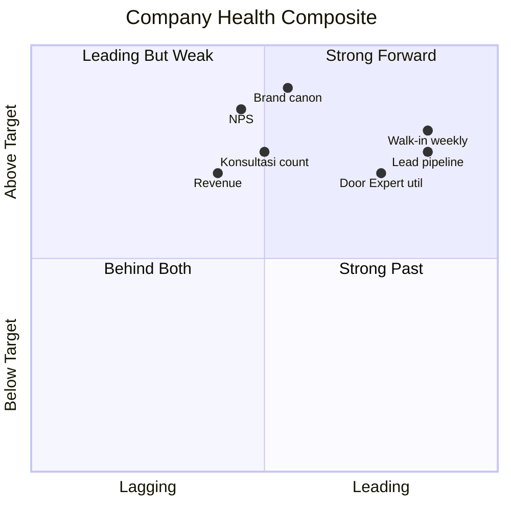
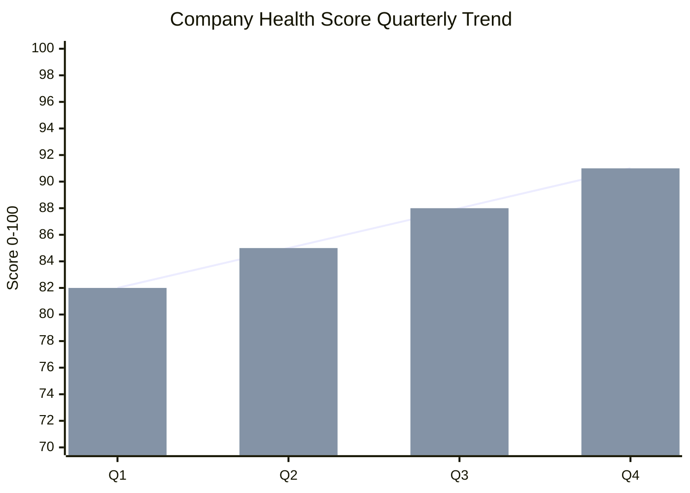
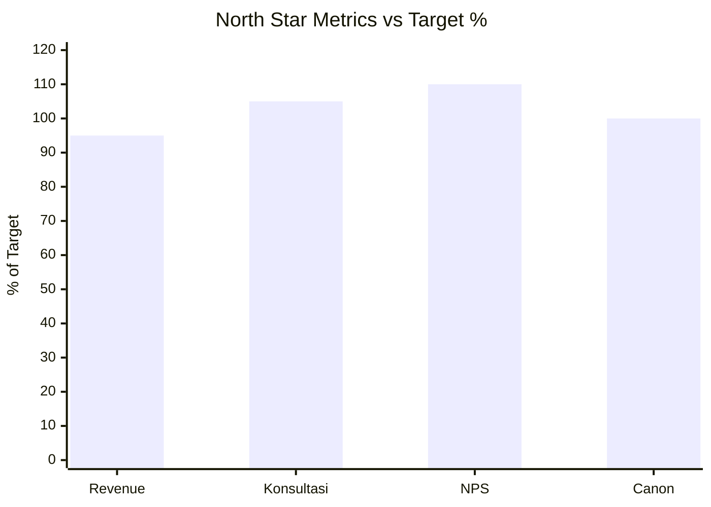
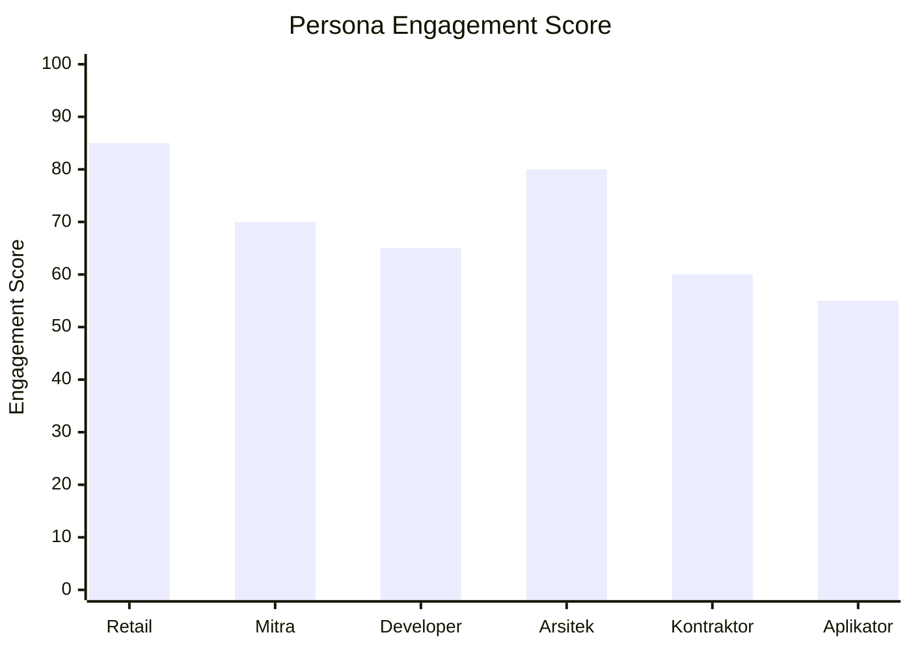

# Company KPI Dashboard

Master KPI dashboard Gerai 1000 Pintu: aggregate dari CMO + COO + CCO + CFO function dashboard. Top-level view, leading + lagging indicator, trend + benchmark.

## Triggers

Primary:
- "company KPI"
- "master dashboard"
- "Gerai dashboard"

Secondary:
- "KPI summary"
- "performance dashboard"

## Input Required

| Field | Type | Required | Default |
|---|---|---|---|
| period | enum | yes | (weekly / monthly / quarterly / annual) |
| compare_period | string | no | (previous period for trend) |

## Output Template

```markdown
# Company KPI Dashboard: {PERIOD}

**Period:** {Date range}
**Compare:** {Previous period}
**Owner:** Matthew (review) + Atmaja (synthesis)
**Distribution:** Tim Pusat + C-Level

## Executive Snapshot (30-sec read)

🟢 Company Health Score: **{N}/100**
{Trend: ↑ / → / ↓ vs previous}

**Top win:** {1 key achievement}
**Top concern:** {1 critical issue}
**Decision needed:** {1 action item}

## North Star Metrics (4 critical)

### NS 1: Revenue
- Current: Rp {N}M
- Target: Rp {N}M
- Trend: 
- Status: -

### NS 3: NPS (Customer Satisfaction)
- Current: {N}
- Target: 40+ Y1 / 60+ Y2
- Trend: -
- Status: -

### NS 4: Brand Canon Compliance
- Current: {%}
- Target: 95%+
- Trend: -
- Status: -

## Function-Specific KPI Aggregation

### CMO Dashboard (Marketing)

| KPI | Target | Actual | Status |
|---|---|---|---|
| Lead count | {N} | {N} | - |
| Lead-to-konsultasi conv | 30%+ | {%} | - |
| Brand awareness Balikpapan | 30% Y1 | {%} | - |
| Marketing budget utilization | ±5% | {%} | - |
| Social engagement rate | 5%+ | {%} | - |
| Web traffic monthly | 10K Y1 | {N} | - |
| Email open rate | 25%+ | {%} | - |

### COO Dashboard (Operations)

| KPI | Target | Actual | Status |
|---|---|---|---|
| Sprint velocity | 30+ pts | {N} | - |
| Vendor on-time delivery | 90%+ | {%} | - |
| QC pass rate | 95%+ | {%} | - |
| MA capacity utilization | 70-85% | {%} | - |
| Door Expert konsultasi | 80-100/Q | {N} | - |
| SOP coverage | 90%+ | {%} | - |
| Staff retention | 80%+ Y1 | {%} | - |
| Risk register critical resolved | 100% | {%} | - |

### CCO Dashboard (Brand)

| KPI | Target | Actual | Status |
|---|---|---|---|
| Brand canon compliance | 95%+ | {%} | - |
| Content shipped weekly | 42 piece | {N} | - |
| Press mention quarter | 10+ pieces | {N} | - |
| Brand sentiment positive | 85%+ | {%} | - |
| Anchor reference (BP Latest reference) recognition | 15%+ Y1 | {%} | - |
| Asset library health | Updated | {status} | - |

### CFO Dashboard (Financial)

| KPI | Target | Actual | Status |
|---|---|---|---|
| Revenue actual vs target | ±10% | {%} | - |
| Gross margin | 30%+ |  of KR achieved
- Trend: improving / stable / declining
- Top blocker: {if any}

### Theme 2: Lean Store + Operating Model Validate (O2)
- Status: -
- Progress: 

### Theme 4: Phase 2 Foundation (O4)
- Status: -
- Progress: {%}

## Persona Engagement Tracking

| Persona | Lead Q | Conv % | NPS | Trend |
|---|---|---|---|---|
| Retail | {N} |  | {N} | - |
| Developer | {N} |  | {N} | - |
| Kontraktor | {N} |  | {N} | - |

## 4-negara cultural reference Archetype Distribution

| Dunia | Customer Choice | Engagement | Inventory Mix |
|---|---|---|---|
| Jepang |  |  |  |
| Amerika |  |  |  |

## Leading Indicator (Early Signal)

### Signals to watch
| Indicator | Current | Target | Signal |
|---|---|---|---|
| Walk-in weekly | {N} | 8-12 | 🟢/🟡/🔴 |
| Konsultasi booking weekly | {N} | 2-3 | - |
| Web search "Gerai 1000 Pintu" | {N} | 50+/week | - |
| Customer organic mention | {N} | 10+/week | - |
| Door Expert capacity util | {%} | 70-85% | - |
| Brand canon violation count | {N} | <5/week | - |

### Lagging indicator (outcome)
- Revenue
- Customer count cumulative
- NPS sustained
- Brand awareness aided

## Trend Analysis

### Quarterly trend (last 4 quarter)
{Multi-quarter chart implied}

### Year-over-year (kalau Y1+)
{YoY comparison}

### Seasonal pattern
{Pattern detected}

## Vs Benchmark

### Industry benchmark (curated retail)
| KPI | Gerai | Industry | Gap |
|---|---|---|---|
| NPS | {N} | 40 | {gap} |
| Conversion rate | {%} | 30% | - |
| Customer satisfaction | {N} | 8.0 | - |

### Anchor benchmark (BP Latest reference)
| KPI | Gerai | BP Latest reference |
|---|---|---|
| Brand canon compliance | {%} | 98% |
| NPS | {N} | 70+ |
| Customer aspirational association | {%} | 90%+ |

## Concern + Action

### Top 3 concern this period
1. **{Concern 1}** — Owner + ETA
2. **{Concern 2}** — Owner + ETA
3. **{Concern 3}** — Owner + ETA

### Top 3 win to celebrate
1. **{Win 1}** — credit team
2. **{Win 2}** — credit team
3. **{Win 3}** — credit team

## Forward Look

### Next period priority (top 3)
1. {Priority + owner + KPI to move}
2. {Priority}
3. {Priority}

### Decision required from Matthew
1. {Decision 1 + context}
2. {Decision 2}

### Investment + Resource shift
- Increase: {area + reason}
- Maintain: {area}
- Decrease: {area + reason}

## Brand Canon Continuous

### Compliance trend
- Em-dash violation: trending
- Vocabulary drift: trending
- Tone alignment: trending
- Visual canon: trending

### Audit cadence active
- Weekly auto-scan
- Monthly tone qualitative
- Quarterly full
- Annual benchmark

## Risk Surveillance

### Critical risk active (from COO risk-register)
| Risk ID | Status | Owner | Action |
|---|---|---|---|
| R-{ID} | Active 🔴 | {role} | {action} |

### New risk emerged
- {Risk + assessment + initial response}

### Risk resolved
- {Risk + outcome}

## Stakeholder Pulse

### Customer pulse
- Sentiment: {trend}
- Complaint count: {N}
- Praise count: {N}
- Testimonial pipeline: {N}

### Vendor pulse
- Performance: {summary}
- Issue: {if any}

### Team pulse
- Morale: {assessment}
- Retention: {%}
- Burnout signal: {if any}
```

## Visual Output

Health score composite:



Quarterly trend:



North Star metric radar:



Persona engagement:



## Knowledge Dependency

- All C-Level function dashboard (CMO + COO + CCO + CFO)
- COO weekly-ops-report
- CCO brand-health-dashboard
- swot-okr-integration (OKR alignment)
- vision-roadmap (strategic theme)
- COO risk-register

## Mode

Default: EXECUTION (aggregate + visualize)
Switch: NEED_CLARIFICATION jika data source incomplete

## Tools Required

- file-search (function dashboards)
- artifacts (composite + trend + radar)

## Validation Criteria

- Executive snapshot 30-sec
- 4 North Star metrics (Revenue + Konsultasi + NPS + Canon)
- Function-specific KPI aggregation (4 dashboard)
- Strategic theme tracking (4 OKR Objective)
- Persona engagement 6 persona
- 4-negara cultural reference distribution
- Leading + lagging indicator
- Trend analysis quarterly + YoY
- Vs benchmark (industry + BP Latest reference)
- Concern + win + forward look
- Brand canon continuous
- Risk surveillance
- Stakeholder pulse
- 3+ visual embedded

## Sample I/O

**Input:** "Company KPI dashboard Q4 2026 post Wave 1 launch month 1"

**Output summary:**
- Health score: 88/100 🟢 strong post-launch
- North Star: Revenue Rp 1.2M (95% target), Konsultasi 22 (105%), NPS 48 (110%), Canon 95% (target)
- CMO: Lead 80 (115% target), Awareness 35% Balikpapan (above 30% target)
- COO: Sprint velocity 32 pts, Door Expert util 75%, retention 100% (new hires only)
- CCO: Content 45/week (target 42), Press mention 5 pieces (Y1 pipeline)
- CFO: Margin 32%, runway 8 month, CAC Rp 350k (well below Rp 500k)
- Strategic theme: O1 Wave 1 launch 80% KR achieved 🟢, O2 Lean Store validating 60% 🟡
- Persona: Retail 85% engagement (top), Aplikator 55% (focus next Q)
- 4-negara cultural reference: Jepang 30% + Eropa 25% + Amerika 25% + China 20%
- Leading signal: Walk-in 12/week (target), search 80/week (above), no canon violation critical
- Top win: Wave 1 launch ahead of schedule + 5 organic press pickup
- Top concern: Aplikator persona engagement low (action Q1: dedicated content)
- Forward: Q1 educate filosofi + Aplikator outreach + maintain canon
- Composite quadrant + trend + radar + persona embedded

## Handoff

- All C-Level dashboard (data input)
- quarterly-business-review (deep dive)
- executive-summary (Matthew brief)
- vision-roadmap (strategic align)
