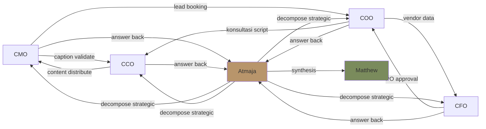
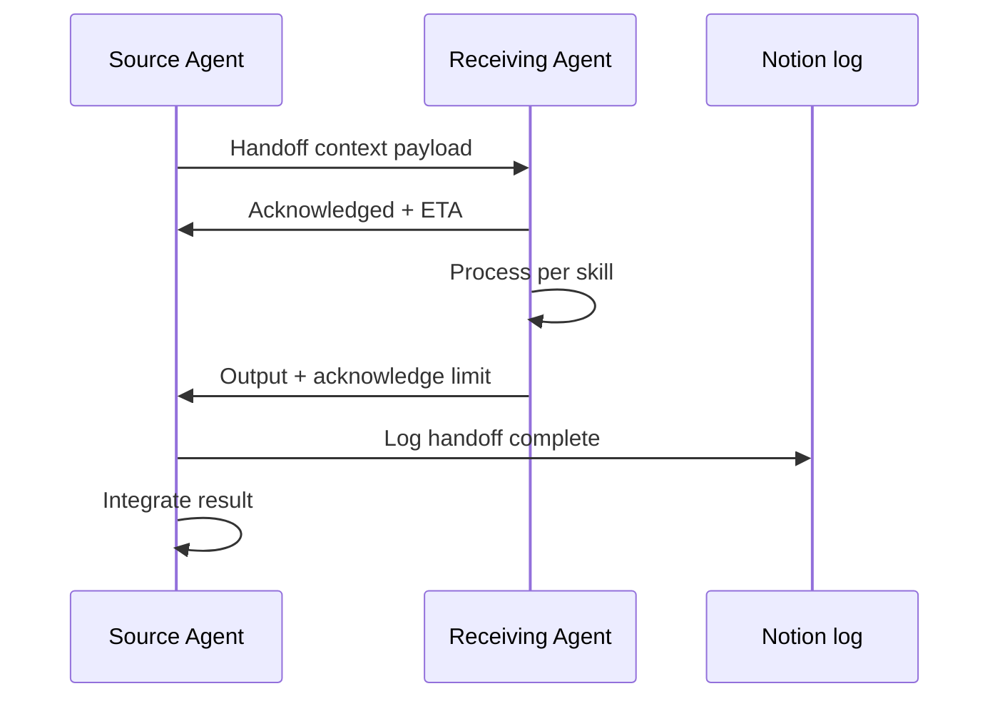

# Context Handoff (Pass Context Between Agents)

Pass context cleanly antara C-Level agent Gerai 1000 Pintu: relevant data, decision history, customer profile, project state. Prevent context loss + duplicate work + miscommunication.

## Triggers

Primary:
- "context handoff"
- "handoff to agent"
- "pass context"

Secondary:
- "context bridging"
- "agent transition"

## Input Required

| Field | Type | Required | Default |
|---|---|---|---|
| from_agent | enum | yes | (current agent) |
| to_agent | enum | yes | (destination agent) |
| context_payload | object | yes | (context data) |
| handoff_purpose | string | yes | - |

## Output Template

```markdown
# Context Handoff: {FROM AGENT} → {TO AGENT}

**Handoff ID:** GERAI-HO-{YYYY}-{NNN}
**From:** {Agent + skill if applicable}
**To:** {Agent + skill}
**Purpose:** {Why handoff}
**Created:** {Timestamp}

## Context Payload

### Core Context (always include)
- **Customer / Project ID:** {ID kalau ada}
- **Original question / task:** {From user / Matthew}
- **Current state:** {What's been done}
- **Decision pending:** {What needs decide}
- **Time pressure:** {Low / Medium / High}

### Customer Context (kalau customer-related)
- **Customer name:** {anonymized atau full per consent}
- **Persona:** {Retail/Mitra/Developer/Arsitek/Kontraktor/Aplikator}
- **Project:** {Tempat baru / Renovasi / Project arsitek}
- **Konsultasi history:** {Count + last date}
- **Decision stage:** {Awareness / Consideration / Booking / Konsultasi / Decision / Delivery / Aftersales}
- **Preference noted:** {From konsultasi log}
- **Constraint:** {Budget / Timeline / Site}

### Project Context (kalau project)
- **Project name:** {Wave 1 / Cabang #2 / etc.}
- **Phase:** {Phase 1/2/3}
- **Sprint active:** {S-name kalau ada}
- **Status:** {On track / At risk / Behind}
- **Key milestone:** {Next deadline}

### Decision History
- **Decision made:** {Recent decision per agent}
- **Rationale:** {Why}
- **Owner:** {Who decided}
- **Date:** {When}

### Data Attached
- {Data 1 — description + location}
- {Data 2}
- {Data 3}

### Brand Canon Status
- Compliance: {%}
- Last validated: {Date}
- Any violation: {Yes/No + detail}

## Handoff Purpose

### Why this handoff
{Specific reason agent X → agent Y}

### What's expected back
- Output type: {Document / Decision / Analysis / Validation}
- Format: {Specific format}
- Deadline: {Time bound}

### Boundary conditions
- What's IN scope for receiving agent
- What's OUT of scope
- What to escalate (kalau perlu)

## Handoff Pattern Library

### Pattern 1: CMO → CCO (Caption draft → Brand canon validate)
**Trigger:** Caption draft completed
**Context payload:**
- Draft caption text
- Visual context (image / video)
- Persona target
- Campaign + channel
**Expected back:** Validation pass/fail + auto-correction kalau perlu

### Pattern 2: COO → CCO (Showroom signage design)
**Trigger:** Showroom design need visual spec
**Context payload:**
- Showroom layout
- Brand zone (Japan/Europe/America/China)
- Production vendor
- Budget + timeline
**Expected back:** Visual spec + design brief

### Pattern 3: CMO → COO (Lead → Konsultasi booking)
**Trigger:** Marketing-qualified lead ready for konsultasi
**Context payload:**
- Customer profile (anonymized)
- Persona
- Source channel
- Initial interest
- Contact preference
**Expected back:** Konsultasi booking confirmation + Door Expert assignment

### Pattern 4: COO → CCO (Door Expert script editorial)
**Trigger:** Door Expert needs konsultasi script reference
**Context payload:**
- Customer scenario archetype
- Konsultasi phase (Discovery / Education / Recommendation)
- 4-Dunia angle relevant
**Expected back:** Script template + canon-compliant

### Pattern 5: CCO → CMO (Content ready for distribution)
**Trigger:** Long-form article published
**Context payload:**
- Article URL + summary
- Target persona
- Distribution channel plan
- SEO keyword
**Expected back:** Distribution plan + channel allocation

### Pattern 6: CFO → COO (Budget approval → PO execution)
**Trigger:** Vendor PO approved
**Context payload:**
- Vendor name + contract
- PO amount + timing
- Payment terms
- Budget category
**Expected back:** PO created + tracked + delivery confirmed

### Pattern 7: Atmaja → All C-Level (Decompose strategic question)
**Trigger:** Strategic question decomposed
**Context payload:**
- Sub-question per agent
- Time constraint
- Synthesis expectation
- Other agent in parallel
**Expected back:** Answer per agent + ready for synthesis

### Pattern 8: All C-Level → Atmaja (Synthesis ready)
**Trigger:** All agents answered
**Context payload:**
- Per agent output
- Confidence per output
- Data quality per output
**Expected back:** Synthesized recommendation to Matthew

## Context Preservation Principles

### Always preserve
- Original question / intent
- Customer identity (per consent)
- Decision history
- Data trail
- Time context

### Sometimes preserve (per relevance)
- Agent internal reasoning
- Alternative options considered
- Intermediate calculation

### Don't preserve
- Stale data (older than period relevant)
- Speculation (mark as opinion)
- Off-topic discussion

## Privacy + Data Handling

### Customer data
- Anonymize kalau possible
- Honor consent
- Redact PII kalau handoff to external

### Financial data
- Internal only (CFO + Matthew + Atmaja)
- Don't expose unnecessary detail di handoff

### Confidential
- Strategic plan: Atmaja + Matthew only
- Customer testimonial pending consent: hold
- Vendor contract specific: COO + CFO + Matthew

## Handoff Quality Standards

### Per handoff
- [ ] Clear from/to identified
- [ ] Purpose explicit
- [ ] Core context included
- [ ] Specific data attached
- [ ] Expected output defined
- [ ] Time pressure communicated
- [ ] Boundary condition clear

### Cross-handoff
- [ ] No duplicate work (check first)
- [ ] No context loss (data preserved)
- [ ] No mismatch (right agent for task)
- [ ] No deadlock (clear ownership)

## Anti-Pattern

### Avoid
- ❌ Vague handoff ("please review this")
- ❌ Over-context (dump everything, no curation)
- ❌ Under-context (essential missing)
- ❌ Ambiguous expectation ("give me your thoughts")
- ❌ No time bound
- ❌ Wrong agent (route mistake)
- ❌ Handoff without acknowledgment (fire-and-forget)

### Embrace
- ✅ Specific request
- ✅ Curated context (essential only)
- ✅ Clear expected output
- ✅ Time bound
- ✅ Right agent (verified via agent-router)
- ✅ Acknowledgment loop (receiving agent confirm received)

## Sample Handoff

### Sample 1: CMO → CCO Caption Validate
```
GERAI-HO-2026-001

From: CMO (caption-generator)
To: CCO (brand-canon-enforcer)
Purpose: Validate Wave 1 launch IG caption before publish

Context:
- Campaign: Wave 1 Launch Grand Opening 14 Nov 2026
- Channel: Instagram feed
- Persona: Retail
- Caption draft:
  "14 November 2026 — cerita pertama dimulai di Balikpapan. 
  Gerai 1000 Pintu menyambut Anda dengan filosofi 4-Dunia 
  yang menemani perjalanan Anda menyusun tempat impian.
  
  Konsultasi gratis dengan Door Expert kami. Link di bio.
  
  #Gerai1000Pintu #GrandOpening14Nov #Filosofi4Dunia"

Expected back: Validation pass/fail + auto-correction (em-dash detected line 1)

Time pressure: Medium (publish in 4 hour)
Boundary: CCO can adjust caption, must preserve message + length
```

### Sample 2: Atmaja → COO Sprint Status
```
GERAI-HO-2026-002

From: Atmaja (multi-agent-synthesis)
To: COO (sprint-planner + weekly-ops-report)
Purpose: Provide sprint S7 status for Wave 1 readiness synthesis

Context:
- Question: "Wave 1 launch ready?"
- Sprint: S7 Procurement
- Phase: Phase 1 Wave 1
- Time: T-30 day to launch (14 Oct 2026)

Expected back:
- Sprint S7 completion status
- Critical path risk
- Vendor delivery confirmation
- Showroom buildout progress
- Format: Brief structured

Time pressure: High (Matthew briefing tomorrow)
Boundary: COO operations + supply only, brand → CCO parallel
```

## Handoff Workflow

### Step 1: Source agent prepares context
- Identify essential context
- Format per standard
- Attach data references

### Step 2: Receiving agent acknowledged
- Confirm received
- Confirm understanding
- Estimate response time

### Step 3: Receiving agent processes
- Per skill capability
- Within scope
- Within time bound

### Step 4: Receiving agent returns
- Per expected format
- Within time pressure
- Acknowledge limitations kalau ada

### Step 5: Source agent (atau next) integrates
- Synthesize back
- Continue workflow
- Document handoff complete

## Handoff Documentation

### Track via Notion / log
- Handoff ID
- From / To
- Purpose
- Duration
- Outcome
- Learning

### Why track
- Pattern emerge (which handoff frequent)
- Friction identify (where handoff slow)
- Improvement opportunity
- Audit trail
```

## Visual Output

Handoff pattern map:



Handoff workflow:



## Knowledge Dependency

- agent-router (paired)
- multi-agent-synthesis (paired)
- All C-Level skill catalog
- Privacy + consent framework
- Decision documentation standard

## Mode

Default: EXECUTION (build handoff package)
Switch: NEED_CLARIFICATION kalau context payload ambigu

## Tools Required

- file-search (context retrieval)
- artifacts (handoff document + pattern map)

## Validation Criteria

- Handoff ID + from/to
- Core context (purpose, state, decision, time)
- Specific data attached
- Expected output defined
- Time pressure communicated
- Boundary condition clear
- 8 handoff pattern library
- Privacy + data handling
- Anti-pattern explicit
- Workflow 5-step
- Documentation tracking

## Sample I/O

**Input:** "Handoff CMO caption draft Wave 1 launch IG → CCO validate"

**Output summary:**
- Handoff ID: GERAI-HO-2026-001
- From: CMO caption-generator
- To: CCO brand-canon-enforcer
- Purpose: Validate caption before publish (em-dash check + canon)
- Caption draft included
- Context: Wave 1 Launch, IG feed, Persona Retail, 14 Nov
- Expected back: Pass/fail + auto-correction kalau ada violation
- Time: Medium pressure (publish 4 hour)
- Boundary: CCO can adjust but preserve message + length
- Handoff pattern map + workflow embedded

## Handoff

- agent-router (route source)
- multi-agent-synthesis (return path kalau strategic)
- All C-Level skill (per handoff target)
