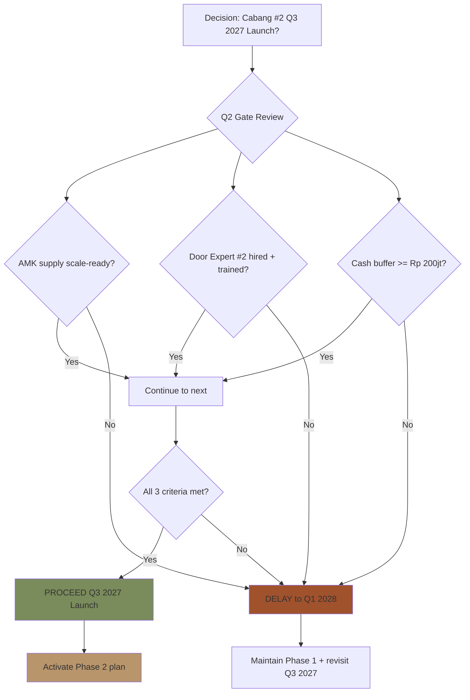
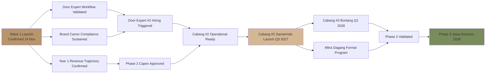
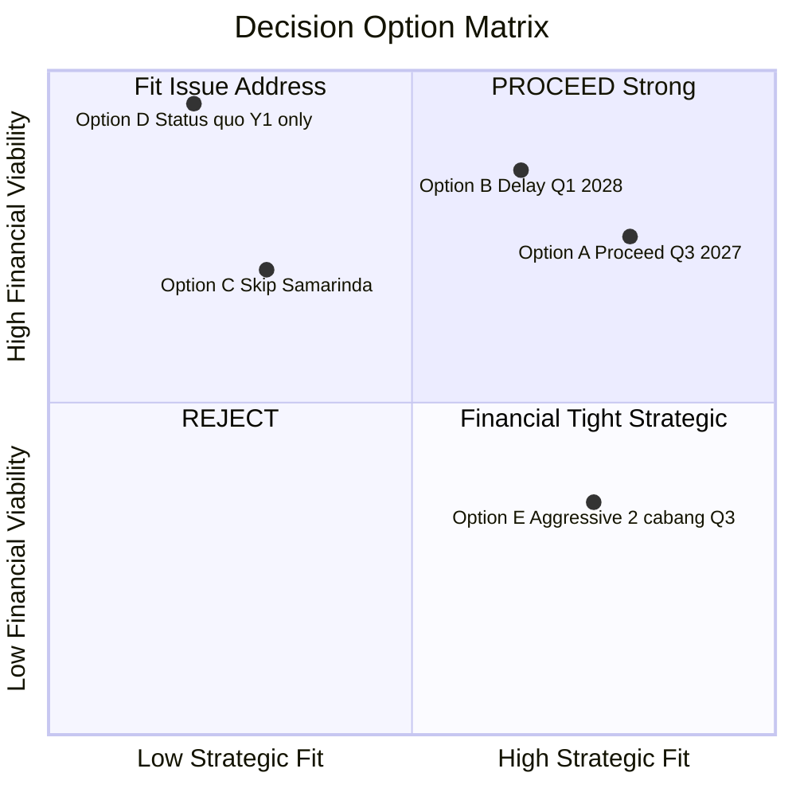
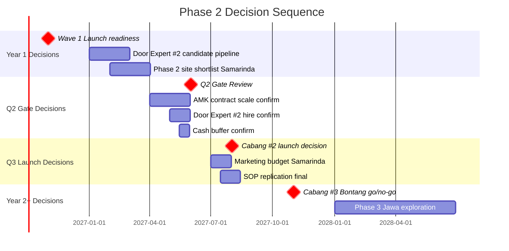
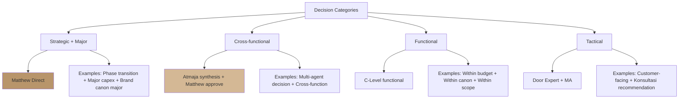
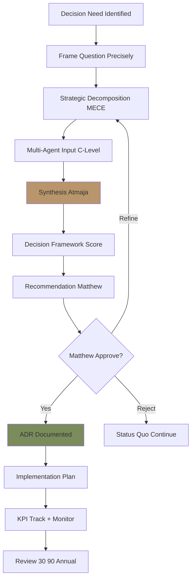
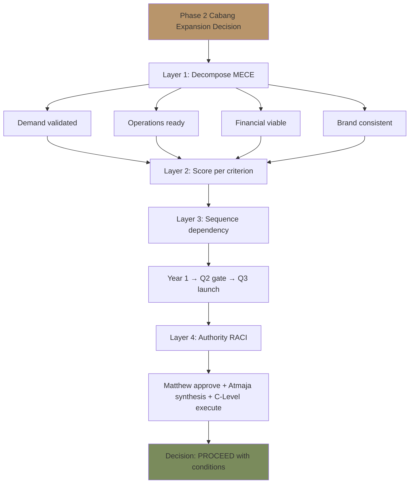

# Decision Architecture (Decision Tree + Logic Graph)

Build decision architecture Gerai 1000 Pintu: decision tree, dependency graph, prerequisite chain, decision sequence. Visualize decision logic untuk Matthew + team alignment.

## Triggers

Primary:
- "decision architecture"
- "decision tree"
- "decision logic"

Secondary:
- "dependency map"
- "decision sequence"

## Input Required

| Field | Type | Required | Default |
|---|---|---|---|
| decision_scope | string | yes | (single decision / decision sequence / portfolio) |
| visualization_type | enum | yes | (tree / graph / matrix / sequence) |
| audience | enum | no | (Matthew / team / stakeholder) |

## 6 Decision Architecture Patterns

### Pattern 1: Single Decision Tree (Branch Logic)
**Use:** One decision with multiple option + conditional branches



### Pattern 2: Decision Dependency Graph
**Use:** Multiple decisions where some depend on others



### Pattern 3: Decision Matrix (Multi-Criteria)
**Use:** Compare multiple option across multiple criteria



### Pattern 4: Decision Sequence (Time-Based)
**Use:** Sequence of decisions over time



### Pattern 5: Decision Authority Map (RACI)
**Use:** Who decides what + how



### Pattern 6: Decision Quality Funnel
**Use:** Filter decision quality from concept to execution



## Decision Tree Templates per Category

### Category 1: Phase Transition Decision
- Decision: When to launch Phase 2/3?
- Tree: Gate criteria branching → All met = Proceed / Any fail = Delay
- Owner: Matthew + Atmaja
- ADR mandatory

### Category 2: Hiring Decision
- Decision: Hire role X now?
- Tree: Capacity > 100% sustained + Budget approved + Pipeline ready → Hire / Else wait
- Owner: COO + Matthew

### Category 3: Vendor Decision
- Decision: New vendor onboard?
- Tree: Need confirmed + Alternative scarce + Cost favorable → Onboard / Else stick
- Owner: COO + CFO

### Category 4: Investment Decision
- Decision: Capex Rp X approval?
- Tree: ROI >= threshold + Strategic fit + Cash available → Approve / Else defer
- Owner: CFO + Matthew

### Category 5: Brand Decision
- Decision: Brand canon evolution?
- Tree: Forces compelling + Long-term alignment + Stakeholder buy-in → Evolve / Else maintain
- Owner: CCO + Matthew (LOCKED rare change)

### Category 6: Crisis Decision
- Decision: Activate which playbook P0/P1/P2?
- Tree: Severity + Time-pressure + Stakeholder impact → Tier appropriate
- Owner: Severity-dependent

## Decision Architecture Quality Standards

### Per decision tree
- [ ] Decision question precisely framed
- [ ] Branches mutually exclusive (no overlap)
- [ ] Branches collectively exhaustive (no gap)
- [ ] Outcome clear per path
- [ ] Terminal node = action / decision
- [ ] Color coded (Green proceed / Yellow conditional / Red stop)
- [ ] Brand canon palette compliance

### Per decision sequence
- [ ] Logical time ordering
- [ ] Dependency explicit
- [ ] Critical path identified
- [ ] Decision gate marked

### Per decision matrix
- [ ] Criteria weighted
- [ ] Options scored consistently
- [ ] Recommendation clear

## Decision Architecture Composition

### Multi-Layer Decision
Combine 2-3 patterns for complex decision:

**Layer 1:** Strategic decomposition (MECE tree)
**Layer 2:** Per dimension decision matrix
**Layer 3:** Sequence + dependency
**Layer 4:** Authority + RACI

### Example: Phase 2 Decision Combo



## Brand Canon Compliance (Decision Architecture)

### Visual
- Brass for proceed / hero
- Charcoal for primary nodes
- Sage for positive outcome
- Rust for stop / negative
- Ivory background generous

### Verbal
- Decision statement clear (no em-dash)
- Premium hangat tone in labels
- Direct + factual

### Anti-pattern
- ❌ Over-complex tree (>15 node confusing)
- ❌ Vague branches (subjective criteria)
- ❌ No terminal decision (just analysis)
- ❌ Color rainbow chaotic
- ❌ Bias toward predetermined outcome

## Sample Use Cases

### Atmaja invoke
- Strategic decomposition → Decision Tree
- Multi-agent synthesis → Dependency Graph
- Phase transition → Decision Sequence + Authority Map
- QBR review → Quality Funnel

### C-Level invoke
- CMO campaign decision → Tree pattern
- COO sprint priority → Sequence pattern
- CCO content strategy → Tree + Matrix combo
- CFO investment evaluation → Matrix + Quality Funnel

## Universal Invocation Pattern

```
decision-architecture {
  scope: "{decision context}",
  pattern: "tree / graph / matrix / sequence / authority / funnel",
  layer: "single / multi-layer combo",
  audience: "Matthew / team / stakeholder"
}
```

## Sample I/O

**Input:** "Decision architecture: Cabang #2 Samarinda go/no-go Q3 2027 dengan gate criteria + sequence"

**Output:**
- Pattern combo: Layer 1 Decision Tree (3 gate criteria) + Layer 2 Sequence (Q1-Q3 timeline) + Layer 3 Authority (Matthew + Atmaja)
- Tree branches: AMK supply scale + Door Expert #2 hired + Cash buffer Rp 200jt
- All 3 met → PROCEED Q3 launch
- Any fail → DELAY Q1 2028
- Sequence: Year 1 prep → Q2 gate review → Q3 decision → Q3-Q4 launch
- Authority: Matthew final + Atmaja synthesis + COO+CFO+CMO+CCO execute
- Brand canon: ✅ Brass focal + Sage positive + Rust delay
- 3-layer architecture rendered

## Knowledge Dependency

- decision-framework (paired Atmaja)
- delegation-matrix (authority)
- architectural-model (visual foundation)
- architectural-decision-record (output documentation)
- All C-Level skill (decision context)

## Mode

Default: EXECUTION
Switch: NEED_CLARIFICATION jika decision context ambigu

## Tools Required

- artifacts (Mermaid render)
- file-search (context retrieval)

## Validation Criteria

- 6 decision architecture pattern
- Per pattern: use case + Mermaid template + sample
- 6 decision category templates
- Quality standards per pattern
- Multi-layer composition
- Brand canon compliance
- Anti-pattern explicit
- Universal invocation

## Handoff

- decision-framework (paired)
- architectural-decision-record (document)
- architectural-model (visual foundation)
- All agents (universal invocation)
- Matthew (decision authority)
