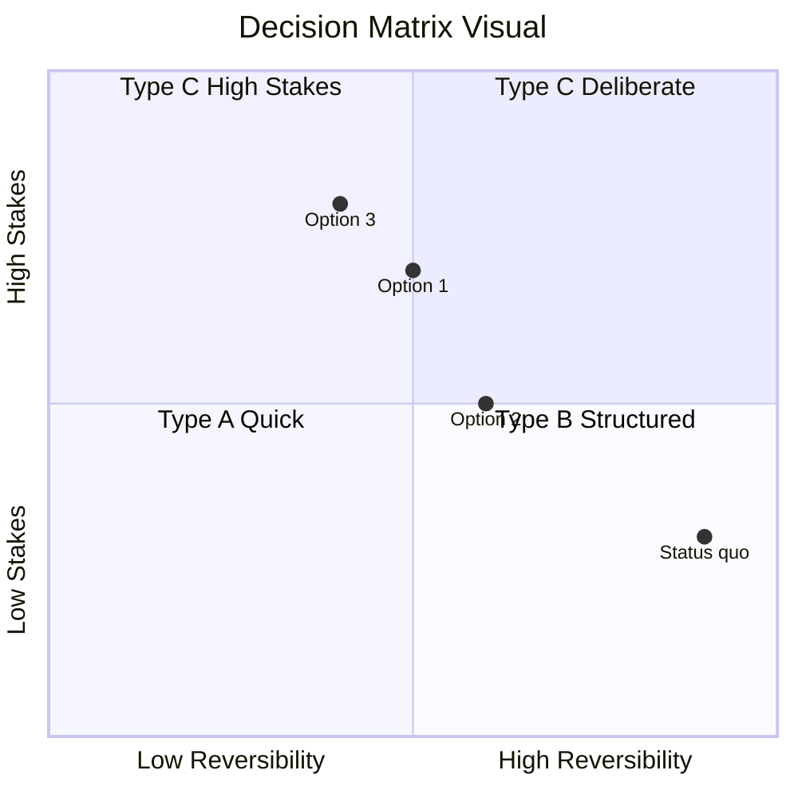
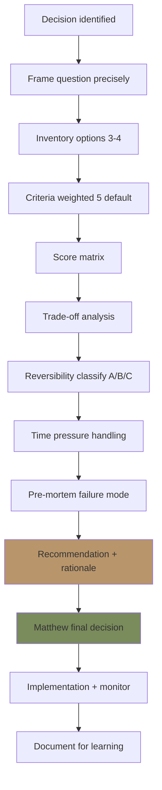
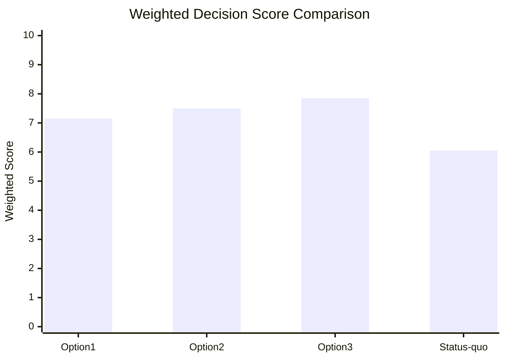

# Decision Framework

Structure complex decision Gerai 1000 Pintu: criteria matrix, trade-off analysis, reversibility test, time-pressure handling. Output: structured recommendation untuk Matthew.

## Triggers

Primary:
- "decision framework"
- "decision matrix"
- "evaluate option"

Secondary:
- "trade-off analysis"
- "reversibility test"

## Input Required

| Field | Type | Required | Default |
|---|---|---|---|
| decision | string | yes | (decision to evaluate) |
| options | array | yes | (alternatives considered) |
| criteria | array | no | (decision criteria, default 5 standard) |
| time_pressure | enum | no | (low/medium/high) |

## Output Template

```markdown
# Decision Framework: {DECISION}

**Decision owner:** Matthew (final) + Atmaja synthesis
**Time pressure:** {Low / Medium / High}
**Reversibility:** {High / Medium / Low}
**Stakes:** {Low / Medium / High}

## Decision Question (precisely framed)

> {Restate decision precisely — avoid ambiguity}

## Option Inventory

### Option 1: {Name}
- Description
- Pros
- Cons
- Cost (Rp + time)
- Reversibility

### Option 2: {Name}
- Description
- Pros
- Cons
- Cost
- Reversibility

### Option 3: {Name}
- Description
- Pros
- Cons
- Cost
- Reversibility

### Option 4: Status quo (do nothing)
- Description: keep current state
- Cost of inaction
- Why considered (kalau perlu)

## Decision Criteria (weighted)

### Standard 5 Criteria (default)

| Criterion | Weight | Description |
|---|---|---|
| Brand alignment | 20% | Aesop+DWR anchor + canon strict |
| Strategic fit | 25% | Phase 1-3 roadmap alignment |
| Financial impact | 20% | Revenue, cost, margin, cash |
| Operational feasibility | 15% | Capacity + capability + timeline |
| Risk + reversibility | 20% | Downside + ability to undo |
| **Total** | **100%** | - |

### Custom criteria (kalau specific decision)
- Adapt 5 standard
- Add specific criterion (e.g., customer impact, partner relationship)

## Scoring Matrix

| Criterion | Weight | Option 1 | Option 2 | Option 3 | Status quo |
|---|---|---|---|---|---|
| Brand alignment | 20% | 8 | 7 | 9 | 6 |
| Strategic fit | 25% | 7 | 9 | 8 | 5 |
| Financial impact | 20% | 6 | 8 | 7 | 4 |
| Operational feasibility | 15% | 8 | 6 | 7 | 9 |
| Risk + reversibility | 20% | 7 | 6 | 8 | 9 |
| **Weighted score** | - | **7.15** | **7.50** | **7.85** | **6.05** |

(Scoring 1-10 scale, weighted sum)

## Trade-off Analysis

### Option 1 vs Option 2
- Strength advantage Option 1: {what}
- Strength advantage Option 2: {what}
- Trade-off: {what we sacrifice with each}

### Option 1 vs Option 3
{Similar}

### Option 2 vs Option 3
{Similar}

### Status quo cost
- What we lose by NOT acting
- Opportunity cost

## Reversibility Test

### Reversibility classification

#### Type A: Highly Reversible (low stakes)
- Can undo within 30 day
- Cost to undo < 10% of action cost
- Examples: Marketing campaign experiment, new product variant trial

**Decision rule:** Quick decide + iterate

#### Type B: Moderately Reversible (medium stakes)
- Can undo within 6 month
- Cost to undo 10-50% of action cost
- Examples: Hire new role, new vendor contract, channel launch

**Decision rule:** Structured decide + monitor + course-correct

#### Type C: Hardly Reversible (high stakes)
- Cannot easily undo
- Cost to undo >50% of action cost
- Examples: Cabang expansion, major capex, brand pivot

**Decision rule:** Deliberate decide + scenario plan + go/no-go gate

### This decision: Type {A/B/C}

**Implication:** {Decision rule}

## Time Pressure Handling

### Low time pressure
- Full analysis (1-2 week)
- Multiple stakeholder consult
- Scenario planning
- Detailed financial model

### Medium time pressure
- Standard framework (3-5 day)
- Key stakeholder consult
- Basic financial sensitivity
- Decision document

### High time pressure (P0 / urgent)
- Quick framework (24 hour)
- Matthew direct decision
- Document rationale post-decision
- Course-correct ready

### Anti-pattern
- ❌ Force urgency on Type C decision (high stakes deserves time)
- ❌ Over-analyze Type A decision (reversible can iterate)
- ❌ Skip framework "because urgent" → lost rationale

## Decision Recommendation

### Recommended: Option {N}

**Rationale:**
- {Reason 1 — strongest criteria match}
- {Reason 2 — trade-off acceptable}
- {Reason 3 — risk manageable}

**Implementation plan:**
- Phase 1: {action + owner + ETA}
- Phase 2: {action}
- Phase 3: {action}

**Risk + mitigation:**
- {Risk 1 + mitigation}
- {Risk 2 + mitigation}

**Decision gate (kalau Type C):**
- Go-criteria: {threshold for proceeding}
- No-go criteria: {threshold for stopping}

**Monitor + course-correct:**
- KPI to track
- Review cadence
- Course-correct triggers

## Stakeholder Communication

### Internal team
- Decision rationale share
- Their role in implementation
- Impact on their function

### Customer (kalau impact)
- Communication timing
- Tone (brand canon)
- Channel

### Vendor / Partner (kalau impact)
- Direct conversation
- Contract implication
- Relationship continuation

### Press / Public (kalau big)
- Press release timing
- Spokesperson
- Message alignment

## Pre-mortem Exercise

### "Imagine 6 month from now this decision FAILED. Why?"

**Failure mode 1:** {What could go wrong}
- Probability: {Low/Med/High}
- Mitigation: {action}

**Failure mode 2:** {What could go wrong}
- Probability
- Mitigation

**Failure mode 3:** {What could go wrong}
- Probability
- Mitigation

**Highest probability failure:** {Top concern}
- Pre-emptive action: {what we do now to prevent}

## Decision Documentation

### Record permanent
- Date of decision
- Options considered
- Criteria weight
- Scoring rationale
- Selected option
- Implementation plan
- Risks acknowledged

### Why documentation matters
- Future reference (similar decision)
- Learning loop (was rationale sound?)
- Onboarding new team (institutional knowledge)
- Course-correct context (kalau perlu re-evaluate)

## Common Decision Pattern

### Pattern 1: Build vs Buy vs Partner
- Criteria: speed, control, cost, capability
- Apply to: tech stack, vendor selection, expansion mode

### Pattern 2: Now vs Later
- Criteria: urgency, capacity, opportunity cost, risk
- Apply to: feature launch, expansion timing

### Pattern 3: Bet Big vs Iterate Small
- Criteria: confidence level, reversibility, learning value
- Apply to: marketing budget allocation, capex

### Pattern 4: Standardize vs Customize
- Criteria: scale efficiency, customer fit, brand consistency
- Apply to: product offering, customer segment service
```

## Visual Output

Decision matrix radar:



Decision flow:



Scoring sample chart:



## Knowledge Dependency

- BP Chapter 18 (Strategic Roadmap)
- Brand Canon (alignment criteria)
- C-Level skill catalog (data input)
- Matthew strategic priorities
- COO risk-register (risk input)

## Mode

Default: EXECUTION (full decision framework)
Switch: NEED_CLARIFICATION jika options ambigu

## Tools Required

- file-search
- artifacts (matrix + flow + chart)

## Validation Criteria

- Decision question precisely framed
- 3-4 option inventoried + status quo
- Criteria weighted 5 standard or custom
- Scoring matrix transparent
- Trade-off analysis explicit
- Reversibility test classified
- Time pressure handling appropriate
- Recommendation with rationale
- Risk + mitigation
- Pre-mortem failure mode
- Documentation captured
- Common pattern reference

## Sample I/O

**Input:** "Decide: Cabang #2 Samarinda Q3 2027 — proceed atau delay?"

**Output:**
- Option 1: Proceed Q3 2027
- Option 2: Delay to Q1 2028
- Option 3: Skip Samarinda, prioritize Bontang
- Option 4: Status quo (Balikpapan only Year 2)
- Criteria (5 standard) scored 1-10
- Type C decision (Hardly Reversible — capex Rp 250-300jt)
- Time pressure: Medium (3-5 day analysis)
- Pre-mortem: Top failure mode = AMK supply chain not ready scale
- Recommendation: Option 1 PROCEED Q3 2027 dengan condition (AMK contract scale + Door Expert #2 hired by Q2)
- Go/no-go gate: Q2 2027 review (AMK + Door Expert ready)
- Document: Full rationale archived
- Matrix + flow + scoring chart embedded

## Handoff

- strategic-decomposition (kalau perlu sub-question)
- agent-router (data input dari C-Level)
- multi-agent-synthesis (combine data)
- Matthew (final decision)
- COO risk-register (risk cross-check)
