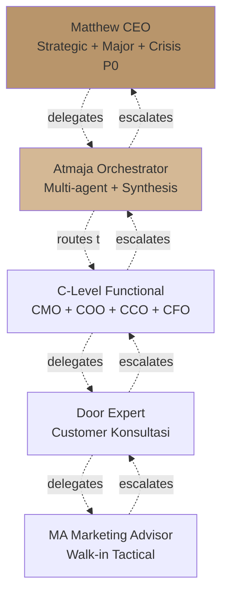
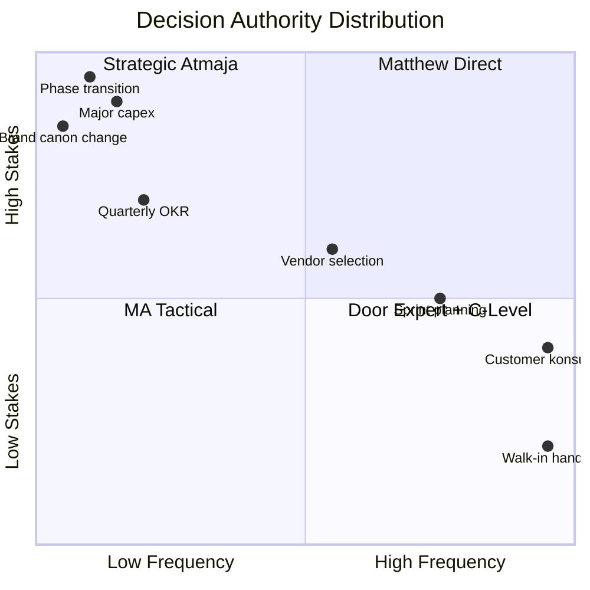
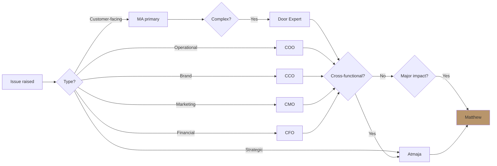

# Delegation Matrix (Who Decides What)

Define decision authority + delegation pattern Gerai 1000 Pintu. Matthew direct vs Atmaja autonomous vs C-Level delegated vs MA tactical. RACI clarity per decision type.

## Triggers

Primary:
- "delegation matrix"
- "decision authority"
- "RACI matrix"

Secondary:
- "who decides"
- "approval workflow"

## Output Template

```markdown
# Delegation Matrix Gerai 1000 Pintu

**Architecture:** Matthew (CEO) + Atmaja (orchestrator) + 4 C-Level + Tim Pusat
**Status:** 🔒 LOCKED authority structure
**Last update:** 2026-05-27

## Decision Authority Tier

### Tier 1: Matthew Direct (CEO)
**Scope:** Strategic + Major Financial + Brand Pivot + Phase Transition

**Decisions:**
- Phase 1→2→3 gate transition
- Cabang expansion approval
- Major capex >Rp 50jt
- Brand canon major change
- Investment / external capital
- Founder vision adjustment
- Crisis P0 response
- Press positioning major
- Partnership major (Architect firm, distributor)
- Headcount expansion senior role

**Speed:** Per situation (immediate to weeks)
**Documentation:** Decision rationale archived

### Tier 2: Atmaja Autonomous (with Matthew oversight)
**Scope:** Multi-agent orchestration + Synthesis + Strategic decomposition

**Decisions:**
- Strategic question decomposition
- Multi-agent task routing
- Cross-functional synthesis
- Quarterly OKR coordination
- Vision communication articulation
- Scenario planning evolution
- Knowledge management coordination

**Speed:** Real-time (mostly)
**Documentation:** Logged for Matthew review
**Escalation:** Anything ambiguous → Matthew

### Tier 3: C-Level Functional (CMO / COO / CCO / CFO)
**Scope:** Function-specific decision within budget + canon

**CMO authority:**
- Marketing channel allocation (within budget)
- Campaign execution
- Influencer collab approval (<Rp 5jt per)
- Content topic per pillar
- Persona prioritization tactical

**COO authority:**
- Sprint planning + execution
- Vendor selection (<Rp 20jt PO)
- Hire decision MA + Gudang/OB
- SOP creation + modification
- Performance review functional
- Showroom operational adjustment
- Logistics route selection

**CCO authority:**
- Brand canon validation (auto + manual)
- Content production
- Editorial calendar adjustment
- Design vendor selection (<Rp 15jt)
- Press tier 1 (regional) pitch
- Influencer creative brief
- Asset library curation

**CFO authority:**
- Budget allocation within approved envelope
- Cash flow management
- Vendor payment scheduling
- Financial report production
- Routine financial decision (<Rp 10jt)

**Speed:** Standard 1-3 day decision
**Documentation:** Function dashboard tracking
**Escalation:** >budget OR cross-functional → Atmaja+Matthew

### Tier 4: Door Expert Operational
**Scope:** Customer-facing + Konsultasi + Recommendation

**Authority:**
- Konsultasi session conduct (60 min)
- Product recommendation per customer
- Pricing standard application
- Discount within program (≤15%)
- Customer complaint handle minor
- Aftersales schedule

**Speed:** Real-time during konsultasi
**Documentation:** CRM session log
**Escalation:** Discount >15% OR customer complaint major → Matthew/COO

### Tier 5: MA (Marketing Advisor) Tactical
**Scope:** Walk-in handling + Initial intent + Schedule

**Authority:**
- Welcome + tour customer
- Initial intent identification
- Schedule Door Expert konsultasi
- Documentation CRM
- Basic aftersales follow-up
- Pricing standard reference
- Diskon ≤10% (per program)

**Speed:** Real-time
**Documentation:** CRM
**Escalation:** Complex inquiry → Door Expert; Issue → COO

## RACI Matrix per Decision Type

### Decision Category 1: Brand Direction

| Decision | Responsible | Accountable | Consulted | Informed |
|---|---|---|---|---|
| Brand canon major change | CCO | Matthew | CMO+COO+CFO | All |
| Visual identity refresh | CCO | Matthew | Atmaja | All |
| Brand positioning pivot | CCO+Atmaja | Matthew | All C-Level | All |
| Editorial style guide update | CCO | CCO | Atmaja | Content team |
| Anchor reference adjustment | CCO+Atmaja | Matthew | - | All |

### Decision Category 2: Marketing & Customer

| Decision | Responsible | Accountable | Consulted | Informed |
|---|---|---|---|---|
| Marketing campaign launch | CMO | CMO | CCO+CFO | Atmaja+Matthew |
| Channel budget shift | CMO | CFO | Atmaja | Matthew |
| Influencer collab major | CMO | Matthew | CCO+CFO | - |
| Persona prioritization | CMO | CMO | Atmaja | All |
| Customer crisis P1+ | CMO+CCO | Matthew | COO+CFO | All |

### Decision Category 3: Operations & Supply

| Decision | Responsible | Accountable | Consulted | Informed |
|---|---|---|---|---|
| Vendor selection major | COO | Matthew (>Rp 20jt) | CFO | Atmaja |
| Sprint planning | COO | COO | All C-Level | - |
| SOP creation | COO | COO | Functional team | All |
| Lean Store concept change | COO+Atmaja | Matthew | All | All |
| Hire MA | COO | COO | HR | Atmaja |
| Hire Door Expert | COO+CCO | Matthew | All C-Level | All |
| Showroom buildout | COO | Matthew | CCO+CFO | All |

### Decision Category 4: Financial

| Decision | Responsible | Accountable | Consulted | Informed |
|---|---|---|---|---|
| Budget Year 1 set | CFO | Matthew | All C-Level | - |
| Budget reallocation | CFO | Matthew | Functional | - |
| Major capex | CFO | Matthew | All | All |
| Cash management | CFO | CFO | Matthew | - |
| Pricing strategy | CFO+CMO | Matthew | CCO | All |
| External capital | CFO | Matthew | Atmaja | - |

### Decision Category 5: Strategic

| Decision | Responsible | Accountable | Consulted | Informed |
|---|---|---|---|---|
| Phase 1→2 transition | Atmaja | Matthew | All C-Level | All |
| Phase 2→3 transition | Atmaja | Matthew | All | All |
| Vision adjustment | Atmaja+Matthew | Matthew | All | All |
| Annual OKR set | Atmaja | Matthew | All | All |
| Quarterly review | Atmaja | Matthew | All | - |
| Scenario activation | Atmaja | Matthew | All | All |
| Crisis P0 | Matthew direct | Matthew | All | All |

## Delegation Pattern (When to Delegate vs Decide Direct)

### Matthew direct decision when:
- Strategic implication > 1 year
- Brand pivot OR canon major change
- Capex > Rp 50jt
- Crisis P0
- Press positioning major
- Founder vision element

### Atmaja autonomous when:
- Multi-agent task routing
- Synthesis from C-Level inputs
- Coordination across functions
- Strategic decomposition first-pass

### C-Level functional when:
- Within budget envelope
- Within brand canon
- Tactical execution
- Standard decision (not strategic)

### Door Expert / MA when:
- Customer-facing real-time
- Standard product recommendation
- Documented program (discount, aftersales)

## Escalation Path

```
MA → Door Expert → COO → Atmaja → Matthew
                       ↘ CCO / CMO / CFO (parallel)
```

### Escalation Triggers
- Customer issue complex → Door Expert
- Operational gap → COO
- Cross-functional → Atmaja
- Strategic / financial major → Matthew
- Crisis P0/P1 → Matthew (immediate)

### Time-bound escalation
- P0: Immediate Matthew
- P1: <4 hour Matthew/C-Level
- P2: <24 hour C-Level
- P3: Standard cycle

## Anti-Pattern Delegation

### Avoid
- ❌ Matthew bottleneck on every decision (paralysis)
- ❌ C-Level over-escalate (avoid accountability)
- ❌ Door Expert under-empower (customer experience suffers)
- ❌ Decision without owner (everyone vs no one)
- ❌ Authority overlap (CMO + CCO both deciding brand voice)

### Embrace
- ✅ Clear single accountable per decision
- ✅ Authority commensurate with role
- ✅ Documentation rationale (learn loop)
- ✅ Escalation transparent (not blame)
- ✅ Delegation = trust + verify

## Decision Documentation Standard

### What to document
- Decision date
- Decision maker (accountable)
- Options considered
- Rationale chosen option
- Implementation plan
- KPI to track
- Review cadence

### Where to document
- Notion: strategic decision
- WhatsApp + Slack: operational decision
- CRM: customer decision
- Email: external party decision

### Why document
- Future reference
- Learning loop
- Onboarding new team
- Audit trail
- Course-correct context

## Boundary Cases

### When C-Level disagrees with Atmaja
- Atmaja synthesis recommendation
- C-Level submits alternative position with rationale
- Matthew final decide kalau material
- Atmaja respects + adapts

### When Atmaja can decide without Matthew
- Standard orchestration + synthesis
- Within established framework + canon
- No precedent-setting implication

### When Matthew override C-Level
- Founder vision element
- Brand canon critical
- Strategic priority
- Financial gate

### When external party challenges
- Vendor / customer / partner dispute
- Authority structure clear (CCO/COO handle most)
- Matthew represents externally only for major

## Authority Communication

### To team
- Clarity of who decides what
- Empowerment within scope
- Escalation pattern known

### To customer
- Brand voice consistent (no "let me check with my manager")
- Empowerment level (Door Expert can decide most)
- Escalation transparent kalau perlu

### To vendor / partner
- Authority figure clear (COO for vendor, Matthew for major partner)
- Contract authority documented

## Decision Speed Targets

| Decision tier | Target speed |
|---|---|
| MA tactical | Real-time |
| Door Expert operational | Real-time / same session |
| C-Level functional | 1-3 day |
| Atmaja synthesis | 3-5 day (standard) / immediate (urgent) |
| Matthew direct standard | 1-7 day |
| Matthew direct strategic | 1-4 week |
```

## Visual Output

Authority tier pyramid:



RACI heatmap sample:



Escalation flow:



## Knowledge Dependency

- BP Chapter 14 (Struktur Organisasi)
- All C-Level skill catalog
- Lean Store concept LOCKED
- Decision-framework skill
- Atmaja agent-router

## Mode

Default: REFERENCE (provide matrix)
Switch: EXECUTION kalau specific decision routing

## Tools Required

- file-search
- artifacts (pyramid + RACI + flow)

## Validation Criteria

- 5 tier authority structure
- Per tier scope + speed + documentation
- RACI matrix per decision category (Brand / Marketing / Operations / Financial / Strategic)
- Delegation pattern (when delegate vs decide direct)
- Escalation path explicit
- Anti-pattern + embrace pattern
- Decision documentation standard
- Boundary case handling
- Speed targets per tier

## Sample I/O

**Input:** "Delegation matrix untuk Gerai 1000 Pintu Phase 1"

**Output summary:**
- 5 tier authority: Matthew (strategic + major), Atmaja (orchestrate + synthesis), C-Level (functional), Door Expert (customer), MA (tactical)
- RACI per category 5 (Brand / Marketing / Operations / Financial / Strategic)
- Matthew direct: Phase transition, capex >Rp 50jt, canon major change, crisis P0
- Atmaja autonomous: Multi-agent orchestrate, synthesis, OKR coordinate
- C-Level functional within budget + canon
- Door Expert: konsultasi 60 min + product recommendation + discount ≤15%
- MA tactical: walk-in + initial intent + discount ≤10%
- Escalation MA → Door Expert → COO → Atmaja → Matthew
- Speed: MA real-time, C-Level 1-3 day, Matthew strategic 1-4 week
- Authority pyramid + RACI heatmap + escalation flow embedded

## Handoff

- agent-router (paired)
- multi-agent-synthesis (decision flow)
- decision-framework (formal decision)
- governance-framework (kalau related)
