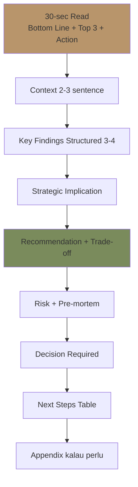
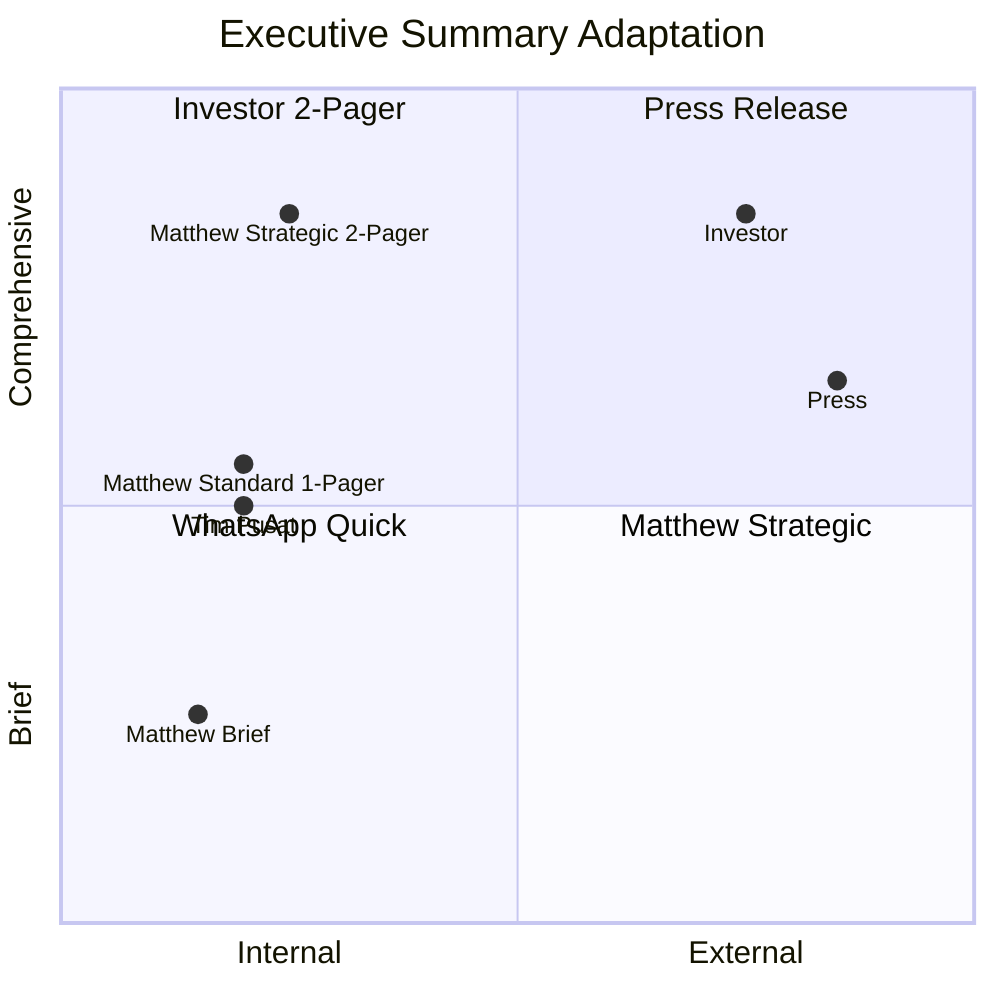

# Executive Summary

Synthesize executive summary Gerai 1000 Pintu untuk Matthew + stakeholder: dari multi-agent input atau standalone analysis. 30-second readable + comprehensive depth available.

## Triggers

Primary:
- "executive summary"
- "exec summary"
- "ringkasan eksekutif"

Secondary:
- "TL;DR"
- "leadership summary"

## Input Required

| Field | Type | Required | Default |
|---|---|---|---|
| topic | string | yes | (what to summarize) |
| audience | enum | yes | (Matthew / Tim Pusat / Investor / Press) |
| length | enum | no | (1-pager / 2-pager / brief) |
| context | string | no | - |

## Output Template

```markdown
# Executive Summary: {TOPIC}

**Date:** {Date}
**Audience:** {Specific}
**Length:** {1-2 page}
**Confidence:** {High / Medium / Low}

## 30-Second Read (Critical)

**Bottom line:** {1-2 sentence direct conclusion}

**Top 3 takeaway:**
1. {Insight 1 — most important}
2. {Insight 2}
3. {Insight 3}

**Action needed:** {Specific action atau decision}

**Urgency:** {Immediate / Quarter / Year}

## Context (2-3 sentence)

{Background: what's happening, why now, what we're synthesizing}

## Key Findings (Structured)

### Finding 1: {Headline}
- What we observed
- Why it matters
- Data point key

### Finding 2: {Headline}
- {Same structure}

### Finding 3: {Headline}
- {Same structure}

### Finding 4 (kalau perlu): {Headline}
- {Same structure}

## Strategic Implication

### What this means
{Translate findings into strategic implication for Gerai 1000 Pintu}

### Phase impact
- Phase 1 (current Year 1): {how affected}
- Phase 2 (Year 2 scale): {forward implication}
- Phase 3+ (long-term): {if material}

### Brand canon implication
{If any brand-related implication}

## Recommendation

### Recommended action
{Specific, actionable, owner identified}

### Rationale
- {Reason 1}
- {Reason 2}
- {Reason 3}

### Trade-off
- {What we gain}
- {What we sacrifice}
- {Why acceptable}

### Implementation
- Owner: {agent + skill}
- Timeline: {dates}
- Budget: Rp {amount kalau ada}
- KPI to track: {metrics}

## Risk + Mitigation

### Top risk
- {Risk 1 + probability + impact + mitigation}
- {Risk 2}

### Pre-mortem
- "Imagine 6 month from now this failed. Why?"
- {Top failure mode + pre-positioned action}

## Decision Required (kalau ada)

### From Matthew
- {Specific decision needed + by when}
- {Option A vs Option B vs Status quo}
- {Recommended choice + reasoning}

### From other stakeholder
- {Decision needed from whom + what}

## Next Steps

| Step | Owner | Deadline | Status |
|---|---|---|---|
| {Step 1} | {role} | {date} | {pending} |
| {Step 2} | {role} | {date} | {} |
| {Step 3} | {role} | {date} | {} |

## Appendix (kalau perlu deep dive)

### Supporting data
{Link or summary}

### Multi-agent input source
- CMO contribution: {summary}
- COO contribution: {summary}
- CCO contribution: {summary}
- CFO contribution: {summary}

### Reference document
{Links}

## Format Variants

### Format 1: Brief (5-sentence)
For: Urgent / WhatsApp / Quick decision

```
{Topic}

{Bottom line 1 sentence}

{Top 3 takeaway as bullet}

{Action needed 1 sentence}

{Deadline}
```

### Format 2: 1-Pager (Standard)
For: Weekly check-in / Routine decision

- 30-second read
- Context 2-3 sentence
- 3-4 finding structured
- Recommendation
- Risk top + Decision needed

### Format 3: 2-Pager (Comprehensive)
For: Strategic decision / Quarterly review

- All sections above
- Plus appendix data
- Plus multi-agent source breakdown

### Format 4: Board / Investor (kalau Phase 3+)
For: External stakeholder

- Polished presentation
- Visuals dominant
- Brand canon strict
- Confidentiality marked

## Audience-Specific Adaptation

### For Matthew (Founder)
- Direct + factual
- Strategic context emphasized
- Trade-off transparent
- Decision required clear

### For Tim Pusat
- Team context emphasized
- Action items per role
- Pragmatic tone
- Cross-team coordination

### For Investor (Phase 3+)
- Financial trajectory emphasized
- Strategic thesis aligned
- Confidentiality + accuracy critical
- Brand canon impeccable

### For Press / External
- Brand canon STRICT
- Premium hangat tone
- Approved fact + quote only
- Anchor reference Aesop+DWR visible

## Brand Canon Compliance

### For Matthew + Tim Pusat (internal)
- Tone: Direct + warm
- No em-dash habit
- "Gerai 1000 Pintu" lengkap kalau formal
- Internal terminology OK

### For External
- Premium hangat strict
- All canon enforcement
- Anchor reference appropriate
- Visual identity correct

## Anti-Pattern

### Avoid
- ❌ Burying lead (top insight di paragraph 3)
- ❌ All caveat no recommendation
- ❌ Vague action ("we should consider...")
- ❌ Data dump without insight
- ❌ Em-dash habit
- ❌ Length over substance
- ❌ Generic findings ("market is changing")

### Embrace
- ✅ Lead with bottom line
- ✅ Specific actionable recommendation
- ✅ Trade-off transparent
- ✅ Data with synthesis
- ✅ Brand canon discipline
- ✅ Right length for purpose
- ✅ Specific insight (not generic)

## Sample Executive Summary

### Sample 1: Wave 1 Launch Readiness (Brief format)

**Wave 1 Launch Readiness — 30 Oct 2026**

**Bottom line:** PROCEED launch 14 Nov 2026 per plan. Operational, brand, and financial ready. Marketing amplification accelerate last 2 week.

**Top 3 takeaway:**
1. Showroom + Door Expert + supply chain 100% ready (COO confirms)
2. Brand canon 95% compliance + press kit ready (CCO confirms)
3. Marketing 80% ready — recommend Rp 20jt additional last 2-week amplification (CMO)

**Action needed:** Approve CMO budget reallocation Rp 20jt to last 2-week amplification.

**Deadline:** Decision by 1 Nov.

---

### Sample 2: Cabang #2 Samarinda Decision (2-Pager format)

**Cabang #2 Samarinda Go/No-Go — Q3 2027 Launch**

**Audience:** Matthew
**Length:** 2-Pager

**30-second read:**

**Bottom line:** PROCEED Q3 2027 launch with conditions (AMK scale-ready + cash buffer Rp 200jt + Q2 review gate).

**Top 3 takeaway:**
1. Samarinda demand validated (CMO research), persona Retail + Mitra strong
2. Operations 95% ready (COO), 1 risk AMK supply chain scale
3. Cash flow tight but workable (CFO), working capital backup standby

**Action needed:** Approve Q3 2027 Cabang Samarinda launch with conditional gate Q2 2027

**Urgency:** Quarter (decision by Q1 2027 for site negotiation)

**Context:**
Phase 1 Year 1 on track, gate criteria met by Q2 2027 projected. Samarinda is logical next step in Phase 2 (per vision roadmap). External signal: economic stable, premium retail trend growing.

**Key findings:**

Finding 1: Demand validated (CMO)
- Persona Retail 30%+ above Balikpapan baseline
- Mitra Dagang interest 5+ inquiries from Samarinda already
- Architect partnership 2 firms interested

Finding 2: Operations 95% ready (COO)
- Site shortlisted 3 location
- Door Expert #2 hired Q2 2027 trained
- SOP replicated from Cabang #1
- 1 risk: AMK Premium supply scale need contract update

Finding 3: Cash flow tight but workable (CFO)
- Capex Rp 280jt feasible
- Cash runway maintains 4-month buffer
- Working capital line Rp 200jt standby
- Break-even Cabang #2 projected month 8-12

Finding 4: Brand consistency manageable (CCO)
- Brand canon auto-validation strong
- Geographic suffix branding ready
- Door Expert centralized maintains quality

**Strategic implication:**
- Phase 1→2 transition validated
- Multi-cabang model proven scalable
- Brand canon discipline tested

**Recommendation:**
PROCEED Q3 2027 Cabang Samarinda launch dengan condition:
- Q2 2027 gate review: AMK contract scale + cash buffer + Door Expert #2 ready
- Cash buffer maintained Rp 200jt minimum throughout
- Marketing budget Rp 60jt Samarinda-specific

**Trade-off:**
- GAIN: Phase 2 momentum + revenue growth + brand scale validation
- SACRIFICE: Cash position tighter + management bandwidth + risk concentration
- ACCEPTABLE: Trade-off priced in, gate criteria protect downside

**Implementation:**
- Owner: COO (lead-store-design + capacity-planning)
- Timeline: Site secure Q1, buildout Q2, soft-launch Q3, grand opening Q3-Q4
- Budget: Rp 280jt total (capex + soft-launch marketing)
- KPI: Walk-in 6+/week month 3, konsultasi 8+/week month 6

**Risk + Mitigation:**

Top risk: AMK supply scale delay
- Probability: Medium
- Impact: High
- Mitigation: Q2 gate check + alternative vendor shortlist

Top risk 2: Cash flow tightness
- Probability: Medium
- Impact: High
- Mitigation: Working capital line + conservative scenario plan

Pre-mortem: "Cabang #2 failed because we didn't validate Samarinda local needs"
- Pre-positioned: 4 customer interview Samarinda before launch + soft-launch month phase

**Decision required:**
1. Approve Q3 2027 Cabang Samarinda launch
2. Approve Q1 2027 site lease negotiation
3. Approve Rp 280jt capex budget

**Next steps:**
| Step | Owner | Deadline |
|---|---|---|
| Site lease finalize | Matthew + COO | Q1 2027 end |
| AMK contract scale | COO | Q2 2027 |
| Door Expert #2 hire | COO | Q2 2027 |
| Marketing Samarinda plan | CMO | Q2 2027 |
| Buildout start | COO | Q2 2027 |
| Soft-launch | All | Q3 2027 |
```

## Visual Output

Executive summary structure pyramid:



Audience adaptation matrix:



## Knowledge Dependency

- multi-agent-synthesis (input)
- decision-framework (recommendation structure)
- brand-canon-enforcer (compliance)
- All C-Level skill (data input)
- Matthew priorities + communication style

## Mode

Default: EXECUTION (generate summary)
Switch: NEED_CLARIFICATION jika audience/length ambigu

## Tools Required

- file-search
- artifacts (summary document + structure)

## Validation Criteria

- 30-second read at top
- Bottom line + Top 3 + Action explicit
- Context 2-3 sentence
- Key findings 3-4 structured
- Strategic implication
- Recommendation + trade-off
- Risk + pre-mortem
- Decision required clear
- Next steps table
- 4 format variant (brief / 1-pager / 2-pager / board)
- Audience adaptation 4-tier
- Brand canon compliance
- Anti-pattern explicit
- Sample summary

## Sample I/O

**Input:** "Executive summary Wave 1 launch readiness for Matthew 30 Oct 2026, brief format"

**Output:**
- Format: Brief 5-sentence
- Bottom line: PROCEED launch 14 Nov per plan
- Top 3: Operations 100% + Brand 95% + Marketing 80% (additional Rp 20jt)
- Action needed: Approve CMO budget reallocation Rp 20jt
- Decision deadline: 1 Nov
- Confidence: High
- Brand canon: ✅ Clean

## Handoff

- multi-agent-synthesis (paired input)
- decision-framework (formal decision)
- founder-briefing (Matthew-specific)
- stakeholder-briefing (other audience)
- board-presentation (external Phase 3+)
