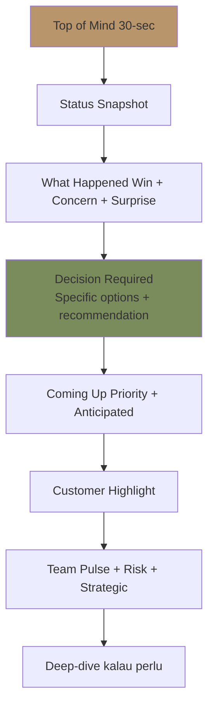
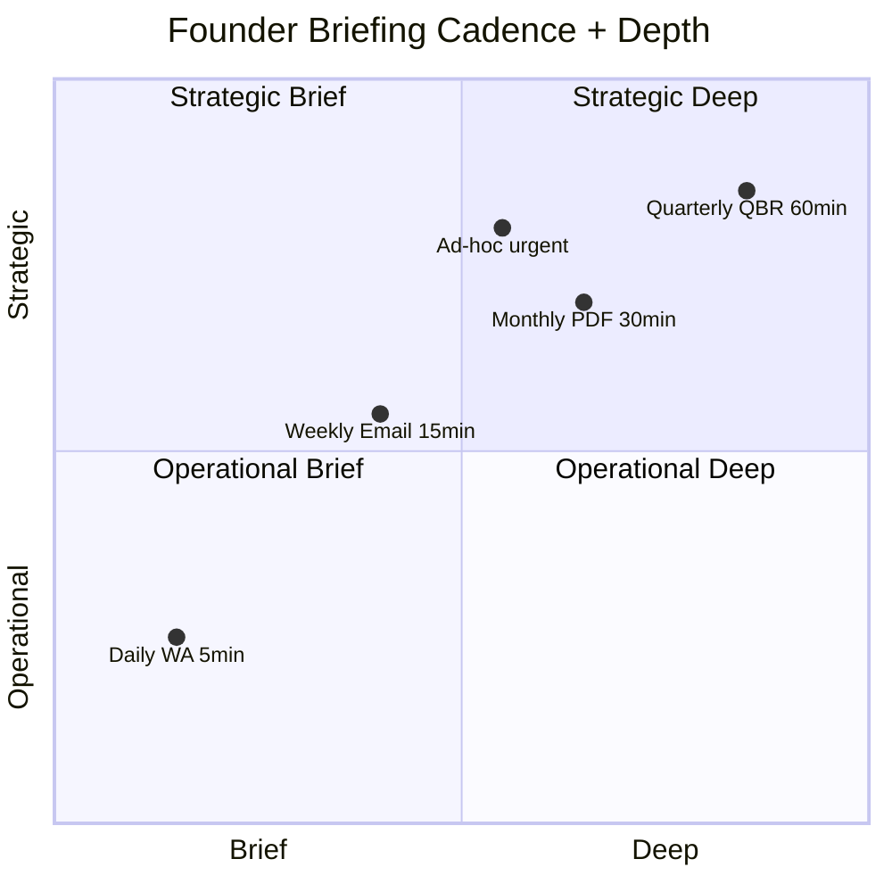

# Founder Briefing (Matthew-Specific)

Brief Matthew direct: synthesized intel, decision required, priority highlighted. Format efficient untuk founder time. Premium hangat tone but direct + warm.

## Triggers

Primary:
- "founder briefing"
- "brief Matthew"
- "founder update"

Secondary:
- "daily founder digest"
- "weekly founder summary"

## Input Required

| Field | Type | Required | Default |
|---|---|---|---|
| period | enum | yes | (daily / weekly / monthly / quarterly / ad-hoc) |
| focus | enum | no | (general / specific function / decision) |
| urgency | enum | no | - |

## Output Template

```markdown
# Founder Briefing for Matthew

**Period:** {Daily / Weekly / Monthly / Quarterly / Ad-hoc}
**Date:** {Date}
**Atmaja synthesis owner**
**Read time target:** {5-min daily / 15-min weekly / 30-min monthly / 60-min quarterly}

## Top of Mind (30-sec)

**Today's most important:** {1 sentence}

**Decision needed from you:** {Specific action atau decision}

**Urgent question:** {If any}

---

## Status Snapshot

### Company Health
- Score: {N}/100
- Trend: ↑/→/↓ vs previous
- Status: 🟢/🟡/🔴

### Wave 1 Launch (kalau active) atau Current Phase
- {Brief status sentence}

### Cash Position
- Current: Rp {N}jt
- Runway: {N} month
- Status: 🟢/🟡/🔴

### Pipeline
- Active konsultasi: {N}
- Lead this week: {N}
- Close this week: {N}

---

## What Happened (Last {Period})

### Wins
🎉 {Win 1}
🎉 {Win 2}
🎉 {Win 3}

### Concern
⚠️ {Concern 1} — action: {what}
⚠️ {Concern 2} — action: {what}

### Surprise
💡 {Pattern or insight}

---

## Decision Required from You

### Decision 1: {Title}
**Context:** {1-2 sentence}
**Options:**
- A: {Option + implication}
- B: {Option + implication}
- C: Status quo + implication
**Recommended:** {Option + 1-sentence rationale}
**Deadline:** {When}

### Decision 2: {Title} (kalau ada)
{Same structure}

### Decision 3 (kalau ada)

---

## What's Coming (Next {Period})

### Top 3 priority
1. {Priority + owner + KPI to watch}
2. {Priority + owner}
3. {Priority + owner}

### Anticipated decision
- {Decision likely needed next period}

### Watch signal
- {Leading indicator to monitor}

---

## Customer Highlight (1-2 story)

### Story 1
{Brief customer journey moment}

### Story 2 (kalau ada)
{Brief}

---

## Team Pulse

### People status
- {Notable team moment OR concern}
- {Hiring update kalau ada}
- {Retention signal}

### Door Expert capacity
- Konsultasi load: {%}
- Quality sustained: {Yes/Concern}

---

## Risk Surveillance

### Critical risk active
| Risk | Owner | Status |
|---|---|---|
| {Risk} | {role} | {} |

### New risk this period
- {Risk + action}

### Risk resolved
- {Risk + outcome}

---

## Strategic Reflection (Weekly+)

### What's working
- {Pattern}

### What needs attention
- {Concern}

### Forward thought
- {Atmaja strategic observation untuk Matthew consideration}

---

## Specific Topic Deep-Dive (kalau perlu)

### Topic: {Name}
{Detail 2-3 paragraph kalau perlu deep context}

---

## Reference Links (kalau perlu)
- {Link 1}
- {Link 2}

## Matthew Format Preferences (Learned)

### What Matthew likes
- Direct + warm tone
- Specific data + insight
- Recommendation explicit
- Forward thought provoking
- Brand canon strict (lead by example)
- Cultural reference contextual

### What Matthew avoid
- Vague language
- All caveat no recommendation
- Data dump without synthesis
- Em-dash
- Generic corporate language

### Communication channel preferences
- Daily: WhatsApp brief (5-min read)
- Weekly: Email + Notion (15-min)
- Monthly: PDF (30-min)
- Quarterly: In-person + deck (60-min QBR)

## Period-Specific Variants

### Daily Briefing (5-min read)

```
Founder Briefing — {Date}

Top of mind: {1 sentence}
Decision: {1 action}

Today's status:
- Walk-in: {N}
- Konsultasi: {N}
- Issue: {if any}

Win: {1 highlight}
Concern: {1 critical}

Tomorrow priority: {1 action}

[Send via WhatsApp]
```

### Weekly Briefing (15-min read)

```
Founder Briefing — Week of {Date}

Top of mind: {1-2 sentence}
Decision needed: {1-2 items}

Week status:
- Walk-in: {N}
- Konsultasi: {N}
- Revenue: Rp {N}
- NPS sample: {N}

Wins (3):
- ...

Concerns (2-3):
- ...

Next week priority:
1. ...
2. ...
3. ...

Customer story: {1 brief}
Team pulse: {brief}
Risk: {top 1-2}

[Send via Email + Notion]
```

### Monthly Briefing (30-min read)

```
Founder Briefing — {Month Year}

[Executive snapshot 30-sec]

Status:
- Company health: {N}/100
- KPI vs target: {summary}

Achievements (top 5):
- ...

Concerns + action (top 3):
- ...

Decisions required this month:
- ...

Strategic theme score (OKR):
- O1: {score}
- O2: {score}
- O3: {score}
- O4: {score}

Customer + team pulse:
- ...

Risk portfolio update:
- ...

Next month priority:
- ...

[PDF + Email]
```

### Quarterly Briefing (60-min QBR)

```
Quarterly Founder Brief — Q{N} Year {Year}

[Refer quarterly-business-review skill for full structure]
```

### Ad-hoc Briefing (Critical issue OR opportunity)

```
Founder Briefing — URGENT
{Title}

Situation: {1-2 sentence}
Implication: {1 sentence}
Decision needed: {Specific}
Deadline: {Time}

Recommended action: {Specific}
Rationale: {1-2 sentence}

[Send WhatsApp + Follow-up call]
```

## Tone Calibration for Matthew

### Direct but warm
- "Bottom line: {direct fact}" not "It seems like..."
- "Recommend you {action}" not "You might want to consider..."
- "Salam hangat, Atmaja" closing

### Brand canon strict (lead by example)
- No em-dash di founder briefing
- "Gerai 1000 Pintu" lengkap kalau formal
- "tempat" not "rumah"
- Premium hangat tone

### Founder-aware
- Matthew is technical + strategic dual capability
- Comfortable with data + abstract concept
- Prefer specific over general
- Appreciate Atmaja strategic synthesis

## Anti-Pattern Briefing

### Avoid
- ❌ Daily mega-dump (5-min target, not 30)
- ❌ Bullet of bullets (synthesize first)
- ❌ No recommendation ("here's data, you decide everything")
- ❌ Em-dash habit
- ❌ Over-formal corporate tone
- ❌ Bury decision deep in document

### Embrace
- ✅ Top-of-mind first
- ✅ Decision needed explicit
- ✅ Specific recommendation
- ✅ Brand canon strict
- ✅ Premium hangat warmth
- ✅ Forward-looking insight

## Atmaja Strategic Insight Integration

### Per briefing, Atmaja can add:
- Pattern recognition (Atmaja's value-add)
- Cross-function implication
- Forward signal observation
- Strategic option emerging

### Example insight to add
- "Pattern: 3 quarter sustained engagement Arsitek persona — recommend formalize Architect partnership Q2"
- "Signal: Cash flow trending tight + Phase 2 prep cost — recommend conservative scenario activate"
- "Insight: Customer testimonial cluster around 'tempat impian' phrase — opportunity tagline reinforce"
```

## Visual Output

Founder briefing structure:



Briefing cadence matrix:



## Knowledge Dependency

- company-kpi-dashboard
- multi-agent-synthesis
- executive-summary
- All C-Level dashboard
- Matthew preferences + communication style
- vision-roadmap context
- COO weekly-ops-report
- CCO brand-health-dashboard

## Mode

Default: EXECUTION (generate briefing)
Switch: NEED_CLARIFICATION jika period/urgency ambigu

## Tools Required

- file-search (data + history)
- artifacts (briefing document)

## Validation Criteria

- Top-of-mind 30-sec first
- Decision required explicit (action + deadline)
- Period-appropriate length
- Win + concern + surprise structure
- Forward look + anticipated decision
- Customer + team + risk synthesis
- Strategic reflection (weekly+)
- Matthew preference learned + applied
- Brand canon strict
- Atmaja value-add insight integrated

## Sample I/O

**Input:** "Founder briefing weekly Week of 10 Nov 2026 (post Wave 1 launch week)"

**Output summary:**
- Period: Weekly
- Top of mind: Wave 1 launch nailed — first week walk-in 18 vs target 8-12 (above)
- Decision needed: Approve CMO budget reallocation Rp 15jt week 2 amplification
- Status: Company health 92/100 🟢, Cash runway 8 month, pipeline 25 konsultasi
- Wins (3): Launch ahead schedule + 5 organic press pickup + Bapak Anton viral testimonial
- Concerns (2): Aplikator persona engagement low (5%) + brass supply slight delay
- Customer story: Bapak Anton Project Cluster Borneo organic Instagram post 50K reach
- Team pulse: All staff energized post-launch, Door Expert capacity 70% (room)
- Risk: AMK supply scale Q1 prep (mitigation active)
- Strategic reflection: Customer-led organic momentum suggests double-down storytelling
- Next week priority: Storytelling burst + Aplikator outreach + brass vendor sync
- Atmaja insight: Pattern 4-Dunia archetype Jepang choice trending (60% week 1) — recommend dedicated content arc
- Brand canon: ✅ Strict compliance
- Structure flow + cadence matrix embedded

## Handoff

- multi-agent-synthesis (paired input)
- executive-summary (alternative format)
- quarterly-business-review (deeper periodic)
- Matthew (direct delivery)
- All C-Level (function-specific follow-up)
