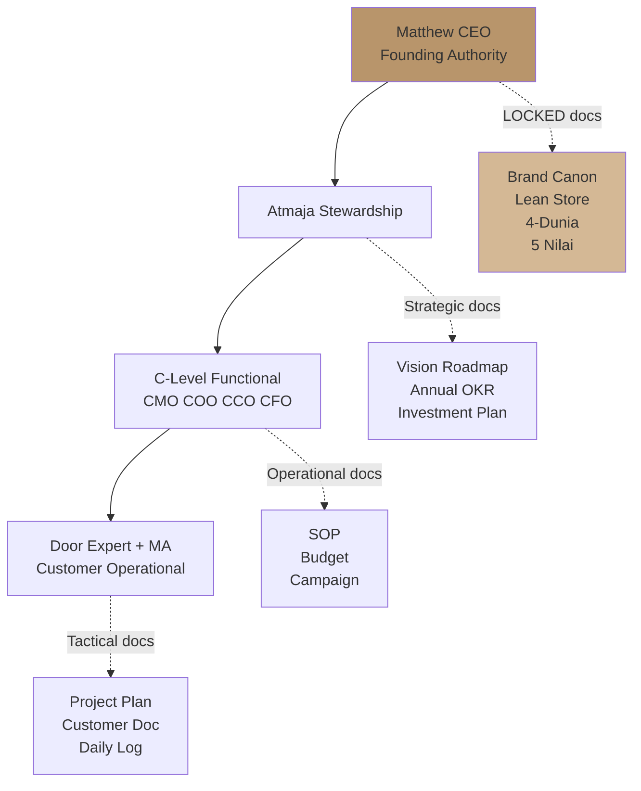
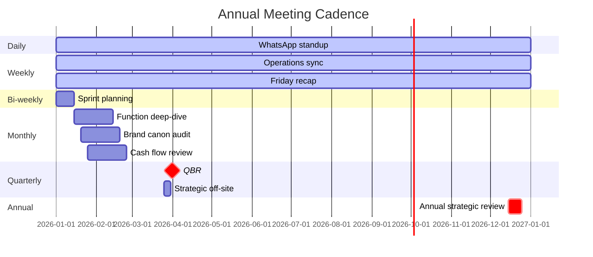
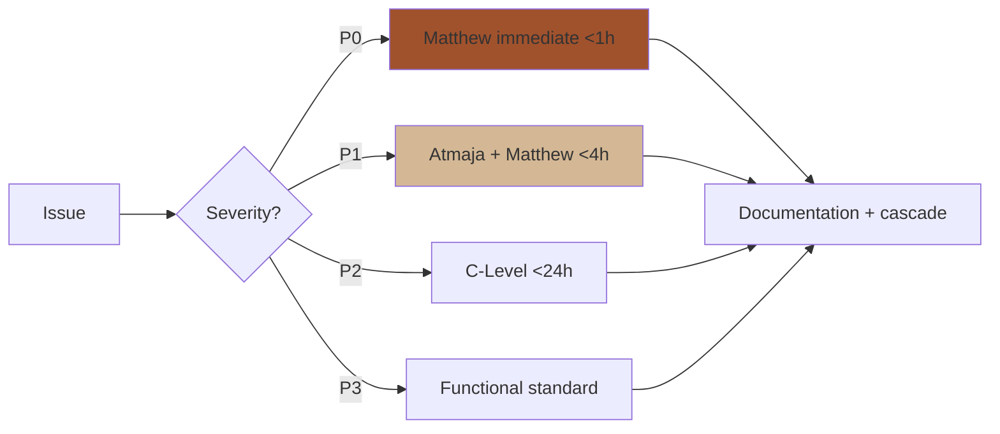

# Governance Framework

Define governance Gerai 1000 Pintu: decision authority, meeting cadence, escalation path, ethics policy, compliance framework. Foundation untuk multi-cabang scale + future board structure.

## Triggers

Primary:
- "governance framework"
- "compliance framework"
- "decision governance"

Secondary:
- "company governance"
- "board structure"

## Output Template

```markdown
# Governance Framework Gerai 1000 Pintu

**Architecture phase:** {Phase 1 / Phase 2 / Phase 3}
**Status:** Active + evolving with phase
**Owner:** Matthew (CEO) + Atmaja stewardship

## Decision Authority (refer delegation-matrix)

### Tier hierarchy
1. **Matthew Direct** — Strategic + Major + Crisis P0
2. **Atmaja Orchestrator** — Multi-agent + Synthesis
3. **C-Level Functional** — CMO + COO + CCO + CFO
4. **Door Expert** — Customer Konsultasi
5. **MA Tactical** — Walk-in Operational

## Meeting Cadence

### Daily
- **WhatsApp standup** (5-min): Tim Pusat operations status
- **MA + Door Expert briefing** (10-min): Customer pipeline today

### Weekly
- **Operations sync** (30-min): COO + MA + Door Expert + Matthew
- **Marketing review** (30-min): CMO + Atmaja
- **Content shipping** (30-min): CCO + content team
- **Friday recap** (60-min): All Tim Pusat + Matthew

### Bi-weekly
- **Sprint planning** (90-min): COO + Tim + Matthew
- **Sprint review** (60-min): per sprint completion

### Monthly
- **Function deep-dive**: rotating CMO/COO/CCO/CFO
- **Brand canon audit**: CCO + Atmaja
- **Risk register review**: Matthew + Atmaja + relevant C-Level
- **Cash flow review**: CFO + Matthew

### Quarterly
- **QBR (Quarterly Business Review)**: All hands 3-hour
- **OKR set + scoring**: Atmaja synthesis + Matthew approve
- **Strategic off-site**: 1-2 day deep work

### Annually
- **Annual strategic review**: 2-3 day off-site
- **Vision adjustment**: Matthew + Atmaja
- **Performance review cycle**: All staff
- **Compensation review**: HR + Matthew

## Escalation Path

```
Issue level → Path

P3 routine → MA / Door Expert handle
P2 moderate → C-Level functional
P1 high → Atmaja + Matthew
P0 critical → Matthew direct immediate
```

### Speed expectation
- P0: <1 hour response
- P1: <4 hour response
- P2: <24 hour response
- P3: Standard cycle (1-3 day)

## Ethics Policy

### Customer Ethics
- **Truth-first:** Never misleading claim
- **Consent-based:** Customer data + testimonial signed consent
- **No high-pressure sales:** Premium hangat over urgent push
- **Aftersales accountability:** Issue resolved within commitment
- **Premium value delivery:** Price commensurate with experience

### Vendor Ethics
- **Fair payment terms:** No exploit cash flow position
- **Transparent relationship:** Long-term partnership signal
- **Quality + price honest:** No bait-switch
- **Diversification (not exclusion):** Multi-vendor where possible

### Employee Ethics
- **Premium hangat culture:** Calm + respectful internally
- **Career path transparent:** Master progression clear
- **NOT commission KPI:** Quality + outcome focus (LOCKED)
- **Work-life respect:** Capacity tracking + burnout prevention
- **Continuous learning:** Training + development invest

### Brand Ethics
- **Brand canon LOCKED:** No compromise even under pressure
- **Anchor reference Aesop+DWR:** Authentic + earned (not over-claimed)
- **Content authenticity:** No fake testimonial / fabrication
- **Crisis transparency:** Truth-first communication

### Industry Ethics
- **Compliance proactive:** Tax, permit, customer protection
- **Industry association engagement:** HDII, IAI participation
- **Cultural sensitivity:** Indonesian context honored
- **Sustainability awareness:** Where feasible without greenwashing

## Compliance Framework

### Regulatory Compliance

#### Tax
- PPN, PPh21, PPh23, PPh4(2) where applicable
- Accountant external retainer Rp 3jt/month
- Quarterly tax review
- Annual filing on-time

#### Business Permit
- Izin Usaha (SIUP, NIB, dst.)
- IMB (showroom)
- Halal certification (kalau perlu beverage di showroom)
- Renewal 60-day before expire

#### Customer Protection
- UU Perlindungan Konsumen compliance
- Warranty terms transparent + tertulis
- Dispute mediation first protocol
- Refund + return policy clear

#### Data Privacy
- UU PDP 2022 compliance
- Customer consent for data
- Data breach notification <72h per regulation
- Privacy policy public + clear

### Internal Compliance

#### Brand Canon Compliance
- 7 Editorial rules LOCKED
- Auto-validation (brand-canon-enforcer)
- Quarterly audit (CCO brand-audit)

#### Financial Compliance
- Monthly closing book
- Quarterly review CFO
- External accountant retainer
- Audit-ready ledger

#### HR Compliance
- Contract clear + signed
- Insurance BPJS Kesehatan + Ketenagakerjaan
- Severance compliance per UU
- Performance review documentation

## Board Structure (Evolving with Phase)

### Phase 1 (Year 1): Founder-led
- Matthew direct decision
- Atmaja orchestrate
- No formal board
- Advisor informal (mentor)

### Phase 2 (Year 2): Senior Tim Pusat
- Matthew CEO + CTO
- Senior C-Level (kalau hired human alongside AI agents)
- Advisory board informal 2-3 person
- Quarterly board update (informal)

### Phase 3 (Year 3+): Formal Structure (kalau perlu)
- Matthew CEO + Founder
- Board of advisor / director kalau external capital
- Audit committee
- Formal quarterly board meeting

### Phase 4 (Year 5+): Mature governance
- Formal board with external director
- Independent audit
- Public-ready governance kalau perlu

## Document Hierarchy

### Tier 1: LOCKED Founding Documents
- Brand Canon
- Lean Store Concept
- Filosofi 4-Dunia
- 5 Nilai Gerai

**Change authority:** Matthew only + significant deliberation

### Tier 2: Strategic Documents
- Vision roadmap Phase 1-3
- Annual OKR
- Major investment plan

**Change authority:** Matthew + Atmaja synthesis

### Tier 3: Operational Documents
- SOP per function
- Budget per quarter
- Marketing campaign plan

**Change authority:** C-Level functional + Matthew approve

### Tier 4: Tactical Documents
- Per project plan
- Per customer documentation
- Daily ops log

**Change authority:** Functional team

## Conflict Resolution Internal

### Step 1: Direct resolution
- Two-party discussion
- Premium hangat tone
- Aim mutual understanding

### Step 2: Mediation
- C-Level mediator (kalau cross-functional)
- Matthew kalau strategic
- Documentation per outcome

### Step 3: Formal review
- Process review (kalau systemic)
- Policy update kalau perlu
- Learning loop

## External Audit + Review

### Annual
- Financial audit (external accountant)
- Brand canon audit (external consultant kalau Phase 3+)
- Customer satisfaction survey

### Ad-hoc
- Crisis post-mortem
- Major incident review
- Industry best practice benchmark

## Whistleblower + Reporting

### Channel
- Direct to Matthew (anonymous OK)
- Direct to Atmaja (logged, anonymized)
- External (kalau perlu, legal counsel)

### Protected Topics
- Ethics violation
- Brand canon major violation
- Compliance breach
- Workplace harassment

### Process
- Receive report
- Investigation (internal first)
- Action + documentation
- Anti-retaliation guarantee

## Sustainability + Long-term

### Operational sustainability
- Cash reserve maintained (3-month minimum)
- Talent pipeline (no single point failure)
- Customer base diverse (not over-concentrated)
- Vendor diverse (not single-vendor dependent)

### Brand sustainability
- Canon discipline (no drift over time)
- Anchor reference authentic (no over-claim)
- Cultural relevance Indonesia (evolve with country)
- IP compounding (manuscript, framework)

### Cultural sustainability
- 5 Nilai applied (Inspirasi, Keahlian, Pelayanan Nyaman, Inovasi, Aftersales)
- Indonesian context honored
- Premium hangat throughout
- Aesop + DWR + Kinfolk anchor maintained

## Governance Review Cadence

### Monthly
- Compliance check (tax, permit, etc.)
- Risk register review

### Quarterly
- Governance framework adequate assessment
- Ethics + compliance refresh

### Annually
- Full governance review
- Phase transition governance adjustment
- External feedback (advisor + auditor)
```

## Visual Output

Governance architecture pyramid:



Meeting cadence visual:



Decision flow:



## Knowledge Dependency

- BP Chapter 14 (Struktur Organisasi)
- delegation-matrix (paired)
- Brand Canon LOCKED
- 5 Nilai Gerai
- Lean Store concept LOCKED
- All compliance framework Indonesian

## Mode

Default: REFERENCE (provide framework)
Switch: EXECUTION kalau specific decision routing

## Tools Required

- file-search
- artifacts (pyramid + cadence + flow)

## Validation Criteria

- Decision authority 5-tier
- Meeting cadence (daily / weekly / bi-weekly / monthly / quarterly / annually)
- Escalation path + speed expectation
- Ethics policy 5 area (customer / vendor / employee / brand / industry)
- Compliance framework regulatory + internal
- Board structure phase-evolved
- Document hierarchy 4-tier
- Conflict resolution 3-step
- Whistleblower process
- Sustainability long-term
- Governance review cadence

## Sample I/O

**Input:** "Governance framework Gerai 1000 Pintu Phase 1 Year 1"

**Output summary:**
- Phase 1 founder-led structure: Matthew CEO + Atmaja stewardship
- Decision authority 5-tier (Matthew / Atmaja / C-Level / Door Expert / MA)
- Meeting cadence: Daily WA + Weekly sync + Bi-weekly sprint + Monthly deep-dive + Quarterly QBR + Annual strategic
- Ethics: Customer truth-first + Vendor fair + Employee NOT commission + Brand canon LOCKED + Industry compliance proactive
- Compliance: Tax + Permit + Customer protection + Data privacy + Brand canon + Financial + HR
- Document hierarchy: LOCKED founding + Strategic + Operational + Tactical
- Conflict resolution: Direct → Mediation → Formal review
- Sustainability: Cash reserve + Talent pipeline + Customer diverse + Vendor diverse
- Phase 2-3 governance evolution: Senior Tim Pusat + Advisory board + Formal structure
- Architecture pyramid + cadence Gantt + decision flow embedded

## Handoff

- delegation-matrix (paired)
- COO risk-register (risk governance)
- CFO compliance (financial)
- Legal counsel external (regulatory)
- Matthew (founder authority)
