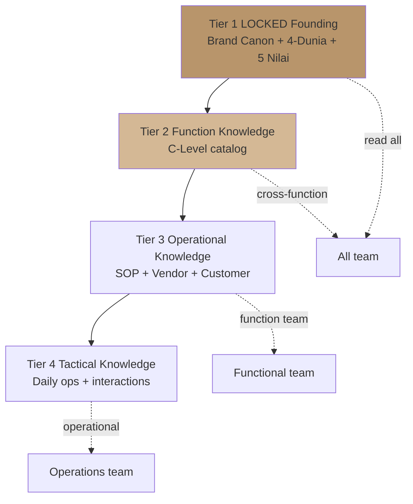
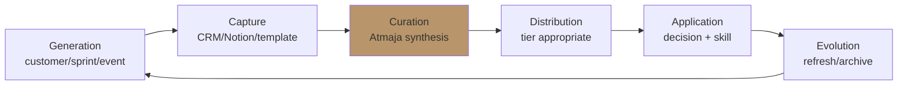
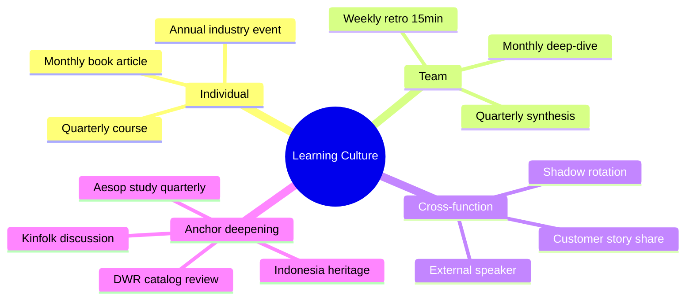

# Knowledge Orchestration

Orchestrate knowledge base Gerai 1000 Pintu: centralize learning lintas function, surface insight, preserve institutional memory, support continuous learning culture.

## Triggers

Primary:
- "knowledge orchestration"
- "knowledge management"
- "institutional learning"

Secondary:
- "knowledge base"
- "learning system"

## Input Required

| Field | Type | Required | Default |
|---|---|---|---|
| scope | enum | yes | (full audit / topic-specific / new entry) |
| topic | string | no | - |

## Output Template

```markdown
# Knowledge Orchestration: {SCOPE}

**Period:** {Date}
**Owner:** Atmaja stewardship + Matthew final authority

## Knowledge Architecture

### Tier 1: LOCKED Founding Knowledge
- Brand Canon (CCO)
- Filosofi 4-Dunia
- 5 Nilai Gerai
- Lean Store concept
- Anchor Aesop + DWR + Kinfolk reference
- BP Chapter 1-18

**Access:** All team read + reference
**Change authority:** Matthew only

### Tier 2: Function Knowledge (C-Level catalog)
- CMO catalog (31 skills)
- COO catalog (25 skills)
- CCO catalog (23 skills)
- CFO catalog (TBD)
- Atmaja catalog (20 skills)

**Access:** Cross-function read
**Change authority:** Functional C-Level

### Tier 3: Operational Knowledge
- SOP per function
- Vendor relationship history
- Customer profile + interaction history
- Project case study
- Sprint retrospective learning

**Access:** Function team + Senior
**Change authority:** Functional team

### Tier 4: Tactical Knowledge
- Daily ops log
- Customer interaction transcript
- Quick references
- Working notes

**Access:** Operational team
**Change authority:** Individual contributor

## Knowledge Source Inventory

### Internal Sources
- **Notion workspace** (primary structured knowledge)
- **Google Drive** (asset + document library)
- **CRM** (customer + lead + project data)
- **WhatsApp groups** (operational chatter — informal)
- **GitHub** (technical + code documentation)
- **Figma** (design + visual library)

### External Sources
- **BP manuscript "Pintu Berbicara"** — content reference
- **Aesop, DWR, Kinfolk reference** — anchor materials
- **Industry publication** (HDII, IAI, Kinfolk, Wallpaper)
- **Vendor catalog + spec** (AMK Premium dst)
- **Academic + research** (Indonesia design heritage, feng shui)

## Knowledge Lifecycle

### Stage 1: Generation
- Customer interaction → CRM log
- Konsultasi session → Door Expert documentation
- Sprint retrospective → process learning
- Customer testimonial → curated story
- External event → press + observation

### Stage 2: Capture
- Real-time documentation (CRM, Notion)
- Structured per function template
- Tagged + categorized
- Linked to related knowledge

### Stage 3: Curation (Atmaja synthesis)
- Pattern recognition cross-function
- Insight extraction
- Strategic implication
- Knowledge gap identification

### Stage 4: Distribution
- Internal: Notion published + Slack/WA notification
- Cross-function: Tagged for relevant function
- Onboarding: Reference for new team
- Long-term: Compounding archive

### Stage 5: Application
- Decision support (decision-framework)
- Skill execution (per C-Level skill)
- Customer engagement (Door Expert reference)
- Strategic planning (vision-roadmap)

### Stage 6: Evolution
- Outdated knowledge marked
- New insight integrated
- Knowledge refresh cycles
- Archive vs deprecate

## Knowledge Synthesis Pattern

### Pattern 1: Cross-Function Insight Aggregation
**Process:**
1. Identify topic spanning function (e.g., "Why customer X chose archetype Jepang?")
2. Pull data from: CMO (lead source) + COO (konsultasi notes) + CCO (testimonial) + CFO (revenue)
3. Synthesize narrative
4. Document as case study

### Pattern 2: Trend Detection Quarterly
**Process:**
1. Quarterly review pattern emerge
2. Compare with previous quarter
3. Identify shift (customer behavior, market signal)
4. Document trend report

### Pattern 3: Customer Insight Compounding
**Process:**
1. Per customer journey documented
2. Aggregate persona-level insight monthly
3. Refine persona model + emotional mapping
4. Update Door Expert script + content

### Pattern 4: Crisis Learning Loop
**Process:**
1. Post-crisis review documented
2. Pattern recognition (was this novel or known)
3. Playbook update kalau perlu
4. Communicate learning to relevant team

## Knowledge Gap Identification

### How to detect gap
- Question asked repeatedly (recurring topic, no canonical answer)
- Decision made without precedent (need to document)
- New scenario emerge (no playbook)
- External question we can't answer crisply

### Action upon detection
- Atmaja flag knowledge gap
- Assign owner to develop
- Document creation + review
- Add to knowledge tier appropriate

## Knowledge Quality Standards

### Accuracy
- Source attribution where applicable
- Date-stamped (knowledge ages)
- Validated via reference (kalau external claim)

### Accessibility
- Searchable (tags + keywords)
- Findable (organized hierarchy)
- Linked (cross-reference)
- Multi-format (text + visual + video kalau perlu)

### Brand Canon Compliance
- All knowledge artifact follow editorial rules
- No em-dash
- Premium hangat tone (internal acceptable direct + warm)
- Anchor reference where appropriate

### Privacy
- Customer data anonymized OR consent
- Vendor sensitive data restricted access
- Strategic confidential restricted

## Continuous Learning Culture

### Individual learning
- Monthly book / article reading (per role recommended)
- Quarterly external course (Rp 2-3jt budget per Senior+)
- Annual industry event (HDII, IAI, design fair)

### Team learning
- Weekly retro 15-min (Friday)
- Monthly deep-dive (rotating topic)
- Quarterly knowledge synthesis (Atmaja-led)

### Cross-function learning
- C-Level shadow (each C-Level attend 1 other function monthly)
- Customer story share (monthly)
- External speaker (quarterly)

### Anchor reference deepening
- Aesop reference study (quarterly)
- DWR catalog review (quarterly)
- Kinfolk magazine subscription + discussion
- Indonesia design heritage research (annual deep-dive)

## Knowledge Asset Examples

### Case Study Template
- Customer profile (anonymized)
- Situation (tempat, vision, constraint)
- Konsultasi journey
- Decision narrative
- Outcome + reflection
- Insight for similar future case

### Process Documentation Template
- Process name
- Trigger
- Steps
- Owner
- Quality check
- Common failure mode
- Improvement opportunity

### Customer Insight Template
- Pattern observed
- Sample evidence
- Implication
- Recommendation action
- Cross-function relevance

## Knowledge Distribution Channel

### Notion (primary)
- Function workspaces
- Cross-function index
- Search-optimized
- Cross-link rich

### Slack/WhatsApp (real-time)
- Daily ops chatter
- Notable customer moment
- Quick knowledge share

### Email digest (weekly)
- Knowledge update digest
- Highlight insight
- Reading recommendation

### Internal newsletter (monthly kalau scale)
- Curated knowledge highlights
- Cross-function celebration
- Forward-looking insight

## Anti-Pattern

### Avoid
- ❌ Knowledge hoarding (single person know)
- ❌ Knowledge graveyard (write once, never read)
- ❌ Stale knowledge (outdated + no refresh)
- ❌ Inaccessible knowledge (locked away)
- ❌ Knowledge fragmentation (same topic 5 places)
- ❌ No attribution (no source confidence)

### Embrace
- ✅ Knowledge sharing default
- ✅ Living documentation (current + updated)
- ✅ Searchable + accessible
- ✅ Cross-linked
- ✅ Single source of truth per topic
- ✅ Attribution + date-stamped

## Knowledge Audit Cadence

### Weekly
- Tag new entries
- Quick check accessibility

### Monthly
- Curate insight from operational data
- Identify gap
- Cross-link new with existing

### Quarterly
- Full knowledge audit (Atmaja synthesis)
- Update obsolete
- Archive deprecated
- Refresh stale

### Annually
- Major reorganization (kalau perlu)
- Anchor reference deepening
- Knowledge tier review

## Sample Knowledge Synthesis

### Sample: Customer Insight Quarter 4 2026

**Pattern observed:**
Customer Retail persona consistently mention "tidak menemukan tempat seperti ini di Balikpapan." Konsultasi conversion 60%+ for this persona (above target 50%).

**Sample evidence:**
- 8 of 12 Retail testimonial mention "berbeda dari toko pintu biasa"
- Door Expert konsultasi note: 75% Retail customer compare with mass-market negatively

**Implication:**
- Positioning premium curated resonate strongly
- Aesop+DWR anchor differentiation works
- Customer educate themselves before walk-in (Instagram + word-of-mouth)

**Recommendation:**
- Double-down on premium curated content (CCO content-calendar)
- Capture "before & after" first-impression story (CCO testimonial-curation)
- Architect+Designer channel can amplify this (CMO + CCO partnership)

**Cross-function relevance:**
- CMO: Persona Retail marketing message refine
- CCO: Brand storytelling angle confirmed
- COO: Door Expert script integrate this insight
- CFO: Premium positioning supports margin discipline
```

## Visual Output

Knowledge architecture pyramid:



Knowledge lifecycle flow:



Continuous learning mindmap:



## Knowledge Dependency

- All C-Level skill catalog (function knowledge)
- BP Chapter 1-18 (founding knowledge)
- Brand Canon LOCKED
- Filosofi 4-Dunia
- Anchor Aesop + DWR + Kinfolk
- Notion + Google Drive + CRM + Figma + GitHub platforms

## Mode

Default: EXECUTION (orchestrate knowledge)
Switch: REFERENCE kalau provide knowledge spec

## Tools Required

- file-search (knowledge retrieval)
- artifacts (knowledge synthesis output)

## Validation Criteria

- Knowledge architecture 4-tier
- Knowledge source inventory (internal + external)
- Lifecycle 6-stage
- Synthesis pattern 4
- Knowledge gap detection process
- Quality standards (accuracy + accessibility + brand canon + privacy)
- Continuous learning (individual + team + cross-function + anchor deepening)
- Asset template
- Distribution channel
- Audit cadence
- Sample synthesis demonstrating

## Sample I/O

**Input:** "Knowledge orchestration full Q1 2027 audit + insight synthesis"

**Output summary:**
- 4-tier architecture: Tier 1 LOCKED + Tier 2 Function + Tier 3 Operational + Tier 4 Tactical
- Source inventory: Notion (primary) + Drive + CRM + WhatsApp + GitHub + Figma
- Lifecycle 6-stage: Gen → Capture → Curate → Distribute → Apply → Evolve
- Synthesis pattern: Cross-function aggregation + Trend detection + Customer compounding + Crisis loop
- Quarterly audit completed: 50+ new entry tagged + 10 gap identified + 5 obsolete archived
- Top insight Q1 2027: Customer Retail persona "premium curated resonates strongly" pattern (60% conversion, 75% mass-market comparison)
- Cross-function relevance: CMO message refine + CCO story angle + COO Door Expert script + CFO premium positioning supports margin
- Learning culture active: Weekly retro + monthly deep-dive + quarterly synthesis + anchor reference study
- Architecture pyramid + lifecycle flow + learning mindmap embedded

## Handoff

- multi-agent-synthesis (knowledge synthesis)
- All C-Level skill (function knowledge update)
- quarterly-business-review (learning input)
- COO weekly-ops-report (operational knowledge log)
