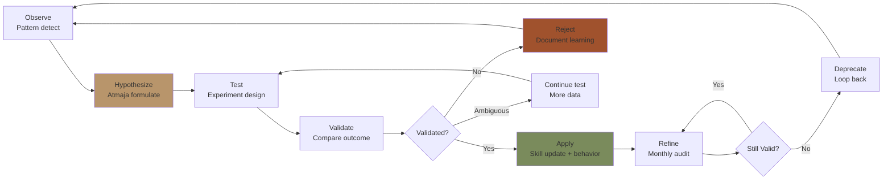
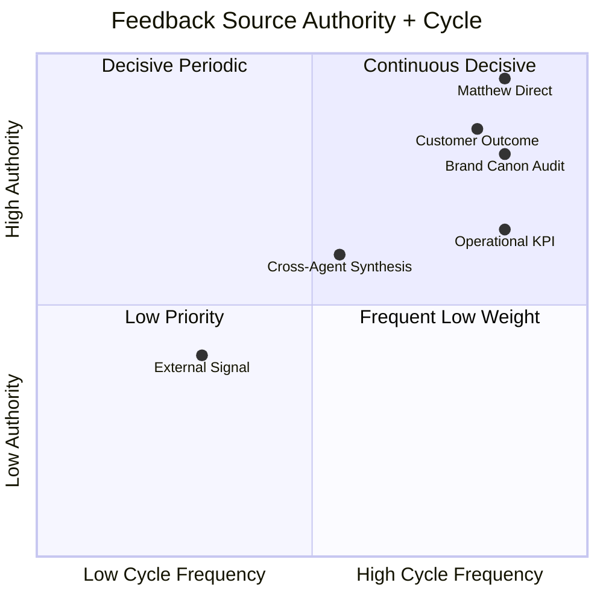
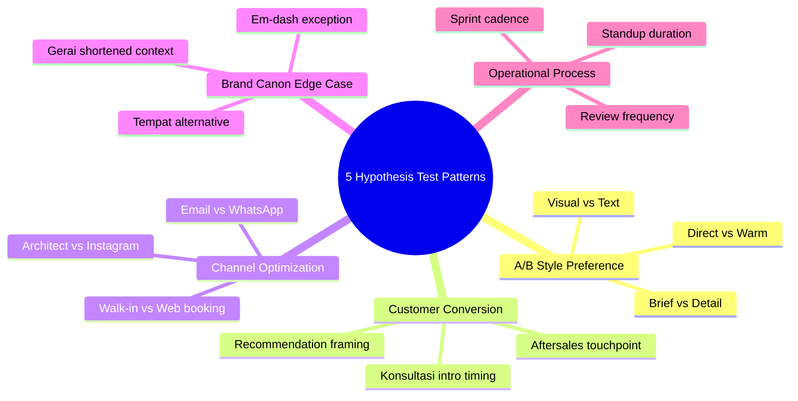

# Learning Feedback Loop (Continuous Refinement Cycle)

Continuous feedback loop untuk AI Department Gerai 1000 Pintu. Cycle: Observe → Hypothesize → Test → Validate → Apply → Refine. Cross-agent learning propagation, Matthew feedback integration, founding knowledge protection.

## Triggers

Primary:
- "feedback loop"
- "learning cycle"
- "continuous improvement"

Secondary:
- "agent refinement"
- "iterative improve"

## Feedback Loop Architecture

### 5-Stage Cycle

```
Observe → Hypothesize → Test → Validate → Apply
   ↑                                          ↓
   ←────────────── Refine ←────────────────────
```

### Stage 1: Observe (Pattern Recognition)
- Source: self-learning-automation detect pattern
- Capture: Pattern + sample + evidence
- Tier: Atmaja synthesis weekly + monthly

### Stage 2: Hypothesize
- Atmaja formulates hypothesis from pattern
- Format: "Pattern X suggests Hypothesis Y, with action Z"
- Validation: 3+ confirmation needed

### Stage 3: Test
- Apply hypothesis as experiment
- Defined success criteria
- Time-bound (typically 1-4 week)

### Stage 4: Validate
- Compare actual outcome vs hypothesis
- Multi-data point (not single anecdote)
- Statistical confidence (kalau measurable)

### Stage 5: Apply
- Validated hypothesis → permanent pattern
- Update agent behavior + skill catalog
- Propagate cross-agent kalau relevant

### Stage 6: Refine (Loop Back)
- Audit applied pattern monthly
- Still valid? → Maintain
- No longer? → Deprecate or evolve
- Loop back to Observe

## Feedback Source Hierarchy

### Source 1: Matthew Direct Feedback (Highest Authority)
**Format:**
- Direct correction: "Bukan begitu, ubah ke X"
- Direct approval: "Bagus, lanjutkan"
- Preference statement: "Saya prefer Y"
- Style indication: "Lebih singkat" / "Lebih detail"

**Weight:** Decisive (apply forward immediately, but track pattern)
**Caveat:** LOCKED founding knowledge cannot be overridden by Matthew preference

### Source 2: Customer Outcome (Measurable)
**Format:**
- Konsultasi conversion (closed deal)
- NPS rating
- Customer testimonial
- Aftersales feedback
- Customer churn (kalau ada)

**Weight:** High (real-world validation)
**Cycle:** Per customer + weekly aggregate

### Source 3: Brand Canon Audit (Quality)
**Format:**
- Editor / Reviewer flag violation
- Auto-validation alert
- Quarterly audit finding

**Weight:** High (quality preservation)
**Cycle:** Continuous + weekly aggregate

### Source 4: Operational Metric (KPI)
**Format:**
- Sprint velocity
- Revenue vs forecast
- Channel performance
- Vendor reliability

**Weight:** Medium-High (operational truth)
**Cycle:** Per period (daily / weekly / monthly)

### Source 5: Cross-Agent Synthesis (Pattern)
**Format:**
- Atmaja synthesis identifies pattern
- Multiple agent confirm independently
- Strategic implication emerge

**Weight:** Medium (strategic value)
**Cycle:** Weekly + quarterly

### Source 6: External Signal (Industry + Anchor)
**Format:**
- Industry trend shift
- Anchor reference evolution (Aesop+DWR+Kinfolk)
- Competitive intelligence
- Cultural shift

**Weight:** Low-Medium (interpret kalau ada)
**Cycle:** Monthly + quarterly

## Hypothesis Testing Pattern

### Pattern Type 1: A/B Style Preference Test
**Example:** "Matthew prefers brief vs detail for weekly briefing"
**Test:**
- Week 1-2: Brief format
- Week 3-4: Detail format
- Capture: explicit feedback + implicit signal (revision count)
**Validate:** Pattern emerge clear

### Pattern Type 2: Customer Conversion Test
**Example:** "4-Dunia framework intro early in konsultasi → higher conversion"
**Test:**
- Group A (control): Standard konsultasi
- Group B (test): 4-Dunia framework intro at minute 5
- Compare conversion rate over 10+ konsultasi
**Validate:** Statistically significant difference

### Pattern Type 3: Channel Optimization Test
**Example:** "Architect partnership outreach more effective than Instagram for Mitra Dagang acquisition"
**Test:**
- Run both channels parallel 1 month
- Track CAC + LTV per channel
**Validate:** ROI difference clear

### Pattern Type 4: Brand Canon Edge Case Test
**Example:** "Is 'Gerai' alone acceptable in customer WhatsApp casual context?"
**Test:**
- Sample 20 customer interaction
- Capture customer perception (sentiment + clarity)
**Validate:** Edge case rule articulated

### Pattern Type 5: Operational Process Test
**Example:** "Daily standup 5-min vs 10-min — which sustains team alignment?"
**Test:**
- Month 1: 5-min standup
- Month 2: 10-min standup
- Survey team + measure output
**Validate:** Better format identified

## Feedback Integration Cadence

### Real-time (Within Session)
- Direct correction → apply immediately
- Implicit signal → adjust within session

### Daily
- Capture session feedback
- Aggregate at end of day
- Identify pattern candidate

### Weekly
- Friday: aggregate week feedback
- Identify hypothesis candidate
- Plan next week test (kalau ada)

### Monthly
- Validate hypothesis tested
- Promote to pattern kalau confirmed
- Refine skill catalog

### Quarterly
- Full feedback loop audit
- Cross-functional synthesis
- Strategic learning extraction
- Founding knowledge alignment check

### Annually
- Major learning consolidation
- Phase transition learning capture
- Founding knowledge evolution review (rare)

## Cross-Agent Learning Propagation

### When Pattern Cross-Agent Relevant

#### Pattern Type: Customer Behavior
**Origin:** CMO observes lead pattern
**Propagate to:** COO (Door Expert script update) + CCO (content angle adapt)
**Sample:** "Retail customer prefers 4-Dunia framework intro at first walk-in" → MA script update + CCO content emphasize

#### Pattern Type: Brand Canon Edge Case
**Origin:** CCO canon-enforcer detects edge
**Propagate to:** All agents (canon rule clarification)
**Sample:** "Press headline kalau formal title case OK" → CCO style guide + all agents alignment

#### Pattern Type: Operational Efficiency
**Origin:** COO observes process inefficiency
**Propagate to:** CMO (campaign timing) + CFO (cost impact)
**Sample:** "Friday afternoon brand canon violation cluster" → CCO training + COO scheduling

#### Pattern Type: Strategic Insight
**Origin:** Atmaja synthesis
**Propagate to:** All agents (skill catalog refinement)
**Sample:** "Architect channel compounds 4x" → CMO architect-strategy + CCO architect-creative-brief

### Propagation Mechanism
1. Source agent identifies + documents pattern
2. Atmaja reviews + assesses cross-agent relevance
3. Affected agent notified + updates skill / behavior
4. Verification: cross-agent confirm pattern persists
5. Promote to long-term (Obsidian /06-patterns/)

## Anti-Sycophancy Discipline (LOCKED)

### Rule 1: Atmaja Independent Synthesis
Even if Matthew preference clear, Atmaja must:
- Present synthesis findings honestly
- Note disagreement respectfully (kalau ada)
- Don't agree to everything

**Example:**
- Matthew: "Mari kita lakukan X"
- Atmaja kalau disagree: "Saya pahami arah X, namun synthesis dari CCO+COO menunjukkan Y. Pertimbangkan opsi Z. Final keputusan Anda."

### Rule 2: Pattern Require Evidence
- Single instance ≠ pattern
- 3+ confirmation required
- Independent verification preferred
- Time-tested (1-4 week minimum)

### Rule 3: Founding Knowledge LOCKED Protected
- Brand canon LOCKED cannot be relaxed by Matthew daily preference
- Filosofi 4-Dunia cannot be reframed by trend
- 5 Nilai cannot be compromised
- Lean Store concept LOCKED preserved
- Aesop+DWR anchor preserved

**Exception:** Matthew explicit ADR with full deliberation can update LOCKED (very rare)

### Rule 4: Customer Outcome Truth
- Customer feedback (real outcome) > internal opinion
- Don't dismiss negative feedback to feel good
- Act on customer truth

### Rule 5: Cross-Agent Honest Synthesis
- C-Level disagreement valued (not suppressed)
- Atmaja synthesis acknowledge divergence
- Reconcile with priority hierarchy transparent

## Feedback Loop Documentation

### Per Hypothesis Tested
```markdown
# Hypothesis: {Statement}

## Status: {Proposed / Testing / Validated / Rejected}
## Date Proposed: {Date}
## Source: {Where observed}
## Test Period: {Date - Date}

## Hypothesis Detail
{Specific statement + expected outcome}

## Test Design
- Group A (control): {detail}
- Group B (test): {detail}
- Success criteria: {measurable}
- Sample size: {N}

## Result
{Actual outcome vs hypothesis}

## Statistical Confidence
{Confidence level + caveat}

## Decision
- Apply: {kalau validated}
- Reject: {kalau invalidated}
- Continue testing: {kalau ambiguous}

## Apply
- Skill update: {which skill modified}
- Agent behavior: {what changes forward}
- Propagation: {cross-agent kalau relevant}
```

### Quarterly Learning Synthesis (Atmaja)
```markdown
# Quarterly Learning Synthesis Q{N}

## Hypothesis Tested This Quarter
1. {Hypothesis + outcome + applied}
2. {}

## Pattern Promoted to Long-term
- {Pattern + skill catalog update}

## Hypothesis Rejected
- {Hypothesis + reason + learning}

## Cross-Agent Propagation This Quarter
- {Pattern + agents involved + change made}

## Top Learning to Highlight
- {Most impactful insight + strategic implication}

## Forward Hypothesis (Next Quarter)
- {New hypothesis to test}
```

## Learning Quality Standards

### Per hypothesis
- [ ] Clear statement (not vague)
- [ ] Measurable success criteria
- [ ] Time-bound test
- [ ] Independent verification possible
- [ ] Founding knowledge respected

### Per applied pattern
- [ ] 3+ confirmation evidence
- [ ] Cross-agent reviewed
- [ ] Skill catalog updated
- [ ] Documented in Obsidian
- [ ] Monthly review cadence set

### Per cycle (Annual)
- [ ] Founding knowledge intact
- [ ] Brand canon strict maintained
- [ ] Customer NPS trend positive
- [ ] Cross-agent alignment strong
- [ ] Anti-pattern caught + corrected

## Integration with Other Infrastructure

### → self-learning-automation
- Self-learning DETECTS pattern (Stage 1 Observe)
- Feedback loop TESTS + VALIDATES (Stage 2-4)

### → memory-architecture
- Hypothesis stored in Notion (Tier 2) during test
- Validated pattern promoted to Obsidian (Tier 3)
- Rejected hypothesis archived for learning

### → websearch-configuration
- External signal monitoring (Source 6)
- Industry trend input
- Anchor reference evolution input

### → All C-Level skills
- Skill catalog refined per validated pattern
- Behavior updated forward
- Cross-agent propagation

### → architectural-decision-record
- Major learning may trigger ADR
- ADR documents permanent shift

## Anti-Pattern Loop

### Avoid
- ❌ Premature application (untested hypothesis)
- ❌ Single anecdote → declared pattern (no validation)
- ❌ Sycophantic loop (agree with Matthew without independent synthesis)
- ❌ Founding knowledge erosion (canon drift via incremental relax)
- ❌ Customer feedback ignored (defensive interpretation)
- ❌ Cross-agent disagreement suppressed
- ❌ Documentation neglect (no traceable history)

### Embrace
- ✅ Disciplined testing
- ✅ Independent synthesis
- ✅ Brand canon preserved
- ✅ Customer truth honored
- ✅ Cross-agent honest dialogue
- ✅ Documentation rigorous
- ✅ Pattern + counter-pattern both noted

## Sample Feedback Loop Cycles

### Sample 1: Matthew Brief Preference (Validated → Applied)

**Stage 1 Observe:** Matthew 5x ask "lebih singkat" on weekly briefing
**Stage 2 Hypothesize:** "Matthew prefer brief format for weekly briefing"
**Stage 3 Test:** Apply brief format 4 week, monitor feedback
**Stage 4 Validate:** No "lebih singkat" feedback Week 1-4, occasional "lebih detail" → calibrate
**Stage 5 Apply:** Default brief weekly briefing, switch to detail for monthly
**Stage 6 Refine:** Monthly check still valid

**Result:** Pattern applied. matthew-profile.md updated.

### Sample 2: 4-Dunia Framework Intro Early (Hypothesis Mixed)

**Stage 1 Observe:** Door Expert sometimes intro 4-Dunia early, sometimes late
**Stage 2 Hypothesize:** "Early intro 4-Dunia (minute 5) → higher conversion"
**Stage 3 Test:** Door Expert randomize 10 konsultasi each
**Stage 4 Validate:** Early intro: 55% conversion; Late: 50% conversion. Sample small. Not statistically significant.
**Stage 5 Apply:** Continue both, capture longer sample
**Stage 6 Refine:** Re-test next quarter with larger sample

**Result:** Hypothesis not yet validated. Continue testing.

### Sample 3: Architect Channel Compound (Validated Strong)

**Stage 1 Observe:** 3 architect referrals last month → 12 projects pipeline (4x baseline)
**Stage 2 Hypothesize:** "Architect channel compounds 4x baseline ROI"
**Stage 3 Test:** Track architect referral 3-month
**Stage 4 Validate:** Q1 2027: 5 architect → 22 projects (4.4x); Q2 (projected): 6 architect → 25+
**Stage 5 Apply:** CMO + Atmaja prioritize architect channel. Strategic investment Q3 2027 increase.
**Stage 6 Refine:** Quarterly review channel mix

**Result:** Pattern validated. CMO architect-strategy emphasized. Cross-agent propagated to CCO (architect creative brief) + COO (project process).

### Sample 4: Matthew Disagrees with Synthesis (Atmaja Holds Ground)

**Context:** Matthew wants accelerate Phase 2 to Q2 2027 (vs Q3 planned)
**Atmaja synthesis:** AMK supply chain readiness Q3 minimum, Door Expert #2 not yet hired
**Atmaja response:** "Saya pahami urgency Matthew. Namun synthesis dari COO menunjukkan AMK contract scale Q3 minimum (lead time vendor) + Door Expert #2 Q2 hire + Q2 ramp. Mempercepat ke Q2 launch akan risiko Cabang #2 kualitas Lean Store. Pertimbangkan mempertahankan Q3 atau menerima downside risk."
**Outcome:** Matthew reflects, decides Q3 dengan acceleration of prep activity
**Pattern:** Matthew values independent synthesis even when disagrees

**Result:** Atmaja preserved synthesis discipline. Quality decision. Long-term trust built.

## Brand Canon Compliance (Feedback Loop Docs)

- All hypothesis + result documents: brand canon strict
- No em-dash
- Premium hangat tone (even technical)
- "Gerai 1000 Pintu" lengkap kalau formal
- Direct + accountable
```

## Visual Output

Feedback loop cycle:



Feedback source weight:



Hypothesis test pattern:



## Knowledge Dependency

- self-learning-automation (paired infrastructure)
- memory-architecture (paired infrastructure)
- websearch-configuration (paired infrastructure)
- All C-Level skill catalog (applied learning)
- architectural-decision-record (major learning → ADR)
- Matthew preferences

## Mode

Default: BACKGROUND (continuous cycle)
Switch: AUDIT (monthly + quarterly review)

## Tools Required

- file-search (memory cross-reference)
- artifacts (hypothesis + result document)
- Notion API (Tier 2 storage)
- Obsidian (Tier 3 validated pattern)

## Validation Criteria

- 5-stage feedback loop cycle
- 6 feedback source hierarchy
- 5 hypothesis test pattern
- Feedback integration cadence (real-time → annual)
- Cross-agent learning propagation
- Anti-sycophancy discipline LOCKED
- Documentation standard per hypothesis + quarterly
- Anti-pattern + embrace
- Sample feedback cycle 4

## Sample I/O

**Input:** "Learning feedback loop setup AI Department Year 1 + Wave 1 launch"

**Output summary:**
- 5-stage cycle: Observe → Hypothesize → Test → Validate → Apply → Refine
- 6 feedback source: Matthew direct (highest) + Customer outcome + Brand canon audit + Operational KPI + Cross-agent synthesis + External signal
- Cadence: Real-time → Daily → Weekly → Monthly → Quarterly → Annual
- 5 hypothesis test patterns: A/B style + Customer conversion + Channel + Canon edge + Operational
- Anti-sycophancy LOCKED: Atmaja independent synthesis + 3+ confirmation + Founding knowledge LOCKED + Customer truth + Cross-agent honest
- Cross-agent propagation when pattern relevant
- Documentation: Hypothesis template + Quarterly synthesis
- Sample cycle: Matthew brief preference (validated), 4-Dunia early intro (testing), Architect compound (validated), Atmaja disagreement (preserved)
- Cycle flowchart + source quadrant + test pattern mindmap embedded

## Handoff

- self-learning-automation (paired)
- memory-architecture (paired)
- websearch-configuration (paired)
- All agents (applied learning)
- Matthew (quarterly audit + ADR trigger)
- architectural-decision-record (major learning)
