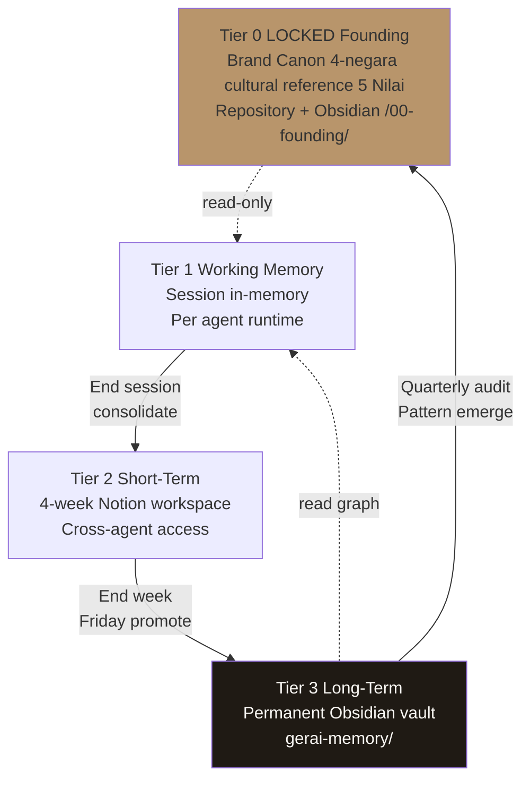
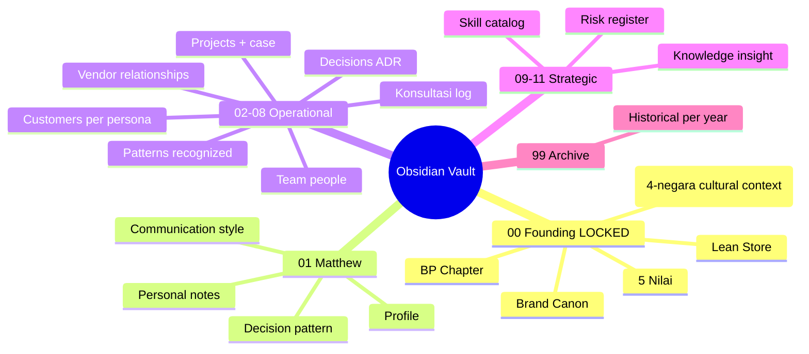
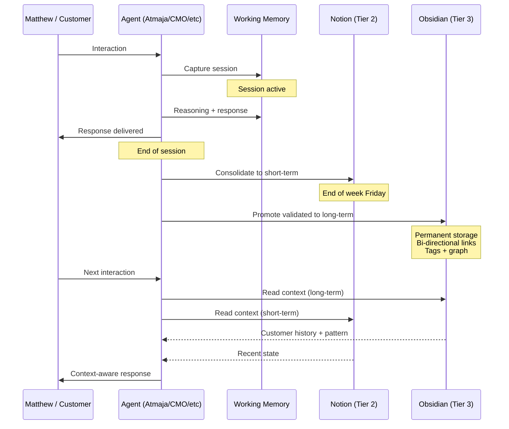

# Memory Architecture (3-Tier + Obsidian Long-Term)

Memory architecture untuk seluruh AI Department Gerai 1000 Pintu. 3-tier hierarchy: Working (session) + Short-term (week, Notion) + Long-term (permanent, Obsidian). Per-agent memory + cross-agent shared. Brand canon + founding knowledge LOCKED.

## Triggers

Primary:
- "memory architecture"
- "agent memory"
- "Obsidian integration"

Secondary:
- "knowledge memory"
- "persistent memory"

## Memory Hierarchy (3-Tier + Founding)

### Tier 0: LOCKED Founding Knowledge (Permanent + Immutable)
**Content:**
- Brand Canon LOCKED (7 editorial rules)
- Filosofi Dunia Pintu (4-negara cultural context)
- 5 Nilai Gerai
- Lean Store concept
- Anchor BP Latest reference
- BP Chapter 1-18

**Storage:** Repository + Obsidian vault `/00-founding/`
**Access:** Read-only for all agents
**Change authority:** Matthew only (ADR required)
**Update cadence:** Phase transition OR significant evolution

### Tier 1: Working Memory (Session-Level)
**Content:**
- Current conversation context
- Active task state
- Recent interactions (this session)
- Temporary computations

**Storage:** In-memory (agent runtime)
**Access:** Per-agent only
**Lifetime:** Session duration (cleared at end)
**Purpose:** Coherent within-session reasoning

### Tier 2: Short-Term Memory (Week-Level)
**Content:**
- Recent customer interactions
- This week's konsultasi notes
- Active project state
- Sprint context current
- Recent decisions (this week)
- Customer profile updates

**Storage:** Notion workspace
**Access:** Per-agent + cross-agent kalau relevant
**Lifetime:** 4-week rolling window (auto-consolidate to long-term after)
**Purpose:** Continuity across day-to-day operations

### Tier 3: Long-Term Memory (Permanent — Obsidian Vault)
**Content:**
- All customer profile + history
- All Door Expert konsultasi log
- All sprint retrospective
- All ADR (Architectural Decision Record)
- All learning pattern recognized
- Matthew profile + preferences
- Brand canon evolution
- Persona model refined
- Cross-agent synthesis

**Storage:** Local Obsidian vault `gerai-memory/` + cloud sync
**Access:** Per-agent + cross-agent
**Lifetime:** Permanent (never auto-delete)
**Purpose:** Institutional knowledge + compounding

## Obsidian Vault Structure

### Folder Architecture
```
gerai-memory/
├── 00-founding/          # Tier 0 LOCKED
│   ├── brand-canon.md
│   ├── filosofi-4-dunia.md
│   ├── 5-nilai-gerai.md
│   ├── lean-store-concept.md
│   └── bp-chapter-summary.md
│
├── 01-matthew/           # Founder profile + preferences
│   ├── matthew-profile.md
│   ├── communication-style.md
│   ├── decision-patterns.md
│   ├── strategic-priorities.md
│   └── personal-notes.md
│
├── 02-customers/         # Customer profile + history
│   ├── [customer-id]-{name}.md
│   ├── persona-end-user/
│   ├── persona-mitra/
│   ├── persona-developer/
│   ├── persona-arsitek/
│   ├── persona-kontraktor/
│   └── persona-aplikator/
│
├── 03-projects/          # Project + case study
│   ├── [project-id]-{name}.md
│   └── completed-archive/
│
├── 04-konsultasi/        # Door Expert session log
│   └── [date]-{customer}.md
│
├── 05-decisions/         # ADR catalog
│   ├── ADR-001-lean-store-locked.md
│   ├── ADR-002-not-commission-kpi.md
│   └── ...
│
├── 06-patterns/          # Recognized patterns
│   ├── customer-behavior.md
│   ├── operational-pattern.md
│   ├── brand-canon-violation.md
│   └── opportunity-pattern.md
│
├── 07-vendor/            # Vendor relationship
│   ├── amk-premium.md
│   ├── logistics.md
│   └── ...
│
├── 08-team/              # Team + people
│   ├── door-expert/
│   ├── ma-cabang/
│   └── tim-pusat/
│
├── 09-risk/              # Risk register live
│   ├── operational-risk.md
│   ├── financial-risk.md
│   ├── brand-risk.md
│   └── strategic-risk.md
│
├── 10-knowledge/         # Cross-function knowledge
│   ├── industry-trend.md
│   ├── anchor-reference-aesop-dwr.md
│   ├── press-coverage.md
│   └── insight-quarterly.md
│
├── 11-skill-catalog/     # Agent skill catalog (reference)
│   ├── atmaja-skills.md
│   ├── cmo-skills.md
│   ├── coo-skills.md
│   ├── cco-skills.md
│   └── cfo-skills.md
│
└── 99-archive/           # Deprecated + historical
    └── [year]/
```

### File Format Convention

Each Obsidian note follows structured format:

```markdown
---
id: {unique-id}
type: {customer / project / decision / pattern / etc.}
created: {YYYY-MM-DD}
updated: {YYYY-MM-DD}
tags: [#tag1, #tag2]
related: [[note-1]], [[note-2]]
status: active / archive / deprecated
---

# {Title}

## Summary
{1-2 sentence what this note contains}

## Detail
{Structured content per type}

## Connections
- Linked to: [[other-note]]
- Reference: [[founding-doc]]
- Evolved from: [[predecessor]]

## Updates Log
- {Date}: {What changed}
```

### Bi-Directional Link (Obsidian Native)
- `[[Customer Anton]]` → automatic backlink
- Cross-reference graph navigable
- Pattern: customer → project → konsultasi → decision

### Tag System
Standardized tags:
- `#persona-end-user`, `#persona-mitra`, etc.
- `#dunia-jepang`, `#dunia-eropa`, etc.
- `#phase-1`, `#phase-2`, `#phase-3`
- `#cabang-bpn`, `#cabang-smr`, `#cabang-bnt`
- `#priority-high`, `#priority-medium`, `#priority-low`
- `#status-active`, `#status-archive`, `#status-deprecated`

## Memory Read/Write Pattern

### Write Pattern (When + What)

#### End of Session (every interaction)
Working memory → consolidate to short-term (Notion):
- Decision made + rationale
- Customer interaction summary
- Pattern observed (preliminary)
- Action items

#### End of Week (Friday cadence)
Short-term (Notion) → consolidate to long-term (Obsidian):
- Validated pattern (3+ confirmation)
- Customer profile updates
- Decision documentation
- Cross-agent synthesis

#### Quarterly (QBR)
Long-term refinement:
- Pattern audit (still valid?)
- Knowledge tier promotion (tactical → strategic)
- Deprecated knowledge archive

### Read Pattern (How agents retrieve)

#### Semantic Search
- Query keyword → relevant Obsidian notes
- Use Mermaid embedding (search supports)
- Tags + backlinks navigate

#### Temporal Filter
- Last 7 day / 30 day / quarter / year
- Trend analysis over time

#### Relational Graph
- Start from customer → traverse links to projects → decisions → patterns
- Discovery via backlinks

#### Per-Agent Pre-Load
- Each agent has "always-read" set:
  - Atmaja: All Tier 0 + matthew-profile + recent decisions
  - CMO: Tier 0 + persona models + recent campaigns
  - COO: Tier 0 + sprint state + vendor pattern
  - CCO: Tier 0 + brand canon + recent canon violations
  - CFO: Tier 0 + financial snapshot + forecast variance

## Obsidian Integration Approach

### Option A: Local Vault + Git Sync (Recommended Phase 1)
- Obsidian vault on Matthew's machine (local)
- Git repo sync (encrypted at rest)
- Agent access via file system (when running locally)
- Pros: Privacy + offline + full control
- Cons: Manual sync, single device

### Option B: Obsidian Sync (Phase 2)
- Obsidian official sync service (paid)
- Multi-device sync
- End-to-end encrypted
- Agent access via API kalau ada (community plugin)
- Pros: Multi-device + cloud
- Cons: Subscription cost

### Option C: Self-Hosted Sync (Phase 3)
- Obsidian + Syncthing OR rsync
- Multi-device + private cloud
- Custom integration
- Pros: Full control + multi-device
- Cons: Setup complexity

### Current Recommendation
**Phase 1 Year 1:** Option A (Local + Git sync)
**Phase 2 Year 2:** Migrate to Option B kalau perlu multi-device
**Phase 3+:** Re-evaluate per scale

## Memory Hygiene

### Daily
- Working memory cleared at session end (auto)
- Critical decisions written to short-term

### Weekly (Friday)
- Short-term consolidation to long-term
- Tag cleanup + cross-reference verify
- Backup verify

### Monthly
- Pattern validation (3+ confirmation rule)
- Knowledge tier promotion
- Obsolete entry archive

### Quarterly
- Full memory audit
- Tier 2 → Tier 3 promotion review
- Tier 3 cross-link audit (broken link fix)
- Founding knowledge sync (kalau ada update)

### Annually
- Major reorganization (kalau perlu)
- Backup strategy refresh
- Schema evolution

## Backup + Disaster Recovery

### Backup Strategy
- **Daily:** Auto-commit local git
- **Weekly:** Push to remote git (private repo)
- **Monthly:** Cold storage backup (encrypted external HDD)
- **Quarterly:** Cross-cloud backup (Drive + Dropbox alternate)

### Recovery Plan
- Vault corruption: restore from git
- Local device loss: clone from remote git
- Catastrophic: cold storage restore
- Target RTO: <24 hour

## Privacy + Security

### Access Tier
- **Tier 0 LOCKED:** Read-only all agents
- **Tier 3 Customer profile:** Restricted (anonymize where possible)
- **Tier 3 Financial detail:** CFO + Matthew only
- **Tier 3 Personal Matthew:** Atmaja + Matthew only

### Encryption
- Local vault: OS-level encryption (FileVault / BitLocker)
- Git repo: encrypted at rest
- Sync service: end-to-end encrypted

### Consent
- Customer data: per consent form (refer CCO testimonial-curation)
- Anonymization default kalau not explicit consent
- Data retention per UU PDP 2022 Indonesia

### Data Minimization
- Only capture what valuable
- Periodic review (delete unnecessary)
- Aggregate when possible (pattern over individual)

## Cross-Agent Memory Sharing

### Shared Knowledge (All agents access)
- Tier 0 LOCKED founding
- Customer profile (relevant fields)
- Project status
- Brand canon
- Decision history (ADR)

### Function-Specific (Restricted)
- CFO financial detail
- CCO brand canon edge case
- CMO campaign performance detail
- COO vendor pricing detail
- Atmaja Matthew personal preference

### Synthesis Pattern
- Atmaja can read all (orchestrator role)
- C-Level read function + cross-function relevant
- Door Expert / MA read customer + relevant only

## Memory Quality Standards

### Per note
- [ ] Frontmatter complete (id + type + created + updated + tags)
- [ ] Title descriptive
- [ ] Connections explicit ([[backlinks]])
- [ ] Tags applied
- [ ] Updates log maintained
- [ ] Brand canon compliance

### Per vault
- [ ] No broken links
- [ ] No orphan note (kecuali archive)
- [ ] Tag consistency
- [ ] Backup current
- [ ] Tier 0 LOCKED intact

## Brand Canon Compliance (Memory Documents)

- All memory documents: brand canon strict
- No em-dash
- "tempat" not "rumah" kalau customer-facing
- "Gerai 1000 Pintu" lengkap kalau formal
- Premium hangat tone preserved (even in raw note)

## Sample Memory Operations

### Sample 1: New Customer Konsultasi Log
```
Action: Door Expert completes konsultasi with Bapak Anton

Working memory: Active during 60-min session
End of session:
  → Write to Notion (Tier 2): konsultasi-2026-11-20-anton.md
  → Includes: vision tempat, archetype interest (Jepang), decision pending

End of week (Friday):
  → Promote to Obsidian (Tier 3): /04-konsultasi/2026-11-20-anton.md
  → Update customer profile: /02-customers/persona-end-user/anton-wijaya.md
  → Link bi-directional: [[customer-anton]] ↔ [[konsultasi-2026-11-20-anton]]
  → Tag: #persona-end-user #dunia-jepang #cabang-bpn #phase-1

Quarterly: Pattern check (Retail customer Jepang preference cluster?)
```

### Sample 2: Strategic Decision (ADR)
```
Action: Matthew approves Cabang #2 Samarinda Q3 2027

Atmaja architectural-decision-record.md draft ADR-003

Working memory: During decision synthesis
End of session:
  → Write to Notion (Tier 2): draft ADR-003

Customer-facing note: NONE (internal strategic)

End of week:
  → Finalize ADR-003 in Obsidian (Tier 3): /05-decisions/ADR-003-cabang-samarinda.md
  → Link: ADR-001 [[lean-store-locked]] (predecessor)
  → Link: ADR-024 [[cabang-bontang]] (successor)
  → Tag: #phase-2 #strategic #matthew-approved
  → Status: Accepted

Quarterly: Review ADR-003 status (proceed per plan?)
```

### Sample 3: Pattern Recognition
```
Action: Atmaja observes 4-negara cultural reference Jepang choice trending (3 quarter sustained 30%+ vs Eropa decline 25→20%)

Working memory: Quarterly synthesis
End of week:
  → Pattern hypothesis: Jepang archetype customer preference strengthening

End of month:
  → Promote to long-term: /06-patterns/customer-behavior.md
  → Update: persona-end-user.md (preference shift documented)
  → Link to: brand-storytelling [[filosofi-4-dunia]]
  → Tag: #pattern #persona-end-user #dunia-jepang

Quarterly QBR:
  → Action recommended Matthew: Content arc Jepang Q2 emphasis
  → Update CMO content-calendar-strategy
```

## Memory Retrieval API (Conceptual)

### Agent invoke memory
```
memory.retrieve {
  query: "{semantic + tag + temporal filter}",
  tier: "{0 founding / 2 short-term / 3 long-term}",
  agent: "{requesting agent}",
  depth: "{shallow / deep / graph traversal}"
}
```

### Agent write memory
```
memory.write {
  tier: "{2 / 3}",
  type: "{customer / project / decision / pattern}",
  content: "{structured note}",
  links: "{related notes}",
  tags: "{taxonomy}"
}
```
```

## Visual Output

Memory hierarchy:



Obsidian vault structure tree:



Memory write/read flow:



## Knowledge Dependency

- self-learning-automation (paired infrastructure)
- learning-feedback-loop (paired infrastructure)
- websearch-configuration (paired infrastructure)
- Atmaja knowledge-orchestration
- CCO asset-library-organization (asset vs memory distinction)
- BP Chapter 1-18 (founding source)
- Obsidian software documentation

## Mode

Default: BACKGROUND (continuous read/write)
Switch: AUDIT (when Matthew requests memory review)

## Tools Required

- file-search (vault navigation)
- artifacts (memory document)
- Local file system (Obsidian vault)
- Git (sync + backup)
- Notion API (Tier 2 short-term)

## Validation Criteria

- 4-tier hierarchy (0 Founding / 1 Working / 2 Short / 3 Long Obsidian)
- Obsidian vault structure 12-folder
- File format convention (frontmatter + content + connections)
- Bi-directional link + tag system
- Memory write/read pattern
- Obsidian integration option (A/B/C)
- Memory hygiene cadence
- Backup + disaster recovery
- Privacy + security
- Cross-agent sharing
- Quality standards
- Sample operations

## Sample I/O

**Input:** "Memory architecture setup full untuk AI Department Year 1 Phase 1"

**Output summary:**
- 4-tier hierarchy: Tier 0 LOCKED Founding + Tier 1 Working (session) + Tier 2 Short-term (Notion 4-week) + Tier 3 Long-term (Obsidian permanent)
- Obsidian vault: 12 folder structure (founding + matthew + customers + projects + konsultasi + decisions + patterns + vendor + team + risk + knowledge + skill catalog + archive)
- Integration approach: Option A (Local vault + Git sync) recommended Phase 1
- Memory write: Session end → Notion, Friday → Obsidian, Quarterly → Founding promote
- Memory read: Pre-load per agent + semantic search + temporal filter + relational graph
- Bi-directional link Obsidian native + tag taxonomy (persona + dunia + phase + cabang + priority + status)
- Hygiene: Daily auto-commit, Weekly consolidate, Monthly validate, Quarterly audit, Annual reorganize
- Backup: Daily git + Weekly remote + Monthly cold storage + Quarterly cross-cloud
- Privacy: Tier-based access, encryption local + sync, customer consent honored
- Hierarchy flow + vault mindmap + sequence diagram embedded

## Handoff

- self-learning-automation (paired)
- learning-feedback-loop (paired)
- websearch-configuration (paired)
- knowledge-orchestration (Atmaja)
- All agents (memory operations)
- Matthew (setup approval + audit)
