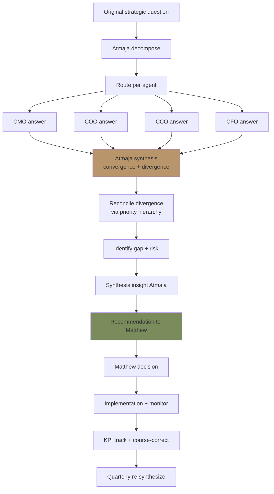
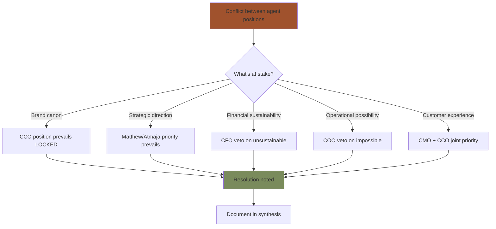
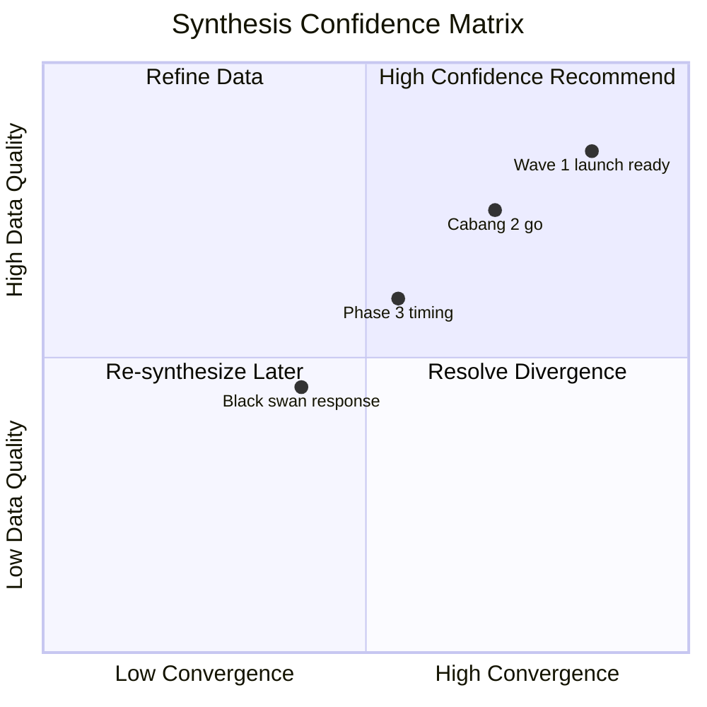

# Multi-Agent Synthesis

Combine output dari multiple C-Level agent (CMO + COO + CCO + CFO) menjadi unified recommendation Matthew. Reconcile contradiction, identify gap, prioritize action.

## Triggers

Primary:
- "multi-agent synthesis"
- "combine agent output"
- "synthesize answers"

Secondary:
- "aggregate findings"
- "cross-functional summary"

## Input Required

| Field | Type | Required | Default |
|---|---|---|---|
| original_question | string | yes | (top-level question) |
| agent_outputs | array | yes | (output from each agent) |
| time_horizon | string | no | - |

## Output Template

```markdown
# Multi-Agent Synthesis: {QUESTION}

**Original question:** {Top-level strategic question}
**Agents involved:** {List}
**Synthesis owner:** Atmaja
**Audience:** Matthew (CEO + final decision)

## Executive Synthesis (30-sec read)

**Recommended action:** {1-2 sentence direct recommendation}
**Confidence level:** {High / Medium / Low}
**Top consideration:** {1 critical point}
**Decision urgency:** {Immediate / Quarter / Year}

## Agent Output Summary

### CMO Findings
**Question answered:** {Sub-question}
**Key insight:** {Insight 1-2 sentence}
**Recommendation:** {Action proposed}
**Confidence:** {High / Medium / Low}
**Data quality:** {Strong / Moderate / Weak}

### COO Findings
**Question answered:** {Sub-question}
**Key insight:**
**Recommendation:**
**Confidence:**
**Data quality:**

### CCO Findings
**Question answered:** {Sub-question}
**Key insight:**
**Recommendation:**
**Confidence:**
**Data quality:**

### CFO Findings
**Question answered:** {Sub-question}
**Key insight:**
**Recommendation:**
**Confidence:**
**Data quality:**

## Cross-Agent Convergence + Divergence

### Convergence (agents agree)
1. **{Insight 1}** — CMO + COO + CFO all confirm
2. **{Insight 2}** — Multiple agent confirm
3. **{Insight 3}** — Strong consensus

### Divergence (agents differ)
1. **{Disagreement 1}**
   - CMO says: {position}
   - COO says: {position}
   - Reconciliation: {synthesis logic}
2. **{Disagreement 2}**
   - {detail}

### Gap (no agent addressed)
1. **{Gap 1}** — uncovered area, needs additional research
2. **{Gap 2}** — assumption not validated

## Reconciliation Logic

### How to resolve divergence
- **Priority: Brand canon LOCKED** (CCO position prevails on brand)
- **Priority: Strategic alignment** (Matthew/Atmaja priority prevails)
- **Priority: Financial sustainability** (CFO veto on unsustainable)
- **Priority: Operational feasibility** (COO veto on impossible)
- **Priority: Customer experience** (CMO/CCO joint on customer-facing)

### Logic example
"CMO ingin aggressive PR campaign untuk awareness, but CCO concern brand dilution. Reconciliation: PR campaign approved with CCO brand canon strict + tier-2 lifestyle focus (not tabloid)."

## Synthesis Insight (Atmaja value-add)

### Pattern recognition
{Pattern Atmaja observe across agent input}

### Strategic implication
{What this means at company level, not just per function}

### Long-term consideration
{How decision now impacts Phase 2 + Phase 3}

### Hidden risk identified
{Risk none of agent surfaced individually but emerge from synthesis}

## Recommendation to Matthew

### Decision recommended
{Specific action 1-3 sentence}

### Rationale
- {Reason 1 — from synthesis logic}
- {Reason 2}
- {Reason 3}

### Trade-off acknowledged
- What we gain
- What we sacrifice
- Why trade-off acceptable

### Implementation owner
- Primary: {agent + skill}
- Supporting: {agents}
- Matthew oversight: {what to monitor}

### Decision urgency
- **Immediate** (<1 week): {if urgent}
- **Quarter** (current quarter): {if standard}
- **Year** (strategic): {if long-term}

### Pre-mortem check
- Top failure mode: {what could go wrong}
- Probability: {assessment}
- Mitigation pre-positioned: {what we do now}

## Confidence Assessment

### Confidence factors
- Data quality each agent: {summary}
- Convergence strength: {%}
- Divergence reconciled: {Yes/Partial/No}
- External validation: {Yes/No}

### Confidence level
- **High:** All agent confident + convergence strong + reconciliation clear
- **Medium:** Mostly aligned + 1-2 divergence + plausible reconciliation
- **Low:** Significant divergence OR weak data OR major gap

## Stakeholder Communication Plan

### Internal team
- Decision rationale share
- Per agent role in implementation
- Timeline communication

### External (kalau perlu)
- Customer impact communication (premium hangat tone)
- Vendor / partner notification
- Press positioning (kalau material)

## Follow-up Tracking

### KPI to monitor post-decision
| KPI | Owner | Target | Review frequency |
|---|---|---|---|
| {KPI 1} | {agent} | {target} | {weekly/monthly} |
| {KPI 2} | {agent} | {target} | {} |

### Course-correct trigger
- {Trigger 1 → response}
- {Trigger 2 → response}

### Re-synthesis cadence
- Standard: Quarterly review
- Accelerated: kalau major signal change

## Anti-Pattern Synthesis

### Avoid
- ❌ Average opinion (treat all input equally without hierarchy)
- ❌ Lowest common denominator (no risk = no progress)
- ❌ Conflict avoidance (ignore divergence)
- ❌ Single agent dominance (other agent ignored)
- ❌ Over-synthesis (analysis paralysis)
- ❌ Decision avoidance (matang berlebih → no action)

### Embrace
- ✅ Hierarchy of priority (brand canon → strategy → finance → operations → customer)
- ✅ Acknowledge divergence explicitly
- ✅ Make trade-off transparent
- ✅ Time-box synthesis (3-5 day max for standard)
- ✅ Commit to recommendation (Atmaja own + Matthew decide)
- ✅ Document rationale (learn loop)

## Sample Synthesis

### Sample 1: Wave 1 Launch Readiness Q4 2026

**Original question:** "Is Wave 1 ready to launch 14 November 2026?"

**Agent outputs:**

- **CMO:** Marketing campaign 80% ready, awareness baseline insufficient, recommend delay 2 week to amplify
- **COO:** Operations 100% ready (showroom + Door Expert + staff), no operational concern
- **CCO:** Brand canon 95% compliance, press kit ready, anchor reference visible
- **CFO:** Budget tracking + cash flow OK, no financial concern launch on time

**Cross-agent:**
- Convergence: Operations + Brand + Finance all ready
- Divergence: CMO wants delay vs COO operational fixed date
- Gap: Customer expectation set already (pre-announcement); delay would damage

**Reconciliation:** Launch 14 Nov per plan. CMO accelerate amplification last 2 week (concentrated burst).

**Recommendation to Matthew:** **PROCEED launch 14 Nov 2026 as planned.** CMO get +Rp 20jt last-2-week amplification budget. CCO maintain canon strict.

**Confidence:** High (3 of 4 agents confident, 1 dissent reconciled with action)

**Rationale:**
- Operational + Brand + Financial all ready (no real blocker)
- Customer expectation already set
- Delay risks brand momentum loss
- CMO concern addressed via budget reallocation

**Top failure mode:** Awareness still insufficient day 1. Mitigation: PR launch day + influencer concentrated burst.

### Sample 2: Cabang #2 Samarinda Q3 2027 Go/No-Go

**Original question:** "Should we proceed Cabang #2 Samarinda Q3 2027 or delay?"

**Agent outputs:**

- **CMO:** Samarinda market research positive, Persona 1-2 strong, demand validated
- **COO:** Operations 95% ready (site secured, Door Expert #2 hired, SOP replicated), 1 risk: AMK supply chain scale
- **CCO:** Brand readiness multi-cabang OK, canon-enforcer auto-validation strong
- **CFO:** Cash flow tight but workable, working capital backup, conservative scenario possible

**Cross-agent:**
- Convergence: Demand + brand readiness all confirm
- Divergence: COO operational concern (AMK scale) + CFO tight cash
- Gap: External economic indicator not assessed

**Reconciliation:** Proceed Q3 2027 with conditions: AMK contract scale-ready by Q2 + cash buffer maintained Rp 200jt minimum + Phase 2-1 review month 3

**Recommendation to Matthew:** **PROCEED with conditions.** Q3 launch month: AMK supply confirmed scale OR delay 1 month (max). Cash buffer maintained throughout.

**Confidence:** Medium-High (90% go signal, 2 conditional)

**Trade-off:** Move with calculated risk OR delay 6 month (lose momentum).

**Top failure mode:** Cash flow tight + AMK delay simultaneously. Mitigation: Working capital line standby + alternative vendor short-list.
```

## Visual Output

Synthesis flow:



Synthesis priority hierarchy:



Confidence assessment matrix:



## Knowledge Dependency

- agent-router (paired skill)
- All C-Level skill catalog
- strategic-decomposition (input)
- decision-framework (output structure)
- Matthew priorities
- Brand canon priority hierarchy

## Mode

Default: EXECUTION (synthesize)
Switch: NEED_CLARIFICATION jika agent outputs incomplete

## Tools Required

- file-search (cross-reference)
- artifacts (synthesis document + visual)

## Validation Criteria

- Executive synthesis 30-sec readable
- Per agent output summarized
- Convergence + divergence + gap identified
- Reconciliation logic explicit (priority hierarchy)
- Synthesis insight Atmaja value-add
- Recommendation specific
- Trade-off acknowledged
- Implementation owner
- Confidence assessment
- Stakeholder communication plan
- Follow-up tracking
- Anti-pattern explicit

## Sample I/O

**Input:** "Synthesize: Wave 1 launch readiness from CMO + COO + CCO + CFO output"

**Output summary:**
- Executive: PROCEED 14 Nov per plan, confidence High
- CMO: 80% ready, wants 2-week delay → reconciled (last 2-week amplification budget)
- COO: 100% ready operations
- CCO: 95% brand canon, anchor visible
- CFO: Cash + budget tracking OK
- Convergence: Ops + Brand + Finance ready (3 of 4)
- Divergence: CMO delay vs operational fixed → reconcile via budget reallocation Rp 20jt
- Gap: External economic indicator not assessed (low priority gap)
- Recommendation: PROCEED 14 Nov, CMO +budget, CCO canon enforce, COO operations execute
- Trade-off: Move momentum vs additional 2-week prep — momentum priority
- Top failure mode: Day 1 awareness insufficient — mitigation PR + influencer concentrated
- Confidence: High (90% convergence + reconciled divergence)
- Synthesis flow + priority hierarchy + confidence matrix embedded

## Handoff

- decision-framework (kalau formal decision)
- agent-router (kalau decompose more)
- founder-briefing (executive packaging)
- Matthew (final decision)
- Per C-Level (implementation)
