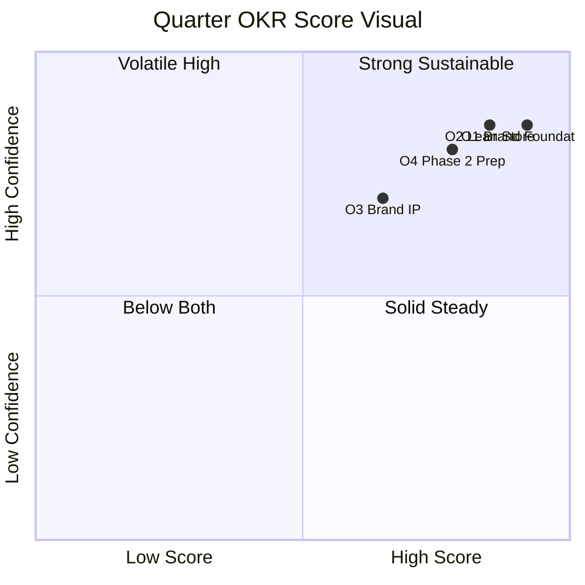
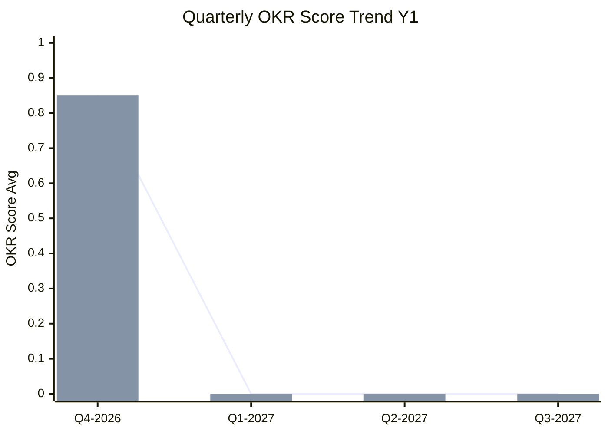
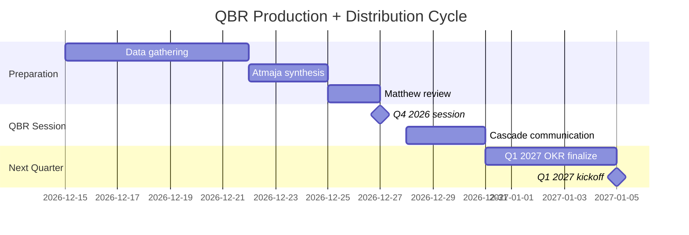

# Quarterly Business Review (QBR)

Comprehensive quarterly business review Gerai 1000 Pintu: OKR score + retrospective + forward planning + course-correct. Atmaja synthesize, Matthew approve, all team cascade.

## Triggers

Primary:
- "quarterly business review"
- "QBR"
- "review kuartal"

Secondary:
- "quarter retrospective"
- "Q review"

## Input Required

| Field | Type | Required | Default |
|---|---|---|---|
| quarter | enum | yes | (Q1/Q2/Q3/Q4 + year) |
| compare_baseline | string | no | (previous quarter) |

## Output Template

```markdown
# Quarterly Business Review: {Q}

**Quarter:** {Q + Year}
**Review date:** {Date}
**Owner:** Matthew + Atmaja synthesis
**Distribution:** Tim Pusat full + C-Level + Senior MA + Door Expert

## QBR Agenda Structure (3-hour session)

### Part 1: Recap (60 min)
- Achievements
- KPI vs target
- Notable customer story
- Win to celebrate

### Part 2: Retrospective (60 min)
- What worked
- What broke
- Surprise findings
- Hindsight insights

### Part 3: Forward (60 min)
- Next quarter OKR
- Strategic priority
- Resource shift
- Decision required

## Part 1: Quarter Recap

### Achievement Highlights
1. **{Achievement 1}** — KR linked + team credit
2. **{Achievement 2}**
3. **{Achievement 3}**
4. **{Achievement 4}**
5. **{Achievement 5}**

### Strategic Theme Score (OKR)

#### O1: {Objective name}
- KR 1.1: Target {X} | Actual {Y} | Score {0.0-1.0}
- KR 1.2: -
- KR 1.3: -
- KR 1.4: -
- **Overall O1 score:** {avg 0.0-1.0}

#### O2: {Objective name}
- KR per same format
- **Overall O2 score:**

#### O3: {Objective name}
- KR per same format
- **Overall O3 score:**

#### O4: {Objective name}
- KR per same format
- **Overall O4 score:**

### Function Performance

#### CMO Function
- Top achievement
- KPI summary
- Persona insight
- Channel performance

#### COO Function
- Top achievement
- KPI summary
- Sprint completion
- People + ops health

#### CCO Function
- Top achievement
- KPI summary
- Brand canon trend
- Content shipping

#### CFO Function
- Top achievement
- KPI summary
- Cash + margin status
- Investment ROI

### Customer Pulse This Quarter
- Lead generated: {N}
- Konsultasi count: {N}
- Revenue: Rp {N}M
- NPS: {N}
- Top testimonial: {brief}
- Top complaint resolved: {brief}

### Persona Quarterly Spotlight
| Persona | Q Performance | Insight |
|---|---|---|
| Retail | {summary} | {insight} |
| Mitra Dagang | {summary} | {insight} |
| Developer | {summary} | {insight} |
| Arsitek | {summary} | {insight} |
| Kontraktor | {summary} | {insight} |
| Aplikator | {summary} | {insight} |

## Part 2: Retrospective

### What Worked (Continue + Scale)

#### Process
- {Process that worked + why}
- {Process 2}

#### Decision
- {Decision that proved right + outcome}

#### Team behavior
- {Behavior that delivered + recognize}

### What Broke (Address + Improve)

#### Process gap
- {Gap + impact + improvement action + owner}

#### Decision mistake
- {Decision + outcome + learning}

#### Team challenge
- {Challenge + intervention + owner}

### Surprise Findings (Adapt)

#### Positive surprise
- {Pattern we didn't expect + leverage}

#### Negative surprise
- {Issue we didn't anticipate + adapt}

### Hindsight Insights

#### "If we had known"
- {What we know now we wished known then}
- {Implication for forward}

#### "Now we understand"
- {Pattern emerged through quarter}
- {Strategic implication}

## Part 3: Forward Planning

### Next Quarter OKR (set)

#### O1 next quarter: {Objective}
- KR 1.1: {SMART target}
- KR 1.2: {SMART target}
- KR 1.3: {SMART target}
- KR 1.4: {SMART target}

#### O2 next quarter: {Objective}
- KR per same

#### O3 + O4: {Same structure}

### Strategic Priority Top 3
1. **{Priority 1}** — owner + KPI
2. **{Priority 2}**
3. **{Priority 3}**

### Resource Shift

#### Investment Increase
- {Area + amount + rationale}

#### Investment Maintain
- {Area + rationale}

#### Investment Decrease
- {Area + amount + rationale}

### Hiring + People Plan

- Critical hire: {role + timeline}
- Backfill: {kalau ada}
- Training initiative: {topic + audience}

### Decision Required Matthew

1. {Decision 1 + context + recommended option}
2. {Decision 2}
3. {Decision 3}

## Risk Forecast

### Risk emerging next quarter
- {Risk 1 + mitigation pre-positioned}
- {Risk 2}
- {Risk 3}

### Risk monitoring continuous
- {Refer COO risk-register critical}

### Scenario activation status
- Current scenario: {Base / Best / Worst}
- Trigger watch: {leading indicator}

## Brand Canon Quarterly Audit

### Compliance trend
- Em-dash violation: {trend}
- Vocabulary drift: {trend}
- Tone alignment: {trend}
- Visual canon: {trend}

### Improvement action this quarter
- {Specific gap + action}

## Phase Roadmap Alignment

### Where we are
- Phase 1 Year 1 progress
- Vs vision-roadmap timeline

### Gate criteria progress
- Phase 1→2 gate: {% criteria met}
- Date target: {Q3 2027}
- Risk to gate: {if any}

## Communication Cascade

### Internal team
- All-hands meeting recap (1-hour session)
- WhatsApp group celebration
- Notion documentation archived

### External (kalau material)
- Vendor + partner update
- Press recap (kalau big achievement)
- Customer thank-you (kalau testimonial worthy)

## QBR Sample Visual

### Quarter Scorecard Snapshot
```
Q4 2026 Wave 1 Launch Quarter

Overall score: 0.85 🟢 (target 0.7+)

Objective 1 Brand Foundation:    🟢 0.92
Objective 2 Lean Store Validate: 🟢 0.85
Objective 3 Brand IP Content:    🟡 0.65
Objective 4 Phase 2 Prep:        🟢 0.78

Top win: Wave 1 launch ahead schedule + 5 organic press
Top concern: Content shipping 75% target (below 90% target)

Next quarter priority:
1. Aplikator persona content arc
2. Phase 2 site Samarinda secure
3. Door Expert #2 hiring pipeline active
```

## Brand Canon Compliance (QBR Output Itself)

- [ ] No em-dash di document
- [ ] "Gerai 1000 Pintu" lengkap kalau formal mention
- [ ] "tempat" not "rumah"
- [ ] Tone direct + warm (internal)
- [ ] Numbers + insight balanced
- [ ] Action-oriented
```

## Visual Output

QBR scorecard visual:



Quarterly progression chart:



QBR workflow:



## Knowledge Dependency

- company-kpi-dashboard
- swot-okr-integration
- All C-Level function dashboard
- vision-roadmap
- COO risk-register + weekly-ops-report
- CCO brand-health-dashboard
- Matthew priorities

## Mode

Default: EXECUTION (full QBR document)
Switch: DISCUSSION jika OKR score debate

## Tools Required

- file-search (all source data)
- artifacts (scorecard + trend + workflow)

## Validation Criteria

- 3-part agenda (Recap / Retrospective / Forward)
- OKR score per Objective + KR
- Function performance summary (CMO + COO + CCO + CFO)
- Customer pulse + persona spotlight
- What worked + broke + surprise + hindsight
- Next quarter OKR set
- Strategic priority top 3
- Resource shift
- Decision required Matthew
- Risk forecast + scenario
- Brand canon audit
- Phase roadmap alignment
- Communication cascade plan

## Sample I/O

**Input:** "QBR Q4 2026 Wave 1 launch quarter"

**Output summary:**
- Overall score: 0.85 🟢 (target 0.7+ exceeded)
- O1 Brand Foundation 0.92 (Wave 1 launch nailed, brand canon 95%, NPS 48)
- O2 Lean Store 0.85 (Door Expert 75% util, sprint velocity high)
- O3 Brand IP 0.65 🟡 (content 75% target, need acceleration Q1)
- O4 Phase 2 Prep 0.78 (site shortlist done, Door Expert #2 candidate pipeline)
- Top win: Wave 1 launch + 5 organic press + Bapak Anton testimonial viral
- Top concern: Aplikator persona engagement low (55%)
- Surprise positive: 4-Dunia framework cited by Architect publication
- Surprise negative: Brand canon em-dash 8 violation (writer X habit)
- Q1 2027 OKR set: Filosofi educate + Aplikator focus + Phase 2 site secure
- Priority: Content acceleration + Aplikator outreach + canon training refresh
- Decision needed Matthew: Approve Q1 marketing budget shift + Aplikator program
- Quarterly chart + scorecard quadrant + workflow embedded

## Handoff

- company-kpi-dashboard (input + ongoing)
- swot-okr-integration (next quarter set)
- executive-summary (Matthew brief)
- Stakeholder-briefing (team cascade)
- All C-Level (next quarter alignment)
