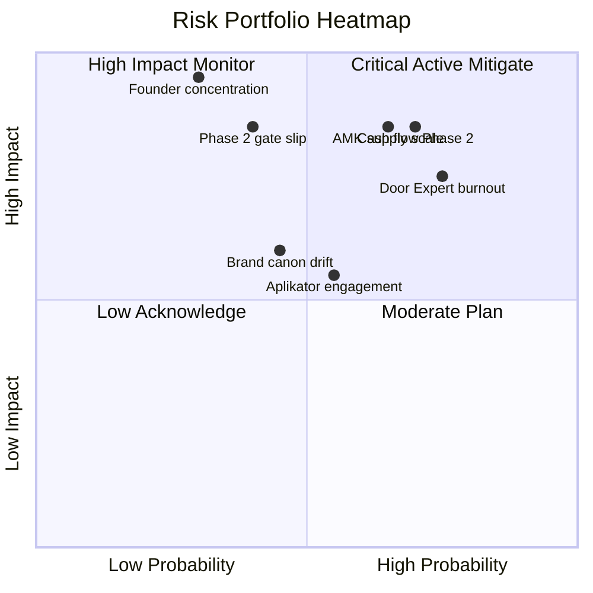
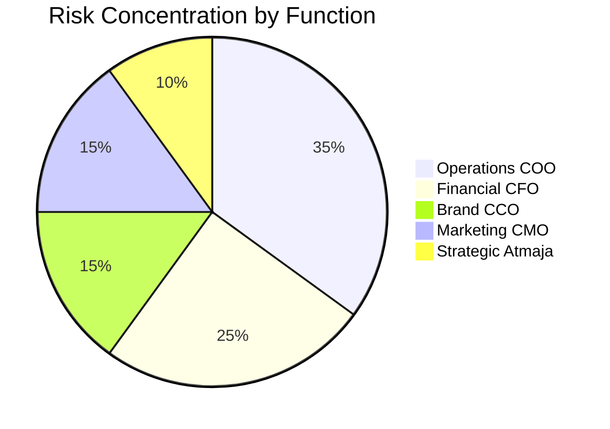
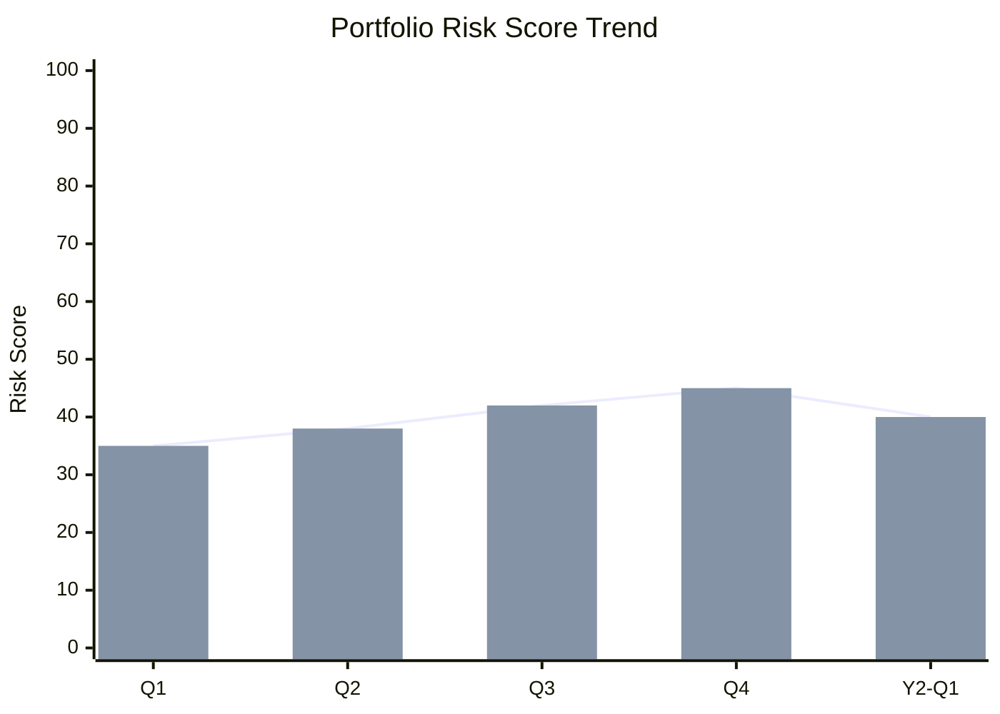

# Risk Portfolio View (Aggregated Cross-Function)

Aggregate risk Gerai 1000 Pintu across function: COO risk-register + CFO financial risk + CMO brand risk + CCO communication risk. Portfolio-level view untuk Matthew strategic decision.

## Triggers

Primary:
- "risk portfolio"
- "company risk view"
- "aggregated risk"

Secondary:
- "enterprise risk"
- "risk synthesis"

## Input Required

| Field | Type | Required | Default |
|---|---|---|---|
| period | enum | yes | (monthly / quarterly) |
| sensitivity | enum | no | (default critical+high) |

## Output Template

```markdown
# Risk Portfolio View: {PERIOD}

**Period:** {Date}
**Compare:** Previous period
**Owner synthesis:** Atmaja
**Owner action:** Matthew + C-Level distributed

## Executive Risk Summary

### Portfolio Risk Score: {N}/100
- 🟢 0-30: Low overall risk
- 🟡 31-60: Moderate risk
- 🔴 61-100: High risk demand intervention

**Trend:** {↑/→/↓ vs previous period}

**Top 3 critical risk:** {brief list}

## Risk Aggregation by Function

### Operational Risk (COO source: risk-register)
- Total risks: {N}
- Critical 🔴: {N}
- High 🟡: {N}
- Moderate 🟢: {N}
- Top risk: {description}

### Financial Risk (CFO source)
- Cash flow risk: {assessment}
- Margin risk: {assessment}
- Investment risk: {assessment}
- Currency / inflation risk: {assessment}
- Top risk: {description}

### Brand Risk (CCO source: brand-audit + crisis playbook)
- Brand canon violation: {assessment}
- Reputation incident: {assessment}
- Anchor reference drift: {assessment}
- Top risk: {description}

### Marketing Risk (CMO source)
- Pipeline thinning: {assessment}
- Channel concentration: {assessment}
- Customer acquisition cost: {assessment}
- Top risk: {description}

### Strategic Risk (Atmaja synthesis)
- Phase 1→2 gate slippage: {assessment}
- Vision execution drift: {assessment}
- Founder concentration (single Matthew): {assessment}
- Top risk: {description}

## Cross-Function Risk Pattern

### Pattern 1: Cascading risk
{Risk in one function triggering another}
- Example: AMK supply delay (COO) → marketing pipeline gap (CMO) → revenue shortfall (CFO)
- Mitigation: Coordinated response cross-function

### Pattern 2: Compounding risk
{Multiple smaller risks compounding}
- Example: Brand canon drift + customer complaint + press attention
- Mitigation: Brand canon enforcement strict + crisis playbook ready

### Pattern 3: Hidden risk
{Not visible in single function view}
- Example: Door Expert burnout (COO operational) + customer NPS slow decline (CMO trailing)
- Mitigation: Cross-function dashboard monitoring

## Portfolio Risk Concentration

### By function
| Function | Risk Score | Critical Count |
|---|---|---|
| Operations | {N} | {N} |
| Financial | {N} | {N} |
| Brand | {N} | {N} |
| Marketing | {N} | {N} |
| Strategic | {N} | {N} |

### By probability × impact
| Risk Score | Count | Sample |
|---|---|---|
| 16-20 Critical | {N} | {top risk name} |
| 12-15 High | {N} | {} |
| 6-11 Moderate | {N} | {} |
| <6 Low | {N} | {} |

### By time horizon
| Horizon | Risk Count | Note |
|---|---|---|
| Immediate (this month) | {N} | {} |
| Quarter (3-month) | {N} | {} |
| Strategic (year+) | {N} | {} |

## Top 5 Portfolio Risk (Critical + High)

### Risk 1: {Name}
- **Source function:** {COO/CFO/CMO/CCO/Atmaja}
- **Probability × Impact:** {score}
- **Description:** {brief}
- **Mitigation in progress:** {detail}
- **Owner:** {role}
- **Status:** {Active mitigated / Active pending / New}

### Risk 2: {Name}
{Same structure}

### Risk 3: {Name}
{Same structure}

### Risk 4: {Name}
{Same structure}

### Risk 5: {Name}
{Same structure}

## Risk Movement (Trend)

### New risk emerged this period
| Risk | Source | Score | Initial action |
|---|---|---|---|
| {} | {} | {} | {} |

### Risk resolved / closed
| Risk | Outcome | Learning |
|---|---|---|
| {} | {} | {} |

### Risk score changed
| Risk | Previous | Current | Reason |
|---|---|---|---|
| {} | {} | {} | {} |

## Scenario Impact (vs Best/Base/Worst from scenario-planning)

### Current trajectory implies
- Most likely scenario: {Best / Base / Worst}
- Risk indicators alignment: {summary}
- Course-correct trigger: {kalau ada}

## Pre-positioned Action

### Action active (mitigation in progress)
- {Action 1 + owner + ETA}
- {Action 2}

### Action pre-positioned (kalau scenario shifts)
- Worst case triggers: {action sequence}
- Black Swan triggers: {action sequence}

### Action recommended (new this period)
- {Recommendation + rationale + owner}

## Decision Required from Matthew

### Urgent (this week)
1. {Decision 1}
2. {Decision 2}

### Quarter (this quarter)
1. {Decision 1}
2. {Decision 2}

### Strategic (long-term)
1. {Decision 1}

## Risk Communication Cascade

### Internal team
- WhatsApp digest (top 3 critical)
- Notion documentation full
- Function-specific to relevant C-Level

### External (kalau perlu)
- Vendor: kalau vendor-related risk
- Customer: kalau service-affecting (premium hangat)
- Press: kalau public risk

## Brand Canon Discipline (Risk Communication)

- Premium hangat tone preserved
- No panic language
- Specific + actionable
- Accountable owner identified
- Forward-looking constructive

## Vs Scenario Planning Alignment

### Current state vs Base Case
- Variance: {assessment}
- Implication: {action}

### Drift toward Worst
- Probability assessment: 
- Capture preparation: {Yes/No}

## Risk Portfolio Insight + Strategic Implication

### Pattern recognized
{What Atmaja observed across function}

### Implication for Phase
- Phase 1 (current): {how affected}
- Phase 2 (forward): {prep needed}

### Implication for Brand
{Brand-related insight}

### Implication for Investment
{Where to invest more in mitigation}

## Sample Output

### Sample Risk Portfolio Q1 2027

**Portfolio Risk Score:** 42/100 🟡 Moderate
**Trend:** Slight increase (from 38) — Phase 2 prep activity adding risk

**Top 5 critical risks:**

1. **AMK Premium scale supply** (Score 12, COO)
   - Mitigation: Q2 contract negotiation active + backup vendor shortlist
   - Owner: COO + Matthew
   - Status: Active mitigation

2. **Cash flow gap Phase 2 capex** (Score 12, CFO)
   - Mitigation: Working capital line activated + conservative budget
   - Owner: CFO + Matthew
   - Status: Active mitigation

3. **Door Expert burnout sustained 100+ konsultasi** (Score 12, COO)
   - Mitigation: Door Expert #2 hiring Q2 + capacity tracking weekly
   - Owner: COO + HR
   - Status: Active hiring

4. **Brand canon drift writer X habit em-dash** (Score 9, CCO)
   - Mitigation: Refresher training + auto-validator strict
   - Owner: CCO
   - Status: Mitigation completed

5. **Aplikator persona engagement low** (Score 8, CMO)
   - Mitigation: Q1 dedicated content arc + outreach
   - Owner: CMO
   - Status: Action initiated

**Pattern:** Phase 2 prep generating new operational risk (AMK + Door Expert) + financial pressure (cash). Strategic risk concentrated Q2-Q3 2027 transition window.

**Pre-positioned:** Worst case scenario action menu ready (delay Phase 2 to Q1 2028 + working capital activation).

**Recommendation Matthew:** Q2 2027 review checkpoint for Phase 2 go/no-go.
```

## Visual Output

Risk portfolio heatmap:



Risk by function distribution:



Trend over quarter:



## Knowledge Dependency

- COO risk-register (primary input)
- COO contingency-plan
- CFO financial risk
- CCO brand-audit
- CMO channel + funnel risk
- scenario-planning (alignment)
- All C-Level skill

## Mode

Default: EXECUTION (synthesize portfolio)
Switch: NEED_CLARIFICATION jika function data incomplete

## Tools Required

- file-search (all risk source)
- artifacts (heatmap + pie + trend)

## Validation Criteria

- Portfolio risk score
- Risk aggregation by function 5-area
- Cross-function pattern (cascading + compounding + hidden)
- Risk concentration analysis
- Top 5 portfolio risk
- Risk movement (new / resolved / changed)
- Scenario impact alignment
- Pre-positioned action (active + standby + recommended)
- Decision required Matthew
- Risk communication cascade
- Brand canon discipline preserved
- Strategic implication insight

## Sample I/O

**Input:** "Risk portfolio view Q1 2027 Phase 2 prep period"

**Output summary:**
- Portfolio score: 42/100 🟡 Moderate (slight increase from 38)
- Top 5: AMK scale (12) + Cash flow Phase 2 (12) + Door Expert burnout (12) + Brand canon drift (9) + Aplikator engagement (8)
- Pattern: Phase 2 prep concentrating risk Q2-Q3 transition window
- Function distribution: COO 35% + CFO 25% + CCO 15% + CMO 15% + Atmaja 10%
- 3 critical 🔴 + 2 high 🟡
- Mitigation active: AMK contract Q2 + working capital line + Door Expert #2 hiring
- Pre-positioned: Worst case Phase 2 delay menu ready
- Recommendation: Q2 2027 Phase 2 go/no-go review checkpoint
- Heatmap quadrant + pie + trend embedded

## Handoff

- COO risk-register (primary source)
- COO contingency-plan (response)
- scenario-planning (alignment)
- executive-summary (Matthew brief)
- All C-Level (function-specific mitigation)
