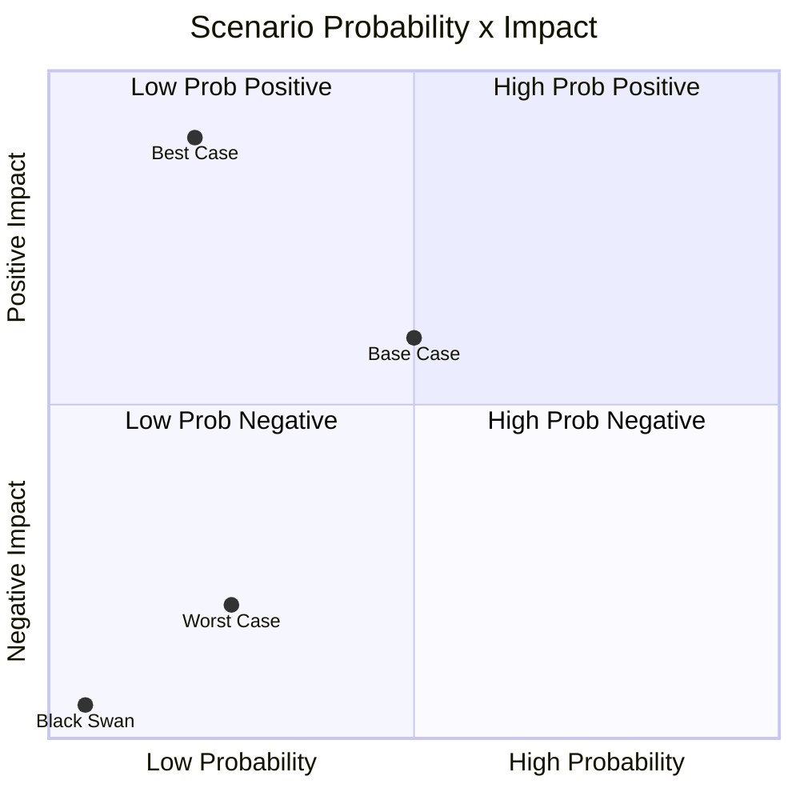
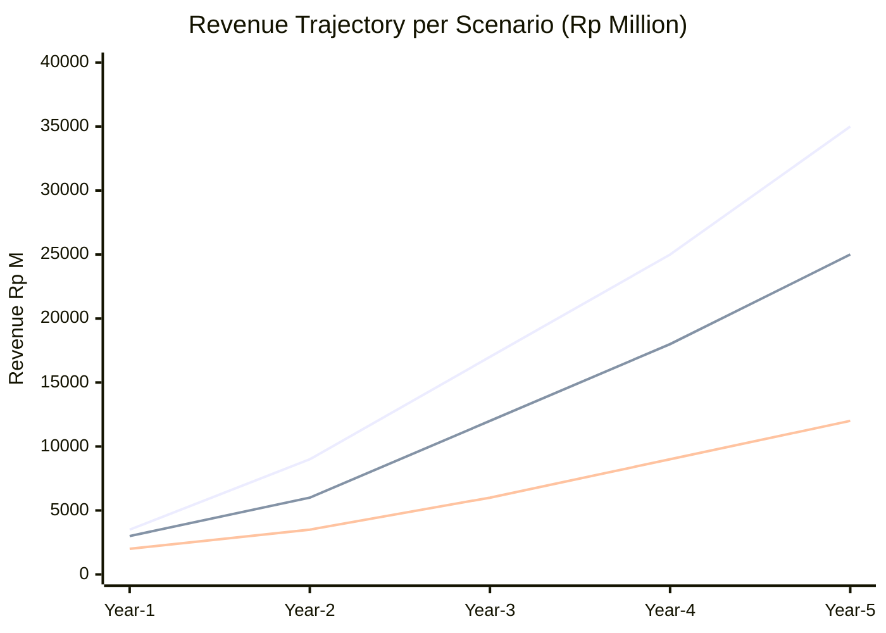
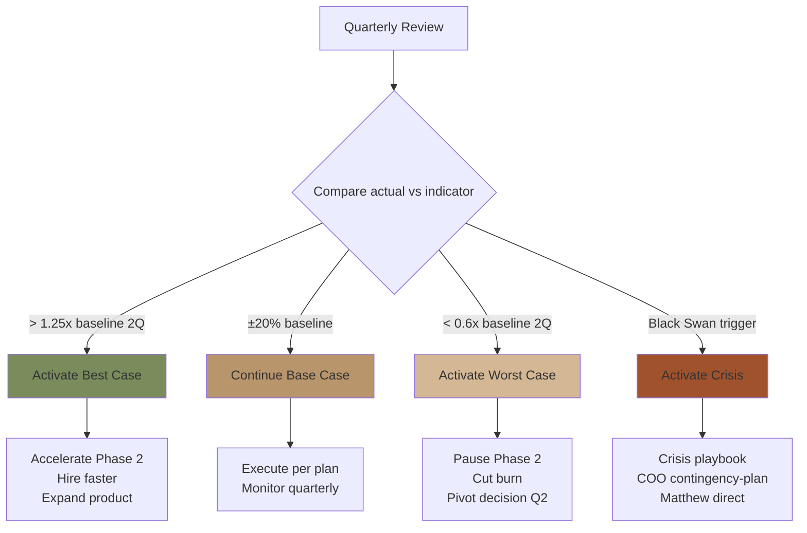

# Scenario Planning

Build scenario plan Gerai 1000 Pintu: best case + base case + worst case + black swan. Strategic flexibility, contingency, decision pre-positioning.

## Triggers

Primary:
- "scenario planning"
- "scenario analysis"
- "what-if planning"

Secondary:
- "future scenarios"
- "contingency strategic"

## Input Required

| Field | Type | Required | Default |
|---|---|---|---|
| time_horizon | enum | yes | (1-year / 3-year / 5-year) |
| scope | enum | no | (full / specific function) |
| trigger_event | string | no | (e.g., "Wave 1 launch outcome") |

## Output Template

```markdown
# Scenario Planning: {SCOPE} | {Time Horizon}

**Time horizon:** {Date range}
**Scenario count:** 4 (Best + Base + Worst + Black Swan)
**Update cadence:** Quarterly review

## Scenario Definition

### Scenario 1: Best Case (Bullish)
**Probability:** ~20% (rare upside)
**Theme:** Hyper-growth + premium positioning resonates massively

**Assumptions:**
- Wave 1 launch viral organic 5x baseline
- Premium curated trend Indonesia accelerates
- Architect+Designer channel highly receptive
- Door Expert model proves AI-augmentable rapidly
- Capital available (kalau perlu external)

**Trajectory:**
- Year 1: 150+ konsultasi/quarter (vs 80 baseline)
- Year 2: 5 cabang Kaltim+ (vs 3 baseline)
- Year 3: 8-10 cabang including Jawa (vs 4-5 baseline)
- Brand mention as BP Latest reference Indonesia equivalent
- Press: Wallpaper, Kinfolk, international coverage

**Key indicators (early signal):**
- Q1 2027 konsultasi >100 (>1.25x baseline)
- Press Tier 2 national pickup organic
- Customer NPS 60+ Q2 2027

**Strategic implication:**
- Accelerate Phase 2 timing (Q2 2027 vs Q3-Q4)
- Hire Door Expert #2 + #3 earlier
- Expand product line selected expansion brand earlier
- Consider external capital strategic OR remain bootstrap

### Scenario 2: Base Case (Realistic)
**Probability:** ~50% (most likely)
**Theme:** Steady execution per plan

**Assumptions:**
- Wave 1 launch meets target ±20%
- Phase 2 Kaltim scale per Q4 2027 timing
- Brand awareness Year 1: 30% Balikpapan
- Door Expert single sufficient sustained Year 1
- Cabang #1 break-even Q3 2027

**Trajectory:**
- Year 1: 80+ konsultasi/quarter per plan
- Year 2: 3 cabang per Phase 2 plan
- Year 3: 4-5 cabang Phase 3 first Jawa
- NPS 40+ sustained
- Brand canon 95%+ compliance

**Key indicators:**
- All OKR Year 1 score 0.7+ average
- Phase 1→2 gate criteria met Q3 2027
- Healthy cash position maintained

**Strategic implication:**
- Execute per roadmap
- Quarterly OKR adjustment
- Maintain BP Latest reference anchor discipline

### Scenario 3: Worst Case (Bearish)
**Probability:** ~25% (significant downside)
**Theme:** Slower-than-planned + financial stress

**Assumptions:**
- Wave 1 launch traffic 50% target
- Premium curated adoption slower in Balikpapan
- Architect channel slower warm-up
- Cash burn higher than projected
- Door Expert capacity underutilized

**Trajectory:**
- Year 1: 40-50 konsultasi/quarter
- Year 2: Phase 2 delayed (Q1-Q2 2028 vs Q4 2027)
- Year 3: 2-3 cabang only
- NPS 30-40
- Cash tight, requiring external capital OR cost cut

**Key indicators (early signal):**
- Q1 2027 konsultasi <40 (>0.5x baseline)
- CSAT positive but low volume
- Cash runway <6 month

**Strategic response:**
- Pause Phase 2 prep
- Reduce burn (defer hires, cut non-essential marketing)
- Double-down customer experience (premium hangat)
- Pivot OR persevere decision Q2 2027

### Scenario 4: Black Swan (Catastrophic)
**Probability:** ~5% (rare but possible)
**Theme:** Major external disruption

**Possible triggers:**
- Indonesia recession deep (>2 quarter contraction)
- AMK Premium vendor bankruptcy
- Showroom catastrophe (fire/flood major)
- Founder Matthew incapacitated
- Pandemic resurgence (movement restriction)

**Trajectory varies per trigger:**
- Major slowdown 50-70%
- Operations disrupted
- Brand reputation potential damage

**Strategic response per trigger:**
- Recession: Conservation mode, cash hoard, lean ops
- Vendor failure: Activate backup vendor immediately
- Showroom catastrophe: Refer COO contingency-plan
- Founder issue: Succession plan + Atmaja autopilot
- Movement restriction: Door Expert remote primary

**Insurance + contingency:**
- All-risk insurance Rp 500jt showroom
- Cyber insurance data
- Key person insurance Matthew
- Working capital line standby Rp 200jt
- Document-based succession Atmaja AI

## Scenario Triggers Matrix

### Leading Indicators per Scenario

| Indicator | Best | Base | Worst | Black Swan |
|---|---|---|---|---|
| Q1 2027 konsultasi count | >100 | 60-80 | <40 | Operations disrupted |
| Brand awareness 6-month | 25%+ | 15-20% | <10% | Damaged |
| NPS first 100 customer | 60+ | 40-50 | <30 | N/A |
| Cash runway | Comfortable | OK | Tight | Critical |
| Press pickup | Tier 1-2-3 organic | Tier 1 regional | Limited | Negative |
| Customer share of voice | Viral organic | Steady growth | Quiet | Crisis |

### Decision Triggers (when to activate scenario response)

#### Activate Best Case response when:
- 2+ consecutive quarter exceeding 1.25x baseline
- Press momentum sustained Tier 2-3
- Customer NPS sustained 60+

#### Activate Base Case (default) when:
- Steady within ±20% baseline
- No major deviation signal

#### Activate Worst Case response when:
- 2+ consecutive quarter below 0.6x baseline
- Cash runway <6 month + downward trend
- NPS sustained <30

#### Activate Black Swan response when:
- Trigger event occurs
- Refer COO contingency-plan playbook

## Pre-positioned Decisions

### What we decide NOW (before scenario)

#### Universal preparations
- Maintain brand canon discipline regardless
- Continue Door Expert quality investment
- Keep AMK Premium relationship strong
- Document SOP comprehensively
- Build cash reserve buffer

#### Best case preparation
- Door Expert #2 candidate pipeline (could hire fast)
- Phase 2 site negotiation parallel (could activate)
- Selected expansion brand vendor relationship (could expand product line)

#### Worst case preparation
- Cost cut menu (what to cut 20%/30%/50% scenarios)
- Working capital line activated standby
- Reduced marketing budget scenario
- Phase 2 delay communication ready

#### Black Swan preparation
- Insurance coverage current
- Crisis playbook tested annually
- Atmaja AI capable autonomous decision-making (within parameters)
- Communication template per scenario

## Scenario Review Cadence

### Quarterly Review
- Compare actual vs scenario indicator
- Identify scenario drift signal
- Adjust expectation
- Pre-position update

### Annual Strategic Off-site
- Full scenario re-evaluation
- New scenario emerged (kalau ada)
- Probability re-weight
- Update preparations

## Strategic Flexibility Plan

### Flexibility Reserve
- Cash buffer: 3-month operating expense minimum
- People flexibility: Cross-trained staff
- Process flexibility: SOP adaptable
- Marketing flex: Budget shiftable per scenario

### Optionality Investments
- Selected expansion brand: validated but not committed (option)
- Mitra Dagang: relationship cultivated (option to formalize)
- Phase 2 site: shortlisted (option to lease)
- Door Expert #2: candidate pipelined (option to hire)
- Technology: AI Department evolving (option to deploy more)

## Pre-mortem Per Scenario

### "Imagine Year 1 ended as Worst Case. What signal did we miss?"

**Likely signals missed:**
- Lower-than-expected walk-in early but rationalized as "still launching"
- Customer feedback positive but volume insufficient
- Cash burn higher than projected but believed "temporary"
- Marketing channel underperforming but believed "needs more time"

**Pre-position to catch:**
- Weekly walk-in count tracking + threshold alert
- Cash runway monthly review (not quarterly)
- Marketing channel performance dashboard
- Customer feedback aggregate weekly (not monthly)

## Communication Framework

### Internal scenario language
- Don't share "worst case" anxiety publicly
- Internal awareness scenario triggers
- Action-oriented language ("If X happens, we do Y")
- Confidence preserved

### External communication
- Customer: scenario-agnostic premium hangat
- Vendor: long-term relationship signal
- Press: optimistic but grounded
- Investor (kalau ada): scenario transparency

## Decision Authority Matrix

| Decision Trigger | Authority | Speed |
|---|---|---|
| Within Base Case range | Functional C-Level | Standard |
| Best Case activation | Atmaja + Matthew | 1-2 week |
| Worst Case mitigation | Matthew direct | 1 week |
| Black Swan response | Matthew immediate | <24 hour |
```

## Visual Output

Scenario probability + impact quadrant:



Scenario trajectory:



Scenario response decision flow:



## Knowledge Dependency

- vision-roadmap (base case scenario)
- swot-okr-integration (threat input)
- COO risk-register (worst + black swan input)
- COO contingency-plan (crisis playbook)
- CFO financial projection
- Matthew strategic priorities

## Mode

Default: EXECUTION (build scenarios)
Switch: DISCUSSION jika probability assessment debate

## Tools Required

- file-search
- artifacts (quadrant + trajectory + decision flow)

## Validation Criteria

- 4 scenario explicit (Best + Base + Worst + Black Swan)
- Probability assigned + sum 100%
- Assumption per scenario
- Trajectory per scenario quantified
- Leading indicator early signal
- Pre-positioned decision per scenario
- Trigger matrix for activation
- Strategic flexibility reserve
- Pre-mortem exercise
- Decision authority matrix
- Quadrant + trajectory + flow visual

## Sample I/O

**Input:** "Scenario planning 5-year Gerai 1000 Pintu Phase 1-3"

**Output summary:**
- 4 scenarios:
  - Best (20%): Hyper-growth, 5x baseline, accelerate Phase 2 Q2 2027
  - Base (50%): Steady execution, per roadmap
  - Worst (25%): 50% target, Phase 2 delay Q1-Q2 2028
  - Black Swan (5%): External catastrophe (recession/vendor/showroom/founder/pandemic)
- Leading indicators Q1 2027 konsultasi (best >100 / base 60-80 / worst <40)
- Decision triggers explicit per scenario
- Pre-positioned: Best case (Door Expert #2 pipeline + Phase 2 site shortlist), Worst case (cost cut menu + working capital), Black Swan (insurance + crisis playbook + Atmaja autopilot)
- Strategic flexibility: 3-month cash buffer + cross-trained + SOP adaptable
- Optionality investment: Selected expansion brand validated + Mitra cultivated + Phase 2 site option + Door Expert #2 pipeline
- Decision authority: C-Level (base), Atmaja+Matthew (best), Matthew direct (worst+black swan)
- Trajectory: Best Rp 35M Year 5, Base Rp 25M, Worst Rp 12M
- Quadrant + trajectory + flow embedded

## Handoff

- vision-roadmap (base scenario alignment)
- decision-framework (scenario decision)
- COO contingency-plan (Black Swan + Worst response)
- CFO scenario financial model
- Matthew (executive scenario awareness)
