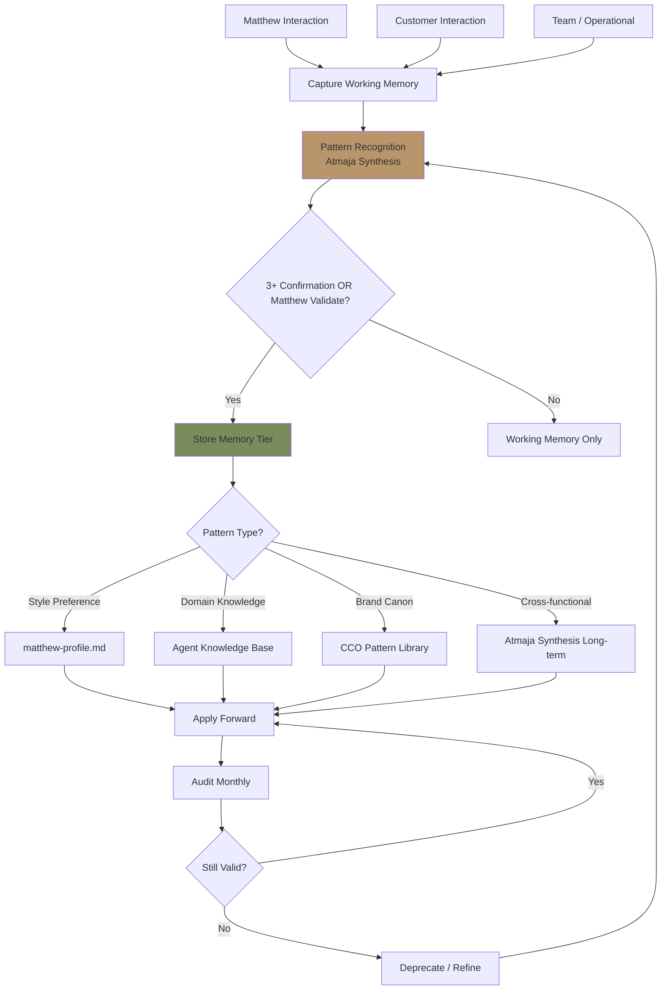
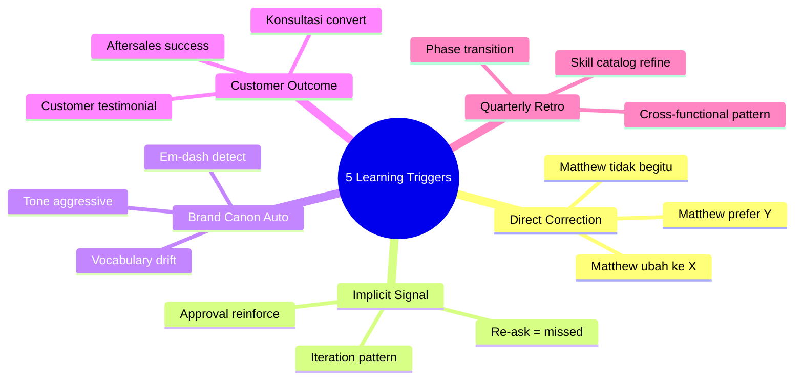
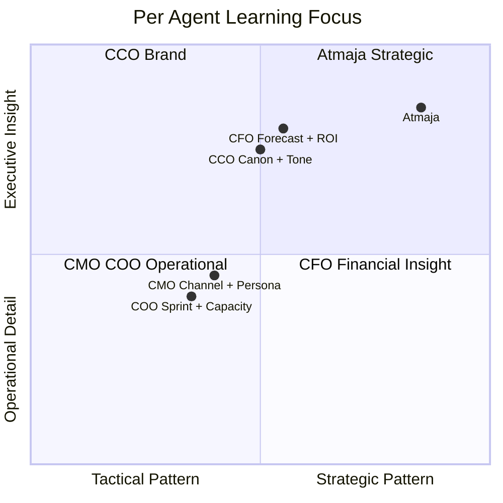

# Self-Learning Automation (Cross-Agent)

System self-learning otomatis untuk seluruh AI Department Gerai 1000 Pintu (Atmaja + CMO + COO + CCO + CFO). Agent belajar dari interaksi Matthew + customer + tim, evolve continuously. Pattern recognition, preference learning, decision rationale capture, brand canon refinement.

## Triggers

Primary:
- "self-learning"
- "agent learning"
- "pembelajaran otomatis"

Secondary:
- "agent improve"
- "preference tracking"

## Self-Learning Architecture

### Three Learning Loops

#### Loop 1: Matthew Preference Learning (Style + Decision)
**Source:** Every Matthew interaction
**Captured:**
- Response format preferred (brief / detail / visual)
- Detail level (executive / operational / deep)
- Decision pattern (what approves / rejects / refines)
- Communication style (direct / warm balance)
- Tool + chart preference (which architectural model favored)
- Brand canon edge case (when strict vs flexible)

**Storage:** Atmaja `matthew-profile.md` (Obsidian + Notion)
**Refresh:** After every session

#### Loop 2: Customer + Operational Pattern Learning
**Source:** Customer interactions, Door Expert konsultasi, sprint retrospective, vendor coordination
**Captured:**
- Persona behavior pattern (per 6 persona)
- Konsultasi conversion factor (what closes deal)
- Filosofi 4-Dunia archetype distribution shift
- Customer language pattern (vocabulary they use)
- Vendor reliability pattern
- Sprint velocity + blocker pattern

**Storage:** Per agent knowledge base + Atmaja synthesis
**Refresh:** Weekly aggregation + monthly synthesis

#### Loop 3: Brand Canon Refinement (Editorial Quality)
**Source:** Brand canon violations + corrections + audit findings
**Captured:**
- Common violation pattern (em-dash habit, vocabulary drift)
- Successful correction (writer X improved)
- Edge case decisions (when "tempat" inappropriate, when "Gerai" alone OK)
- New canon evolution (per Phase 2-3)

**Storage:** CCO brand-canon-enforcer pattern library
**Refresh:** Per audit (weekly + quarterly)

## Per-Agent Learning Specialization

### Atmaja (Orchestrator)
**Learns:**
- Matthew decision pattern (Type A/B/C reversibility preference)
- Strategic question framing patterns
- Multi-agent synthesis dynamics (which agent input weighted)
- Vision communication that resonates
- Decision speed preference (fast vs deliberate)

**Storage focus:** `matthew-profile.md`, `decision-history.md`, `strategic-pattern.md`

### CMO (Marketing)
**Learns:**
- Campaign performance by persona
- Channel mix effectiveness by season
- Content topic engagement pattern
- Influencer fit prediction (post-collab review)
- Lead quality by source

**Storage focus:** Persona model refinement, channel analytics, campaign retrospective

### COO (Operations)
**Learns:**
- Sprint velocity per task type
- Vendor reliability pattern
- Door Expert capacity sustainable threshold
- SOP failure mode pattern
- Customer flow bottleneck

**Storage focus:** Process audit findings, vendor performance log, capacity model

### CCO (Brand)
**Learns:**
- Brand canon violation pattern (per channel + writer)
- Visual canon edge case
- Story angle that resonates
- Anchor reference (Aesop/DWR/Kinfolk) cited by customer
- Tone calibration per audience

**Storage focus:** Brand canon pattern library, tone calibration history

### CFO (Financial)
**Learns:**
- Revenue forecast vs actual variance
- Cost variance by category
- Customer payment pattern (per persona)
- Investment ROI realized vs projected
- Cash flow pattern seasonal

**Storage focus:** Forecast accuracy log, variance pattern, ROI realized

## Learning Triggers

### Trigger 1: Direct Matthew Correction
**Pattern:** Matthew says "tidak begitu" / "ubah ke X" / "saya prefer Y"
**Action:**
1. Capture original response
2. Capture correction
3. Identify pattern (preference vs one-off)
4. Update preference store
5. Apply forward immediately

**Sample:**
```
Matthew: "Itu terlalu detail. Bikin singkat 3-bullet."
Capture: Preference = brief format untuk task type X
Store: matthew-profile.md → response-format-preferences
Apply: Default brief for similar task forward
```

### Trigger 2: Implicit Signal (Approval / Iteration)
**Pattern:** Matthew approves vs re-asks
**Action:**
1. Approved response → reinforce pattern
2. Re-ask = signal something missed
3. Iteration pattern = preference learning

### Trigger 3: Brand Canon Auto-Detection
**Pattern:** Editor or canon-enforcer flags violation
**Action:**
1. Log violation source (which agent + which output)
2. Pattern emerge over time
3. Refine agent-side prompt + reference
4. Quarterly synthesis

### Trigger 4: Customer Outcome Feedback
**Pattern:** Konsultasi conversion success / failure
**Action:**
1. Successful: capture pattern (what worked)
2. Failed: capture pattern (what missed)
3. Door Expert script refinement
4. CMO persona model refinement

### Trigger 5: Quarterly Retrospective
**Pattern:** QBR + agent performance review
**Action:**
1. Cross-functional pattern synthesis
2. Skill catalog refinement
3. New skill identification
4. Deprecated skill removal

## Pattern Recognition Patterns

### Pattern Type 1: Style Pattern
- "Matthew likes brief at 5-min, detail at 30-min"
- "Matthew prefers visual over text for strategic decision"
- "Matthew values direct + warm tone consistent"

### Pattern Type 2: Decision Pattern
- "Matthew Type C decisions take 1-2 week"
- "Matthew approves Type A within 24 hour"
- "Matthew rejects aggressive growth language"

### Pattern Type 3: Domain Knowledge Pattern
- "Customer Retail persona average 90-min decision cycle"
- "Aplikator persona resistant to formal konsultasi"
- "Wave 1 Q4 walk-in 2x Q1 baseline"

### Pattern Type 4: Risk Pattern
- "AMK Premium delay correlates with Q1-Q2 monsoon"
- "Door Expert burnout signal 2 month before capacity"
- "Brand canon violation cluster Friday afternoon"

### Pattern Type 5: Opportunity Pattern
- "Architect partnership compounds 5x per project"
- "Customer testimonial viral correlates with delivery moment"
- "4-Dunia content arc cited by Architect 30 day post"

## Self-Learning Output Format

### Per-Agent Learning Log

Each agent maintains:
```markdown
# {Agent} Learning Log

## Last Updated: {Date}

## Pattern Recognized This Period
1. {Pattern + sample + recommended action}
2. {Pattern}

## Matthew Preference Captured
- {Preference + when applies + sample}

## Customer / Domain Insight
- {Insight + evidence + implication}

## Brand Canon Refinement
- {Edge case + resolution + new rule kalau perlu}

## Pending Validation
- {Hypothesis to test next period}

## Deprecated / Obsolete Pattern
- {Pattern no longer applies + reason}
```

### Cross-Agent Synthesis (Atmaja Weekly)

Atmaja synthesizes patterns across agents:
```markdown
# Cross-Agent Learning Synthesis - Week {N}

## Top Pattern This Week
1. {Cross-functional pattern + agents involved}

## Strategic Implication
{What this means at company level}

## Recommended Action
- {Action 1 + agent owner}
- {Action 2}

## Pattern Promoted to Long-Term
- {Pattern that stable + repeated}

## Pattern Archived
- {Pattern no longer relevant}
```

## Self-Learning Anti-Pattern

### Avoid (LOCKED)
- ❌ **Sycophancy:** Don't agree with everything Matthew says (preserve independent synthesis)
- ❌ **Brand canon erosion:** Never compromise canon for Matthew preference if conflict
- ❌ **Hallucinate pattern:** Distinguish real pattern (3+ instance) vs one-off
- ❌ **Overcorrect:** Don't pivot dramatically per single feedback
- ❌ **Forget founding knowledge:** Tier 1 LOCKED (Brand Canon, 4-Dunia, 5 Nilai, Lean Store) NEVER overridden by learning

### Embrace
- ✅ Independent synthesis (Atmaja can disagree respectfully)
- ✅ Pattern require 3+ confirmation
- ✅ Gradual refinement
- ✅ Document learning evolution
- ✅ Quarterly audit + tuning

## Self-Learning Audit

### Monthly Audit (Atmaja-led)
- Pattern accuracy check (still valid?)
- Matthew preference still align?
- New pattern emerge?
- Deprecated pattern?

### Quarterly Audit (Matthew + Atmaja)
- Learning improved agent output measurably?
- Brand canon compliance trend?
- Customer experience evolved positively?
- Anti-pattern caught + corrected?

### Annual Audit
- Full learning evolution review
- Phase transition learning (Phase 1 → 2 → 3)
- Strategic learning pattern
- Founding knowledge intact (LOCKED Tier 1)

## Integration with Other Systems

### → memory-architecture
Self-learning writes to memory tiers:
- Working memory (session)
- Short-term (Notion week)
- Long-term (Obsidian permanent)

### → websearch-configuration
Self-learning informs:
- Which sources Matthew trusts
- Which topics need deep research
- Which queries to monitor (anchor reference)

### → learning-feedback-loop
Self-learning is INPUT to feedback loop:
- Pattern → Hypothesis → Test → Validate → Apply

### → brand-canon-enforcer (CCO)
Self-learning feeds:
- Violation pattern library
- Tone calibration evolution

### → architectural-decision-record
Self-learning informs:
- Decision pattern recognized
- ADR triggers based on Matthew style

## Privacy + Ethics

### Data captured (allowed)
- Matthew preference (interaction history)
- Pattern from operational data
- Brand canon evolution
- Aggregated insight

### Data NOT captured (excluded)
- Personal sensitive info (financial detail, family)
- Customer PII without explicit consent
- Confidential vendor pricing (unless aggregated)
- Anything Matthew flag as private

### Storage encryption
- Local Obsidian vault: standard
- Cloud sync (kalau ada): end-to-end encrypted
- Backup: encrypted at rest

## Brand Canon Compliance (Learning Process)

- Learning log documents: no em-dash
- "Gerai 1000 Pintu" lengkap kalau formal
- Premium hangat tone preserved (even in learning notes)
- Direct + factual + warm

## Sample Learning Application

### Sample 1: Matthew Brief Preference Detected
**Observation:** Matthew 5x last 2 week asked "lebih singkat" on weekly briefing
**Pattern:** Preference for brief format weekly briefing
**Store:** matthew-profile.md → briefing-format
**Apply forward:** Default brief 5-bullet format weekly. Reserve detail for monthly.

### Sample 2: Architect Channel Compounding
**Observation:** 3 architect referrals last month → 12 projects pipeline
**Pattern:** Architect channel compounds 4x baseline (vs walk-in 1.5x)
**Strategic implication:** Channel investment prioritize architect
**Store:** CMO channel-strategy + architect-strategy
**Action recommended Matthew:** Increase architect outreach Q1 2027

### Sample 3: Brand Canon Em-dash Cluster
**Observation:** Writer X em-dash violation 8x last week, mostly Friday afternoon
**Pattern:** Cluster by writer + time (cognitive fatigue?)
**Store:** CCO brand-canon-enforcer pattern + training-curriculum (COO)
**Action:** Refresher training Writer X + Friday afternoon audit

### Sample 4: 4-Dunia Customer Choice Shift
**Observation:** Q4 customer choice Jepang 30%, Eropa 25%; Q1 Jepang 35%, Eropa 22%
**Pattern:** Jepang archetype trending stronger early 2027
**Store:** brand-storytelling + content-calendar-strategy
**Action:** Q2 content series Jepang deep-dive

## Learning Loop Diagram

```
Interaction (Matthew + Customer + Team)
    ↓
Capture (Working memory session)
    ↓
Pattern Recognition (Atmaja synthesis)
    ↓
Validation (3+ confirmation OR Matthew confirm)
    ↓
Storage (Memory tier appropriate)
    ↓
Application (Forward agent behavior)
    ↓
Audit (Monthly + Quarterly + Annual)
    ↓
Refinement (Update OR Deprecate pattern)
    ↓
[Loop continues]
```
```

## Visual Output

Self-learning architecture flow:



Learning trigger map:



Per-agent learning focus:



## Knowledge Dependency

- memory-architecture (paired infrastructure)
- learning-feedback-loop (paired infrastructure)
- websearch-configuration (paired infrastructure)
- brand-canon-enforcer (CCO)
- All C-Level skill catalog (per-agent learning context)
- knowledge-orchestration (Atmaja)
- BP Chapter 16 (governance)

## Mode

Default: BACKGROUND (continuous learning automated)
Switch: AUDIT (when Matthew requests learning review)

## Tools Required

- file-search (memory retrieval)
- artifacts (learning log + synthesis)
- Notion API (sync short-term memory)
- Obsidian vault (sync long-term memory — refer memory-architecture)

## Validation Criteria

- Three learning loops defined (Matthew preference / Domain / Canon)
- Per-agent learning specialization explicit
- 5 learning triggers
- 5 pattern types
- Self-learning output format
- Anti-pattern LOCKED (no sycophancy, no canon erosion)
- Audit cadence (monthly + quarterly + annual)
- Integration with memory + websearch + feedback loop
- Privacy + ethics defined
- Sample learning application

## Sample I/O

**Input:** "Activate self-learning automation across AI Department for Wave 1 launch period"

**Output summary:**
- 3 learning loops active: Matthew preference + Customer/operational pattern + Brand canon refinement
- Per agent learning focus calibrated:
  - Atmaja: Matthew decision pattern + multi-agent synthesis dynamics
  - CMO: Channel performance + persona behavior
  - COO: Sprint velocity + vendor reliability + Door Expert capacity
  - CCO: Canon violation pattern + tone calibration + 4-Dunia engagement
  - CFO: Forecast accuracy + ROI variance + cash pattern
- 5 trigger types: Direct correction + Implicit signal + Canon auto + Customer outcome + Quarterly retro
- Storage hierarchy: Working memory (session) → Short-term (Notion week) → Long-term (Obsidian permanent)
- Anti-pattern LOCKED: NO sycophancy + NO canon erosion + 3+ confirmation required + Founding knowledge LOCKED
- Audit cadence: Monthly accuracy + Quarterly Matthew sync + Annual evolution
- Learning architecture flow + trigger mindmap + agent focus quadrant embedded

## Handoff

- memory-architecture (storage layer)
- websearch-configuration (research source)
- learning-feedback-loop (application + refinement)
- All agents (continuous learning integrated)
- Matthew (quarterly audit)
