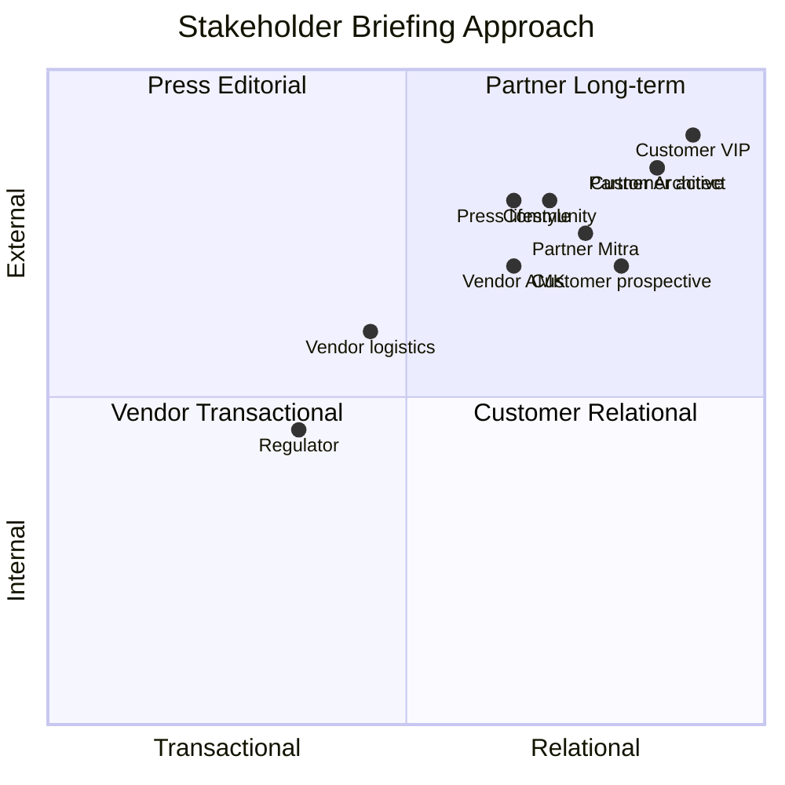
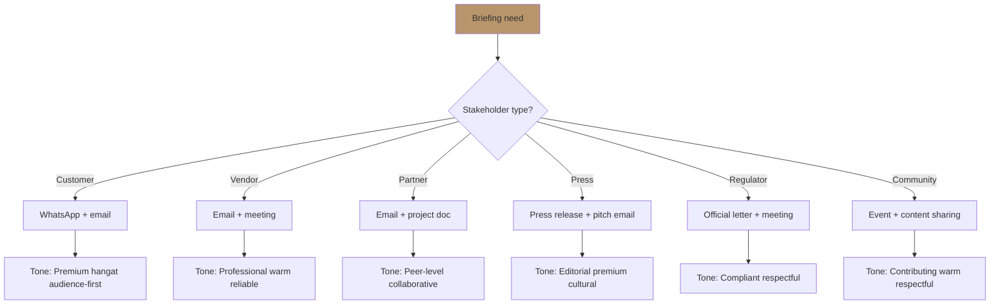

# Stakeholder Briefing

Brief stakeholder Gerai 1000 Pintu: customer, vendor, partner, press, regulator, community. Audience-adapted tone, brand canon strict, premium hangat.

## Triggers

Primary:
- "stakeholder briefing"
- "brief stakeholder"
- "communicate to"

Secondary:
- "external communication"
- "stakeholder update"

## Input Required

| Field | Type | Required | Default |
|---|---|---|---|
| stakeholder_type | enum | yes | (customer / vendor / partner / press / regulator / community) |
| message_purpose | string | yes | - |
| sensitivity | enum | no | (routine / important / confidential) |

## Output Template

```markdown
# Stakeholder Briefing: {STAKEHOLDER TYPE}

**Audience:** {Specific}
**Purpose:** {Why briefing}
**Sensitivity:** {Routine / Important / Confidential}
**Tone:** Premium hangat (brand canon strict)

## Stakeholder Profile

### Who they are
{Background + role + relationship Gerai 1000 Pintu}

### What they care about
- Primary interest 1
- Primary interest 2
- Primary interest 3

### What they fear / concern
- Concern 1
- Concern 2

### Existing relationship
- Trust level: {High / Building / Neutral / Tense}
- History: {Brief summary}
- Communication frequency: {Cadence}

## Message Framework

### Core Message (30-sec)
{1-2 sentence direct message they should remember}

### Supporting Points
1. {Point 1 — addresses their primary interest}
2. {Point 2 — addresses concern}
3. {Point 3 — value proposition specific}

### Action Required (kalau ada)
- From them: {what we ask}
- From us: {what we commit}
- Timeline: {when}

## Stakeholder Type-Specific Briefing

### Customer Stakeholder

**Sub-types:**
- Prospective customer (lead)
- Active customer (booking)
- Past customer (aftersales)
- VIP customer (retention)

**Tone:** Premium hangat + audience-first
**Format:** WhatsApp / email / personal visit
**Length:** Concise (50-200 word)

**Key elements:**
- "Anda" focus
- Personal touch
- Specific (not generic)
- Brand canon strict
- BP Latest reference refined

**Sample WhatsApp brief (prospective customer):**
```
Selamat siang, Bapak Anton.

Terima kasih atas inquiry Anda kemarin tentang pintu untuk tempat baru di 
Cluster Borneo.

Door Expert kami sediakan waktu konsultasi 60 menit via Zoom untuk berbicara 
tentang tempat impian Anda. Slot tersedia:
- Rabu, 5 November, 10:00 WIB
- Kamis, 6 November, 14:00 WIB

Konsultasi gratis tanpa komitmen. Konfirmasi via WhatsApp atau 
gerai.mahewwork.com/konsultasi.

Salam hangat,
Andi, MA Gerai 1000 Pintu
```

### Vendor Stakeholder

**Sub-types:**
- AMK Premium (anchor vendor)
- Logistics partner
- Design/print vendor
- Photography/video freelance

**Tone:** Professional + warm + reliable
**Format:** Email / WhatsApp / call
**Length:** Direct (100-300 word)

**Key elements:**
- Long-term relationship signal
- Specific request / update
- Clear expectation
- Mutual benefit
- Premium hangat (vendor still feel partner not commodity)

**Sample email brief (AMK Premium quarterly):**
```
Subject: Update Gerai 1000 Pintu Q1 2027 + Phase 2 Preparation

Bapak/Ibu {Name},

Terima kasih atas partnership berkelanjutan selama Q4 2026 Wave 1 launch. 
AMK Premium adalah anchor kurasi kami, dan kami menghargai komitmen quality 
Anda.

Update Q1 2027:
- Konsultasi pipeline: 40+ project active
- AMK Premium share di pipeline: 70%+
- Aftersales feedback: 9/10 sustained

Permintaan ke depan:
- PO Q2 2027: estimasi 200 unit (preview document attached)
- Phase 2 prep: discussion contract scale untuk Cabang #2-3 (Q3 2027 onwards)
- Lead time confirmation Q2-Q3 untuk planning

Sediakan waktu untuk meeting tatap muka atau Zoom minggu depan?

Salam hangat,
Matthew
Founder Gerai 1000 Pintu
```

### Partner Stakeholder

**Sub-types:**
- Architect firm
- Designer freelance
- Mitra Dagang network
- Contractor

**Tone:** Peer-level + collaborative + premium
**Format:** Email / meeting / project documentation
**Length:** Medium-long (200-500 word)

**Key elements:**
- Mutual respect (peer-level)
- Filosofi Dunia Pintu framework (intellectual angle)
- Project-specific
- Long-term partnership signal
- Documentation rigor

**Sample partner brief (Architect firm):**
```
Subject: Project Cluster Borneo — Kurasi Pintu Bersama Filosofi Dunia Pintu (4-negara cultural context)

Bapak/Ibu {Architect Name},

Terima kasih atas kepercayaan untuk berkolaborasi di Project Cluster Borneo. 
Filosofi Dunia Pintu (4-negara cultural context) kami dapat memberi framework yang berguna untuk presentasi 
ke client Anda.

Per discovery session kemarin:
- 8 unit hunian membutuhkan kurasi pintu
- Profile client: keluarga premium mid-upper
- Vision: modern Indonesian dengan refleksi karakter unik per unit

Kurasi yang kami sarankan:
- Unit 1-3: Archetype Jepang (jiwa minimalist)
- Unit 4-5: Archetype Eropa (seni craftsmanship)
- Unit 6-7: Archetype Amerika (statement scale)
- Unit 8: Archetype China (legacy untuk owner Chinese-Indonesian)

Door Expert kami sediakan waktu untuk co-presentation ke client kalau 
Anda menghendaki. Material sample + photography kami siapkan untuk 
support presentasi Anda.

Kapan kita lanjut discussion?

Salam hangat,
Matthew
Founder Gerai 1000 Pintu
```

### Press Stakeholder

**Sub-types:**
- Local regional press
- National lifestyle press
- Industry trade press
- International press (Phase 3+)

**Tone:** Premium editorial + factual + cultural
**Format:** Press release + pitch email + interview
**Length:** Per outlet standard

**Key elements:**
- Anchor reference BP Latest reference
- Cultural angle
- Quote-ready Matthew
- Photography kit ready
- Brand canon strict

**Refer to press-release-writer (CCO) for detailed template**

**Sample press pitch email:**
```
Subject: Story Pitch — Gerai 1000 Pintu: Indonesia's First Premium Curated 
Pintu Retail with BP Latest reference Reference

Dear {Editor Name},

Hope this email finds you well. Saya menulis untuk memperkenalkan story 
yang mungkin menarik untuk {Outlet Name}.

Gerai 1000 Pintu launched November 2026 di Balikpapan sebagai tempat 
premium pintu di Indonesia pertama di Indonesia yang anchor pada BP Latest reference dan 
BP Latest reference untuk retail experience.

Beberapa angle yang mungkin resonate:
- Filosofi Dunia Pintu (4-negara cultural context): framework cultural yang kami susun
- Lean Store + Door Expert remote: operational innovation
- Founder Matthew: technical+creative dual capability
- Indonesia premium tetapi inklusif emergence

Press kit lengkap tersedia. Saya senang menyediakan 30 menit interview 
dengan Matthew kalau {Outlet Name} tertarik mengembangkan story.

Salam hangat,
Andi Marketing Lead
Gerai 1000 Pintu
```

### Regulator Stakeholder

**Sub-types:**
- Tax authority
- Local government (izin usaha)
- Industry association (HDII, IAI)

**Tone:** Professional + compliant + respectful
**Format:** Official letter + meeting + documentation
**Length:** Formal per requirement

**Key elements:**
- Compliance demonstrated
- Documentation complete
- Respectful tone
- Premium hangat where appropriate (not overly formal cold)

### Community Stakeholder

**Sub-types:**
- Local neighborhood (Balikpapan area)
- Indonesian design community
- Cultural community (Indonesia design heritage)

**Tone:** Respectful + contributing + warm
**Format:** Event participation + content sharing
**Length:** Per occasion

**Key elements:**
- Cultural sensitivity
- Contributing value (not extracting)
- Long-term participation
- Indonesia first

## Briefing Workflow

### Step 1: Audience analysis
- Stakeholder profile retrieve
- Recent context (history)
- Current state

### Step 2: Message framework
- Core message
- Supporting points
- Action required

### Step 3: Tone adaptation
- Stakeholder-specific tone
- Channel-specific format
- Length appropriate

### Step 4: Brand canon validate
- Editorial style guide check
- Premium hangat tone confirm
- Anchor reference appropriate

### Step 5: Approval
- C-Level approve (CMO/CCO/COO function)
- Matthew approve (kalau material)
- Legal review (kalau regulator)

### Step 6: Send + Follow-up
- Send via appropriate channel
- Track response
- Follow-up cadence

### Step 7: Document outcome
- Conversation log
- Action item update
- Learning extract

## Anti-Pattern

### Avoid
- ❌ Generic template (no personalization)
- ❌ One-size-fits-all tone
- ❌ Over-formal cold corporate
- ❌ Aggressive sales push
- ❌ Em-dash habit
- ❌ Vague action
- ❌ No follow-up commitment

### Embrace
- ✅ Personal specific reference
- ✅ Stakeholder-adapted tone
- ✅ Premium hangat warmth
- ✅ Soft confident invitation
- ✅ Brand canon discipline
- ✅ Specific action
- ✅ Follow-up cadence

## Frequency + Cadence

### Customer
- Booked: Per session + follow-up Day 1/7/30/90
- Active: Per project milestone
- VIP: Quarterly check-in
- Past: Anniversary touch

### Vendor
- AMK Premium: Quarterly review + ad-hoc
- Other: Per PO cycle

### Partner
- Architect: Per project + quarterly community
- Mitra Dagang: Monthly digest + ad-hoc
- Designer: Per project + quarterly

### Press
- Major news: Ad-hoc
- Relationship maintain: Quarterly outreach
- Annual: Year recap

### Regulator
- Compliance: Per deadline (tax filing, permit renewal)
- Industry event: Annual participation

## Brand Canon Compliance

### Customer-facing
- "tempat" not "rumah" strict
- "Gerai 1000 Pintu" lengkap
- No em-dash
- Premium hangat tone
- Anchor refined vocabulary

### Internal team
- Less strict, but tone preserved
- Direct + warm

### External non-customer
- Brand canon strict
- Industry-appropriate adaptation
- Cultural sensitivity Indonesia
```

## Visual Output

Stakeholder type matrix:



Communication channel decision:



## Knowledge Dependency

- All stakeholder profile + history
- brand-canon-enforcer
- editorial-style-guide (CCO)
- crisis-communication (CCO, kalau crisis)
- press-release-writer (CCO, kalau press)
- Matthew preferences + personal relationships

## Mode

Default: EXECUTION (draft briefing)
Switch: NEED_CLARIFICATION jika stakeholder context ambigu

## Tools Required

- file-search (stakeholder history)
- artifacts (briefing draft)

## Validation Criteria

- 6 stakeholder type covered (customer / vendor / partner / press / regulator / community)
- Sub-type per category
- Tone + format + length per type
- Key elements per stakeholder
- Sample briefing per type
- Workflow 7-step
- Anti-pattern + embrace
- Frequency + cadence
- Brand canon compliance

## Sample I/O

**Input:** "Stakeholder briefing: AMK Premium vendor quarterly Q1 2027 + Phase 2 prep discussion"

**Output summary:**
- Audience: AMK Premium (anchor vendor)
- Purpose: Q1 update + Phase 2 contract scale discussion
- Channel: Email + Zoom meeting
- Tone: Professional + warm + reliable + premium hangat
- Length: 300-word email
- Key elements: Quarterly update (40+ project pipeline) + Q2 PO estimate (200 unit) + Phase 2 scale discussion (Cabang #2-3) + meeting invitation
- Brand canon: ✅ No em-dash + Gerai 1000 Pintu lengkap + "Salam hangat" closing + reliable partner signal
- Sample email drafted
- Stakeholder matrix + channel flow embedded

## Handoff

- press-release-writer (kalau press detail)
- crisis-communication (kalau crisis)
- brand-canon-enforcer (validation)
- All C-Level (function-specific kalau perlu)
