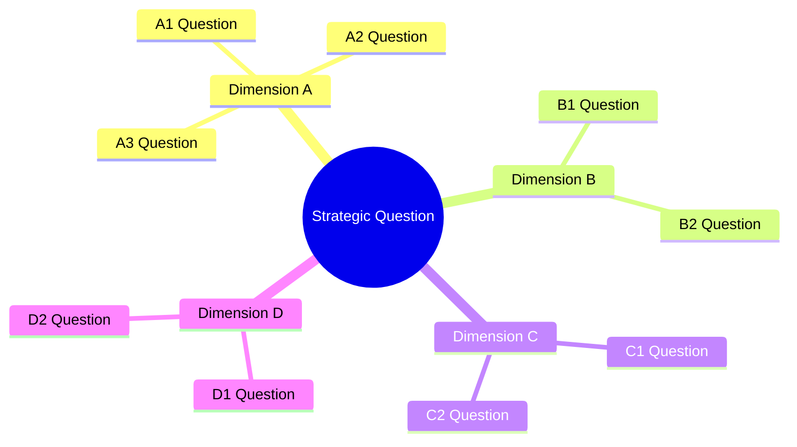
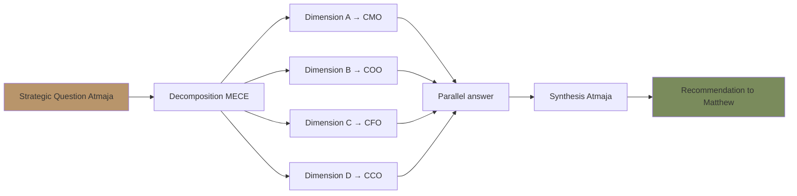

# Strategic Decomposition

Break big strategic question Gerai 1000 Pintu menjadi sub-question yang actionable. MECE framework (Mutually Exclusive Collectively Exhaustive). Output structured tree yang setiap node dapat di-handoff ke C-Level agent specific.

## Triggers

Primary:
- "strategic decomposition"
- "break down strategy"
- "decompose question"

Secondary:
- "MECE analysis"
- "issue tree"

## Input Required

| Field | Type | Required | Default |
|---|---|---|---|
| strategic_question | string | yes | (high-level question to decompose) |
| depth_target | enum | no | (2-level / 3-level / 4-level) |
| context | string | no | - |

## Output Template

```markdown
# Strategic Decomposition: {QUESTION}

**Decomposition depth:** {Level}
**Framework:** MECE (Mutually Exclusive, Collectively Exhaustive)
**Owner final:** Matthew (CEO) + decomposed handoff per agent

## Top-Level Question

> {Original strategic question}

## Decomposition Tree

### Level 1: Primary Dimensions (MECE)

#### Dimension A: {Sub-question A}
- Owner: {C-Level agent}
- Why this dimension matters
- Sub-sub-question Level 2

#### Dimension B: {Sub-question B}
- Owner: {C-Level agent}
- Why this dimension matters
- Sub-sub-question Level 2

#### Dimension C: {Sub-question C}
- Owner: {C-Level agent}
- Why this dimension matters
- Sub-sub-question Level 2

### Level 2: Sub-Sub Questions

#### From Dimension A
- A1: {Question}
- A2: {Question}
- A3: {Question}

#### From Dimension B
- B1: {Question}
- B2: {Question}

#### From Dimension C
- C1: {Question}
- C2: {Question}

### Level 3: Actionable Tasks (kalau perlu deeper)

Per leaf node, identify:
- Specific data needed
- Specific decision needed
- Specific owner

## Handoff Matrix

| Question | Level | Owner | Skill to invoke |
|---|---|---|---|
| {Question 1} | A1 | CMO | {marketing skill} |
| {Question 2} | A2 | COO | {operations skill} |
| {Question 3} | B1 | CFO | {financial skill} |
| ... | ... | ... | ... |

## Synthesis Plan

### Step 1: Parallel decomposition
- Distribute Level 2 questions ke C-Level agent
- Each agent answer dengan their depth + skill
- Parallel processing

### Step 2: Cross-question dependency
- Identify question yang depend on other question's answer
- Sequence accordingly

### Step 3: Synthesis back to top
- Aggregate answer per Level 2
- Reconcile contradiction kalau ada
- Synthesize Level 1 dimension answer
- Final synthesis top-level question

## Quality Check (MECE Validation)

### Mutually Exclusive
- [ ] No overlap between Level 1 dimension
- [ ] Each Level 2 question maps to ONE Level 1 dimension
- [ ] No double-counting

### Collectively Exhaustive
- [ ] Sum of Level 1 dimension covers entire question scope
- [ ] No important angle missed
- [ ] "What else?" check passed

### Actionable
- [ ] Each leaf node has clear owner
- [ ] Each leaf node has clear data/decision need
- [ ] Each leaf node can be handed off

## Common Decomposition Frameworks

### Framework 1: Three Horizons (Strategic Time)
- Horizon 1: Current core (defend + optimize)
- Horizon 2: Emerging (build + nurture)
- Horizon 3: Future (explore + bet)

**Apply:** Strategic question about timing + growth

### Framework 2: Customer-Product-Market (3C)
- Customer: who served + need
- Company: capability + strength
- Competition: alternative + differentiation

**Apply:** Market positioning question

### Framework 3: Revenue-Cost-Margin (Financial)
- Revenue: sources + growth
- Cost: structure + optimize
- Margin: protect + expand

**Apply:** Financial strategy question

### Framework 4: People-Process-Tech-Brand
- People: talent + culture
- Process: operations + workflow
- Tech: tools + automation
- Brand: positioning + asset

**Apply:** Organizational capability question

### Framework 5: 4P Marketing (extended)
- Product / Proposition
- Price
- Place / Channel
- Promotion / Communication
- Plus: People + Process (services)

**Apply:** Marketing strategy question

### Framework 6: Strategic Lens Combo
- Customer lens: persona + journey + emotion
- Operations lens: capacity + quality + cost
- Brand lens: identity + canon + perception
- Financial lens: revenue + margin + risk

**Apply:** Comprehensive Gerai 1000 Pintu strategic question

## Sample Decomposition

### Sample Question 1
**Strategic question:** "Bagaimana Gerai 1000 Pintu mencapai 80% kapasitas konsultasi sustained Q1 2027?"

**Level 1 (MECE):**

A. **Demand side** (acquire + convert)
- A1: Apa lead generation channel yang paling efektif?
- A2: Bagaimana funnel conversion saat ini + bottleneck?
- A3: Persona mana yang paling underserved?

B. **Supply side** (capacity + quality)
- B1: Door Expert capacity realistic 80% berapa konsultasi?
- B2: Apakah quality konsultasi tetap terjaga di 80% load?
- B3: Backup capacity kalau peak demand?

C. **Operational alignment** (process + tools)
- C1: Booking system smooth?
- C2: Showroom dengan Door Expert remote integrated?
- C3: Aftersales tidak crowd out konsultasi?

**Handoff:**
- A → CMO (marketing skill: persona-targeting, funnel-optimization)
- B → COO (operations: capacity-planning, door-expert-operating-model)
- C → COO (workflow-design, sop-generator)

### Sample Question 2
**Strategic question:** "Should Gerai 1000 Pintu expand to Samarinda Cabang #2 in Q3 2027?"

**Level 1 (MECE):**

A. **Market readiness** (demand + competition)
- A1: Demand size Samarinda premium pintu?
- A2: Competitor landscape Samarinda?
- A3: Distance from Balikpapan logistically?

B. **Operational readiness** (capacity + quality)
- B1: Door Expert capacity cover 2 cabang?
- B2: Hiring pipeline Samarinda staff?
- B3: Supply chain extend to Samarinda?

C. **Financial readiness** (investment + ROI)
- C1: Capex Samarinda showroom?
- C2: Payback period realistic?
- C3: Cash flow impact?

D. **Brand readiness** (consistency + scale)
- D1: Brand canon maintained multi-cabang?
- D2: Customer perception Samarinda vs Balikpapan?
- D3: Marketing budget cover dual cabang?

**Handoff:**
- A → CMO + Matthew (market research)
- B → COO (lean-store-design, capacity-planning)
- C → CFO + Matthew (financial planning)
- D → CCO (brand-architecture, brand-audit)

## Visual Output

Decomposition tree:



Owner handoff matrix:



## Knowledge Dependency

- BP Chapter 1-18 (business plan context)
- C-Level skill catalog (CMO/COO/CCO/CFO)
- agent-router skill (next handoff)
- multi-agent-synthesis skill (re-aggregation)
- Matthew strategic priorities

## Mode

Default: EXECUTION (decompose immediately)
Switch: DISCUSSION jika question ambiguity high

## Tools Required

- file-search (context retrieval)
- artifacts (tree + handoff matrix)

## Validation Criteria

- MECE validated (no overlap, no gap)
- Each leaf actionable (owner + data + decision)
- Handoff matrix complete
- Synthesis plan defined
- 6 framework reference available
- Sample decomposition demonstrated
- Quality check 3-dimension

## Sample I/O

**Input:** "Decompose: Bagaimana Gerai 1000 Pintu mencapai 80% kapasitas konsultasi sustained Q1 2027?"

**Output:**
- Level 1 (MECE): Demand (CMO) + Supply (COO) + Operational (COO)
- Level 2: 8 sub-question total
- Handoff: 3 to CMO + 5 to COO
- Synthesis plan: Parallel answer + cross-dependency + aggregate to recommendation
- Quality: MECE validated + leaf actionable
- Tree mindmap + handoff flow embedded

## Handoff

- agent-router (route per leaf to correct agent)
- multi-agent-synthesis (re-aggregate when answer back)
- Specific C-Level skill per leaf
- Matthew (final recommendation)
