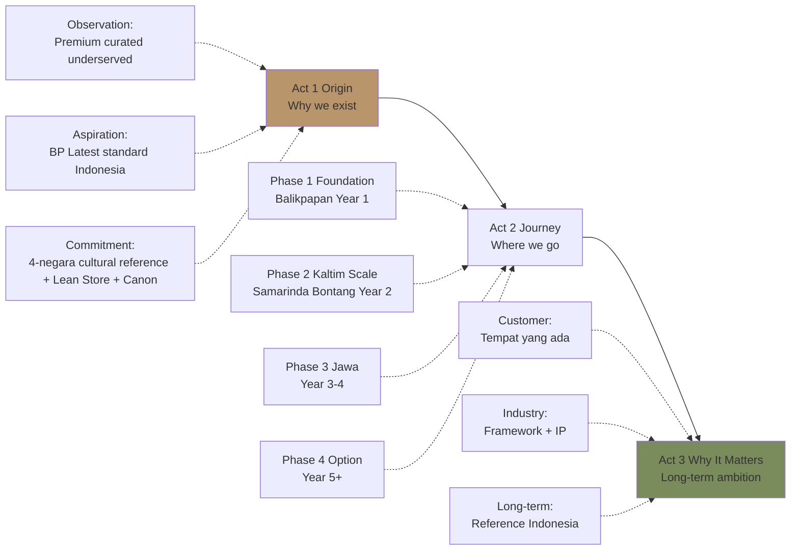
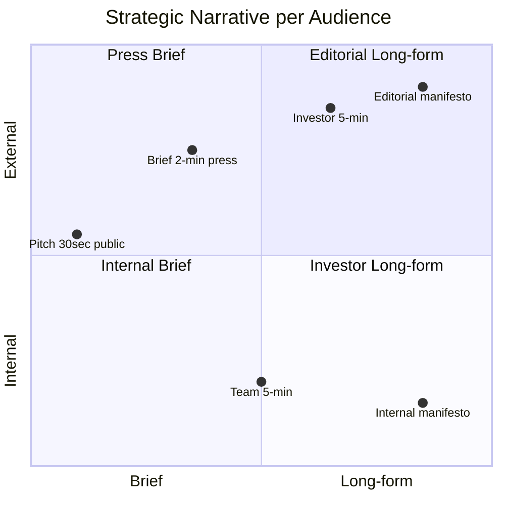

# Strategic Narrative

Build strategic narrative Gerai 1000 Pintu untuk multiple stakeholder: cohesive story yang menjelaskan dari mana, dimana sekarang, ke mana. Connect past → present → future dalam premium hangat tone.

## Triggers

Primary:
- "strategic narrative"
- "company story"
- "narrative arc"

Secondary:
- "investor story"
- "growth narrative"

## Input Required

| Field | Type | Required | Default |
|---|---|---|---|
| audience | enum | yes | (board / investor / press / general / team) |
| time_horizon | enum | no | (origin / current / forward / full arc) |
| length | enum | no | - |

## Output Template

```markdown
# Strategic Narrative: {AUDIENCE}

**Audience:** {Specific}
**Time horizon:** {Origin / Current / Forward / Full arc}
**Length:** {Brief / Medium / Long}

## The Arc (Three Acts)

### Act 1: The Origin (Why)

#### The Observation
{Why Gerai 1000 Pintu exists. What Matthew saw that others missed.}

**Sample (for general audience):**
> Di Indonesia, market pintu premium tidak punya tempat. Mass-market toko pintu 
> agresif jualan harga. E-commerce mendomontrasikan pilihan tanpa konsultasi. 
> Architect-driven specifier hanya untuk klien high-end yang sangat selektif.
> 
> Yang tidak ada: tempat untuk customer mid-upper yang sedang menyusun tempat 
> impian, yang menghargai kurasi premium, dan butuh konsultan yang menemani 
> dengan hangat.
> 
> Itu yang membuat Matthew memulai Gerai 1000 Pintu di Balikpapan 2026.

#### The Aspiration
{Why aim at BP Latest reference standard for Indonesia}

**Sample:**
> Anchor kami tidak generic. BP Latest reference, brand body care Australia, menjaga disiplin 
> retail premium yang refined. BP Latest reference, retailer furniture Amerika, 
> menjaga kurasi editorial yang berani. Keduanya membuat customer berhenti 
> sejenak, mengamati detail, dan berkata "saya menemukan sesuatu yang berbeda."
> 
> Mengapa Indonesia tidak punya standar yang sama? Itu pertanyaan yang kami coba 
> jawab.

#### The Commitment
{What we promise from day 1}

**Sample:**
> Filosofi Dunia Pintu (4-negara cultural context: Jepang jiwa, Eropa seni, Amerika pernyataan, China gerbang rezeki — BUKAN mandatory archetype) 
> adalah framework kami untuk membantu customer memahami karakter pintu yang 
> menemani tempat mereka.
> 
> Door Expert dengan 5 kompetensi adalah konsultan kami yang menemani 60 menit 
> via Zoom tanpa pretensi.
> 
> Brand canon LOCKED memastikan setiap touchpoint customer refined + hangat.

### Act 2: The Journey (How)

#### Phase 1 Foundation (Year 1: 2026-2027)
**Theme:** Establish + Validate

{What we built + what we learned}

**Sample:**
> November 2026 kami launch Wave 1 di Balikpapan. Cabang pertama dengan konsep 
> Lean Store: dua staf plus Door Expert remote dari pusat. Operating model yang 
> efficient + replicable.
> 
> Tahun pertama mencatat: 80+ konsultasi per kuartal, NPS 48 sustained, brand 
> awareness Balikpapan 30%. Customer testimonial mengkonfirmasi: "Saya tidak 
> menemukan pengalaman seperti ini di tempat lain."

#### Phase 2 Kaltim Scale (Year 2: 2027-2028)
**Theme:** Replicate + Expand

{What we plan + what we'll validate}

**Sample:**
> Cabang #2 Samarinda dan #3 Bontang menjadi laboratorium scaling. Apakah Lean 
> Store + Door Expert centralized dapat menjaga konsistensi quality saat geographic 
> expand?
> 
> Mitra Dagang program formal di-kick off Q2 2028 untuk memperluas distribution 
> tanpa diluting brand. Door Expert pool 2-3 person memungkinkan capacity 
> scaling tanpa mengorbankan attention per customer.

#### Phase 3 Jawa Expansion (Year 3-4: 2028-2030)
**Theme:** Scale to Jawa

{What we'll achieve}

**Sample:**
> Jakarta atau Surabaya menjadi langkah berikut. National presence dengan 
> Architect + Designer partnership formal. Brand awareness national 15%.
> 
> Yang penting: setiap cabang aligned dengan standar yang sama. BP Latest reference + 
> Indonesian editorial reference visible di setiap touchpoint.

#### Phase 4 Optional (Year 5+: 2031+)
**Theme:** Continued scale + Optional ASEAN

{What's possible}

**Sample:**
> Beberapa path terbuka: Indonesia consolidation (5-10 cabang), ASEAN entry 
> (Singapore, Kuala Lumpur, Bangkok), atau Editorial IP licensing (manuscript + 
> framework). Keputusan ini akan dipikirkan dengan tenang ketika sampai pada 
> titik itu.

### Act 3: The Why It Matters

#### For Customer
{Why this benefits customers}

**Sample:**
> Customer Indonesia yang menghargai kurasi premium kini punya tempat. Tidak 
> perlu pergi ke BP Latest reference di Singapore atau ke BP Latest reference catalog 
> overseas untuk merasakan retail experience yang refined. Itu hadir di 
> Balikpapan, lalu Samarinda, lalu Jakarta, lalu kota-kota Indonesia berikutnya.

#### For Indonesia Design Industry
{Why this contributes to industry}

**Sample:**
> Filosofi Dunia Pintu (4-negara cultural context) adalah framework yang dapat dicite oleh arsitek dan designer 
> ketika bekerja dengan client tentang pilihan pintu. Editorial content Gerai 
> menjadi referensi cultural Indonesian premium tetapi inklusif. Manuscript 
> "Pintu Berbicara" menjadi IP yang memperluas dialog.

#### For Phase 4 Vision
{Long-term cultural ambition}

**Sample:**
> Tahun-tahun ke depan, ketika seseorang berbicara tentang "premium tetapi inklusif 
> retail Indonesia," nama Gerai 1000 Pintu sebaiknya disebut. Bukan karena kami 
> yang terbesar. Karena kami yang paling konsisten dengan standar yang refined.
> 
> Itu yang sedang kami bangun.

## Narrative Templates

### Template 1: 30-Second Pitch (Origin → Current → Forward)
```
Gerai 1000 Pintu adalah BP Latest reference untuk premium tetapi inklusif Indonesia.
Mulai di Balikpapan 2026, Year 1 NPS 48 + awareness 30%.
Phase 2 ke Samarinda + Bontang 2027, Phase 3 Jawa 2028+.
Indonesia premium tetapi inklusif underserved. Kami menyebar.
```

### Template 2: 2-Minute Brief (Investor / Press)
```
[Act 1 Origin 30 sec]
Indonesia premium tetapi inklusif underserved. Mass-market agresif, e-commerce 
tanpa konsultasi, architect-driven exclusive. Tidak ada tempat untuk mid-upper 
customer yang menghargai kurasi premium.

[Act 2 Journey 60 sec]
Matthew started Gerai 1000 Pintu di Balikpapan November 2026 dengan 
filosofi Dunia Pintu (4-negara cultural context) framework + Lean Store operating model. Year 1 mencatat NPS 
48 + awareness 30% + 80+ konsultasi per kuartal. Phase 2 ke Samarinda + Bontang 
2027. Phase 3 Jawa 2028+. Anchor BP Latest reference untuk retail standard.

[Act 3 Why Matters 30 sec]
Customer mid-upper Indonesia punya tempat sekarang. Industry design punya 
framework 4-negara cultural reference untuk reference. Long-term, ketika seseorang berbicara 
premium tetapi inklusif Indonesia, nama Gerai sebaiknya disebut.
```

### Template 3: Manifesto Long-form (5-min read)
Full Act 1 + Act 2 + Act 3 expanded per audience

### Template 4: Case Study Narrative (Specific story)
Story-driven version untuk customer / project specific

## Audience Adaptation

### For Board / Internal
- Tone: Direct + collaborative
- Detail: Tactical + execution
- Focus: Where we are + decisions
- Emphasis: Team contribution

### For Investor Early-stage
- Tone: Aspirational + grounded
- Detail: Vision + market + team
- Focus: Why bet on this
- Emphasis: Founder + market opportunity

### For Investor Growth-stage (Phase 3+)
- Tone: Confident + data-driven
- Detail: Unit economics + scale
- Focus: Path to outcome
- Emphasis: Track record + roadmap

### For Press / Editorial
- Tone: Cultural + reflective
- Detail: Anchor reference + cultural angle
- Focus: Why this matters
- Emphasis: Industry contribution + cultural meaning

### For Customer
- Tone: Warm + welcoming
- Detail: Experience + value
- Focus: What they gain
- Emphasis: Hospitality + curation

### For Team
- Tone: Mission-driven + warm
- Detail: Purpose + belonging
- Focus: What we build together
- Emphasis: Standard + culture

## Narrative Devices

### Device 1: Three-act structure (Origin → Journey → Why Matters)
Strong arc that audience can follow

### Device 2: Anchor reference as evidence
BP Latest reference as concrete examples

### Device 3: Specific customer voice
Testimonial woven naturally

### Device 4: Founder voice authentic
Matthew quoted thoughtfully

### Device 5: Data + Story balance
Number ground reality + story carry emotion

### Device 6: Cultural relevance
Indonesia first, not Western copy

### Device 7: Forward-looking aspiration
Phase 4 vision projected gracefully

## Brand Canon Compliance

### Mandatory
- No em-dash
- "tempat" not "rumah"
- "Gerai 1000 Pintu" lengkap formal
- Premium hangat tone
- Anchor BP Latest reference visible
- Filosofi Dunia Pintu (4-negara cultural context) woven natural
- 5 Nilai applied implicit

### Tone calibration
- Founder voice: First-person OK
- Brand voice: "Kami" dominant + "Anda" focus
- Editorial voice: Third-person + cultural angle

## Anti-Pattern

### Avoid
- ❌ Generic startup story ("disruption + scale")
- ❌ Over-claim BP Latest reference ("we are BP Latest reference")
- ❌ Empty superlative ("the best", "the first" unverified)
- ❌ Buzzword salad
- ❌ Em-dash habit
- ❌ Cultural insensitivity (Western-only frame)
- ❌ Past tense for future (sounds prophesying)

### Embrace
- ✅ Specific concrete narrative
- ✅ Anchor reference earned + authentic
- ✅ Honest aspiration (achievable beauty)
- ✅ Cultural sensitivity Indonesia
- ✅ Brand canon discipline
- ✅ Three-act flow
- ✅ Forward tense conditional ("akan", "diharapkan")

## Narrative Evolution

### What stays
- Three-act structure
- Anchor reference BP Latest reference
- Filosofi Dunia Pintu framework
- Indonesia first
- Premium hangat tone
- Brand canon LOCKED

### What evolves per phase
- Phase 1 narrative emphasizes Foundation + Lean Store
- Phase 2 emphasizes Replication + Scale
- Phase 3 emphasizes National + IP compounding
- Phase 4 emphasizes Maturity + Optional paths

### Vision-keeper discipline
- Matthew + Atmaja review annually
- Refresh language for current moment
- Maintain core arc continuity
- Document evolution (versioning)

## Sample Strategic Narrative

### Sample 1: Press Pitch 2-min

```
Di Indonesia, kategori premium tetapi inklusif underserved untuk dekade. Mass-market 
agresif jualan harga. E-commerce menyajikan pilihan tanpa kurasi. Architect-driven 
specifier exclusive untuk klien high-end.

Yang tidak ada: tempat untuk customer mid-upper Indonesia yang sedang menyusun 
tempat impian, yang menghargai kurasi premium, dan butuh konsultan hangat.

November 2026 Matthew membuka Gerai 1000 Pintu di Balikpapan dengan anchor 
referensi tidak biasa: BP Latest reference, brand body care Australia yang menjaga disiplin retail 
premium refined, dan BP Latest reference, retailer furniture Amerika dengan kurasi 
editorial yang berani.

Filosofi Dunia Pintu (4-negara cultural context: Jepang jiwa, Eropa seni, Amerika pernyataan, China gerbang rezeki — BUKAN mandatory archetype) menjadi 
framework yang membantu customer memahami karakter pintu untuk tempat mereka. Door 
Expert dengan 5 kompetensi konsultasi 60 menit via Zoom tanpa pretensi.

Year 1 mencatat NPS 48 sustained, awareness 30% Balikpapan, 80+ konsultasi per 
kuartal. Customer testimonial: "Saya tidak menemukan pengalaman seperti ini di tempat 
lain."

Phase 2 ke Samarinda + Bontang akhir 2027. Phase 3 Jakarta atau Surabaya 2028+.

Tahun-tahun ke depan, ketika seseorang berbicara tentang premium tetapi inklusif 
Indonesia, nama Gerai 1000 Pintu sebaiknya disebut.
```
```

## Visual Output

Strategic narrative three-act:



Audience-narrative matrix:



## Knowledge Dependency

- Brand Canon LOCKED
- vision-roadmap (Phase content)
- vision-articulation (paired)
- brand-storytelling (CCO)
- press-release-writer (CCO)
- Anchor BP Latest reference
- Matthew authentic voice + history

## Mode

Default: EXECUTION (build narrative)
Switch: DISCUSSION jika narrative angle debate

## Tools Required

- file-search
- artifacts (narrative + visual)

## Validation Criteria

- Three-act arc (Origin / Journey / Why Matters)
- Audience adaptation 6 tier
- Length variant (30-sec / 2-min / manifesto / case study)
- Narrative devices 7
- Anti-pattern + embrace
- Brand canon compliance
- Evolution discipline per phase
- Sample narrative demonstrated

## Sample I/O

**Input:** "Strategic narrative untuk press pitch 2-min Q1 2027 outreach"

**Output:**
- Audience: Press lifestyle + industry
- Length: 2-min brief (450 word)
- Three-act covered:
  - Act 1 Origin: Indonesia premium tetapi inklusif underserved + Matthew observation
  - Act 2 Journey: Wave 1 Year 1 nailed (NPS 48 + awareness 30% + 80+ konsultasi) + Phase 2 Samarinda+Bontang 2027 + Phase 3 Jawa 2028+
  - Act 3 Why Matters: Customer mid-upper + Industry framework + Long-term reference
- Anchor visible: BP Latest reference
- Customer voice: Testimonial woven
- Brand canon: ✅ No em-dash + "tempat" + Gerai 1000 Pintu lengkap + premium hangat
- Three-act flow + audience matrix embedded

## Handoff

- vision-articulation (paired)
- press-release-writer (CCO press execution)
- board-presentation (kalau investor)
- brand-storytelling (CCO depth)
- founder-briefing (Matthew context)
