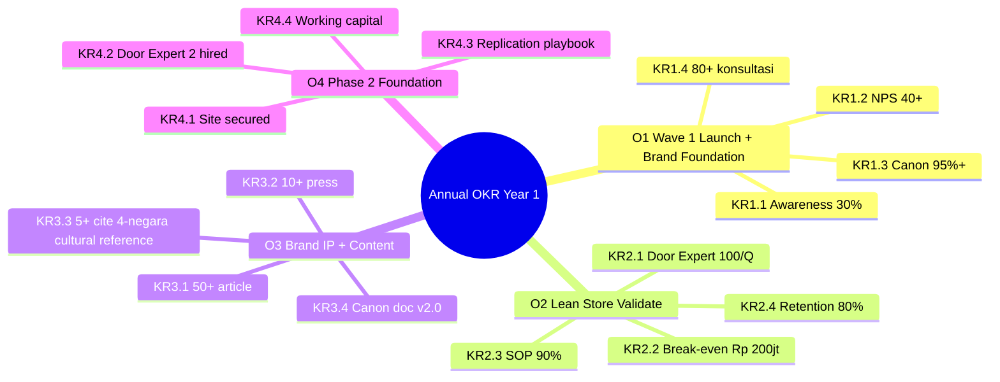
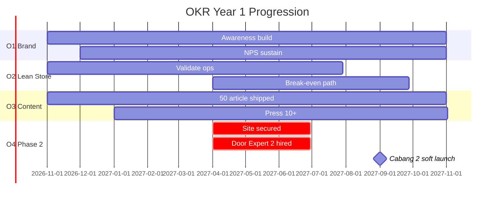

# SWOT + OKR Integration

Conduct SWOT analysis + translate ke OKR Gerai 1000 Pintu. Quarterly + annual cycle. Strategic insight → measurable objectives + key results.

## Triggers

Primary:
- "SWOT analysis"
- "OKR planning"
- "strategic objectives"

Secondary:
- "company OKR"
- "strategic priority"

## Input Required

| Field | Type | Required | Default |
|---|---|---|---|
| period | enum | yes | (quarterly / annual) |
| focus | enum | no | (full company / per function) |
| context | string | no | - |

## Output Template

```markdown
# SWOT + OKR Integration: {PERIOD}

**Period:** {Date range}
**Cycle:** {Q1 / Q2 / Q3 / Q4 / Annual}
**Owner:** Matthew + Atmaja synthesis

## Part 1: SWOT Analysis

### Strengths (Internal +)
1. **Lean Store concept LOCKED** — efficient operating model 2-staf + Door Expert remote
2. **Filosofi Dunia Pintu framework** — proprietary brand differentiator
3. **AMK Premium exclusive Kaltim** — supply moat regional
4. **Brand canon discipline** — BP Latest reference anchored consistency
5. **Founder Matthew technical capability** — CTO + CEO combined
6. **AI Department deployed** — operational intelligence layer
7. **Manuscript "Pintu Berbicara"** — IP + content asset compounding

### Weaknesses (Internal -)
1. **Single founder dependence** — bus factor 1 (Matthew)
2. **Single Door Expert capacity** — bottleneck >120 konsultasi/month
3. **Geographic concentration** — Balikpapan only Phase 1
4. **Brand awareness limited** — Year 1 30% aided target
5. **Cash reserve tight** — burn rate vs runway
6. **Limited operating history** — track record building
7. **Indonesia retail premium tetapi inklusif market underdeveloped** — educate market needed

### Opportunities (External +)
1. **Premium tetapi inklusif retail Indonesia underserved** — first-mover advantage
2. **BP Latest reference aspirational reference growing recognition** — riding wave
3. **Indonesia design appreciation rising** — middle-upper class
4. **Architect+Designer collaboration channel** — B2B2C
5. **Phase 2 expansion Kaltim cabang Samarinda + Bontang** — geographic
6. **AI-augmented operations efficiency** — competitive edge
7. **Editorial Indonesian style editorial content gap Indonesia** — content moat

### Threats (External -)
1. **Mass-market competitor price war** — race to bottom risk
2. **E-commerce marketplace dominance** — convenience vs curation
3. **Indonesia economic slowdown** — premium spending impact
4. **AMK Premium supply concentration risk** — single vendor anchor
5. **Brand canon dilution if scale too fast** — quality drift
6. **Talent scarcity Door Expert quality** — hiring challenge
7. **Regulatory change (tax, import)** — operational disruption

### SWOT Matrix Insight

#### SO Strategies (use Strength + capture Opportunity)
- Leverage Filosofi Dunia Pintu framework + premium tetapi inklusif underserved → Position thought leadership Indonesia retail
- Lean Store + Phase 2 expansion opportunity → Replicate model Samarinda/Bontang
- AI Department + Architect channel → B2B2C automation pipeline

#### WO Strategies (mitigate Weakness + capture Opportunity)
- Single Door Expert + Phase 2 expansion → Hire Door Expert #2 by Q1 2027
- Single founder + AI augmentation opportunity → AI Department compensate for solo capacity
- Brand awareness limited + BP Latest reference/BP Latest reference rising recognition → Anchor reference content marketing

#### ST Strategies (use Strength + defend Threat)
- Brand canon discipline + dilution threat → Strict enforcement + audit cadence
- AMK Premium exclusive + supply concentration threat → Diversification plan Phase 2 selected expansion brand
- Founder technical + competitor digital → AI moat + custom platform

#### WT Strategies (mitigate Weakness + Threat)
- Cash reserve tight + economic slowdown → Conservative budget + working capital line ready
- Limited history + talent scarcity → Compensation package + culture (premium hangat)
- Geographic concentration + regulatory → Compliance documentation + legal counsel standby

## Part 2: OKR Translation

### Annual OKR (Year 1: Nov 2026 - Nov 2027)

#### Objective 1: Wave 1 Launch Successfully + Establish Brand Foundation
**Aspiration:** Gerai 1000 Pintu hadir di Balikpapan dengan reputation premium tetapi inklusif anchored BP Latest reference yang dihormati customer + industry.

**Key Results:**
- KR 1.1: Aided brand awareness Balikpapan 30%+ by Q4 2027
- KR 1.2: NPS 40+ sustained Q2-Q4 2027
- KR 1.3: Brand canon compliance 95%+ sustained
- KR 1.4: 80+ konsultasi/quarter average Q2-Q4

#### Objective 2: Validate Lean Store + Door Expert Operating Model
**Aspiration:** Lean Store 2-staf + Door Expert remote terbukti scalable + replicable.

**Key Results:**
- KR 2.1: Door Expert capacity 100 konsultasi/quarter sustained
- KR 2.2: Cabang #1 break-even Rp 200jt revenue/month by Q3 2027
- KR 2.3: SOP coverage 90%+ of operations documented + adopted
- KR 2.4: Staff retention 80%+ Year 1

#### Objective 3: Build Brand IP + Content Compounding
**Aspiration:** Editorial content + Filosofi Dunia Pintu framework menjadi referensi Indonesia premium tetapi inklusif.

**Key Results:**
- KR 3.1: 50+ long-form article shipped Year 1
- KR 3.2: Press mention Tier 2 (national lifestyle) 10+ pieces
- KR 3.3: Dunia Pintu framework cited external 5+ times
- KR 3.4: Brand canon documentation v2.0 finalized

#### Objective 4: Prepare Phase 2 Scale Foundation
**Aspiration:** Cabang #2 (Samarinda) ready to launch Q3-Q4 2027.

**Key Results:**
- KR 4.1: Cabang #2 site secured + buildout planned by Q2 2027
- KR 4.2: Door Expert #2 hired + trained by Q2 2027
- KR 4.3: Replication playbook documented + tested
- KR 4.4: Working capital + financing secured for Cabang #2

### Quarterly OKR (per Quarter Drill-down)

#### Q4 2026 (Nov-Dec, Launch + Stabilize)
- O: Wave 1 launch executed + steady operations established
- KR: 8-12 walk-in/week + 5+ konsultasi/week + 95%+ brand canon + 4.7+ Google review

#### Q1 2027 (Jan-Mar, Educate + Build)
- O: Filosofi Dunia Pintu (4-negara cultural context) educational arc + customer base growing
- KR: 30+ konsultasi/quarter + 5 customer case study + 4-negara cultural reference content viral piece + persona Aplikator engagement +20%

#### Q2 2027 (Apr-Jun, Optimize + Validate)
- O: Lean Store model validated + Phase 2 preparation
- KR: 60+ konsultasi/quarter + break-even path clear + Door Expert #2 hired + Samarinda site secured

#### Q3 2027 (Jul-Sep, Launch Phase 2 + Continue)
- O: Cabang #2 Samarinda launched + Cabang #1 thriving
- KR: 80+ konsultasi/quarter + Cabang #2 soft-launch + 25%+ revenue cross-cabang + brand consistency 95%

### OKR Scoring + Review

#### Scoring Convention
- 1.0 = stretch goal achieved (rare)
- 0.7 = ambitious target hit (success)
- 0.5 = solid progress (acceptable)
- <0.3 = significant gap (intervention)

#### Review Cadence
- **Weekly:** Check-in 30-min team (Atmaja + Matthew)
- **Monthly:** Adjustment + course-correct
- **Quarterly:** Score + reflection + next quarter set
- **Annually:** Score + retrospective + Year 2 set

## Part 3: SWOT → OKR Mapping

### How SWOT informs OKR

| SWOT Insight | OKR Influenced |
|---|---|
| Strength: Filosofi Dunia Pintu (4-negara cultural context) | O3 KR3.3 — framework cited externally |
| Strength: Lean Store concept | O2 — validate operating model |
| Weakness: Door Expert single | O4 KR4.2 — hire Door Expert #2 |
| Weakness: Brand awareness | O1 KR1.1 — 30% awareness |
| Opportunity: Premium underserved | O1 — establish brand foundation |
| Opportunity: Phase 2 expansion | O4 — prepare Phase 2 |
| Threat: Mass competitor | O3 — content moat |
| Threat: Brand dilution | O1 KR1.3 — canon compliance |

### Strategic Themes (cross-OKR)
1. **Brand foundation discipline** (O1 + O3) — canon + IP + awareness
2. **Operational excellence proof** (O2) — Lean Store viable
3. **Phase 2 readiness** (O4) — geographic scale prep
4. **Cultural anchor maintenance** (across all) — BP Latest reference consistency

## Part 4: Risk + Course-Correct Plan

### Risk per OKR
| OKR | Risk | Mitigation | Owner |
|---|---|---|---|
| O1 (Awareness) | Low Wave 1 traffic | Marketing budget buffer + PR amplification | CMO |
| O2 (Lean Store) | Door Expert burnout | Capacity tracking + freelance backup | COO |
| O3 (Content) | Editorial quality drift | Brand canon enforcer + reviewer | CCO |
| O4 (Phase 2) | Cash flow constraint | Working capital + selective launch | CFO + Matthew |

### Course-correct triggers
- Quarterly score <0.3 → emergency review
- Quarterly score 0.3-0.5 → adjust + add support
- Sustained <0.5 2 quarter → OKR re-design

## Part 5: Communication + Cascade

### Cascade pattern
1. Atmaja + Matthew set company OKR
2. C-Level translate to function OKR (CMO/COO/CCO/CFO)
3. Tim Pusat translate to team + individual goal
4. Cabang adopt cabang-specific KR

### Communication channel
- Annual OKR launch: Notion + all-hands meeting
- Quarterly review: Doc + team meeting
- Weekly check-in: WhatsApp + lightweight
```

## Visual Output

SWOT 2x2 matrix:

```mermaid
quadrantChart
    title SWOT Strategic Position
    x-axis Internal Negative --> Internal Positive
    y-axis External Negative --> External Positive
    quadrant-1 Build on Strength + Opportunity
    quadrant-2 Capture Opportunity + Fix Weakness
    quadrant-3 Mitigate Weakness + Defend Threat
    quadrant-4 Use Strength to Defend Threat
    Filosofi Dunia Pintu (4-negara cultural context): [0.85, 0.85]
    Lean Store concept: [0.8, 0.8]
    Single Door Expert: [0.3, 0.7]
    Brand awareness limited: [0.35, 0.75]
    Mass competitor: [0.7, 0.25]
    Brand dilution threat: [0.65, 0.2]
    Cash reserve tight: [0.3, 0.3]
    Economic slowdown: [0.4, 0.15]
```

OKR cascade tree:



OKR quarterly progression:



## Knowledge Dependency

- BP Chapter 1-18 (business plan)
- Filosofi Dunia Pintu (4-negara cultural context)
- 5 Nilai Gerai
- All C-Level skill catalog
- COO risk-register
- CMO + CFO + CCO + COO function expertise

## Mode

Default: EXECUTION (full SWOT + OKR)
Switch: DISCUSSION jika strategic angle debate

## Tools Required

- file-search
- artifacts (SWOT matrix + OKR tree + Gantt)

## Validation Criteria

- SWOT 4-quadrant: 7+ point per quadrant
- SO + WO + ST + WT strategic insight
- Annual OKR 4 Objectives × 4 KR each (16 KR total)
- Quarterly OKR drill-down 4 quarter
- SWOT → OKR mapping explicit
- Strategic themes 3-4 cross-OKR
- Risk + course-correct per OKR
- Cascade pattern + communication
- Scoring convention + review cadence

## Sample I/O

**Input:** "SWOT + OKR Year 1 Gerai 1000 Pintu Nov 2026 - Nov 2027"

**Output summary:**
- SWOT 4-quadrant: 7 Strength + 7 Weakness + 7 Opportunity + 7 Threat
- Top SO strategy: Filosofi Dunia Pintu (4-negara cultural context) + premium underserved → thought leadership
- Top WO strategy: Door Expert + expansion → hire #2 Q1
- Top ST strategy: Brand canon + dilution → strict audit
- Top WT strategy: Cash tight + slowdown → working capital
- Annual OKR: 4 Objectives (Brand Foundation + Lean Store Validate + Brand IP + Phase 2)
- 16 Key Results measurable
- Quarterly drill-down: Q4 Launch, Q1 Educate, Q2 Optimize, Q3 Phase 2 launch
- Strategic themes: Brand discipline + Operational excellence + Phase 2 readiness + Cultural anchor
- Risk per OKR + mitigation owner identified
- Cascade pattern: Atmaja → C-Level → Tim Pusat → Cabang
- SWOT 2x2 + OKR mindmap + Gantt embedded

## Handoff

- strategic-decomposition (per OKR breakdown)
- All C-Level catalog (function OKR translation)
- vision-roadmap (long-term align)
- company-kpi-dashboard (tracking)
- Matthew (final approval)
