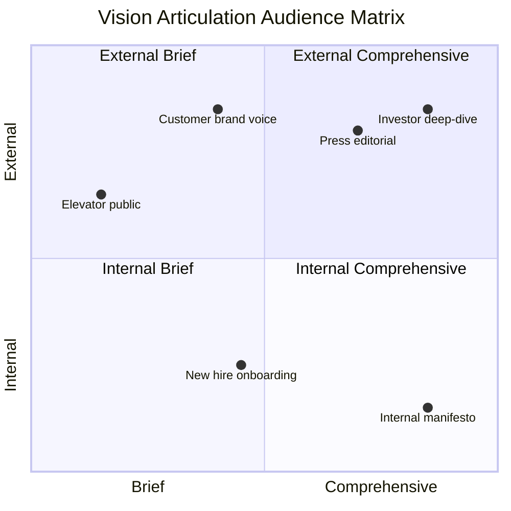
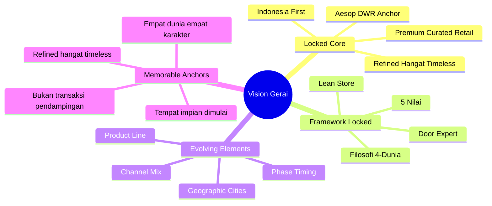

# Vision Articulation

Articulate Gerai 1000 Pintu vision in language that resonates: founder voice (Matthew), customer voice (premium hangat), industry voice (anchor reference). Keep vision living + evolving + memorable.

## Triggers

Primary:
- "vision articulation"
- "articulate vision"
- "vision statement"

Secondary:
- "company narrative"
- "founder story"

## Input Required

| Field | Type | Required | Default |
|---|---|---|---|
| audience | enum | yes | (internal team / customer / press / investor / general public) |
| length | enum | no | (elevator pitch 30s / paragraph / manifesto) |
| occasion | string | no | - |

## Output Template

```markdown
# Vision Articulation: {AUDIENCE}

**Length:** {30-sec / Paragraph / Manifesto}
**Occasion:** {Launch / Quarterly / Annual / Specific}
**Voice:** {Founder / Brand / Cultural}

## Core Vision Statement (LOCKED — never changes)

> Gerai 1000 Pintu menjadi referensi premium curated retail Indonesia yang refined, 
> hangat, dan timeless. Dari Balikpapan, kami menyebar ke kota-kota Indonesia yang 
> menghargai detail. Setiap cabang adalah tempat yang membuat customer berkata, 
> "Saya tidak menemukan pengalaman seperti ini di tempat lain."

**Core elements:**
- Premium curated retail (positioning)
- Indonesia first (cultural anchor)
- Refined + hangat + timeless (tone)
- Tempat yang berbeda (experience)
- Anchor: Aesop + DWR + Kinfolk references

## Audience-Specific Variants

### Variant 1: Internal Team (Vision Manifesto)

**Audience:** Tim Pusat + Senior + Door Expert + MA
**Length:** Manifesto (300-500 word)

```
Kami sedang membangun tempat.

Bukan toko pintu. Bukan e-commerce. Kami sedang membangun tempat curated 
premium yang membuat customer berhenti sejenak, mengamati detail, dan 
berkata "saya menemukan sesuatu yang berbeda."

Apa yang berbeda?

Anchor kami adalah Aesop. Bukan brand-nya, melainkan disiplin yang 
mereka pegang. Setiap detail dipilih dengan kesadaran. Setiap touchpoint 
hangat tanpa pretensi. Tempat yang menyajikan keheningan dalam pasar 
yang ramai.

Design Within Reach mengajarkan kami bahwa retail premium adalah soal 
kurasi yang berani. Kinfolk mengajarkan kami bahwa storytelling hangat 
adalah karya tersendiri.

Filosofi 4-Dunia adalah framework kami. Jepang membawa jiwa. Eropa 
membawa seni. Amerika membawa pernyataan. China membawa legacy. Customer 
kami memilih yang menemani perjalanan mereka.

Lean Store adalah operating model kami. Dua staf di setiap cabang plus 
Door Expert remote. Tidak besar. Tapi setiap pintu didampingi dengan 
kompetensi yang tinggi.

Brand canon kami strict. Tidak ada em-dash. "Tempat" bukan "rumah." 
Premium hangat, bukan agresif sales. Aesop dan Design Within Reach 
visible dalam setiap detail.

Kami mulai di Balikpapan. Kami akan menyebar ke Samarinda, Bontang, lalu 
Jakarta, lalu Surabaya. Tidak terburu-buru. Setiap cabang harus aligned 
dengan standar yang kami susun.

Tahun-tahun ke depan, ketika seseorang berbicara tentang "premium curated 
retail Indonesia," nama kami sebaiknya disebut. Bukan karena kami yang 
terbesar. Karena kami yang paling konsisten dengan standar yang refined.

Kami sedang membangun tempat. Tempat untuk customer. Tempat untuk tim. 
Tempat untuk Indonesia.

Salam hangat,
Matthew Wijaya
Founder Gerai 1000 Pintu
```

### Variant 2: Customer (Brand Voice)

**Audience:** Customer prospective + active
**Length:** Paragraph (100-150 word)

```
Tempat impian dimulai dari pintu yang tepat.

Di Gerai 1000 Pintu, kami menyiapkan kurasi pintu premium yang dipilih 
dengan filosofi 4-Dunia: Jepang jiwa, Eropa seni, Amerika pernyataan, 
China legacy. Door Expert kami siap menemani Anda dengan konsultasi 60 
menit yang hangat.

Bukan transaksi. Sebuah pendampingan untuk menemukan karakter yang 
merefleksikan tempat Anda.

Anchor kami: Aesop dan Design Within Reach.

Mari mulai berbicara tentang tempat Anda.

gerai.mahewwork.com
```

### Variant 3: Press / Editorial

**Audience:** Press + editorial outlet
**Length:** 200-300 word

```
Di Balikpapan, sebuah konsep retail premium curated berbeda mengambil 
ruang. Gerai 1000 Pintu, didirikan November 2026 oleh Matthew Wijaya, 
adalah tempat yang menyajikan pintu kurasi dengan filosofi 4-Dunia 
(Jepang, Eropa, Amerika, China) dan layanan konsultasi Door Expert via 
Zoom — model Lean Store pertama di industri pintu Indonesia.

Anchor brand-nya tidak biasa untuk konteks Indonesia: Aesop, brand body 
care Australia yang dikenal dengan retail experience minimalist refined, 
dan Design Within Reach, retailer furniture premium Amerika yang dikenal 
dengan kurasi editorial.

"Saya tidak ingin membangun toko pintu," ujar Matthew. "Saya ingin 
membangun tempat dimana customer datang untuk memahami karakter pintu 
yang menemani tempat mereka."

Konsep Lean Store dengan dua staf cabang plus Door Expert centralized 
dari pusat memungkinkan Gerai 1000 Pintu menjaga konsistensi quality 
saat scale. Phase 2 ke Samarinda dan Bontang direncanakan akhir 2027.

Filosofi 4-Dunia adalah framework yang bisa di-cite oleh arsitek dan 
designer ketika bekerja dengan klien tentang pilihan pintu.

Gerai 1000 Pintu beralamat di Balikpapan, Kalimantan Timur.

gerai.mahewwork.com
```

### Variant 4: Investor (Phase 3+)

**Audience:** Early-stage + growth-stage investor
**Length:** Elevator pitch 30-sec + 2-min deep dive

**30-sec:**
```
Gerai 1000 Pintu adalah Aesop dan Design Within Reach untuk premium 
curated retail Indonesia. Kami mulai di Balikpapan 2026 dengan filosofi 
4-Dunia dan Lean Store operating model. Year 1 NPS 48 + brand awareness 
30% Balikpapan. Phase 2 ke Kaltim 2027 + Phase 3 Jawa 2028+.
Indonesia premium curated retail market underserved Rp X triliun. Kami 
menyebar.
```

**2-min deep dive:** Refer board-presentation skill

### Variant 5: General Public (Elevator)

**Length:** 30-sec
```
Gerai 1000 Pintu di Balikpapan adalah tempat pintu premium curated 
pertama di Indonesia dengan filosofi 4-Dunia dan konsultasi Door Expert 
gratis 60 menit. Anchor kami Aesop + Design Within Reach. Kami sediakan 
waktu untuk customer yang sedang menyusun tempat impian.
```

### Variant 6: New Hire Onboarding

**Length:** 5-min welcome speech
```
Selamat datang di Gerai 1000 Pintu.

Anda sekarang bagian dari tempat yang sedang membangun standar premium 
curated retail Indonesia. Kami berbeda dari toko pintu biasa. Anchor 
kami Aesop dan Design Within Reach: dua referensi global yang menjaga 
disiplin yang sama di setiap detail.

Filosofi 4-Dunia (Jepang jiwa, Eropa seni, Amerika pernyataan, China 
legacy) adalah framework kami untuk membantu customer memahami karakter 
pintu yang menemani tempat mereka.

5 Nilai kami: Inspirasi, Keahlian, Pelayanan Nyaman, Inovasi, Aftersales. 
Diterapkan setiap interaksi.

Brand canon kami strict. Tidak ada em-dash. "Tempat" bukan "rumah." 
Premium hangat, bukan agresif sales.

Lean Store kami berarti dua staf di setiap cabang plus Door Expert 
remote. Itu memungkinkan kami menjaga konsistensi quality. Anda akan 
berkolaborasi dengan Door Expert untuk customer terbaik.

Tahun-tahun ke depan, ketika seseorang berbicara tentang premium curated 
retail Indonesia, nama Gerai 1000 Pintu sebaiknya disebut. Anda bagian 
dari membangun itu.

Selamat bergabung. Mari kita mulai.
```

## Voice Differentiation

### Founder Voice (Matthew)
- Direct + visionary
- Honest about journey
- Strategic + intellectual
- Refined but accessible
- First-person "saya" OK kalau personal

### Brand Voice (Gerai)
- Premium hangat consistent
- "Kami" (we) dominant
- Customer-first "Anda" focus
- Aesop + Kinfolk warmth
- Refined vocabulary

### Cultural Voice (Industry)
- Indonesian context emphasis
- Cultural sensitivity
- Heritage respect
- Future-facing
- Contributing to discourse

## Vision Evolution Discipline

### What stays LOCKED
- Premium curated positioning
- Filosofi 4-Dunia framework
- Lean Store concept
- 5 Nilai
- Anchor Aesop + DWR + Kinfolk references
- Indonesia first

### What can evolve
- Specific phasing timing
- Geographic next-cities
- Product line expansion specific
- Channel mix tactics
- Communication emphasis

### Vision review cadence
- Quarterly: communication emphasis update
- Annual: phasing alignment
- Phase transition: vision deepen articulation
- Never: core elements

## Memorable Anchor Phrases

### Public-facing
- "Tempat impian dimulai dari pintu yang tepat."
- "Empat dunia. Empat karakter."
- "Bukan transaksi. Sebuah pendampingan."
- "Refined + hangat + timeless."

### Internal
- "Aesop standard for Indonesia."
- "Lean Store, premium hangat."
- "Brand canon LOCKED."
- "Filosofi 4-Dunia framework."

### Founder pull-quote
- "Saya tidak ingin membangun toko pintu. Saya ingin membangun tempat."
- "Aesop mengajarkan kami disiplin. Kinfolk mengajarkan kami warmth."

## Anti-Pattern

### Avoid in articulation
- ❌ Generic startup buzzword ("disrupt", "revolutionize")
- ❌ Empty superlative ("the best", "the only")
- ❌ Trend-chasing language (passing year-specific)
- ❌ Em-dash habit
- ❌ Over-claiming Aesop+DWR (we aspire, not become)
- ❌ Lifestyle aspirational generic ("Make your dream home")

### Embrace
- ✅ Specific concrete language
- ✅ Honest aspirational (achievable beauty)
- ✅ Timeless framing
- ✅ Anchor reference earned not claimed
- ✅ Indonesian cultural sensitivity
- ✅ Premium hangat tone consistent

## Brand Canon Compliance

Every vision articulation MUST:
- [ ] No em-dash
- [ ] "tempat" not "rumah"
- [ ] "Gerai 1000 Pintu" lengkap di formal context
- [ ] Premium hangat tone
- [ ] Anchor reference Aesop + DWR appropriate
- [ ] Filosofi 4-Dunia framework woven natural
- [ ] Lean Store concept honored
- [ ] 5 Nilai applied implicitly
- [ ] Indonesian first vocabulary
- [ ] CTA non-aggressive

## Storytelling Devices

### Device 1: Sensory open
"Pagi di Balikpapan. Sinar pertama menemukan brass yang dipilih dengan hati-hati."

### Device 2: Question hook
"Apa yang membuat sebuah tempat terasa milik Anda?"

### Device 3: Philosophy fragment
"Empat dunia. Empat karakter."

### Device 4: Anchor invocation
"Aesop mengajarkan kami disiplin yang sama untuk Indonesia."

### Device 5: Vision projection
"Tahun-tahun ke depan, ketika seseorang berbicara tentang premium curated retail Indonesia, nama kami sebaiknya disebut."
```

## Visual Output

Vision communication audience matrix:



Vision elements mindmap:



## Knowledge Dependency

- Brand Canon LOCKED
- vision-roadmap (Phase content)
- BP Chapter 1-18 (full vision)
- 5 Nilai + Filosofi 4-Dunia + Lean Store concept
- Anchor Aesop + DWR + Kinfolk
- Matthew personal voice
- editorial-style-guide (CCO)
- brand-storytelling (CCO)

## Mode

Default: EXECUTION (articulate per audience)
Switch: DISCUSSION jika vision evolution debate

## Tools Required

- file-search
- artifacts (manifesto + variants)

## Validation Criteria

- Core vision statement LOCKED
- 6 audience-specific variants
- Voice differentiation (Founder / Brand / Cultural)
- Evolution discipline (LOCKED vs evolve)
- Memorable anchor phrases
- Anti-pattern explicit
- Brand canon compliance strict
- Storytelling devices 5
- Sample articulation per audience

## Sample I/O

**Input:** "Vision articulation untuk new hire MA + Door Expert onboarding"

**Output:**
- Variant 6: New hire onboarding 5-min speech
- Voice: Founder Matthew + Brand premium hangat
- Length: 5-min welcome (~600 word)
- Anchor elements: Aesop + DWR reference + Filosofi 4-Dunia + Lean Store + 5 Nilai + Brand canon LOCKED
- Key memorable phrases: "tempat yang sedang membangun standar premium curated retail Indonesia", "Anchor kami Aesop dan Design Within Reach"
- Closing: "Selamat bergabung. Mari kita mulai."
- Brand canon: ✅ 100% compliance
- Audience matrix + elements mindmap embedded

## Handoff

- brand-storytelling (CCO narrative depth)
- editorial-style-guide (CCO canon)
- press-release-writer (kalau press)
- board-presentation (kalau investor)
- onboarding-roadmap COO (kalau new hire)
