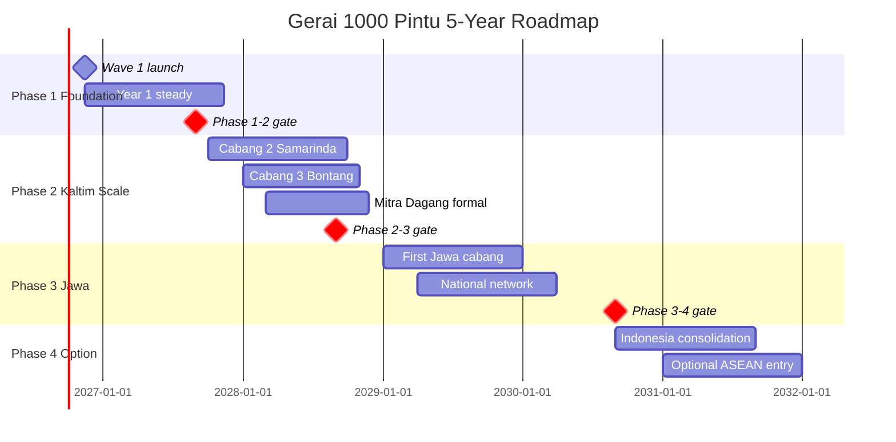
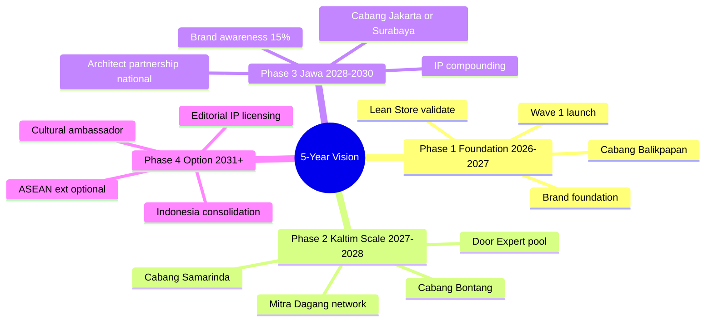
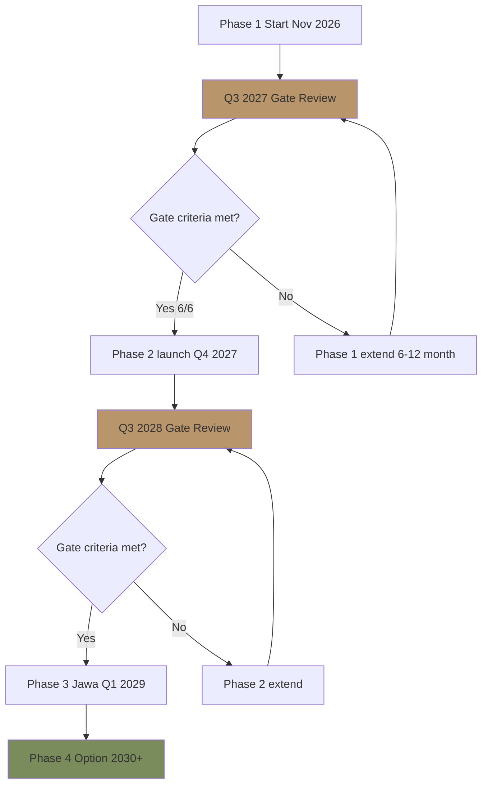

# Vision Roadmap (Phase 1-3 Long-term Plan)

Maintain vision roadmap Gerai 1000 Pintu: Phase 1 Wave 1 (2026), Phase 2 Kaltim scale (2027), Phase 3 Jawa expansion (2028+). Multi-year planning, milestone, decision gate.

## Triggers

Primary:
- "vision roadmap"
- "long-term plan"
- "phase plan"

Secondary:
- "multi-year planning"
- "company roadmap"

## Input Required

| Field | Type | Required | Default |
|---|---|---|---|
| horizon | enum | yes | (3-year / 5-year / 10-year vision) |
| focus | enum | no | (full / phase-specific) |

## Output Template

```markdown
# Vision Roadmap: Gerai 1000 Pintu

**Horizon:** {3-year / 5-year / 10-year}
**Owner:** Matthew + Atmaja stewardship
**Anchor:** Aesop + Design Within Reach + Kinfolk Editorial

## Long-term Vision Statement

> Gerai 1000 Pintu menjadi referensi premium curated retail Indonesia yang refined, 
> hangat, dan timeless. Dari Balikpapan, kami menyebar ke kota-kota Indonesia yang 
> menghargai detail. Setiap cabang adalah tempat yang membuat customer berkata, 
> "Saya tidak menemukan pengalaman seperti ini di tempat lain."

## Phase Architecture

### Phase 1: Foundation (Nov 2026 - Nov 2027) — Year 1
**Theme:** Establish + Validate
**Location:** Cabang Balikpapan (single)
**Focus:** Wave 1 launch + steady operations + Lean Store validation

**Key Milestones:**
- Q4 2026: Wave 1 launch 14 November
- Q1 2027: Filosofi 4-Dunia educational arc
- Q2 2027: Lean Store model validated + break-even path
- Q3 2027: Phase 2 readiness check + Cabang #2 prep

**Year-end target:**
- Aided awareness 30%+ Balikpapan
- 80+ konsultasi/quarter sustained
- NPS 40+
- Cabang #1 break-even path clear

### Phase 2: Kaltim Scale (Nov 2027 - Nov 2028) — Year 2
**Theme:** Replicate + Expand
**Location:** Cabang Balikpapan + Samarinda + Bontang (3 cabang)
**Focus:** Multi-cabang model + Door Expert pool + Mitra Dagang network

**Key Milestones:**
- Q4 2027: Cabang #2 Samarinda launch
- Q1 2028: Cabang #3 Bontang launch
- Q2 2028: Mitra Dagang program formal (5+ partner)
- Q3 2028: Door Expert pool 2-3 person

**Year-end target:**
- 3 cabang operational
- 60% revenue growth vs Year 1
- Mitra Dagang network 5+ partner
- Brand awareness Kaltim 50%+

### Phase 3: Jawa Expansion (Nov 2028 - Nov 2030) — Year 3-4
**Theme:** Scale to Jawa
**Location:** + Cabang Jakarta / Surabaya / Bandung (selected 1-2 first)
**Focus:** National presence + Architect+Designer national network

**Key Milestones:**
- Q1-Q2 2029: First Jawa cabang launch
- Q3-Q4 2029: Architect+Designer national partnership
- Q1 2030: Second Jawa cabang
- Q3 2030: National brand recognition

**Year-end target:**
- 5+ cabang (Kaltim + Jawa)
- National brand awareness 15%+
- Architect+Designer collaboration formal
- Phase 4 international option open

### Phase 4: International Option (2031+) — Optional
**Theme:** Premium curated retail Indonesia → International
**Location:** Jakarta hub + International market entry consideration
**Focus:** Sustainable scale + cultural ambassador

**Optional paths:**
- A. Indonesia consolidation (5-10 cabang nationwide)
- B. ASEAN expansion (Singapore, Kuala Lumpur, Bangkok)
- C. Editorial/IP licensing (manuscript, framework)

**Decision criteria:** Per Year 4 review

## Phase Transition Gate

### Gate Phase 1 → Phase 2 (Q3 2027)
**Go-criteria (must meet):**
- [ ] Cabang #1 break-even path clear
- [ ] Door Expert capacity scalable (Door Expert #2 hired + trained)
- [ ] Brand canon compliance 95%+ sustained
- [ ] Working capital + financing secured
- [ ] AMK Premium contract scale-ready
- [ ] Operational SOP 90%+ documented

**No-go (any one triggers delay):**
- Cabang #1 not break-even
- Door Expert single still
- Cash flow gap critical
- Brand canon major drift

### Gate Phase 2 → Phase 3 (Q3-Q4 2028)
**Go-criteria:**
- [ ] 3 cabang Kaltim operational + healthy
- [ ] Door Expert pool 2-3 person
- [ ] Mitra Dagang network 5+ active
- [ ] Brand awareness Kaltim 50%+
- [ ] Financial reserve sufficient Jawa entry
- [ ] Operational playbook proven

**No-go:** Any cabang #2 or #3 failing

### Gate Phase 3 → Phase 4 (2030-2031)
**Go-criteria:** Per Year 4 review
**Optional:** Open all paths

## Long-term Strategic Themes

### Theme 1: Brand Discipline Maintained
- Aesop + DWR anchor consistency
- Brand canon enforcement non-negotiable
- Filosofi 4-Dunia framework evolving
- Editorial content compounding

### Theme 2: Lean Operating Excellence
- 2-staf cabang model LOCKED
- Door Expert centralized
- AI Department augmentation
- Continuous SOP refinement

### Theme 3: Cultural Anchor Indonesia
- Indonesian poetic literacy
- Cultural context (rumah adat, modern, hybrid)
- Feng shui foundation
- Aesop+DWR adapted Indonesian style

### Theme 4: People + Culture
- Door Expert 5 kompetensi gold standard
- Premium hangat service standard
- Career path Master tier
- Talent retention 80%+ long-term

## Vision Architecture Components

### Brand Architecture (refer CCO)
- Master brand "Gerai 1000 Pintu" LOCKED
- Product line expansion phase-gated
- Service line evolution
- Channel expansion geographic

### Operating Architecture (refer COO)
- Lean Store 2-staf + Door Expert remote
- Centralized Pusat + distributed cabang
- AI Department orchestration
- Knowledge ecosystem

### Financial Architecture (refer CFO)
- Self-funded → working capital → growth capital
- Margin discipline 30%+ gross
- Cash conservation early
- Investment in IP + people

### Brand Equity Architecture (refer CCO)
- Brand canon LOCKED
- Editorial content compounding
- Anchor reference Aesop + DWR + Kinfolk visible
- Customer IP (testimonial + case study)

## Roadmap Visualization

### High-level Phase Timeline

```
Year 1 (2026-2027): Foundation Phase 1
├── Q4 2026: Wave 1 launch
├── Q1 2027: Educate + build
├── Q2 2027: Optimize + validate
└── Q3 2027: Phase 2 preparation

Year 2 (2027-2028): Kaltim Scale Phase 2
├── Q4 2027: Cabang #2 Samarinda
├── Q1 2028: Cabang #3 Bontang
├── Q2 2028: Mitra Dagang formal
└── Q3 2028: Phase 3 preparation

Year 3 (2028-2029): Jawa Expansion Phase 3
├── Q1 2029: First Jawa cabang
├── Q2 2029: Architect+Designer national
├── Q3 2029: Brand momentum national
└── Q4 2029: Phase 3 consolidation

Year 4+ (2029+): Continued scale + Phase 4 option
```

## Strategic Decision Calendar

### Annual Strategic Off-Sites
- Q4 each year: Year retrospective + Year+1 OKR set
- Q2 each year: Mid-year course-correct + budget review
- Matthew + Atmaja + C-Level + key Tim Pusat

### Decision Gate Reviews
- Phase 1→2 gate: Q3 2027 review
- Phase 2→3 gate: Q3 2028 review
- Phase 3→4 gate: 2030 review

### Quarterly Business Review
- Atmaja synthesis from C-Level
- Score vs OKR
- Course-correct decisions
- Communication cascade

## Investment Allocation Framework

### Year 1 (Foundation)
| Category | Allocation | Note |
|---|---|---|
| Showroom buildout Cabang #1 | 35% | One-time |
| Marketing + brand foundation | 20% | Awareness |
| People (hire + train) | 15% | Door Expert + MA |
| Operations + tools | 15% | CRM + system |
| Reserve | 15% | 3-month buffer |

### Year 2 (Phase 2 Scale)
| Category | Allocation |
|---|---|
| Cabang #2 + #3 buildout | 40% |
| Marketing expansion | 20% |
| People (Door Expert #2 + MA × 4) | 15% |
| Mitra Dagang program | 10% |
| Reserve | 15% |

### Year 3 (Phase 3 Jawa)
| Category | Allocation |
|---|---|
| Jawa cabang first | 35% |
| National marketing | 25% |
| Architect+Designer partnership | 15% |
| Operations scale | 10% |
| Reserve | 15% |

## Risk Portfolio Long-term

### Strategic Risk (refer COO risk-register)
- Brand dilution di scale
- Cash flow at expansion
- Talent scarcity Door Expert
- Market downturn

### Mitigation
- Brand canon enforcement strict (CCO)
- Conservative cash management (CFO)
- Door Expert talent pipeline (HR + COO)
- Diversification + reserve (CFO + Matthew)

## Vision Communication

### Internal cascade
- Matthew + Atmaja: Vision narrative articulation
- C-Level: Function adaptation
- Tim Pusat: Team alignment
- Cabang: Geographic embodiment

### External narrative
- Press: Phase milestone announcement
- Customer: Brand journey participation
- Vendor + Partner: Long-term commitment signal
- Investor (kalau ada): Trajectory + thesis

## Sample Forward View 5-Year

| Year | Cabang | Revenue Target | Brand Awareness | Note |
|---|---|---|---|---|
| 2026 | 1 (BPN) | Rp 1-2M | 5% BPN | Foundation Wave 1 |
| 2027 | 1 (BPN) | Rp 3-4M | 30% BPN | Year 1 steady |
| 2028 | 3 (BPN+SMR+BNT) | Rp 8-10M | 50% Kaltim | Phase 2 |
| 2029 | 4-5 (+ 1 Jawa) | Rp 15-18M | 15% National | Phase 3 start |
| 2030 | 6-7 (+ 1 more Jawa) | Rp 25-30M | 25% National | Phase 3 consolidation |
```

## Visual Output

5-year Phase timeline Gantt:



Phase architecture pyramid:



Decision gate flow:



## Knowledge Dependency

- BP Chapter 18 (Strategic Roadmap)
- BP Chapter 8 (Lean Store LOCKED)
- All C-Level skill catalog
- swot-okr-integration skill (annual cycle)
- COO risk-register (strategic risk)
- CFO financial projection
- Matthew strategic priorities

## Mode

Default: EXECUTION (full roadmap)
Switch: DISCUSSION jika strategic timing debate

## Tools Required

- file-search
- artifacts (Gantt + mindmap + decision flow)

## Validation Criteria

- 4 phase architecture (Foundation / Kaltim Scale / Jawa Expansion / Optional International)
- Decision gate per phase transition
- Strategic theme 4 (Brand + Operational + Cultural + People)
- Architecture component (brand + operating + financial + equity)
- Investment allocation Year 1-3
- Risk portfolio + mitigation
- Vision communication cascade
- 5-year forward view table
- Phase milestone Gantt + pyramid + decision flow

## Sample I/O

**Input:** "Vision roadmap 5-year Gerai 1000 Pintu 2026-2031"

**Output summary:**
- Long-term vision: Premium curated retail Indonesia referensi, Aesop+DWR anchored
- Phase 1 Foundation 2026-2027: Cabang Balikpapan Wave 1, validate Lean Store
- Phase 2 Kaltim Scale 2027-2028: + Samarinda + Bontang, Mitra Dagang
- Phase 3 Jawa Expansion 2028-2030: Cabang Jakarta/Surabaya, National
- Phase 4 Option 2031+: Indonesia consolidation OR ASEAN OR IP licensing
- Gate criteria explicit per transition (P1→P2: cabang break-even + Door Expert #2 + canon 95% + working capital)
- Investment allocation: Y1 35% buildout + 20% marketing + 15% people, Y2 40% expansion, Y3 35% Jawa
- Strategic themes: Brand discipline + Lean ops + Cultural anchor + People
- 5-year revenue trajectory: Rp 1-2M Year 1 → Rp 25-30M Year 5
- Gantt timeline + pyramid + decision flow embedded

## Handoff

- swot-okr-integration (annual OKR set)
- strategic-decomposition (per phase question)
- decision-framework (gate review decisions)
- All C-Level catalog (function alignment)
- Matthew (vision stewardship)
