# Visual Thinking Toolkit (Comprehensive Chart Library)

Comprehensive chart + visualization library Gerai 1000 Pintu. 20+ chart type Mermaid + composition pattern + brand canon style. Reference untuk Atmaja + all C-Level agents.

## Triggers

Primary:
- "visual toolkit"
- "chart library"
- "visualization reference"

Secondary:
- "Mermaid templates"
- "data visualization"

## 20+ Chart Type Library

### Foundational (Frequently Used)

#### 1. Flowchart (Process / Decision)
**When:** Workflow, decision logic, swimlane
**Strength:** Clear directional flow
**Limit:** Not for time-based

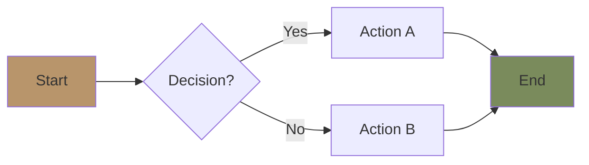

#### 2. Mindmap (Brainstorm / Hierarchy)
**When:** Strategy decomposition, persona breakdown, ideation
**Strength:** Organic + memorable
**Limit:** Not quantitative

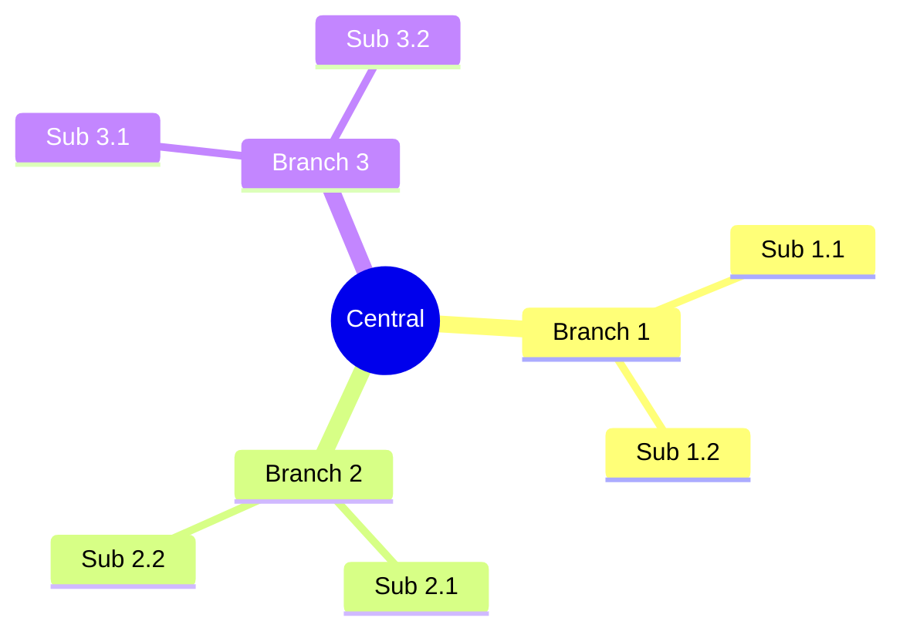

#### 3. Gantt Chart (Timeline / Project)
**When:** Sprint plan, project timeline, marketing calendar
**Strength:** Time + dependency
**Limit:** Crowded if too many task

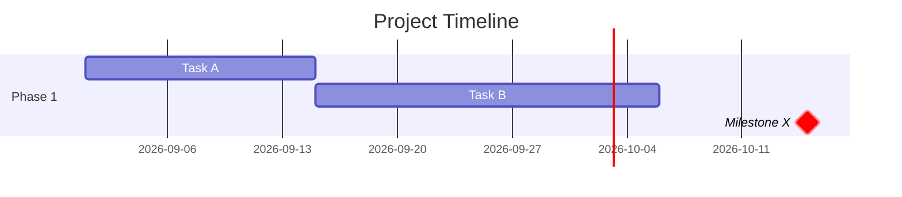

#### 4. Quadrant Chart (2x2 Matrix)
**When:** Risk, positioning, prioritization
**Strength:** Visual comparison 4-zone
**Limit:** Only 2 dimensions

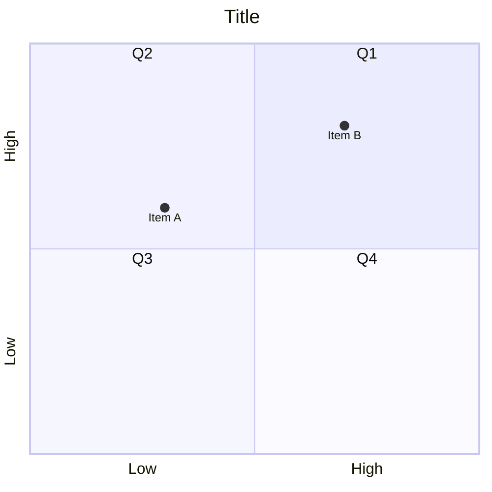

#### 5. XY Chart (Quantitative Data)
**When:** Trend, comparison, forecast
**Strength:** Numerical precision
**Limit:** Needs data

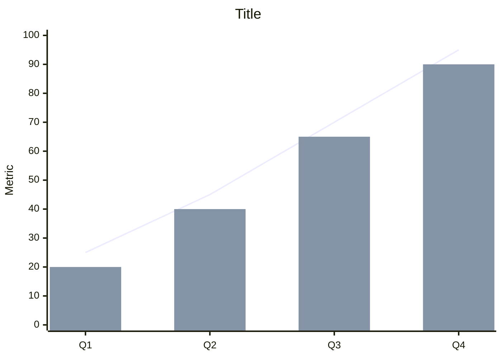

#### 6. Pie Chart (Composition)
**When:** Budget breakdown, distribution, mix
**Strength:** Part-of-whole
**Limit:** Max ~6 slice

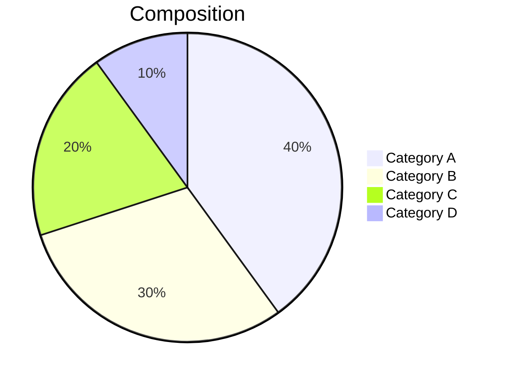

### Advanced (Specialized Use)

#### 7. Sequence Diagram (Interaction)
**When:** API flow, customer-staff interaction, system integration
**Strength:** Time-ordered interaction
**Limit:** Many participants get tangled

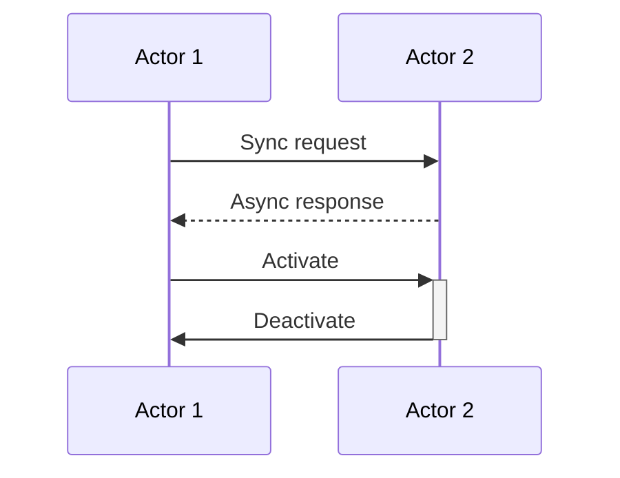

#### 8. State Diagram (Status Flow)
**When:** Order state, project lifecycle, customer status
**Strength:** State + transition
**Limit:** Not for time-based

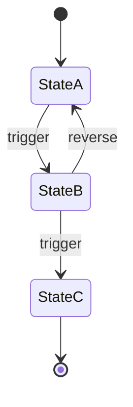

#### 9. Journey Diagram (Customer Experience)
**When:** Customer journey, employee journey, touchpoint
**Strength:** Emotional + scored
**Limit:** Less precise

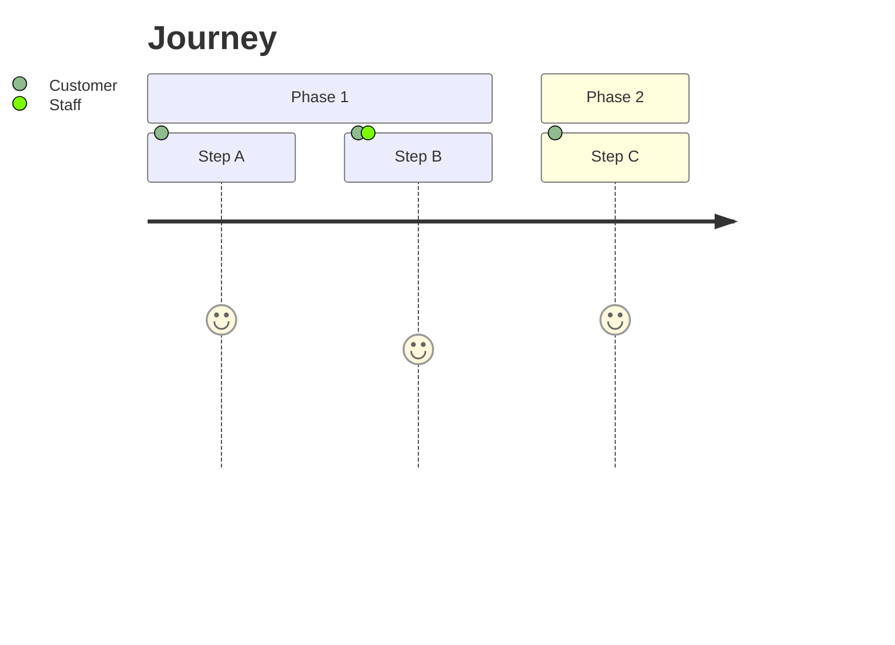

#### 10. Class Diagram (Relationship)
**When:** Data model, OOP design, schema
**Strength:** Type + relationship
**Limit:** Technical audience

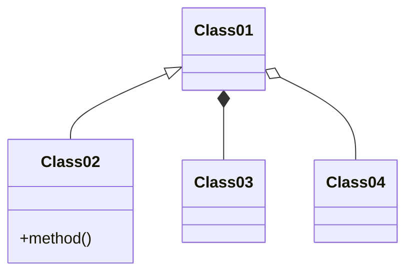

### Specific Use (Niche)

#### 11. ER Diagram (Database)
**When:** Database schema design
**Strength:** Entity + relationship
**Limit:** Technical only

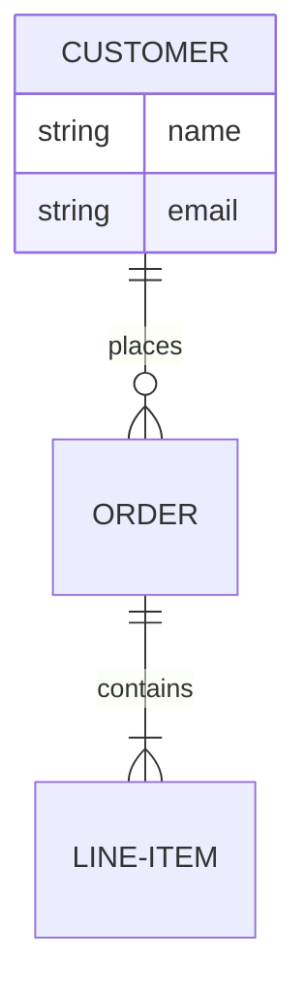

#### 12. C4 Diagram (Architecture)
**When:** Software architecture layered
**Strength:** Abstraction levels
**Limit:** Software-specific

#### 13. Git Graph (Version)
**When:** Code branch, version flow
**Strength:** Branch + merge clarity
**Limit:** Dev-specific

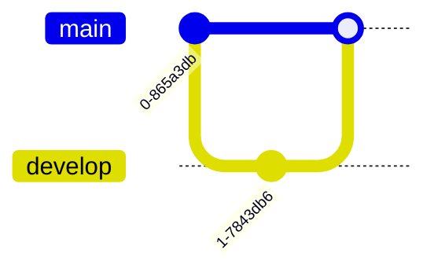

#### 14. Sankey (Flow Volume)
**When:** Energy flow, budget flow, conversion funnel
**Strength:** Flow proportion
**Limit:** Mermaid support evolving

#### 15. Timeline (Linear Time)
**When:** History, milestone, narrative
**Strength:** Chronological clarity
**Limit:** Single dimension time

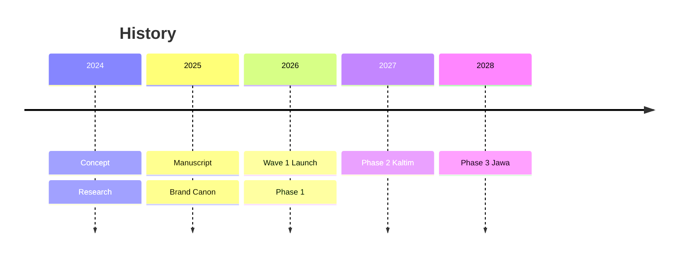

### Composite Patterns

#### 16. Multi-Stack (Layered)
Combine flowchart subgraph for layered architecture

#### 17. Hub-Spoke (Central + Radiate)
Flowchart with central node + many leaf

#### 18. Comparison Chart (Side-by-Side)
Bar + line combo in xychart-beta

#### 19. Heatmap (Color-Coded Matrix)
Quadrant with strategic color zoning

#### 20. Composite Dashboard (Multi-Chart)
Multiple charts in sequence for dashboard view

## Chart Selection Decision Tree

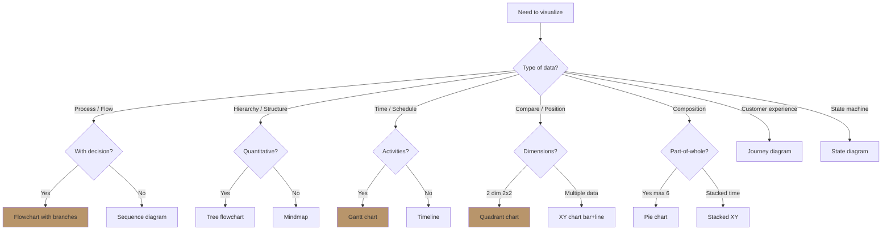

## Brand Canon Visual Style (Universal)

### Color Palette LOCKED
- **Brass `#B8956B`:** focal point, hero element, brand mark, key concept
- **Charcoal `#1F1A14`:** text dominant, primary node (with Ivory text)
- **Ivory `#FAF8F4`:** background, breathing space, neutral fill
- **Warm Tan `#D4B895`:** secondary accent, soft fill
- **Deep Brown `#3D2F22`:** wood reference, depth secondary
- **Sage `#7A8B5C`:** positive signal, success, go
- **Rust `#A0522D`:** warning, attention rare, stop

### Mermaid Color Syntax
```
style NodeA fill:#B8956B
style NodeB fill:#1F1A14,color:#FAF8F4
style NodeC fill:#7A8B5C
style NodeD fill:#A0522D
```

### Typography
- Mermaid auto-renders Inter sans-serif (acceptable)
- Title contextual + descriptive
- Labels concise + meaningful
- No ALL CAPS body (except short labels)

### Layout Principles
- **White space generous** 30-50% of diagram area
- **Hero focal** 1 element with brass (LOCKED concept emphasis)
- **Hierarchy clear** size + color
- **Annotation contextual** (helpful, not noisy)

### Anti-pattern Visual
- ❌ Rainbow palette chaotic
- ❌ Drop shadow heavy
- ❌ 3D effect
- ❌ Gradient flashy
- ❌ Glow / glossy
- ❌ Emoji overload (>2 per visual)
- ❌ Decoration without information value

## Multi-Chart Composition Patterns

### Composition 1: Dashboard (3-4 chart)
Use case: Weekly ops report, brand health, financial snapshot
- Top: KPI quadrant overview
- Mid: Trend line + bar
- Bottom: Composition pie + detail

### Composition 2: Strategic Story (sequential)
Use case: Executive summary, board pitch, vision narrative
- Chart 1: Current state (quadrant)
- Chart 2: Trajectory (xy line)
- Chart 3: Action sequence (gantt)
- Chart 4: Outcome (quadrant aspirational)

### Composition 3: Decision Architecture (layered)
Use case: Strategic decision, phase transition
- Tree (decision flow)
- Matrix (option compare)
- Gantt (sequence implementation)
- Mindmap (knowledge dependency)

### Composition 4: Architecture Stack (4-layer)
Use case: System, business, brand, knowledge architecture
- Flowchart subgraph layered top-to-bottom
- Each subgraph = different abstraction
- Connection between layer explicit

### Composition 5: Comparison (side-by-side)
Use case: Scenario, persona, option
- Same chart type for each item
- Aligned axes for comparison
- Visual difference clear

## Chart Quality Standards

### Per chart
- [ ] Title contextual (jelas apa visualisasi)
- [ ] Brand palette compliance LOCKED
- [ ] Hero focal element (kalau ada)
- [ ] Labels meaningful (no jargon)
- [ ] Hierarchy clear
- [ ] White space generous
- [ ] Annotation kalau perlu
- [ ] Mermaid syntax valid (render-able)
- [ ] Audience-appropriate complexity

### Per composition
- [ ] Logical sequence (kalau dashboard)
- [ ] Consistent style (palette + typography)
- [ ] Aligned narrative (chart story together)
- [ ] No redundancy (each chart different angle)

## Audience-Specific Chart Selection

### For Matthew (Executive)
- Quadrant chart (decision support)
- Flowchart decision tree
- Mindmap (overview)
- 5-15 nodes maximum

### For Tim Pusat (Operational)
- Gantt chart (project)
- Sequence diagram (process)
- Detailed flowchart
- 10-30 nodes acceptable

### For External (Press / Investor)
- Polished xy chart (trajectory)
- Quadrant (positioning)
- Timeline (narrative)
- Premium hangat refined

### For Customer-facing (rare)
- Journey diagram (emotional)
- Mindmap (philosophy)
- Visual metaphor
- Simplified

## Sample Use Cases per Chart Type

### Atmaja
- Strategic decomposition: Flowchart tree
- Multi-agent synthesis: Sequence diagram
- QBR review: Composite dashboard (quadrant + bar + pie)
- Founder briefing: Quadrant + bar (simple)
- Vision roadmap: Gantt + mindmap

### CMO
- Funnel analysis: Flowchart + bar
- Customer journey: Journey diagram
- Campaign calendar: Gantt
- Persona priority: Quadrant
- Channel performance: XY bar + line

### COO
- Sprint plan: Gantt
- Workflow design: Flowchart swimlane
- Risk matrix: Quadrant
- Capacity planning: XY line trend
- Org chart: Flowchart tree

### CCO
- Brand architecture: Flowchart tree
- Visual identity: Mindmap
- Editorial workflow: Flowchart
- Brand audit: Composite (quadrant + trend + pie)
- Persona emotional: Journey

### CFO
- P&L waterfall: XY bar
- Cash flow trend: XY line
- Budget breakdown: Pie
- Investment ROI: Quadrant
- Margin trend: XY line + bar
- Break-even sensitivity: Quadrant

## Mermaid Syntax Quick Reference

### Common Direction (flowchart)
- `TD` Top-down
- `LR` Left-right
- `BT` Bottom-top
- `RL` Right-left

### Common Shape (flowchart)
- `A[Rectangle]` Standard
- `A(Round)` Rounded corner
- `A((Circle))` Circle
- `A{Diamond}` Decision
- `A[/Parallelogram/]` Input/Output
- `A>Asymmetric]` Tag

### Common Arrow
- `-->` Simple
- `---` Plain line
- `-.->` Dotted
- `==>` Thick
- `--o` Circle end
- `--x` Cross end

### Mermaid Pitfall
- Long label: use `<br/>` for line break
- Special character: escape with `&` or `\`
- Subgraph: `subgraph SubName[Display Label]`

## Anti-Pattern Visualization

### Common mistake
- ❌ Wrong chart for data type (force fit)
- ❌ Too many nodes (>30 cluttered)
- ❌ Too few nodes (<3 trivial)
- ❌ Color violation (off-canon)
- ❌ Decoration without meaning
- ❌ Inconsistent style across diagrams
- ❌ Mermaid syntax error

### Fix approach
- Start with chart selection tree (above)
- Iterate to balance detail (3-15 nodes ideal)
- Brand canon validate
- Test render before commit

## Universal Invocation

### Any agent can invoke:
```
visual-thinking-toolkit {
  chart_type: "{chart from 20+ library}",
  data: "{data to visualize}",
  audience: "Matthew / team / stakeholder / external",
  composition: "single / dashboard / story / layered"
}
```

## Brand Canon Compliance

Every chart MUST:
- [ ] Brand palette compliance (Brass + Charcoal + Ivory + secondary)
- [ ] Typography sans-serif acceptable (Mermaid default)
- [ ] No drop shadow / 3D / gradient flashy
- [ ] Hero focal (kalau ada concept LOCKED)
- [ ] Title contextual (Indonesian or English appropriate)
- [ ] Labels brand-canon-compliant (no em-dash, "tempat" not "rumah" kalau ada)
```

## Visual Output

Chart type selector decision tree:

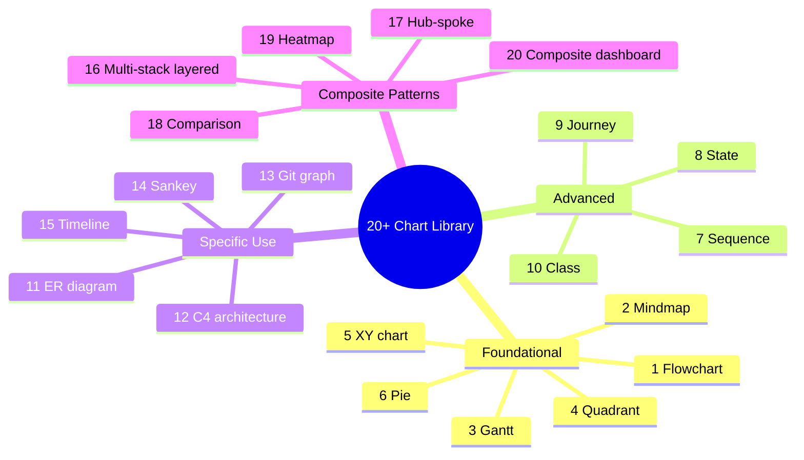

Chart palette + style:

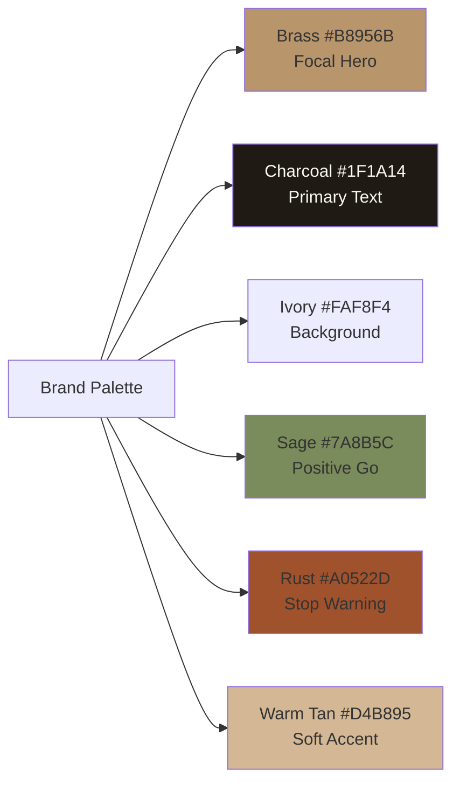

Audience-chart match quadrant:

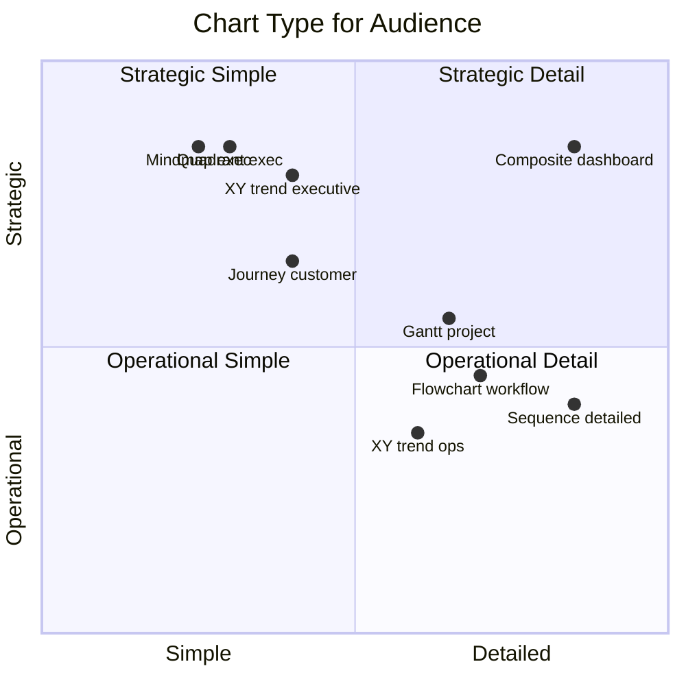

## Knowledge Dependency

- architectural-model (Atmaja foundation)
- CCO visual-summary (paired universal)
- CCO visual-identity-system (canon source)
- Brand Canon LOCKED
- All agents (universal callable)

## Mode

Default: REFERENCE (provide library)
Switch: EXECUTION kalau specific chart request

## Tools Required

- artifacts (rendering)
- file-search (data context)

## Validation Criteria

- 20+ chart type covered
- Per type: when + strength + limit + Mermaid template
- Chart selection decision tree
- Brand canon visual style strict
- Mermaid color + typography + layout
- Multi-chart composition pattern (5)
- Quality standards per chart
- Audience-specific selection
- Sample use case per agent
- Mermaid syntax quick reference
- Anti-pattern + fix approach

## Sample I/O

**Input:** "Visual thinking toolkit reference: charts library for Atmaja synthesis output"

**Output summary:**
- 20+ chart library covered (6 foundational + 4 advanced + 5 specific + 5 composite)
- Top for Atmaja: Quadrant + Mindmap + Flowchart tree + XY trend + Composite dashboard
- Selection decision tree per data type
- Brand canon: Brass focal + Charcoal text + Ivory background + Sage positive + Rust stop
- Multi-chart composition: Dashboard (3-4 chart) + Strategic Story (sequential) + Decision Architecture (layered) + Architecture Stack (4-layer) + Comparison (side-by-side)
- Audience adaptation: Matthew executive simple + Team operational detail + External polished + Customer story
- Anti-pattern: Wrong chart type + Too many node + Off-canon color
- Library mindmap + palette flow + audience quadrant embedded

## Handoff

- architectural-model (Atmaja paired)
- CCO visual-summary (universal)
- CCO visual-identity-system (canon)
- All agents (universal invocation)
- Mermaid documentation reference
