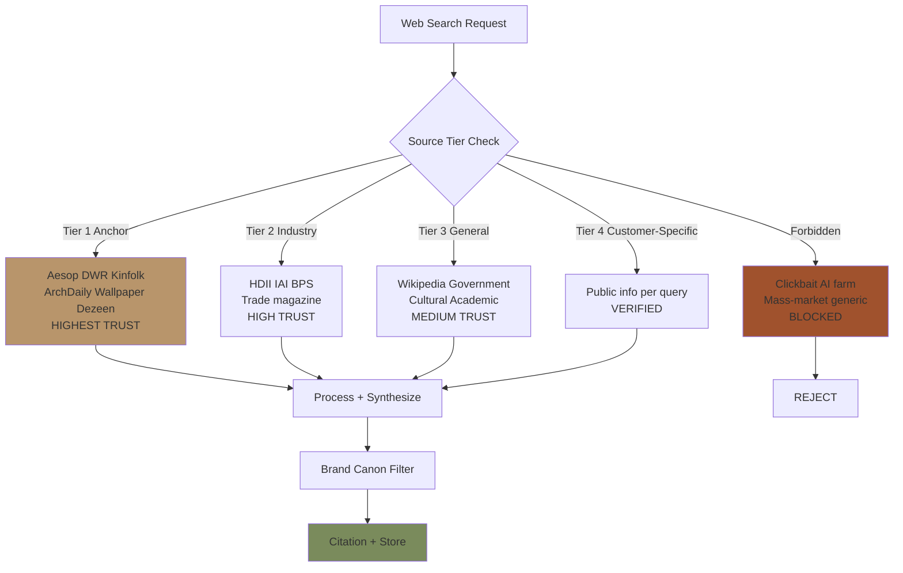
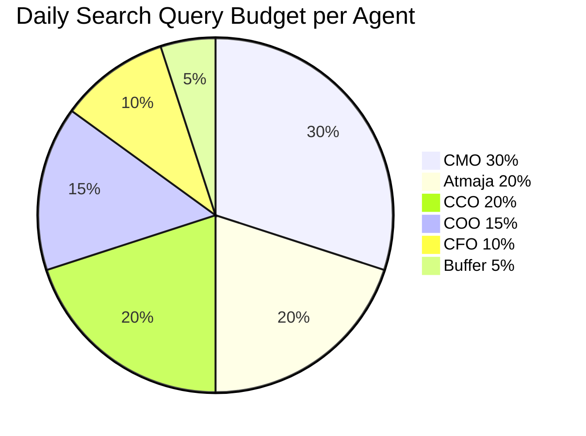
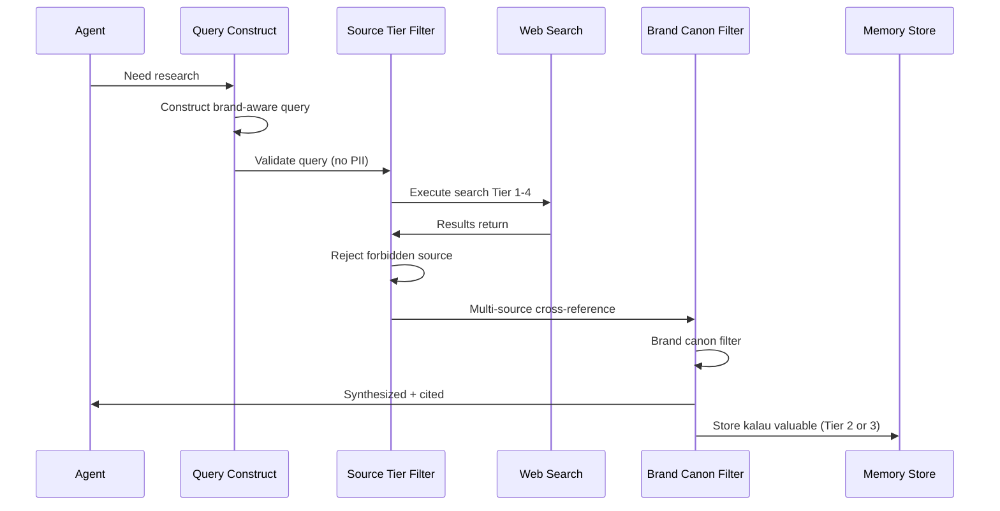

# Websearch Configuration (Brand-Aware Research Policy)

Web search policy + configuration untuk seluruh AI Department Gerai 1000 Pintu. Source tier LOCKED, brand-aware filtering, citation discipline, privacy protection. Anchor reference monitoring (Aesop + DWR + Kinfolk) prioritized.

## Triggers

Primary:
- "websearch configuration"
- "search policy"
- "web research"

Secondary:
- "research source"
- "trusted sources"

## Source Tier (LOCKED)

### Tier 1: Anchor Reference (Highest Trust + Priority)
**Sources:**
- aesop.com (official)
- dwr.com (Design Within Reach)
- kinfolk.com
- Architectural Digest editorial
- Wallpaper magazine
- Dezeen design news
- ArchDaily Indonesia
- Nendo studio official

**Use case:**
- Brand canon evolution reference
- Premium curated retail benchmark
- Editorial style inspiration
- Anchor language + vocabulary
- Visual identity refinement reference

**Frequency:** Monitored weekly (Atmaja)
**Citation:** Always attribute (anchor reference visible)

### Tier 2: Industry Trade + Authority
**Sources:**
- HDII (Himpunan Desainer Interior Indonesia) publications
- IAI (Ikatan Arsitek Indonesia) materials
- Indonesian design industry magazine (Casa Indonesia, dll)
- Trade association reports
- Government data BPS (statistik)
- Reputable financial source (Bloomberg, Reuters)
- Industry research (Nielsen, Statista, dll)

**Use case:**
- Industry trend analysis
- Market size + growth data
- Regulatory + compliance reference
- Competitor intelligence (industry-level)
- Indonesian retail context

**Frequency:** As-needed (per research query)
**Citation:** Attribute source + date

### Tier 3: General + Cultural Reference
**Sources:**
- Wikipedia (foundational reference)
- Government official sites (kemenkeu, kemenkop, dll)
- Cultural + heritage sources (Indonesia design heritage)
- Academic publications
- Reputable press (Kompas, Tempo, mainstream)

**Use case:**
- General context + definition
- Cultural reference Indonesia
- Public record verification
- Background context

**Frequency:** Per query as-needed
**Citation:** Attribute + verify

### Tier 4: Customer-Initiated Specific (Per Query)
**Sources:** Customer-mentioned references
**Use case:** Address customer-specific reference
**Citation:** Verify before incorporating
**Caution:** Don't propagate untrusted source

### Forbidden Sources (LOCKED Block)
**Excluded:**
- ❌ Clickbait sites (BuzzFeed, generic listicle farms)
- ❌ AI-generated content farms (low signal)
- ❌ Mass-market e-commerce (Shopee/Tokopedia generic listing — for competitive intel only, not reference)
- ❌ Untrusted forum (Reddit / general — too noisy)
- ❌ Marketing content disguised as editorial
- ❌ Sponsored content not declared
- ❌ Pirated content (copyright violation)
- ❌ Sites with malware risk

**Why blocked:**
- Brand canon dilution (low-quality reference)
- Misinformation risk
- Off-anchor positioning
- Privacy concern

## Search Query Construction

### Brand-Aware Pattern

#### Pattern 1: Anchor Monitoring Query
```
"Aesop store [location/year] retail experience"
"Design Within Reach [collection] curation"
"Kinfolk magazine [theme] editorial"
```
Purpose: Track anchor reference evolution

#### Pattern 2: Industry Intelligence Query
```
"Indonesia premium retail [year] trend"
"Kaltim furniture market [year]"
"HDII publication [topic]"
```
Purpose: Industry context

#### Pattern 3: Competitor Intelligence (careful)
```
"Toko pintu premium [city]"
"Premium curated retail Indonesia [year]"
```
Caution: Treat as data point, not benchmark we copy
Avoid: Direct competitor name unless strategic need

#### Pattern 4: Customer Research (per project)
```
"[Customer name] project [type]"
"Architect firm [name] portfolio Indonesia"
```
Purpose: Project context
Privacy: Public info only

#### Pattern 5: Cultural Reference Query
```
"Indonesia design heritage [topic]"
"Wabi-sabi philosophy application"
"Feng shui pintu [context]"
```
Purpose: Filosofi 4-Dunia + cultural depth

### Query Quality Standards

#### Do
- ✅ Specific keywords (no generic)
- ✅ Authoritative source priority
- ✅ Date filter when relevance time-sensitive
- ✅ Multi-source verification (3+ source for material claim)
- ✅ Brand canon vocabulary in query

#### Don't
- ❌ Generic broad query (returns noise)
- ❌ Single-source claim (without verification)
- ❌ Outdated information (no date filter)
- ❌ Off-canon vocabulary
- ❌ Personal sensitive query (PII risk)

## Citation Standard (LOCKED)

### Citation Format

#### Inline reference
```
According to [Source Name] ({Date}), {fact / insight}.
```

#### Quote
```
"{Exact quote}" — [Source Name], {Date}, URL
```

#### Paraphrase
```
{Paraphrased content} ([Source Name], {Date}).
```

#### List reference
```
References:
1. [Source 1] - URL - Date accessed
2. [Source 2] - URL - Date accessed
```

### Citation Rules

#### Always cite when
- Quoting verbatim
- Sharing statistic / data
- Sharing factual claim from external
- Industry trend reference
- Anchor brand reference (Aesop, DWR, Kinfolk)

#### Tone in citation
- Premium hangat preserved
- Indonesian first kalau possible
- Don't break narrative flow

#### Brand canon in citation
- No em-dash in citation
- Attribution professional
- Source quality visible

## Privacy Protection (Web Search)

### NO search query containing
- ❌ Customer PII (name, address, phone)
- ❌ Financial detail (account, card)
- ❌ Vendor confidential (pricing detail)
- ❌ Strategic confidential (capex, hire pipeline)
- ❌ Personal Matthew (private)

### Search query proxy
Use generic terms instead:
- ❌ "Bapak Anton Cluster Borneo project status"
- ✅ "Project residential cluster Balikpapan trend"

### Privacy review per query
- High-sensitivity query: skip OR generic alternative
- Default: redact + generalize

## Rate Limiting + Cost Management

### Query Volume Budget

#### Daily Budget per Agent
- **Atmaja:** ~20 queries/day (orchestrator, broad)
- **CMO:** ~30 queries/day (market + competitor + content research)
- **COO:** ~15 queries/day (vendor + industry)
- **CCO:** ~20 queries/day (anchor + brand reference)
- **CFO:** ~10 queries/day (financial + benchmark)

#### Monthly Budget Total
- Estimated: ~3000 queries/month total
- Cost (with paid search API): ~Rp 1.5-3jt/month
- Budget tier: Within tools subscription budget

### Query Cost Tier
- **Free tier:** Built-in basic search (default)
- **Paid Tier 1:** Premium search API (Google, Bing, dll) for specific need
- **Paid Tier 2:** Specialized (Statista, Bloomberg, dll) for premium data

### Avoid Redundancy
- Cache result 24-48 hour (Notion)
- Don't re-query same topic same day
- Share search result cross-agent (Atmaja synthesis)

## Search Result Processing

### Step 1: Source Tier Validation
- Tier 1-4 trusted sources allowed
- Forbidden sources rejected immediately
- Unknown source: validate domain + reputation first

### Step 2: Content Quality Check
- Date relevance (not outdated unless intentional)
- Authority indicator (publication, author credentials)
- Independent verification (cross-reference)

### Step 3: Brand Canon Filter
- Extract aligned with anchor (Aesop+DWR+Kinfolk style)
- Premium curated lens
- Indonesian cultural sensitivity
- Discard off-canon content

### Step 4: Synthesis + Citation
- Synthesize 2-3 source minimum
- Cite each source
- Attribute properly
- Brand canon compliant output

### Step 5: Storage (kalau perlu)
- Notable findings → memory (Tier 2 or 3)
- Tag appropriately
- Cross-reference existing knowledge

## Search Use Case per Agent

### Atmaja
- Strategic context (industry, macro trend)
- Anchor reference monitoring (Aesop, DWR evolution)
- Cross-functional research synthesis
- Competitor intelligence (strategic level)

### CMO
- Persona research (consumer trend Indonesia)
- Channel performance benchmark (industry)
- Influencer research + vetting
- Content topic trend
- Campaign reference (anchor brand)

### COO
- Vendor research + verification
- Industry compliance + regulation
- Operational best practice
- Logistics + supply chain context

### CCO
- Anchor reference deep dive (Aesop store + DWR catalog + Kinfolk article)
- Visual identity trend (Indonesia design)
- Editorial style reference
- Cultural reference Indonesia
- Press monitoring (mention tracking)

### CFO
- Financial benchmark industry
- Tax + regulation update
- Banking + working capital reference
- Pricing benchmark (premium retail)

## Anchor Reference Monitoring Pattern

### Weekly Monitor (Atmaja-led)
- Aesop press + new store + product launch
- DWR catalog + collection + editorial
- Kinfolk magazine new issue + feature
- Architect digest + Wallpaper + Dezeen mention

### Pattern Recognition
- New retail trend at anchor
- Editorial style evolution
- Vocabulary shift
- Cultural reference shift

### Apply to Gerai 1000 Pintu
- Adapt insight kalau aligned (not copy)
- Brand canon evolution (rare, Matthew approve)
- Content angle inspiration
- Visual reference (CCO)

### Anti-pattern
- ❌ Copy Aesop verbatim (we adapt, not clone)
- ❌ Chase trend (anchor is stable timeless)
- ❌ Over-monitor (don't obsess)

## Search Result Quality Audit

### Per query
- [ ] Source tier validated (Tier 1-4 only)
- [ ] Forbidden source rejected
- [ ] Multi-source verified (kalau material)
- [ ] Date relevance check
- [ ] Brand canon filter applied
- [ ] Citation complete

### Per session
- [ ] No PII leak in query
- [ ] Query within daily budget
- [ ] Result stored kalau valuable
- [ ] Cross-reference existing knowledge

### Monthly audit
- Source diversity (not over-reliant on single)
- Tier distribution (Tier 1-2 dominant healthy)
- Cost tracking
- Quality of synthesized output

## Integration with Other Infrastructure

### → memory-architecture
Search results stored:
- Working memory (session)
- Short-term Notion (week)
- Long-term Obsidian (permanent insight) — `/10-knowledge/`

### → self-learning-automation
Search behavior learns:
- Which sources Matthew trusts (preference)
- Which topics deep research valuable
- Which queries pattern emerge

### → brand-canon-enforcer (CCO)
Search filter:
- Brand canon vocabulary in query
- Brand canon filter in result
- Anchor reference priority

### → knowledge-orchestration
Search results feed:
- Tier 4 tactical → curated to Tier 3 long-term
- Pattern recognition input

## Sample Search Sessions

### Sample 1: Anchor Monitoring Weekly
**Query:** "Aesop store [city] 2026 retail experience review"
**Tier:** 1 anchor
**Process:** 3 sources cross-reference
**Output:** Insight on Aesop retail evolution stored at Tier 3 Obsidian
**Citation:** Architect Digest 2026, Wallpaper 2026
**Application:** CCO + Atmaja review for anchor refinement

### Sample 2: Industry Intelligence Quarterly
**Query:** "Indonesia premium curated retail trend 2026"
**Tier:** 2 industry
**Process:** HDII + Casa Indonesia + Statista
**Output:** Trend report synthesized
**Citation:** Multi-source
**Application:** CMO + Atmaja strategic context

### Sample 3: Vendor Research COO
**Query:** "AMK Premium Indonesia distributor capacity 2026"
**Tier:** 2 industry + 4 customer-specific
**Process:** Verify multiple source
**Privacy:** No vendor pricing leaked
**Output:** Operational context for vendor management
**Application:** COO vendor-scorecard

### Sample 4: Customer-facing Research
**Query:** "Architect firm Studio X portfolio Balikpapan"
**Tier:** 2-3 public info
**Process:** Public portfolio only
**Privacy:** No PII
**Output:** Background for collaboration discussion
**Application:** CMO outreach + CCO collaboration brief

## Brand Canon Compliance (Search Output)

- Citation: factual + clear
- Synthesis tone: premium hangat preserved
- "Gerai 1000 Pintu" lengkap kalau quote
- No em-dash di synthesis
- Anchor reference Aesop+DWR+Kinfolk visible
```

## Visual Output

Source tier hierarchy:



Per-agent search budget:



Search workflow:



## Knowledge Dependency

- self-learning-automation (paired)
- memory-architecture (paired)
- CCO brand-canon-enforcer
- Anchor reference list (Aesop+DWR+Kinfolk)
- All agents (search invocation)

## Mode

Default: BACKGROUND (search per query when needed)
Switch: AUDIT (monthly source diversity review)

## Tools Required

- WebSearch (built-in or paid API)
- WebFetch (article retrieval)
- file-search (memory cross-reference)
- artifacts (synthesized output)

## Validation Criteria

- Source tier LOCKED (Tier 1-4 + Forbidden)
- Query construction pattern (5 pattern)
- Citation standard
- Privacy protection LOCKED
- Rate limiting + cost management
- Search result processing 5-step
- Per agent use case + budget
- Anchor monitoring pattern (weekly)
- Integration with other infrastructure
- Audit cadence (per query + session + monthly)

## Sample I/O

**Input:** "Websearch configuration setup for AI Department Year 1"

**Output summary:**
- Source tier LOCKED: Tier 1 Anchor (Aesop+DWR+Kinfolk+Architectural Digest+Wallpaper+Dezeen+ArchDaily Indonesia) + Tier 2 Industry (HDII+IAI+BPS+trade magazine) + Tier 3 General (Wikipedia+gov+academic) + Tier 4 Customer-specific
- Forbidden: Clickbait + AI content farm + mass-market e-commerce generic + untrusted forum + pirated content
- Daily query budget per agent: CMO 30 + Atmaja 20 + CCO 20 + COO 15 + CFO 10 = ~95/day total ~3000/month
- Citation standard: Always attribute (inline / quote / paraphrase / list)
- Privacy: NO PII in query + redact sensitive + generic alternative
- Anchor monitoring weekly (Atmaja-led): Aesop+DWR+Kinfolk press + new launch + editorial
- Cache 24-48h to avoid redundancy
- Brand canon filter applied to result (Aesop+DWR+Kinfolk lens)
- Anti-pattern: NO copy verbatim + NO trend chase + NO over-monitor
- Source tier flow + budget pie + workflow sequence embedded

## Handoff

- self-learning-automation (paired)
- memory-architecture (paired)
- knowledge-orchestration (Atmaja)
- All agents (search invocation per use case)
- CCO brand-canon-enforcer (result filter)
