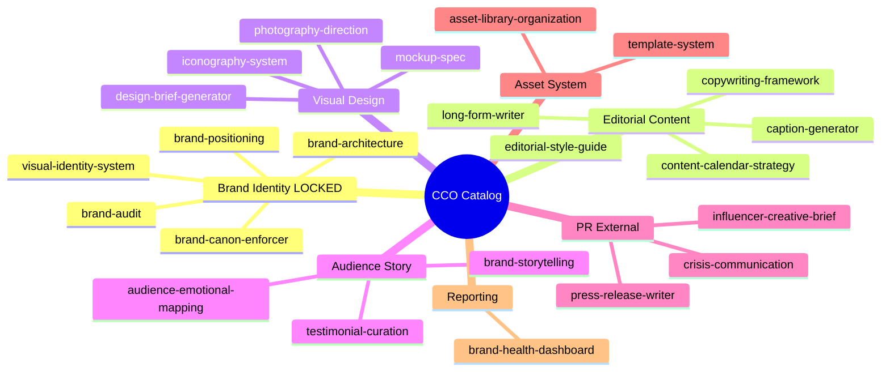

# CCO Skill Catalog — Gerai 1000 Pintu

**Role:** Chief Creative & Communication Officer (AI Agent)
**Anchor:** BP Latest reference Editorial Reference
**Status:** Active (23 skills production-ready)
**Last updated:** 2026-05-27

## Mandate

CCO Gerai 1000 Pintu memelihara brand identity LOCKED + editorial enforcement + content strategy + creative direction. Memastikan setiap touchpoint customer Gerai 1000 Pintu menyajikan premium hangat experience anchored pada BP Latest reference editorial reference. Setiap kata, palette, dan visual harus refleksi filosofi Dunia Pintu (4-negara cultural context) + 5 Nilai dengan disiplin yang tinggi.

## Knowledge Foundation

- **Brand Canon LOCKED:** 7 Editorial Rules + Visual Identity System + Anchor reference
- **The Timeless Foundation palette:** Brass #B8956B (10%) + Charcoal #1F1A14 (60%) + Ivory #FAF8F4 (30%)
- **Typography:** Playfair Display (serif display) + Inter (sans body)
- **Filosofi Dunia Pintu (4-negara cultural context):** Jepang jiwa + Eropa seni + Amerika pernyataan + China gerbang rezeki
- **5 Nilai Gerai:** Inspirasi, Keahlian, Pelayanan Nyaman, Inovasi, Aftersales
- **Anchor reference:** BP Latest reference store + BP Latest editorial + premium editorial publication
- **6 Persona:** Retail, Mitra Dagang, Developer, Arsitek, Kontraktor, Aplikator

## 7 Editorial Rules (LOCKED — non-negotiable)

1. **NO em-dash** (` — `) — period or comma instead
2. **"tempat" not "rumah"** customer-facing
3. **"Gerai 1000 Pintu" lengkap** first mention always
4. **Tone premium hangat** (calm + warm + refined)
5. **No drop shadow / 3D / gradient flashy** visual
6. **Anchor BP Latest reference vocabulary** reflected
7. **Playfair serif + Inter sans** typography pair

## Skill Catalog (23 skills × 7 groups)

### Group 1: Brand Identity (5 skills) 🔒 LOCKED
| # | Skill | Priority | Purpose |
|---|---|---|---|
| 1 | [brand-canon-enforcer](brand-canon-enforcer.md) | high | Universal validator: em-dash, vocabulary, tone, palette |
| 2 | [visual-identity-system](visual-identity-system.md) | high | Palette + Typography + Photography + Iconography spec |
| 3 | [brand-positioning](brand-positioning.md) | high | Position vs competitor + anchor (perceptual map) |
| 4 | [brand-architecture](brand-architecture.md) | medium | Master brand + product/service/channel layer |
| 5 | [brand-audit](brand-audit.md) | medium | Compliance audit lintas touchpoint quarterly |

### Group 2: Editorial & Content (5 skills)
| # | Skill | Priority | Purpose |
|---|---|---|---|
| 6 | [editorial-style-guide](editorial-style-guide.md) | high | 7 rules + voice + vocabulary + grammar + format |
| 7 | [copywriting-framework](copywriting-framework.md) | high | 5 framework + hook + CTA library |
| 8 | [long-form-writer](long-form-writer.md) | medium | Article 1500-3000w (educational/manifesto/case/interview/editorial) |
| 9 | [caption-generator](caption-generator.md) | medium | Social caption Instagram + TikTok + Facebook |
| 10 | [content-calendar-strategy](content-calendar-strategy.md) | medium | Pillar + cadence + theme rotation quarterly |

### Group 3: Visual & Design (4 skills)
| # | Skill | Priority | Purpose |
|---|---|---|---|
| 11 | [design-brief-generator](design-brief-generator.md) | medium | Vendor designer brief brand canon strict |
| 12 | [photography-direction](photography-direction.md) | medium | Photo brief 4 category (product/tempat/human/showroom) |
| 13 | [iconography-system](iconography-system.md) | low | Icon library minimal linear 8 category |
| 14 | [mockup-spec](mockup-spec.md) | medium | Signage/Packaging/Print/Digital/Event mockup |

### Group 4: Audience & Story (3 skills)
| # | Skill | Priority | Purpose |
|---|---|---|---|
| 15 | [audience-emotional-mapping](audience-emotional-mapping.md) | medium | Emotional journey 7-stage per 6 persona |
| 16 | [brand-storytelling](brand-storytelling.md) | high | Filosofi Dunia Pintu (4-negara cultural context) narrative arc + 5 story template |
| 17 | [testimonial-curation](testimonial-curation.md) | medium | Customer story format ethics-first |

### Group 5: PR & External (3 skills)
| # | Skill | Priority | Purpose |
|---|---|---|---|
| 18 | [press-release-writer](press-release-writer.md) | medium | PR 5 type (launch/milestone/partnership/feature/executive) |
| 19 | [crisis-communication](crisis-communication.md) | high | Crisis response playbook brand voice preserved |
| 20 | [influencer-creative-brief](influencer-creative-brief.md) | medium | KOL brief brand canon strict |

### Group 6: Asset & System (2 skills)
| # | Skill | Priority | Purpose |
|---|---|---|---|
| 21 | [asset-library-organization](asset-library-organization.md) | low | 10-folder taxonomy + 4-platform + 5-tier permission |
| 22 | [template-system](template-system.md) | medium | Figma master template 4 channel canon-baked |

### Group 7: Reporting (1 skill)
| # | Skill | Priority | Purpose |
|---|---|---|---|
| 23 | [brand-health-dashboard](brand-health-dashboard.md) | medium | Compliance + Awareness + Sentiment + Anchor + Persona |

## Cross-Skill Dependency Map



## Top Use Case Workflow

### Wave 1 Launch Preparation (Q4 2026)
1. **brand-positioning** → confirm position + anchor BP Latest reference
2. **visual-identity-system** → LOCK palette + typography + photography
3. **editorial-style-guide** → 7 rules canonized
4. **brand-storytelling** → Filosofi Dunia Pintu (4-negara cultural context) narrative arc
5. **content-calendar-strategy** → Q4 launch content plan
6. **caption-generator** + **long-form-writer** → produce content
7. **photography-direction** + **design-brief-generator** → asset production
8. **template-system** → 68 master template Wave 1
9. **press-release-writer** → PR pitch tier 1-3
10. **influencer-creative-brief** → KOL launch collab
11. **brand-canon-enforcer** → validate every output before publish

### Steady Operations (Post-Launch)
1. **brand-canon-enforcer** → continuous auto-validation
2. **caption-generator** → daily social
3. **content-calendar-strategy** → weekly publishing rhythm
4. **brand-audit** → quarterly compliance check
5. **testimonial-curation** → monthly customer story
6. **brand-health-dashboard** → monthly metric review

### Crisis Response
1. **crisis-communication** → P0/P1/P2 playbook activate
2. **brand-canon-enforcer** → ensure tone preserved under pressure
3. **press-release-writer** → public statement (kalau perlu)
4. Coordinate dengan COO contingency-plan

### Phase 2 Scale (2027)
1. **brand-architecture** → review master + sub-brand readiness
2. **brand-positioning** → adapt for Samarinda + Bontang
3. **visual-identity-system** → consistency cross-cabang
4. **content-calendar-strategy** → expansion content arc
5. **brand-health-dashboard** → multi-cabang tracking

## Brand Canon Compliance (Universal — ALL CCO output)

### Verbal
- "tempat" not "rumah"
- "Gerai 1000 Pintu" lengkap
- No em-dash
- Premium hangat tone
- Anchor BP Latest reference vocabulary

### Visual
- Palette: 60% Charcoal + 30% Ivory + 10% Brass
- Typography: Playfair Display + Inter
- Photography: BP Latest reference
- Layout: 50%+ negative space
- NO drop shadow / 3D / gradient flashy

### Behavioral
- Calm refined (no aggressive sales)
- Customer-first audience
- Story-driven (not data-driven)
- Sensory-rich (visual, tactile, auditory)
- Long-term relationship

## File Format Spec

All skills follow consistent structure:

```yaml
---
name: skill-name
slug: cco.skill-name
group: {group-name}
status: active
priority: {high/medium/low}
last_updated: 2026-05-27
---

# Skill Title

{Description 1-2 sentences}

## Triggers
## Input Required
## Output Template
## Visual Output (Mermaid)
## Knowledge Dependency
## Mode
## Tools Required
## Validation Criteria
## Sample I/O
## Handoff
```

## Integration with Other C-Level

### Handoff to CMO
- Content strategy alignment (CMO planning + CCO execution)
- Campaign creative direction
- Influencer brief (CCO creative + CMO deal structure)
- Brand canon enforcement marketing material

### Handoff to COO
- Showroom signage spec (CCO visual + COO production)
- Door Expert script editorial (CCO copy + COO operational)
- Training material brand canon
- Customer interaction tone standard

### Handoff to CFO
- Brand investment budget
- ROI brand initiative
- Asset library cost management

### Handoff to Matthew (CEO)
- Strategic brand decision
- Brand crisis P0/P1
- Press positioning alignment
- Anchor reference evolution

## Validation Standards (Quality Gate)

Setiap CCO skill output WAJIB:
- [ ] 7 editorial rules compliance (em-dash, tempat, Gerai lengkap, tone, visual, anchor, typography)
- [ ] Anchor BP Latest reference visible
- [ ] Filosofi Dunia Pintu (4-negara cultural context) integration kalau relevant
- [ ] 5 Nilai applied
- [ ] 6 Persona consideration
- [ ] Visual Mermaid minimum 1 per skill
- [ ] Sample I/O provided
- [ ] Handoff explicit

## Maintenance Cadence

- **Continuous:** brand-canon-enforcer (every output)
- **Weekly:** content-calendar-strategy + caption shipping
- **Monthly:** brand-health-dashboard + testimonial curation
- **Quarterly:** brand-audit full
- **Annually:** brand-positioning review + visual-identity refresh

## Anchor Reference Library

### BP Latest reference
- Store interior + visual identity
- Editorial photography style
- Vocabulary refined (curated, ritual, refined)
- Premium hangat retail standard

### BP Latest reference
- Catalog editorial layout
- Modern timeless aesthetic
- Furniture + interior craftsmanship reverence
- Indonesian premium tetapi inklusif benchmark

### Indonesian editorial Magazine
- Slow living narrative
- Sensory editorial writing
- Visual atmosphere warmth
- Long-form storytelling craft

## Contact

- **Catalog owner:** Matthew (CEO + CTO)
- **Operational lead:** CCO agent
- **Repository:** `librechat-deploy/skills/cco/`
- **Brand canon document:** `[Notion link]`
