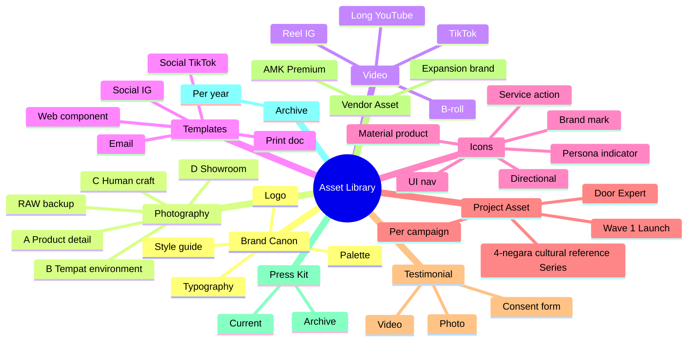
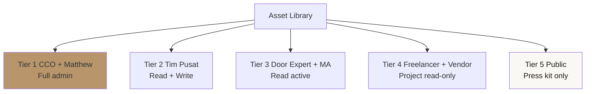

# Asset Library Organization

Organize + maintain asset library Gerai 1000 Pintu: photography, video, logo, template, icon, brand canon doc. Centralized + versioned + tagged + accessible.

## Triggers

Primary:
- "asset library"
- "asset management"
- "organize asset"

Secondary:
- "DAM digital asset"
- "asset taxonomy"

## Input Required

| Field | Type | Required | Default |
|---|---|---|---|
| scope | enum | yes | (full audit / new addition / migration / cleanup) |
| asset_count | number | no | - |

## Output Template

```markdown
# Asset Library: {SCOPE}

**Total assets:** {N}
**Organization platform:** {Figma + Notion + Google Drive + GitHub}
**Last audit:** {Date}
**Next audit:** {Date}

## Asset Taxonomy (Library Structure)

### Top-Level Folders

```
/gerai-1000-pintu-assets/
├── /01-brand-canon/
│   ├── /palette/ (color spec)
│   ├── /typography/ (font files + spec)
│   ├── /logo/ (variants + lockup)
│   └── /style-guide/ (PDF + documents)
├── /02-photography/
│   ├── /category-a-product-detail/
│   ├── /category-b-tempat-environment/
│   ├── /category-c-human-craft/
│   ├── /category-d-showroom/
│   └── /raw/ (source RAW backup)
├── /03-video/
│   ├── /reel-instagram/
│   ├── /tiktok-vertical/
│   ├── /long-form-youtube/
│   └── /b-roll/
├── /04-templates/
│   ├── /social-instagram/
│   ├── /social-tiktok/
│   ├── /email-newsletter/
│   ├── /web-component/
│   └── /print-document/
├── /05-icons/
│   ├── /brand-mark/
│   ├── /service-action/
│   ├── /material-product/
│   ├── /persona-indicator/
│   ├── /ui-navigation/
│   └── /directional/
├── /06-project-asset/
│   ├── /wave-1-launch/
│   ├── /4-dunia-series/
│   ├── /door-expert-campaign/
│   └── /[per-campaign]/
├── /07-testimonial/
│   ├── /photo/
│   ├── /video/
│   └── /consent-form/
├── /08-vendor-asset/
│   ├── /amk-premium/
│   ├── /expansion-brand/
│   └── /reference/
├── /09-press-kit/
│   ├── /current/
│   └── /archive/
└── /10-archive/
    └── /[year]/
```

## Naming Convention (LOCKED)

### Pattern
```
gerai_{type}_{category}_{descriptor}_{variant}_{size-or-version}.{ext}
```

### Examples
```
gerai_photo_a_brasshandle_macro_4k.jpg
gerai_photo_b_foyer_morninglight_4k.tif
gerai_photo_c_konsultasi_hand_2k.jpg
gerai_photo_d_storefront_golden_4k.jpg
gerai_logo_primary_charcoal_2000px.svg
gerai_logo_inverse_ivory_2000px.svg
gerai_icon_service_konsultasi_outline_24.svg
gerai_template_ig-feed_philosophy_v2.fig
gerai_video_reel_4dunia-jepang_1080x1920.mp4
gerai_template_email-newsletter_monthly_v3.html
```

### Rules
- Lowercase only (no caps)
- Underscore separator (no space, no hyphen unless multi-word descriptor)
- Date kalau version: `YYYY-MM-DD` at end
- Version increment: `v1`, `v2`, etc.
- No special character (no `&`, `%`, `()`)

## Metadata Tagging System

### Mandatory tags
| Tag | Values | Purpose |
|---|---|---|
| Category | photo / video / template / icon / logo / doc | Type |
| Sub-category | a-product / b-environment / c-human / d-showroom etc | Sub-classification |
| Status | active / archive / deprecated | Lifecycle |
| Use | catalog / social / web / print / press | Distribution |
| License | in-house / stock / commissioned / cc | Rights |
| Consent | signed / pending / n/a | Privacy |
| Created date | YYYY-MM-DD | Tracking |
| Last updated | YYYY-MM-DD | Versioning |
| Campaign | wave-1 / 4-dunia / etc OR generic | Project link |
| Persona relevance | retail / mitra / dev / arsitek / kontraktor / aplikator / all | Targeting |

### Optional tags
- Photographer / creator
- Source (kalau stock)
- Resolution
- File size
- Color space
- Aspect ratio

## Storage + Access Platform

### Primary: Figma (Visual + Template)
- All design template master
- Brand canon visual reference
- Icon library full
- Component library (UI)
- Access: Tim Pusat (CCO + Marketing) edit, freelance view-only

### Secondary: Google Drive (Photography + Video + Doc)
- High-res photo + raw backup
- Video files
- Source document (Word, PDF)
- Press kit assembled
- Access: Tim Pusat + Door Expert view

### Tertiary: GitHub (Code + Web Asset)
- Logo SVG source
- Icon SVG source
- Web component
- Brand canon JSON spec
- Access: Developer + Tim Pusat

### Quaternary: Notion (Documentation + Index)
- Asset library index + searchable
- Brand canon documentation
- Style guide reference
- Workflow + protocol
- Access: All Tim Pusat read

## Versioning Discipline

### Version control rule
- Major change → new version (`v1` → `v2`)
- Minor edit → date-stamped (`_2026-11-14`)
- Deprecated → move to archive, mark deprecated tag

### File supersession
- Old version retained in archive (don't delete)
- Index update: which version current
- Communication when version change major

### Source file vs export
- Always preserve source (Figma `.fig`, PSD, AI)
- Export variants tracked separately
- Source naming + export naming linked

## Access Permission Tier

### Tier 1: CCO + Matthew (Full admin)
- Read + write + delete + share
- Permission management
- Library audit + cleanup

### Tier 2: Tim Pusat Marketing + Brand
- Read + write
- Asset upload + tag
- Template usage + adapt

### Tier 3: Door Expert + MA
- Read access (current active asset)
- Cannot edit master
- Can adapt for konsultasi use

### Tier 4: Freelancer + Vendor
- Read access (project-specific)
- View-only or download with restriction
- Cannot share externally

### Tier 5: Public (Press kit)
- Specific folder public link
- Press kit downloadable
- Brand mark logo download (with usage guide)

## Asset Lifecycle Management

### Stage 1: Production
- Asset created per design brief / photo direction / etc.
- Source file saved with naming convention
- Initial tag applied

### Stage 2: Approval
- Brand canon validate
- CCO review
- Approved → move to active library

### Stage 3: Distribution
- Adapted per channel
- Tracked usage (which asset used where)
- Performance correlation (kalau measurable)

### Stage 4: Refresh
- Quarterly review: is asset still on-brand?
- Year-end audit: archive vs deprecate

### Stage 5: Archive / Retire
- Outdated → archive (keep for reference)
- Off-brand → deprecate (don't use)
- Sensitive (customer with revoked consent) → delete with audit log

## Audit Cadence

### Weekly
- New asset tagged + indexed
- Versioning current
- Permission consistent

### Monthly
- Folder structure clean (no rogue files)
- Naming convention compliance check
- Most-used asset analytics

### Quarterly
- Full library audit
- Deprecated asset cleanup
- Brand canon compliance refresh
- Asset gap identified (what we need but don't have)

### Annually
- Major library reorganization (kalau perlu)
- Platform migration assessment
- Backup integrity check
- Access permission audit

## Search + Discovery

### Search keywords (Figma + Notion + Google Drive)
- By asset name (descriptive)
- By tag (campaign, persona, category)
- By date range
- By status (active, archive)
- By usage (most-used, recent)

### Discovery features
- Notion: dashboard view (most-used, recent, by campaign)
- Figma: published library (drag-drop into design)
- Google Drive: starred + folder structure
- GitHub: README per folder

## Backup + Disaster Recovery

### Backup strategy
- **Daily:** Auto-sync to cloud (Google Drive + Figma)
- **Weekly:** Local hard drive backup (Tim Pusat)
- **Monthly:** Cold storage backup (external HDD off-site)
- **Quarterly:** Cloud-to-cloud (Google ↔ Dropbox secondary)

### Recovery testing
- Test restore quarterly
- Verify integrity
- Document recovery time

## Brand Canon Compliance Audit

### Asset library audit checklist
- [ ] Logo variant complete (primary + inverse + monogram + icon)
- [ ] Palette swatch reference (Brass + Charcoal + Ivory + secondary)
- [ ] Typography font file (Playfair + Inter all weight)
- [ ] Photography library 4 category populated
- [ ] Icon library 8 category covered
- [ ] Template Figma master 5+ per channel
- [ ] Press kit current (photo + factsheet + bio)
- [ ] No off-canon legacy asset (cleanup)

### Quality standards
- All asset Naming convention applied
- All asset tagged (mandatory tag minimum)
- Source file preserved
- Source-to-export link clear

## Onboarding New Team Member

### Asset library orientation
1. Brand canon document review (Notion + PDF)
2. Figma library tour
3. Google Drive structure walkthrough
4. Naming convention reference card
5. Tag system overview
6. Permission tier + access setup
7. Search + discovery hands-on
8. Q&A session

### Reference card (1-page)
```
Asset Library Quick Reference

Naming: gerai_{type}_{category}_{descriptor}_{variant}_{size}.{ext}
Folders: /01-brand-canon to /10-archive
Platform: Figma (visual) + Drive (photo/video) + GitHub (code) + Notion (doc)
Mandatory tag: category, sub-category, status, use, license, consent
Versioning: v1 → v2 major, date-stamp minor
Access: Tier 1-5 per role
Audit: Weekly tag, Monthly clean, Quarterly full, Annual reorg
Need help: CCO + Marketing Lead
```

## Sample Asset Inventory Snapshot

| Folder | Asset Count | Last Updated |
|---|---|---|
| /01-brand-canon | 25 | 2026-09-15 |
| /02-photography | 450 | 2026-10-20 |
| /03-video | 65 | 2026-10-18 |
| /04-templates | 80 | 2026-10-22 |
| /05-icons | 60 | 2026-09-30 |
| /06-project-asset | 200 | 2026-10-22 |
| /07-testimonial | 35 | 2026-10-15 |
| /08-vendor-asset | 40 | 2026-10-10 |
| /09-press-kit | 20 | 2026-10-25 |
| /10-archive | 150 | 2026-08-30 |
| **Total active** | **1,125** | - |
```

## Visual Output

Asset taxonomy tree:



Access permission tier:



## Knowledge Dependency

- visual-identity-system
- brand-canon-enforcer
- photography-direction
- iconography-system
- template-system (paired)
- design-brief-generator

## Mode

Default: EXECUTION (organize / audit)
Switch: NEED_CLARIFICATION jika scope ambigu

## Tools Required

- file-search
- artifacts (structure tree + permission diagram)

## Validation Criteria

- Top-level folder structure 10 category
- Naming convention LOCKED
- Metadata tagging system mandatory + optional
- Storage platform 4-tier (Figma + Drive + GitHub + Notion)
- Versioning discipline rule
- Access permission 5-tier
- Asset lifecycle 5-stage
- Audit cadence (weekly/monthly/quarterly/annually)
- Search + discovery feature
- Backup + DR strategy
- Brand canon compliance audit
- Onboarding orientation
- Sample inventory snapshot

## Sample I/O

**Input:** "Asset library organization full audit Q4 2026 post Wave 1 launch"

**Output summary:**
- 10 top-level folder structured: brand-canon, photography (4 sub), video, templates (5 sub), icons (6 sub), project, testimonial, vendor, press-kit, archive
- Total active asset: 1,125
- Naming convention LOCKED applied 100%
- Mandatory tags: 10 tag per asset (category, status, use, license, consent, etc.)
- Platform: Figma master (visual) + Google Drive (photo/video) + GitHub (code) + Notion (doc index)
- Versioning: v1 → v2 major, date-stamp minor
- Access: Tier 1 CCO+Matthew full → Tier 5 Public press kit
- Lifecycle: Production → Approval → Distribution → Refresh → Archive
- Audit cadence: Weekly tag, Monthly clean, Quarterly full, Annual reorg
- Backup: Daily cloud, Weekly local, Monthly off-site, Quarterly cloud-to-cloud
- Onboarding: 1-page reference card + 8-step orientation
- Taxonomy mindmap + permission tier embedded

## Handoff

- template-system (paired)
- visual-identity-system (canon source)
- design-brief-generator (asset request)
- brand-canon-enforcer (validation)
