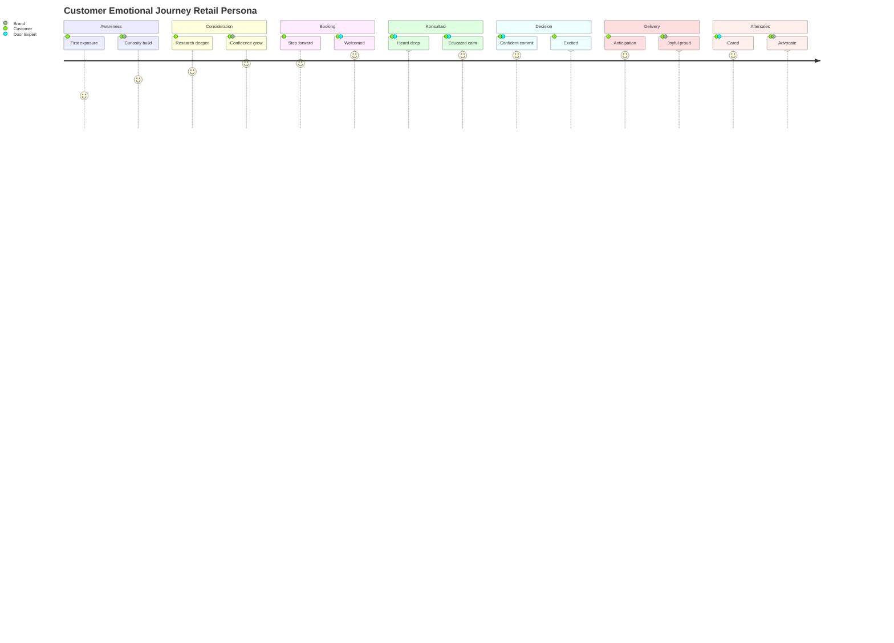
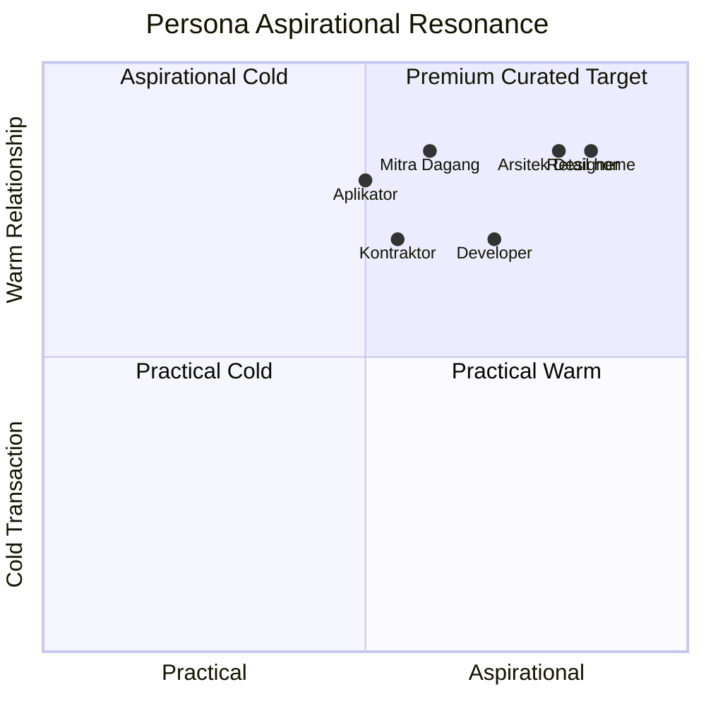

# Audience Emotional Mapping

Map emotional journey 6 Persona Gerai 1000 Pintu lintas customer touchpoint: feeling, motivation, fear, aspiration, brand connection moment. Reference Aesop hospitality + Kinfolk emotional literacy.

## Triggers

Primary:
- "emotional mapping"
- "audience journey emotion"
- "customer feeling map"

Secondary:
- "emotional architecture"
- "feeling resonance"

## Input Required

| Field | Type | Required | Default |
|---|---|---|---|
| persona | enum | yes | (Retail/Mitra/Developer/Arsitek/Kontraktor/Aplikator) |
| journey_stage | enum | no | (all stages default OR specific) |

## Output Template

```markdown
# Emotional Mapping: {PERSONA}

**Persona:** {Name + brief profile}
**Journey scope:** {Awareness → Aftersales OR specific stage}
**Reference:** Aesop hospitality + Kinfolk emotional literacy

## Persona Emotional Baseline

### Core Aspiration
{What this persona aspires to feel about themselves + their tempat}

### Core Fear
{What this persona afraid of in pintu purchase journey}

### Core Motivation
{What drives action — practical + emotional}

### Brand Connection Trigger
{Specific moment Gerai 1000 Pintu can become beloved}

## Emotional Journey Map (6 Stage)

### Stage 1: Awareness (First exposure)
**Touchpoint:** Instagram, Google search, word-of-mouth, Mitra referral

**Feeling baseline:**
- {What they're feeling about their tempat / project}
- {Concern / curiosity active}

**Internal narrative:**
- "Saya butuh pintu untuk {context}. Saya tidak tahu mulai darimana."
- "Saya lihat banyak pilihan, bingung kualitas."
- "Saya khawatir overpay atau dapat kualitas tidak sesuai."

**Brand opportunity:**
- Position Gerai 1000 Pintu sebagai trusted curator
- Reduce overwhelm dengan filosofi 4-Dunia framework
- Build credibility via Door Expert competence + project showcase

**Touchpoint design:**
- Instagram: editorial calm, premium hangat tone
- Web hero: clear value proposition + trust signal (project showcase)
- First impression: Aesop-level refined (signal we are different)

**Target emotion:** Curious + intrigued + welcomed (not pressured)

### Stage 2: Consideration (Active research)
**Touchpoint:** Website browse, catalog request, Instagram deep-dive, ask friend

**Feeling baseline:**
- Comparing options
- Building criteria
- Concern budget + quality trade-off

**Internal narrative:**
- "Apakah Gerai 1000 Pintu cocok untuk saya?"
- "Apa bedanya dengan toko pintu lain?"
- "Harga ini reasonable atau overpriced?"

**Brand opportunity:**
- Educational content (4-Dunia philosophy, material understanding)
- Transparent pricing tier
- Project case study (customer like them)
- Differentiation clear (curated + Door Expert + Aesop reference)

**Touchpoint design:**
- Catalog: editorial premium (Aesop reference)
- Blog article: depth + accessibility balance
- Photography: aspirational achievable
- Pricing transparency (tier visible)

**Target emotion:** Confident + informed + aligned (Gerai understands me)

### Stage 3: Konsultasi Booking (Decision to engage)
**Touchpoint:** WhatsApp inquiry, web form, walk-in

**Feeling baseline:**
- Brave step to commit time
- Excited + slightly nervous
- Building confidence in choice

**Internal narrative:**
- "Saya akan booking konsultasi. Hopefully ini tidak hard-sell."
- "Saya berharap Door Expert benar-benar mendengar saya."
- "Saya akan share project saya. Honest input would be great."

**Brand opportunity:**
- Easy booking (no friction)
- Warm welcome message (Door Expert intro)
- Set expectation gentle (60 min, gratis, no commitment)
- Personal touch (kalau possible, customer name)

**Touchpoint design:**
- WA opening warm + factual
- Booking confirmation premium hangat
- Calendar invite branded
- Pre-session question prep (subtle gentle inquiry)

**Target emotion:** Welcomed + safe + anticipating warmth

### Stage 4: Konsultasi Session (Deep engagement)
**Touchpoint:** Zoom session 60 min OR showroom konsultasi pod

**Feeling baseline:**
- Want to be heard + understood
- Want guidance without pressure
- Want refined experience

**Internal narrative:**
- "Door Expert ini benar-benar listening. Saya merasa dihargai."
- "Filosofi 4-Dunia menarik. Saya kepikiran tentang tempat saya."
- "Saya merasa terbantu, bukan dijual."

**Brand opportunity:**
- Deep listening (Phase 2 Discovery 15 min)
- Education calm (Phase 3 Education 15 min) — 4-Dunia + material
- Curated recommendation (Phase 4 — 3-5 option max, transparent reasoning)
- Co-decision (bukan top-down sell)

**Touchpoint design:**
- Door Expert presence: refined hangat
- Visual support: catalog + photo + Zoom screen share
- Pacing: calm, no rush
- 5 Nilai applied throughout (Inspirasi + Keahlian + Pelayanan Nyaman + Inovasi + Aftersales)

**Target emotion:** Heard + educated + curious-resolved (clarity emerging)

### Stage 5: Decision + Purchase (Commitment)
**Touchpoint:** Proposal review, decision moment, payment

**Feeling baseline:**
- Excited + nervous about commitment
- Want validation choice is right
- Want clarity timeline + process

**Internal narrative:**
- "Saya yakin ini choice yang tepat untuk tempat saya."
- "Door Expert sudah menjelaskan dengan baik. Saya percaya."
- "Saya excited untuk lihat pintu ini di tempat saya."

**Brand opportunity:**
- Proposal: editorial premium document
- Decision support: gentle confirmation tanpa pressure
- Payment transparent: DP terms clear, no hidden fee
- Timeline communication: expectation set clearly

**Touchpoint design:**
- Proposal document: catalog-like premium
- Personal note: handwritten OR personal touch
- Payment process: transparent + reassuring
- Confirmation email + WhatsApp warm

**Target emotion:** Confident + excited + cared for

### Stage 6: Delivery + Installation (Anticipation realization)
**Touchpoint:** Delivery coordination, installation visit, first touch

**Feeling baseline:**
- Anticipation
- Slight nervousness about reality vs expectation
- Want professional process

**Internal narrative:**
- "Akhirnya pintu saya tiba. Saya excited!"
- "Hopefully installasi smooth dan finishing sesuai expectation."
- "Saya akan share moment ini."

**Brand opportunity:**
- Delivery notification proactive
- Installation supervised + professional
- First touch moment: special (welcome ritual)
- Photo opportunity (customer reaction kalau consent)

**Touchpoint design:**
- Delivery: clean transport + careful unwrapping
- Installation: refined supervised
- Welcome moment: brass-wrapped key gesture OR small ritual
- Documentation: photo + warranty card premium

**Target emotion:** Joyful + proud + grateful + share-worthy

### Stage 7: Aftersales + Long-term (Relationship)
**Touchpoint:** Post-install check-in, warranty period, referral cultivation

**Feeling baseline:**
- Settling into new pintu
- Want care continuation
- Potential to recommend

**Internal narrative:**
- "Door Expert sempat follow-up. Saya merasa dihargai."
- "Saya bangga show off pintu saya ke tamu."
- "Saya akan recommend ke teman saya yang sedang renovasi."

**Brand opportunity:**
- Day 7 + Day 30 + Day 90 + Day 365 check-in protocol
- Maintenance tip premium (curated)
- Anniversary touch (Day 365 thank-you)
- Referral cultivation (subtle invitation)

**Touchpoint design:**
- Check-in WhatsApp warm
- Maintenance guide premium printed (catalog companion)
- Anniversary: small token (brass pin OR personal letter)
- Referral: gentle ask + reward Door Expert credit

**Target emotion:** Cared for + proud advocate + long-term member

## Emotional Trigger Map per Persona

### Persona Retail (rumah-pribadi)
| Stage | Trigger Emotion | Brand Action |
|---|---|---|
| Awareness | Overwhelmed → Welcomed | Calm editorial, no rush |
| Consideration | Confused → Confident | 4-Dunia framework, educational |
| Konsultasi | Nervous → Heard | Door Expert warm + listen |
| Decision | Hesitant → Aligned | Transparent + gentle |
| Delivery | Anxious → Proud | Refined process + share moment |
| Aftersales | Forgotten → Cared | Proactive check-in |

### Persona Mitra Dagang
| Stage | Trigger | Brand Action |
|---|---|---|
| Awareness | Looking for partner | Position premium curator |
| Consideration | Margin viability concern | Healthy margin transparent |
| Konsultasi | Quality reliability | Door Expert demonstrate |
| Decision | Long-term commitment | Mitra agreement clear |
| Delivery | Operational smooth | SOP standardized |
| Aftersales | Continued support | Mitra protocol active |

### Persona Developer
| Stage | Trigger | Brand Action |
|---|---|---|
| Awareness | Scale capability question | Showcase project scale ready |
| Consideration | Spec + timeline + budget | Specifier doc transparent |
| Konsultasi | Decision-maker speed | Executive briefing focused |
| Decision | Procurement compliance | Documentation per process |
| Delivery | Project timeline strict | Logistics + install smooth |
| Aftersales | Post-handover support | Project care + relationship |

### Persona Arsitek/Designer
| Stage | Trigger | Brand Action |
|---|---|---|
| Awareness | Resource discovery | Peer-level intellectual depth |
| Consideration | Quality + framework | 4-Dunia framework intellectual |
| Konsultasi | Collaboration peer | Door Expert peer-level |
| Decision | Client interest | Co-presentation possible |
| Delivery | Project alignment | Coordination smooth |
| Aftersales | Ongoing relationship | Resource continuation |

### Persona Kontraktor
| Stage | Trigger | Brand Action |
|---|---|---|
| Awareness | Reliable supplier | Operational excellence visible |
| Consideration | Bulk procurement | Volume pricing transparent |
| Konsultasi | Pragmatic specs | Specifier doc clear |
| Decision | PO process | Standardized smooth |
| Delivery | On-time strict | Logistics excellence |
| Aftersales | Issue resolution | Accountability + speed |

### Persona Aplikator
| Stage | Trigger | Brand Action |
|---|---|---|
| Awareness | Fitting accuracy | Mitra teknis position |
| Consideration | Material spec compatibility | Spec doc detailed |
| Konsultasi | Technical alignment | Training + support |
| Decision | Mitra agreement | Fair terms |
| Delivery | Fitting receive | Quality consistent |
| Aftersales | Ongoing partnership | Mitra protocol active |

## Brand Touchpoint Emotional Architecture

### Universal across persona
- **First touch:** Calm + welcomed (Aesop reference store entry)
- **Engagement:** Heard + educated (Door Expert 5 kompetensi applied)
- **Decision:** Confident + cared for (premium hangat)
- **Realization:** Joyful + proud (delivery + installation moment)
- **Long-term:** Cared + member (aftersales rigorous)

### Sensory + emotional pairing
| Sense | Emotional Pairing |
|---|---|
| Visual (Aesop refined) | Calm + intentional |
| Tactile (material wall) | Connected + tangible |
| Auditory (ambient calm) | Peaceful + focused |
| Olfactory (subtle wood) | Natural + warm |
| Gustatory (premium kopi) | Hospitality + care |

## Emotional Anti-Pattern (jangan)

### Avoid these emotional drives
- ❌ Urgency push ("BURUAN! KEHABISAN!") → triggers anxiety, not premium
- ❌ Fear-based ("Jangan salah pilih atau menyesal!") → manipulative
- ❌ Status flex ("Hanya untuk kalangan elite!") → exclusionary
- ❌ Aggressive comparison ("Mereka tidak sebagus kami!") → tasteless
- ❌ Guilt ("Tempat impian tertunda lagi?") → toxic

### Embrace these emotional drives
- ✅ Curiosity ("Apa yang membuat tempat Anda bermakna?")
- ✅ Aspiration ("Tempat impian dimulai dari pintu yang tepat")
- ✅ Warmth ("Kami sediakan waktu untuk Anda")
- ✅ Pride ("Karya yang menemani Anda bertahun-tahun")
- ✅ Belonging ("Komunitas yang menghargai detail")

## Measurement Indicator

### Per stage emotional success
| Stage | Indicator | Measurement |
|---|---|---|
| Awareness | Bounce rate low | Web analytics <40% |
| Consideration | Page depth | Avg 4+ page per session |
| Booking | Form completion | Booking rate >25% from inquiry |
| Konsultasi | Session NPS | 9/10+ per session |
| Decision | Conversion | 50%+ konsultasi to order |
| Delivery | Reaction shared | 30%+ customer post UGC |
| Aftersales | Referral | 20%+ customer refer |

### Brand sentiment
- Customer review tone analysis quarterly
- Social mention sentiment monthly
- Word-of-mouth indicator (refer survey)
- Long-term NPS tracking
```

## Visual Output

Emotional journey arc per persona:



Persona aspirational quadrant:



## Knowledge Dependency

- 6 Persona spec full
- Filosofi 4-Dunia
- 5 Nilai Gerai
- Anchor Aesop + DWR + Kinfolk
- door-expert-operating-model (COO)
- showroom-experience-design (COO)
- brand-storytelling (paired)

## Mode

Default: EXECUTION (generate map per persona)
Switch: DISCUSSION jika emotional architecture debate

## Tools Required

- file-search
- artifacts (journey + quadrant)

## Validation Criteria

- 7 stage emotional journey (Awareness → Aftersales)
- Per persona emotional trigger map
- Touchpoint design per stage
- Target emotion explicit per stage
- Universal emotional architecture
- Sensory + emotional pairing
- Anti-pattern + embrace pattern
- Measurement indicator per stage

## Sample I/O

**Input:** "Emotional mapping persona Retail untuk Wave 1 launch journey"

**Output summary:**
- Persona: Retail (rumah-pribadi premium curated seeker)
- Core aspiration: Tempat yang refleksi karakter Anda
- Core fear: Overpay, wrong choice, generic outcome
- 7 stage mapped: Awareness (curious + welcomed), Consideration (confident + informed), Booking (welcomed + safe), Konsultasi (heard + educated), Decision (aligned + cared), Delivery (joyful + proud), Aftersales (cared + advocate)
- Brand action per stage: Calm editorial (A), 4-Dunia framework (C), warm welcome (B), deep listening Door Expert (K), gentle support (D), refined delivery (Del), proactive check-in (AS)
- Sensory pairing: Visual calm + Tactile material wall + Auditory ambient + Olfactory wood + Gustatory kopi premium
- Anti-pattern: no urgency push, no fear-based, no exclusionary
- Measurement: 60%+ booking from inquiry, 9/10+ NPS konsultasi, 30%+ UGC delivery
- Journey arc + quadrant embedded

## Handoff

- brand-storytelling (narrative arc translate)
- copywriting-framework (emotional resonance)
- showroom-experience-design COO (physical embodiment)
- door-expert-operating-model COO (Door Expert behavior alignment)
