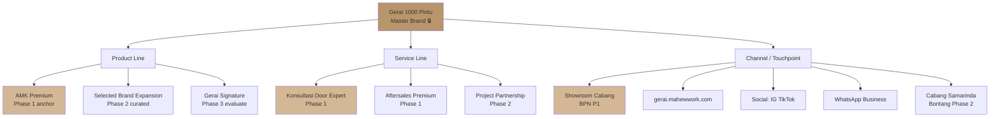
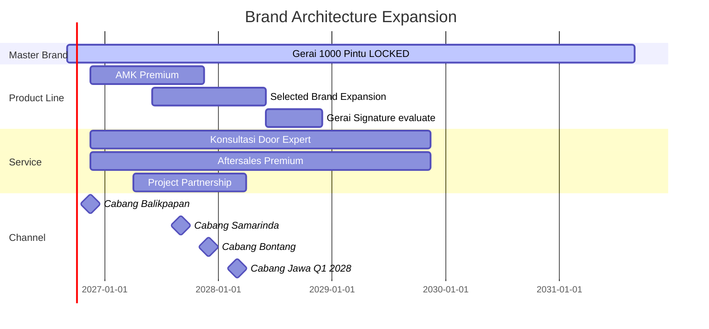

# Brand Architecture

Design brand architecture Gerai 1000 Pintu: master brand + sub-brand (kalau ada), product line, service line, expansion logic. Future-proof untuk Phase 2 scale.

## Triggers

Primary:
- "brand architecture"
- "master brand structure"
- "sub-brand strategy"

Secondary:
- "product line hierarchy"
- "brand portfolio"

## Input Required

| Field | Type | Required | Default |
|---|---|---|---|
| scope | enum | yes | (current / Phase 2 expansion) |
| context | string | no | - |

## Output Template

```markdown
# Brand Architecture Gerai 1000 Pintu

**Architecture model:** Branded House (master brand dominant)
**Status:** 🔒 LOCKED master brand
**Phase:** {Phase 1 / Phase 2}

## Architecture Model

### Branded House (chosen)
**Definition:** Master brand "Gerai 1000 Pintu" dominant, sub-brand subservient (kalau ada).

**Rationale:**
- Master brand equity concentrated (efficient invest)
- Customer recognition simple (1 name remembered)
- Cross-pollination benefit (Gerai trust transfers to all line)
- Easier brand management (1 canon, no fragmentation)

### Alternative considered (rejected)
- ❌ **House of Brands** (separate brand per product): Too fragmented untuk early-stage
- ❌ **Endorsed Brand** (sub-brand prominent + Gerai endorsed): Dilutes master brand
- ❌ **Hybrid**: Confuses customer early stage

## Master Brand: Gerai 1000 Pintu

### Brand Mark
- Wordmark: "Gerai 1000 Pintu" Playfair Display
- Variants: Primary horizontal, stacked, monogram G1P, icon-only
- Usage: ALL touchpoint customer-facing

### Brand Promise
"1000 Pintu, 1000 Mimpi (A Thousand Doors, A Thousand Dreams) — curated dengan Door Expert hangat."

### Brand Pillars
1. Premium curated (filosofi Dunia Pintu (4-negara cultural context) framework)
2. Door Expert konsultasi (5 kompetensi)
3. Refined experience (BP Latest reference anchor)
4. Lean Store + scalable (Phase 2 ready)
5. 5 Nilai applied (Inspirasi, Keahlian, Pelayanan Nyaman, Inovasi, Aftersales)

## Sub-Architecture Layer 1: Product Line

### Line 1: AMK Premium (anchor)
**Position:** Primary product line, exclusive Kaltim distribution
**Brand treatment:** "AMK Premium di Gerai 1000 Pintu" (endorsed within master)
**Visual:** Co-branded subtle, master brand dominant

### Line 2: Selected Brand Expansion (Phase 2+)
**Position:** Curated additional brand untuk completeness
**Examples:** European craftsmanship brand, Japanese minimalist brand, dll.
**Brand treatment:** "[Brand] dikurasi Gerai 1000 Pintu" (curator role explicit)
**Visual:** Co-branded equal, with Gerai curation seal

### Line 3: Gerai Signature (Phase 3, hypothetical)
**Position:** Future own-label premium line (only if margin + capability supports)
**Brand treatment:** "Gerai Signature" sub-brand within master
**Visual:** Master brand + "Signature" descriptor
**Status:** Long-term roadmap, NOT Phase 1-2

## Sub-Architecture Layer 2: Service Line

### Service 1: Konsultasi Door Expert
**Naming:** "Konsultasi Door Expert" (internal terminology kept)
**Customer-facing:** "Konsultasi dengan Door Expert kami"
**Variants:**
- Konsultasi Standar (free 60 min Zoom)
- Konsultasi Project (extended 2 jam, Senior project)
- Konsultasi Arsitek Collab (project-based fee)

### Service 2: Aftersales Premium
**Naming:** "Aftersales Premium" (internal)
**Customer-facing:** "Pendampingan setelah pintu hadir"
**Components:**
- Installation oversight
- Warranty 5-year structural + 2-year finish
- Maintenance protocol guide
- Issue resolution priority

### Service 3: Project Specifier (Phase 2)
**Position:** Architect / contractor / developer service
**Naming:** "Project Partnership"
**Components:**
- Spec consultation
- Bulk procurement support
- Project timeline alignment
- Post-handover care

## Sub-Architecture Layer 3: Channel / Touchpoint

### Channel 1: Showroom Cabang Balikpapan (Phase 1)
**Branding:** "Gerai 1000 Pintu Cabang Balikpapan"
**Visual:** Master brand identity full applied
**Signage:** Brass nameplate + Playfair Display

### Channel 2: Web platform gerai.mahewwork.com
**Branding:** Master brand consistent
**Sub-section:**
- /katalog (product browse)
- /konsultasi (booking)
- /4-dunia (philosophy)
- /aftersales (support)

### Channel 3: Social (Instagram, Facebook, TikTok)
**Branding:** Master brand consistent
**Account naming:** "@gerai1000pintu" (lengkap, no abbreviation)
**Content: refined editorial, premium hangat tone

### Channel 4: WhatsApp Business
**Branding:** Display name "Gerai 1000 Pintu — Konsultasi"
**Greeting:** Premium hangat opening

### Channel 5: Future Cabang #2-3 (Phase 2)
**Naming:** "Gerai 1000 Pintu Cabang Samarinda" (geographic suffix)
**Branding:** Master identical, geography differentiator only
**Quality:** Centralized Door Expert ensures consistency

## Naming Convention

### Customer-facing
- Always: "Gerai 1000 Pintu" lengkap (especially first mention)
- Allowed shorthand (subsequent): "Gerai" only kalau context jelas
- Never: "G1P" customer-facing (internal abbreviation only)

### Internal documentation
- Brand: "Gerai 1000 Pintu" or "G1P" shorthand OK
- Department: "Tim Pusat" (not "HQ")
- Cabang: "Cabang [Geography]" (e.g., "Cabang Balikpapan")
- Role: per BP standard (MA, Door Expert, etc.)

### Product reference
- AMK Premium: keep brand "AMK Premium" lengkap
- Expansion: "{Brand} curated by Gerai 1000 Pintu"
- Gerai Signature (future): "Gerai Signature [Line]"

### Service reference
- Always Indonesia first ("Konsultasi" not "Consultation")
- "Door Expert" English allowed (brand-specific)
- "Aftersales" English allowed (industry standard)

## Expansion Logic (Phase 2-3)

### Geographic Expansion
**Phase 2 (Q2-Q4 2027):** Cabang #2 (Samarinda) + #3 (Bontang)
- Same master brand "Gerai 1000 Pintu"
- Geographic suffix only
- Quality centralized Door Expert

**Phase 3 (2028+):** Cabang Jawa (Jakarta, Surabaya, Bandung)
- Same architecture
- Geographic expansion focus

### Product Line Expansion
**Phase 2:** Selected brand expansion (curated 2-3 brand additional)
- Brand treatment: "{Brand} curated by Gerai 1000 Pintu"
- Visual co-branded with Gerai curator seal

**Phase 3 (hypothetical):** Gerai Signature own-label
- Sub-brand naming
- Requires margin + capability validation
- Not committed yet

### Service Line Expansion
**Phase 2:** Project Partnership (architect/contractor formal)
**Phase 3:** Subscription aftersales / maintenance plan (recurring revenue)

## Brand Architecture Diagram

```
                  ┌─────────────────────────────┐
                  │   Gerai 1000 Pintu (Master) │
                  └──────────────┬──────────────┘
                                 │
        ┌────────────────────────┼────────────────────────┐
        │                        │                        │
   PRODUCT LINE             SERVICE LINE             CHANNEL
        │                        │                        │
   ┌────┴────┐            ┌──────┴──────┐         ┌──────┴──────┐
   │         │            │             │         │             │
   AMK     Selected     Konsultasi   Aftersales  Showroom   Web/Social
  Premium  Expansion    Door Expert  Premium     Cabang     WhatsApp
  (P1)    (P2)         (P1)         (P1)        (P1)        (P1)
                                                     │
                                                Cabang #2-3
                                                  (P2)
```

## Architecture Decision Rules

### When add sub-brand?
**Criteria (all must true):**
- Distinct audience that master brand cannot reach
- Pricing tier different (e.g., budget line)
- Risk of dilution if mixed

**Current assessment:** None met. Master brand sufficient Phase 1-2.

### When expand product line?
**Criteria:**
- Demand validated (>20% customer request)
- Margin viable (>30% gross)
- Brand canon maintainable (curated standard)
- Master brand strength sufficient (don't expand before solid)

### When add channel?
**Criteria:**
- Audience clear (specific persona)
- Brand canon enforceable
- Operations capacity available
- ROI measurable

## Anti-Architecture (jangan)

### Avoid these structures
- ❌ Multiple parallel brand (House of Brands)
- ❌ Sub-brand prominent (Endorsed weakens master)
- ❌ Hyphenated brand ("Gerai-Plus", "Gerai+")
- ❌ Marketing campaign sub-brand ("Gerai Spring 2027")
- ❌ Geography prefix ("Balikpapan Gerai" inverted)

## Brand Equity Investment Priority

### Year 1 (2026 Wave 1 + steady)
- 100% master brand "Gerai 1000 Pintu"
- AMK Premium subordinate
- Door Expert service prominent within master

### Year 2 (2027 Phase 2)
- 90% master brand + 10% selected brand curation seal
- Cabang #2-3 expansion same master
- Service line expansion (Project Partnership)

### Year 3 (2028 Phase 3)
- 80% master + 15% sub-brand if validated + 5% selected expansion
- Geographic Jawa expansion
- Gerai Signature evaluation
```

## Visual Output

Brand architecture tree:



Phase expansion timeline:



## Knowledge Dependency

- BP Chapter 5 (Brand Architecture decision)
- Brand Canon (master brand identity)
- Phase 1-3 roadmap (BP Chapter 18)
- brand-positioning skill
- Anchor BP Latest reference (master brand reference)

## Mode

Default: EXECUTION
Switch: DISCUSSION jika sub-brand proposal debate

## Tools Required

- file-search
- artifacts (tree + timeline)

## Validation Criteria

- Architecture model selected dengan rationale (Branded House)
- Master brand 5 pillar
- Sub-architecture 3 layer (product, service, channel)
- Naming convention explicit
- Expansion logic Phase 1-3
- Decision rules (when sub-brand / expand)
- Anti-architecture explicit
- Brand equity investment Year 1-3
- Tree diagram + timeline embedded

## Sample I/O

**Input:** "Brand architecture full untuk Phase 1-2 Gerai 1000 Pintu"

**Output summary:**
- Model: Branded House (master dominant) — rejected House of Brands + Endorsed
- Master "Gerai 1000 Pintu" LOCKED dengan 5 pillar
- Layer 1 Product: AMK Premium (P1), Selected Expansion (P2 curated), Gerai Signature (P3 hypothetical)
- Layer 2 Service: Konsultasi Door Expert + Aftersales Premium (P1), Project Partnership (P2)
- Layer 3 Channel: Showroom Cabang BPN + Web + Social + WhatsApp (P1), Cabang Samarinda + Bontang (P2)
- Naming convention: Customer-facing always lengkap, internal G1P shorthand OK
- Expansion criteria: demand validated + margin viable + canon maintainable
- Anti-pattern: no sub-brand parallel, no hyphenated, no campaign sub-brand
- Year 1: 100% master, Year 2: 90% + 10% curation seal, Year 3: 80% + sub-brand if validated
- Architecture tree + Gantt timeline embedded

## Handoff

- brand-positioning (consistency check)
- visual-identity-system (visual treatment per layer)
- CMO Gerai (channel strategy)
- COO scaling Phase 2 alignment
