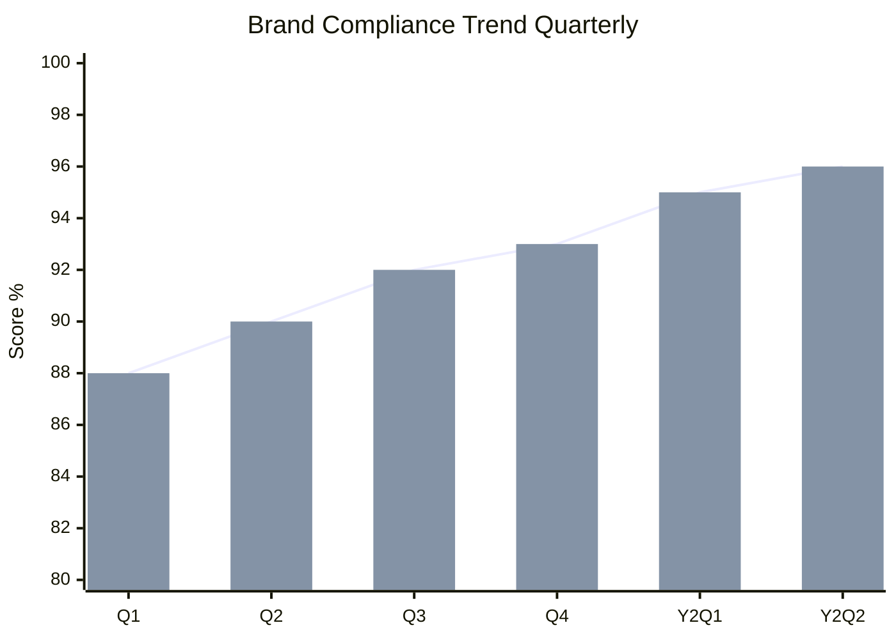
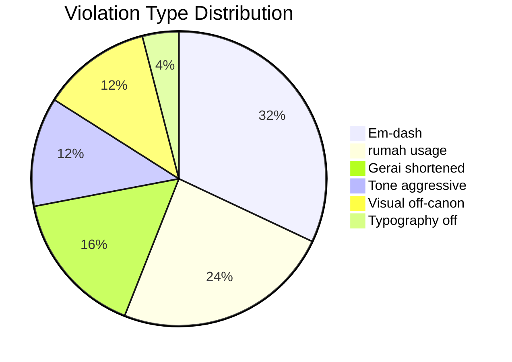

# Brand Audit (Compliance Across Touchpoint)

Audit brand canon compliance lintas touchpoint: website, social, signage, packaging, internal doc, customer interaction. Identifikasi drift, gap, quick-fix action.

## Triggers

Primary:
- "brand audit"
- "compliance check brand"
- "brand drift assessment"

Secondary:
- "touchpoint review"
- "canon enforcement audit"

## Input Required

| Field | Type | Required | Default |
|---|---|---|---|
| audit_scope | enum | yes | (full / specific touchpoint) |
| period | string | yes | (e.g., "Q1 2027" or "post Wave 1") |
| sample_size | number | no | (default per touchpoint) |

## Output Template

```markdown
# Brand Audit Report: {Period}

**Audit period:** {Date - Date}
**Scope:** {Touchpoint covered}
**Sample size:** {N items per touchpoint}
**Auditor:** Editorial Reviewer agent + CCO oversight

## Executive Summary

- **Overall compliance score:** {N}/100
- **Touchpoint compliant:** {N} of {N}
- **Critical drift:** {N} issue
- **Top fix priority:** {1-2 critical}

## Compliance Scorecard per Touchpoint

| Touchpoint | Sample | Pass | Fail | Score | Status |
|---|---|---|---|---|---|
| Instagram caption | 30 | 28 | 2 | 93% | 🟢 |
| Instagram visual | 30 | 27 | 3 | 90% | 🟡 |
| Website copy | 50 page | 47 | 3 | 94% | 🟢 |
| Website visual | 50 page | 45 | 5 | 90% | 🟡 |
| WhatsApp message | 100 | 95 | 5 | 95% | 🟢 |
| Email | 30 | 29 | 1 | 97% | 🟢 |
| Customer interaction transcript | 20 | 18 | 2 | 90% | 🟡 |
| Showroom signage | 12 | 11 | 1 | 92% | 🟢 |
| Press release | 5 | 5 | 0 | 100% | 🟢 |
| Internal document | 20 | 17 | 3 | 85% | 🟡 |
| **TOTAL** | **347** | **322** | **25** | **93%** | 🟢 |

**Threshold:**
- 95-100: ✅ Excellent
- 85-94: 🟡 Minor drift, action recommended
- 70-84: 🔴 Major drift, intervention required
- <70: ❌ Crisis, full retraining

## Rule-Specific Audit

### Rule 1: No em-dash
- **Violation count:** {N} instance
- **Top offender touchpoint:** {Channel}
- **Pattern observed:** {e.g., "writer X uses em-dash habit"}
- **Action:** {fix}

### Rule 2: "tempat" not "rumah"
- **Violation count:** {N} instance
- **Severity:** {Low/Med/High}
- **Locations:** {list}
- **Action:** {auto-correct + writer briefing}

### Rule 3: "Gerai 1000 Pintu" lengkap
- **Violation count:** {N} instance (shortened to "Gerai" in formal context)
- **Top offender:** {Channel}
- **Action:** {style guide refresher}

### Rule 4: Tone premium hangat
- **Drift indicator:** {N instance aggressive tone)
- **Examples:** {sample text}
- **Action:** {tone retraining}

### Rule 5: Visual palette compliance
- **Off-canon color detected:** {N instance}
- **Common drift:** {trendy color, gradient flashy, etc.}
- **Action:** {asset cleanup + designer briefing}

### Rule 6: Anchor reference Aesop + DWR alignment
- **Generic feel detected:** {N instance}
- **Pattern:** {commercial generic vs refined premium}
- **Action:** {visual + copy direction refresh}

### Rule 7: Typography (kalau visual)
- **Off-canon font:** {N instance}
- **Common:** {sans-serif headline, decorative font, etc.}
- **Action:** {asset replacement}

## Vocabulary Audit

### Compliance terms (used correctly)
| Term | Used count | Correct % |
|---|---|---|
| tempat | {N} | 95% |
| Gerai 1000 Pintu | {N} | 90% |
| Door Expert | {N} | 100% |
| Konsultasi | {N} | 100% |
| Filosofi 4-Dunia | {N} | 95% |
| 5 Nilai | {N} | 90% |

### Anti-vocabulary (flagged)
| Term | Instance | Should be |
|---|---|---|
| rumah (customer-facing) | {N} | tempat |
| service | {N} | pelayanan |
| consultation | {N} | konsultasi |
| Gerai (alone formal) | {N} | Gerai 1000 Pintu |
| sales | {N} | Door Expert (kalau role) |

## Tone Drift Analysis

### Spectrum check (1-10 scale)
| Attribute | Target | Avg Observed | Gap |
|---|---|---|---|
| Premium | 9 | 8.2 | -0.8 |
| Hangat | 9 | 8.5 | -0.5 |
| Calm | 8 | 7.8 | -0.2 |
| Refined | 9 | 8.3 | -0.7 |
| Aggressive sales | 0 | 0.5 | +0.5 |
| Generic corporate | 2 | 2.3 | +0.3 |

### Examples of drift
**Premium drift (slipping toward generic):**
- ❌ "Pintu berkualitas dengan harga terjangkau" (commodity tone)
- ✅ "Pintu yang dikurasi untuk tempat impian yang bermakna" (premium curated)

**Hangat drift (slipping toward cold):**
- ❌ "Hubungi customer service kami untuk informasi lebih lanjut" (transactional)
- ✅ "Door Expert kami siap menemani Anda dengan konsultasi hangat" (warm hospitality)

**Aggressive drift (slipping toward push sales):**
- ❌ "Slot konsultasi terbatas, segera daftarkan diri Anda!" (urgency push)
- ✅ "Sediakan waktu untuk konsultasi dengan Door Expert. Booking minggu ini terbuka." (calm refined)

## Visual Audit

### Photography style consistency
- Sample 30 photo: 27 ✅ aligned + 3 ❌ off-canon
- ❌ Issues:
  - Stock photo cliche (handshake)
  - Overlit harsh shadow
  - Trendy filter applied

### Palette compliance
- Sample 50 design asset
- Brass #B8956B usage: 92% correct ratio (10% area)
- Charcoal #1F1A14 dominant: 88% maintained
- Ivory #FAF8F4 breathing: 90% generous
- Off-canon color found: 5 instance (trendy season color)

### Typography compliance
- Headline Playfair: 95% used
- Body Inter: 98% used
- Off-canon font detected: 2 instance (decorative font in social)

### Layout compliance
- White space generous: 85% maintained
- Hierarchy clear: 90%
- Anti-pattern (3D, gradient flashy): 1 instance (legacy asset)

## Brand Storytelling Audit

### Filosofi 4-Dunia integration
- Touchpoint mention 4-Dunia: {N} of {N}
- Quality of mention: {Detailed / Mentioned / Missing}
- Action: increase integration di {missing channel}

### 5 Nilai application
- Mention frequency per Nilai
- Inspirasi: {N}
- Keahlian: {N}
- Pelayanan Nyaman: {N}
- Inovasi: {N}
- Aftersales: {N}
- Action: balance gap

### Anchor Aesop + DWR
- Visual reference visible: 
- Customer feedback recognition: {N mention}

## Quick-Fix Action Plan

### Priority 1: Critical Drift (action within 7 day)
1. **{Issue}** — Owner: {role} — Deadline: {date}
2. **{Issue}** — Owner: {role} — Deadline: {date}

### Priority 2: Improvement Opportunity (action within 30 day)
1. **{Issue}** — Owner: {role}
2. **{Issue}** — Owner: {role}

### Priority 3: Long-term (action quarter)
1. **{Issue}** — Owner: {role}

## Training & Refresher Recommendation

### Brand canon refresher session
- Target audience: {staff group}
- Format: {workshop / async module}
- Duration: {hours}
- Deliverable: {certification + audit pass rate improvement}

### Editorial style guide refresh
- Update {section} dengan example baru
- Distribute via internal Notion

### Visual asset cleanup
- Replace {N} off-canon asset
- Update template library
- Lock asset library access (only approved designer)

## Audit Cadence Recommendation

| Audit Type | Frequency | Sample Size | Owner |
|---|---|---|---|
| Em-dash + vocabulary scan | Weekly | 30 random | Editorial Reviewer auto |
| Tone qualitative review | Monthly | 50 sample | CCO |
| Full touchpoint audit | Quarterly | 200+ sample | CCO + external reviewer |
| Brand health survey | Annually | Customer panel | CMO + CCO |

## Benchmark Comparison

### Vs Anchor Aesop + DWR (qualitative)
- Aesop: ~98% canon consistency (industry gold standard)
- DWR: ~95% consistency
- Gerai 1000 Pintu: 93% (Year 1) — within striking distance

### Year-over-year trend
- Year 1 baseline: 93%
- Year 2 target: 96%
- Year 3 target: 98% (Aesop-level)

## Lessons Learned

### What worked (continue + reinforce)
- {Practice 1 — strong compliance area}
- {Practice 2}

### What broke (address)
- {Issue 1 — drift area}
- {Issue 2}

### Surprise findings
- {Unexpected pattern}
- {Customer feedback insight}
```

## Visual Output

Compliance heatmap per touchpoint:

```mermaid
quadrantChart
    title Brand Compliance Heatmap
    x-axis Low Volume --> High Volume
    y-axis Low Compliance --> High Compliance
    quadrant-1 Star Performer
    quadrant-2 Niche Compliant
    quadrant-3 Low Priority
    quadrant-4 At Risk High Volume
    Instagram caption: [0.85, 0.93]
    Website copy: [0.7, 0.94]
    WhatsApp message: [0.95, 0.95]
    Email: [0.6, 0.97]
    Customer transcript: [0.5, 0.9]
    Showroom signage: [0.4, 0.92]
    Press release: [0.2, 1.0]
    Internal document: [0.65, 0.85]
    Instagram visual: [0.85, 0.9]
    Website visual: [0.7, 0.9]
```

Trend over quarter:



Rule violation breakdown:



## Knowledge Dependency

- Brand Canon LOCKED full
- brand-canon-enforcer (validation method)
- editorial-style-guide
- visual-identity-system
- All touchpoint sample (CRM + social analytics + asset library)

## Mode

Default: EXECUTION (full audit)
Switch: NEED_CLARIFICATION jika sample size ambigu

## Tools Required

- file-search (sample retrieval)
- artifacts (heatmap + trend chart)
- web-search (touchpoint scrape)

## Validation Criteria

- Compliance scorecard 10+ touchpoint
- 7 rule individual audit
- Vocabulary compliance + anti-vocabulary
- Tone spectrum measured 6-attribute
- Visual + photography + palette + typography
- Brand storytelling audit (4-Dunia + 5 Nilai + Anchor)
- Quick-fix action plan priority-tiered
- Training recommendation
- Audit cadence
- Benchmark vs Aesop + DWR
- Year-over-year trend

## Sample I/O

**Input:** "Brand audit full Q3 2027 post Wave 1 + Phase 2 prep"

**Output summary:**
- Overall score 93/100 🟢 Excellent baseline
- 10 touchpoint audited, 9 pass 🟢 + 1 borderline 🟡 (Internal doc 85%)
- Top violation: em-dash (8 instance) + rumah usage (6) + Gerai shortened (4)
- Tone slight drift toward generic corporate (gap -0.7 from target premium)
- Visual: 92% palette correct + 95% Playfair headline + 2 typography drift
- Quick fix Priority 1: em-dash habit writer X (training), trendy filter Instagram (replace 3 asset)
- Refresher session: 2-hour brand canon untuk Marketing team + new MA batch
- Cadence: weekly auto-scan + monthly tone + quarterly full
- Benchmark: 93% vs Aesop 98% (within striking distance Year 2 target 96%)
- Heatmap + trend chart + pie violation embedded

## Handoff

- brand-canon-enforcer (continuous validation)
- editorial-style-guide (update kalau gap)
- training-curriculum COO (refresher schedule)
- Matthew (executive summary)
