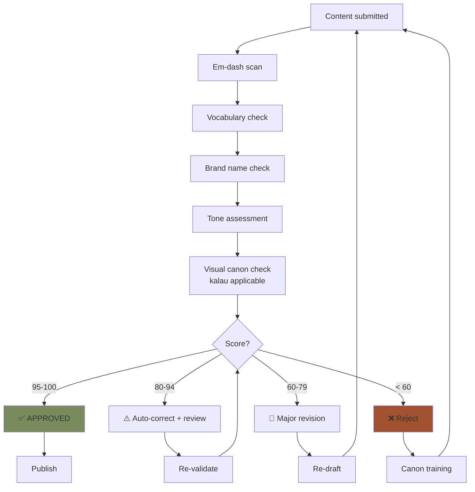
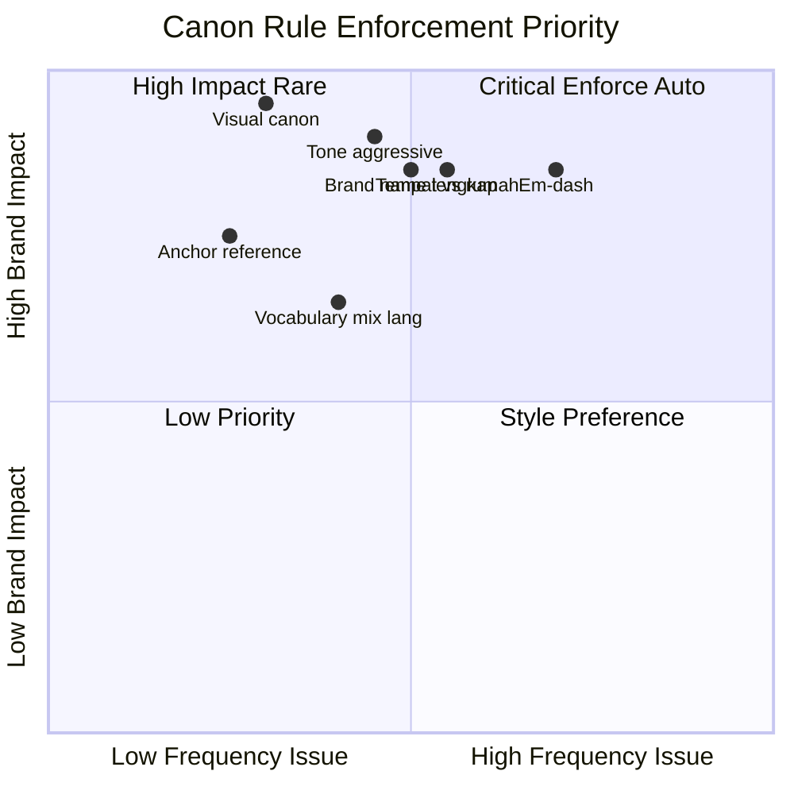

# Brand Canon Enforcer (Universal Validator)

Universal validation skill yang setiap agent dapat invoke untuk cek output sebelum publish: em-dash detection, vocabulary check (tempat/rumah), "Gerai 1000 Pintu" lengkap, tone premium hangat, palette compliance.

## Triggers

Primary:
- "validate brand canon"
- "check em-dash"
- "audit brand compliance"
- "brand canon enforce"

Secondary:
- "editorial check"
- "review tone"

## Input Required

| Field | Type | Required | Default |
|---|---|---|---|
| content | string | yes | (text/copy to validate) |
| context | enum | no | (social/website/press/internal/showroom) |
| strictness | enum | no | (strict default / advisory) |

## Output Template

```markdown
# Brand Canon Audit: {Content excerpt}

**Strictness:** {Strict / Advisory}
**Context:** {Channel}
**Result:** {✅ PASS / ⚠️ ISSUES / ❌ FAIL}

## Critical Rule Check (must 100%)

### Rule 1: No em-dash
- **Pattern:** ` — ` (em-dash with spaces) or `—` (em-dash standalone)
- **Status:** {✅ Clean / ❌ Found N instance}
- **Location:** {if found: line/sentence + suggested fix}

### Rule 2: "tempat" not "rumah"
- **Pattern:** "rumah" used in customer-facing context
- **Status:** {✅ Clean / ❌ Found N instance}
- **Suggested replacement:** "tempat" or contextual ("hunian", "tinggal")

### Rule 3: "Gerai 1000 Pintu" lengkap
- **Pattern:** "Gerai" alone or "1000 Pintu" alone in formal context
- **Status:** {✅ Clean / ❌ Found N instance}
- **Suggested:** Full brand name "Gerai 1000 Pintu" especially first mention

### Rule 4: Tone premium hangat
- **Anti-pattern:** aggressive sales ("BURUAN!", "JANGAN SAMPAI KETINGGALAN!", excessive CAPS)
- **Status:** {✅ Aligned / ⚠️ Borderline / ❌ Aggressive}
- **Suggested:** Calm refined tone, audience-first

### Rule 5: No drop shadow / 3D / gradient flashy (kalau visual)
- **Pattern:** visual element with commercial overload
- **Status:** {✅ Clean / ❌ Found / N/A text-only}

### Rule 6: Anchor reference BP Latest reference
- **Pattern:** Premium tetapi inklusif retail vocabulary consistency
- **Status:** {✅ Aligned / ⚠️ Generic / ❌ Off-anchor}

### Rule 7: Serif + sans typography (kalau visual)
- **Pattern:** Playfair serif (display) + Inter sans (caption)
- **Status:** {✅ Compliant / ❌ Off-canon / N/A text-only}

## Vocabulary Check

### Preferred terms
| Use | Avoid |
|---|---|
| tempat | rumah (customer-facing) |
| Gerai 1000 Pintu | Gerai (alone) |
| hangat | warm (translation jarring) |
| pelayanan | service (English random) |
| konsultasi | consultation (mix language) |
| tukang / aplikator | construction worker |
| Door Expert | sales / staff (kompetensi 5) |
| 5 Nilai | core values (Indonesia first) |
| filosofi | philosophy (Indonesia first) |

### Brand-specific vocabulary (locked)
- Filosofi Dunia Pintu (4-negara cultural context) (not "Four Worlds Philosophy")
- 5 Nilai Gerai (locked Indonesia)
- AMK Premium (vendor name)
- "the timeless foundation" (palette name OK English)
- BP Latest reference (anchor reference English OK)

## Tone Spectrum Check

| Tone Attribute | Target | Current | Status |
|---|---|---|---|
| Premium | High | {assess} | ✅/⚠️/❌ |
| Hangat | High | {assess} | - |
| Calm | High | {assess} | - |
| Refined | High | {assess} | - |
| Aggressive sales | None | {assess} | - |
| Generic / corporate | Low | {assess} | - |

## Sentence-Level Issue

| Line | Issue | Type | Suggested fix |
|---|---|---|---|
| {N} | {issue} | em-dash / rumah / aggressive / etc | {fix} |

## Auto-Correction (if strict mode)

### Before
```
{Original content with issues highlighted}
```

### After
```
{Corrected content compliant}
```

## Compliance Score

- **Em-dash:** {Pass/Fail}
- **Vocabulary:** {Pass/Fail/Partial}
- **Brand name:** {Pass/Fail}
- **Tone:** {Pass/Borderline/Fail}
- **Visual canon (if applicable):** {Pass/Fail/N/A}
- **Overall:** {N}/100

### Threshold
- 95-100: ✅ APPROVED publish
- 80-94: ⚠️ MINOR REVISION (apply auto-correction)
- 60-79: 🔴 MAJOR REVISION (re-draft)
- <60: ❌ REJECT (canon foundation issue)

## Examples Pattern Library

### Em-dash detection
- ❌ "Konsultasi premium — gratis 60 menit"
- ✅ "Konsultasi premium gratis 60 menit"
- ✅ "Konsultasi premium. Gratis 60 menit."

### "tempat" replacement
- ❌ "Pintu untuk rumah impian Anda"
- ✅ "Pintu untuk tempat impian Anda"
- ❌ "Bawa pulang ke rumah"
- ✅ "Bawa pulang ke tempat Anda" / "Bawa pulang ke hunian Anda"

### Brand name lengkap (first mention)
- ❌ "Gerai membantu Anda..."
- ✅ "Gerai 1000 Pintu membantu Anda..."
- (subsequent mention "Gerai" OK kalau context jelas)

### Tone premium hangat
- ❌ "BURUAN! HANYA 3 SLOT TERSISA!"
- ✅ "Slot konsultasi minggu ini terbatas. Kami sediakan waktu khusus untuk Anda."

### Anti-pattern aggressive sales
- ❌ "Jangan sampai ketinggalan promo MURAH MERIAH!"
- ✅ "Program khusus minggu ini untuk Anda yang sedang mempersiapkan tempat impian."

## Use Case per Channel

### Social Media (Instagram caption)
- Strictness: Strict
- Focus: em-dash, vocabulary, tone, hashtag premium hangat
- Auto-correct: enabled

### Website (long-form article)
- Strictness: Strict
- Focus: all 7 rules + tone consistency throughout
- Auto-correct: advisory (human review required)

### Press Release
- Strictness: Strict
- Focus: brand name lengkap, anchor reference, premium tone
- Auto-correct: disabled (manual final review)

### Internal Document
- Strictness: Advisory
- Focus: terminology consistency
- Auto-correct: disabled

### Showroom Signage
- Strictness: Strict + Visual canon
- Focus: typography + palette + vocabulary
- Auto-correct: disabled (physical install)
```

## Visual Output

Canon enforcement flow:



Rule severity matrix:



## Knowledge Dependency

- Brand Canon LOCKED full document
- Editorial Rules 7 rules
- 5 Nilai Gerai
- Filosofi Dunia Pintu (4-negara cultural context) vocabulary
- Anchor BP Latest reference
- All channel context (social, web, press, signage)

## Mode

Default: EXECUTION (auto-validate immediately)
Switch: NEED_CLARIFICATION jika ambiguity (e.g., context unclear)

## Tools Required

- regex / pattern matching
- file-search (canon reference)
- artifacts (correction display)

## Validation Criteria

- 7 critical rules covered
- Vocabulary table reference
- Tone spectrum measured
- Sentence-level issue identified
- Auto-correction provided (kalau strict)
- Compliance score 0-100
- Threshold action defined
- Use case per channel
- Example library

## Sample I/O

**Input:** `"Gerai membantu rumah impian Anda — datang sekarang ke showroom kami!"`

**Output:**
- Em-dash detected ❌ (position 35)
- "rumah" detected ❌ (position 22, customer-facing context)
- "Gerai" alone first mention ⚠️ (should be "Gerai 1000 Pintu")
- Tone: aggressive CTA "datang sekarang" ⚠️
- Score: 45/100 ❌ REJECT

**Auto-correction:**
`"Gerai 1000 Pintu membantu tempat impian Anda. Kami menunggu Anda di showroom dengan konsultasi yang hangat."`

- Em-dash removed ✅
- "rumah" → "tempat" ✅
- "Gerai 1000 Pintu" lengkap ✅
- Tone calm refined ✅
- New score: 98/100 ✅ APPROVED

## Handoff

- Any agent (universal validator before publish)
- editorial-style-guide (deep reference)
- visual-identity-system (visual rule extension)
- brand-audit (compliance aggregation)
