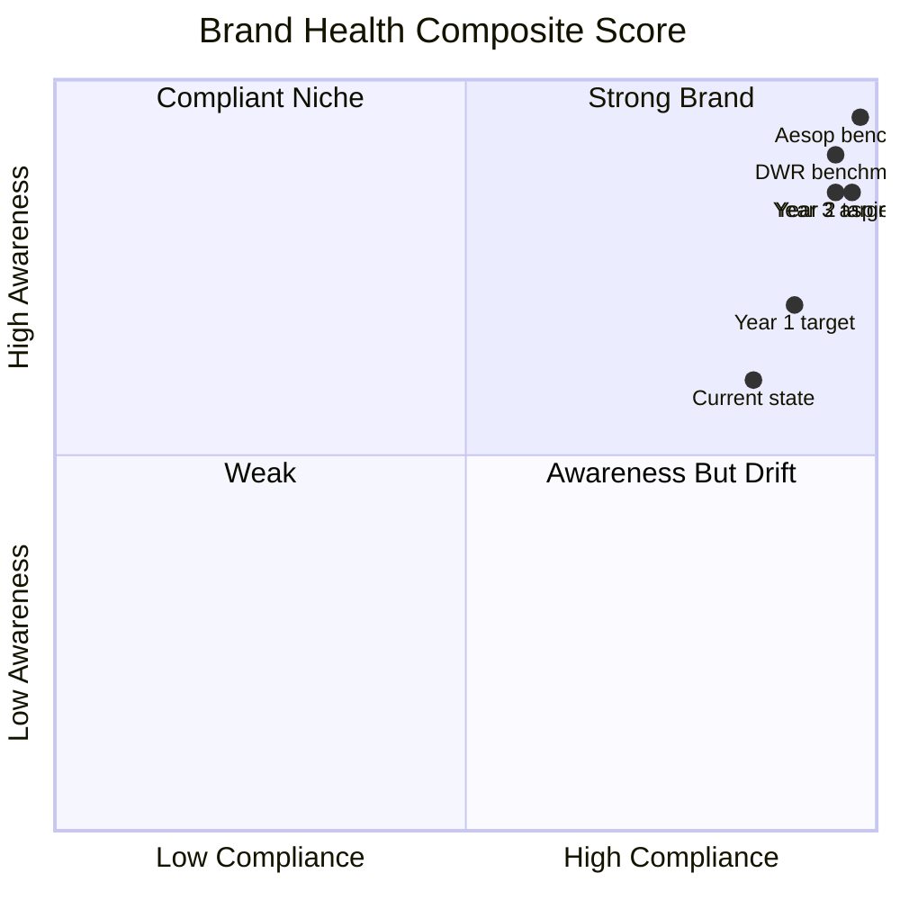
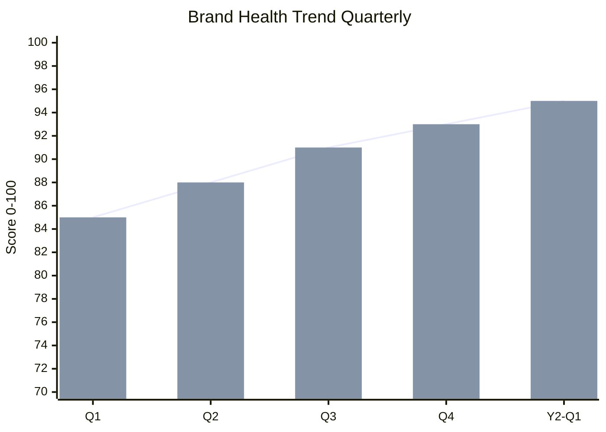
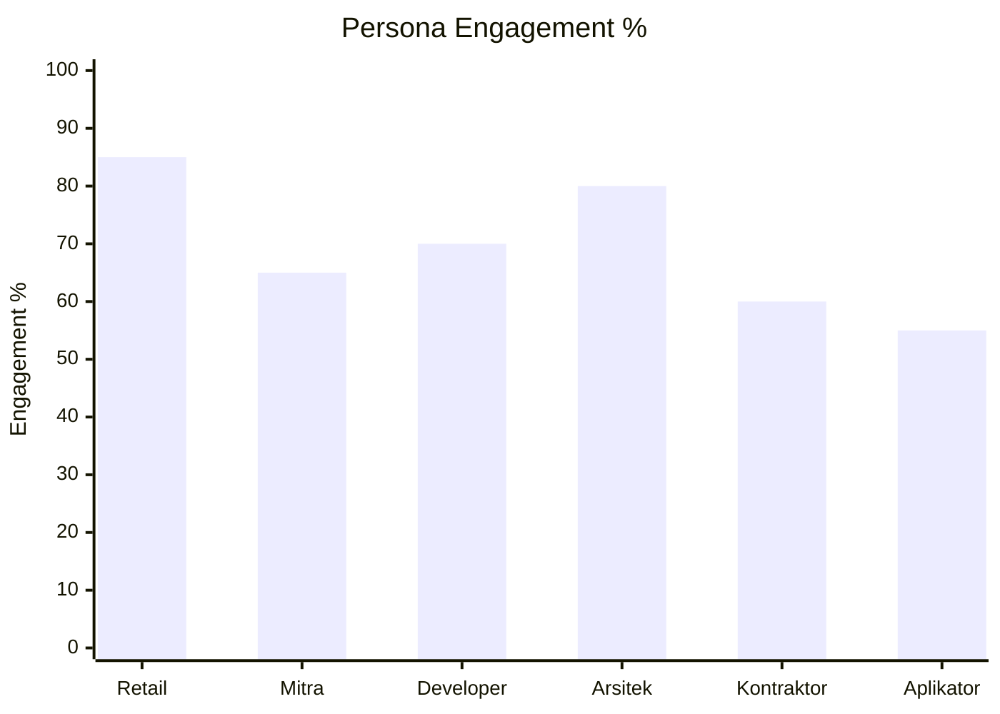
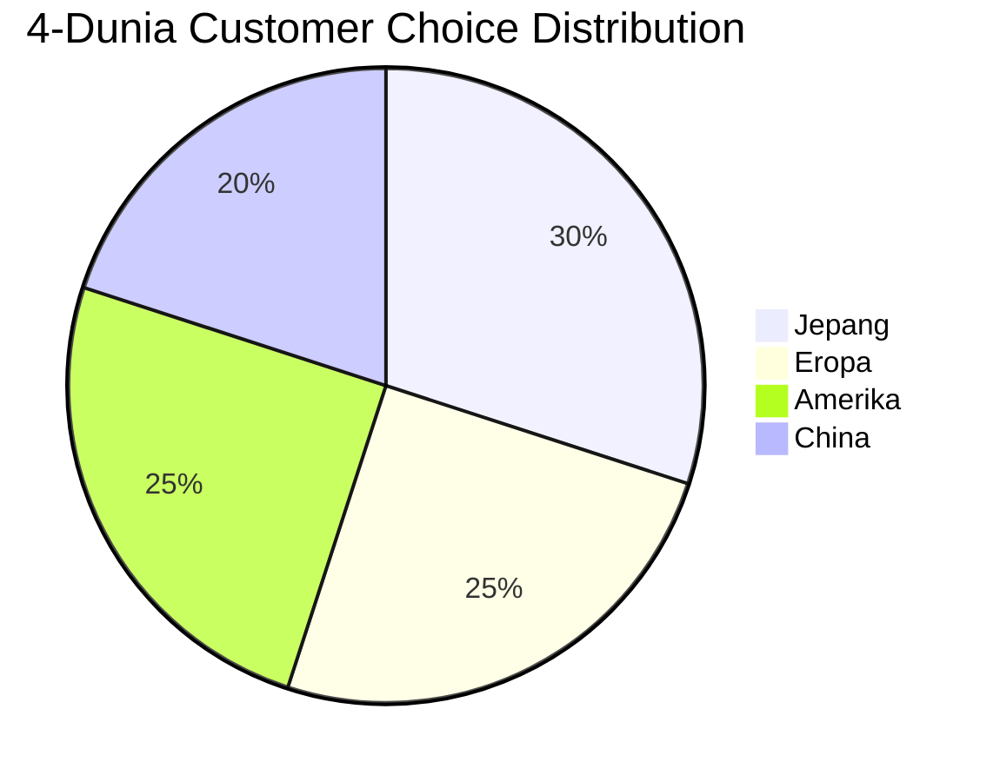

# Brand Health Dashboard

Generate brand health dashboard Gerai 1000 Pintu: compliance score, awareness metric, sentiment, anchor reference recognition, persona resonance. Monthly + quarterly view.

## Triggers

Primary:
- "brand health dashboard"
- "brand metric"
- "brand performance"

Secondary:
- "brand audit visual"
- "brand KPI"

## Input Required

| Field | Type | Required | Default |
|---|---|---|---|
| period | enum | yes | (monthly / quarterly / annual) |
| data_source | array | no | (default: brand-audit + social analytics + survey + CRM) |

## Output Template

```markdown
# Brand Health Dashboard: {PERIOD}

**Period:** {Date range}
**Overall brand health score:** {N}/100
**Trend vs previous:** {↑ / → / ↓}
**Report owner:** CCO + Matthew distribute

## Executive Summary (30-sec read)

🟢 / 🟡 / 🔴

- **Compliance:** {Score} {Trend}
- **Awareness:** {Score} {Trend}
- **Sentiment:** {Score} {Trend}
- **Anchor recognition:** {Score} {Trend}
- **Top win:** {1 highlight}
- **Top concern:** {1 critical}

## KPI Dashboard

### Dimension 1: Brand Canon Compliance
| Metric | Target | Actual | Status |
|---|---|---|---|
| Overall compliance | 95%+ | {%} | 🟢/🟡/🔴 |
| Em-dash violation count | 0 | {N} | - |
| "rumah" usage customer-facing | 0 | {N} | - |
| "Gerai" abbreviation (formal) | 0 | {N} | - |
| Tone aggressive drift | 0 | {N} | - |
| Visual palette compliance | 100% | {%} | - |

### Dimension 2: Brand Awareness
| Metric | Target Y1 | Actual | Status |
|---|---|---|---|
| Aided awareness Balikpapan | 30% | {%} | - |
| Unaided recall "premium pintu" | 5% | {%} | - |
| Social follower (IG aggregate) | 5K | {N} | - |
| Web traffic monthly | 10K | {N} | - |
| Direct search "Gerai 1000 Pintu" | 500/month | {N} | - |

### Dimension 3: Brand Sentiment
| Metric | Target | Actual | Status |
|---|---|---|---|
| NPS (Net Promoter Score) | 40+ | {N} | - |
| Google review average | 4.7+ | {N} | - |
| Social sentiment positive | 85%+ | {%} | - |
| Customer complaint rate | <2% | {%} | - |
| Customer praise organic mention | 50+ | {N} | - |

### Dimension 4: Anchor Reference Recognition
| Metric | Target Y1 | Actual | Status |
|---|---|---|---|
| Aesop reference mentioned customer | 15% | {%} | - |
| DWR reference mentioned customer | 10% | {%} | - |
| Kinfolk-style content engagement | 6%+ | {%} | - |
| "Premium curated" association | 40% | {%} | - |
| "Refined hangat" feedback | 60% |  |  |
| Mitra Dagang |  |  |  |
| Arsitek |  |  |  |
| Aplikator |  | {%} |

### Dimension 6: Brand Storytelling
| Metric | Target | Actual |
|---|---|---|
| 4-Dunia mention frequency | 60+ /month | {N} |
| Story content engagement | 6%+ | 
- Top performing pillar: {pillar}
- Lowest performing pillar: {pillar}
- Brand mention organic: {N}

### Website
- Traffic monthly: {N}
- Bounce rate: 

### Email
- Subscriber: {N}
- Open rate: 
- Unsubscribe rate: 
- Konsultasi inquiry from WA: {N}

### Showroom (kalau applicable)
- Walk-in count: {N}
- Avg dwell time: {min}
- Conversion to konsultasi: {%}
- Customer feedback aggregate: {score}

## Brand Sentiment Detail

### Positive themes (top 5)
1. {Theme + frequency + sample quote}
2. {Theme + frequency + sample}
3. {Theme + frequency + sample}
4. {Theme + frequency + sample}
5. {Theme + frequency + sample}

### Concern themes (kalau ada)
1. {Theme + frequency + sample}
2. {Theme + frequency + sample}

### Action: address concern
- {Concern → action plan + owner + ETA}

## Brand Storytelling Impact

### Top performing story (this period)
| Story | Channel | Engagement | Note |
|---|---|---|---|
| {Title} | {channel} | {metric} | {insight} |

### 4-Dunia archetype balance
| Dunia | Mention | Engagement | Customer choice |
|---|---|---|---|
| Jepang | {N} |  |
| Eropa | {N} |  |
| Amerika | {N} |  |
| China | {N} |  |

## Anchor Reference Visibility

### Aesop alignment
- Customer mention "seperti Aesop": {N}
- Press mention reference: {N}
- Internal team awareness: 

### Kinfolk alignment
- Editorial content engagement: 

## Customer Journey Brand Touchpoint Score

| Touchpoint | Brand Impression Score | Note |
|---|---|---|
| First exposure (social/search) | {N}/10 | - |
| Website visit | {N}/10 | - |
| Konsultasi booking | {N}/10 | - |
| Konsultasi session | {N}/10 | - |
| Decision communication | {N}/10 | - |
| Delivery + Installation | {N}/10 | - |
| Aftersales follow-up | {N}/10 | - |

## Brand Health Insight + Action

### Win to celebrate
🎉 {Win 1 — what we did right}
🎉 {Win 2}

### Concern to address
⚠️ {Concern 1 — action + owner + ETA}
⚠️ {Concern 2}

### Pattern emerging
💡 {Pattern observed — implication + strategic action}

### Brand investment recommendation
- {Where invest more}
- {Where optimize}
- {Where deprioritize}

## Vs Anchor Benchmark

| Metric | Aesop Benchmark | DWR Benchmark | Gerai 1000 Pintu |
|---|---|---|---|
| Brand canon compliance | 98% | 95% | {%} |
| Sentiment positive | 90%+ | 87% | {%} |
| NPS | 70+ | 60+ | {N} |
| Engagement rate social | 4-6% | 3-5% | {%} |

### Gap analysis
- Closest to benchmark: {metric}
- Largest gap: {metric}
- Year-over-year closing: {direction}

## Quarterly Trend

### Compliance trend
{4-quarter trend chart implied}

### Sentiment trend
{4-quarter trend}

### Awareness trend
{4-quarter trend}

## Forward Recommendation

### Next quarter priority
1. {Priority 1 with rationale}
2. {Priority 2 with rationale}
3. {Priority 3 with rationale}

### Investment shift
- Increase: {area + budget}
- Maintain: {area}
- Decrease: {area + reasoning}

### Brand initiative idea
- {Idea 1 — what + why + cost}
- {Idea 2}
```

## Visual Output

Brand health composite radar:



Quarterly trend:



Persona resonance:



4-Dunia balance:



## Knowledge Dependency

- brand-audit (data source)
- brand-canon-enforcer (compliance data)
- brand-positioning (target benchmark)
- audience-emotional-mapping (persona indicator)
- All channel analytics
- Customer survey + NPS data

## Mode

Default: EXECUTION (generate dashboard)
Switch: NEED_CLARIFICATION jika data source incomplete

## Tools Required

- file-search (analytics + audit data)
- artifacts (dashboard visual)

## Validation Criteria

- Executive summary 30-sec readable
- 6 dimension covered (compliance, awareness, sentiment, anchor, persona, storytelling)
- Channel-specific performance
- Customer journey brand touchpoint score
- Win + concern + pattern + recommendation
- Vs anchor benchmark
- Quarterly trend
- Forward recommendation
- 4+ visual embedded (radar, trend, persona, dunia)

## Sample I/O

**Input:** "Brand health dashboard Q4 2026 post Wave 1 launch month 1"

**Output summary:**
- Overall score: 87/100 🟢 strong baseline post-launch
- Compliance: 95% 🟢 (high), em-dash 2 violation, "rumah" 1, "Gerai" shortened 3
- Awareness: 35% aided Balikpapan 🟢 (above target 30%), 5K IG follower growth
- Sentiment: NPS 48 🟢, Google review 4.8/5 🟢, social positive 88%
- Anchor recognition: Aesop mention 18% 🟢, DWR mention 12%, refined hangat feedback 65%
- Persona: Retail 85% engagement (highest), Aplikator 55% (lowest, expected)
- Storytelling: 4-Dunia mention 75/month, 2 long-form article shipped
- Top win: Bapak Anton testimonial viral (organic 50K reach)
- Top concern: Aplikator persona engagement low (action: dedicated content Q1)
- 4-Dunia balance: Jepang 30% + Eropa 25% + Amerika 25% + China 20% (healthy spread)
- Vs anchor: 87/100 vs Aesop 98 (gap closing, on track Year 2 target 95)
- Forward: Q1 2027 prioritize Aplikator + 4-Dunia deep dive + Phase 2 prep
- 4 visual embedded (quadrant + trend + persona + pie)

## Handoff

- brand-audit (continuous loop)
- brand-canon-enforcer (compliance feed)
- CMO Gerai (campaign performance)
- Matthew (executive review)
- visual-summary (rendering)
