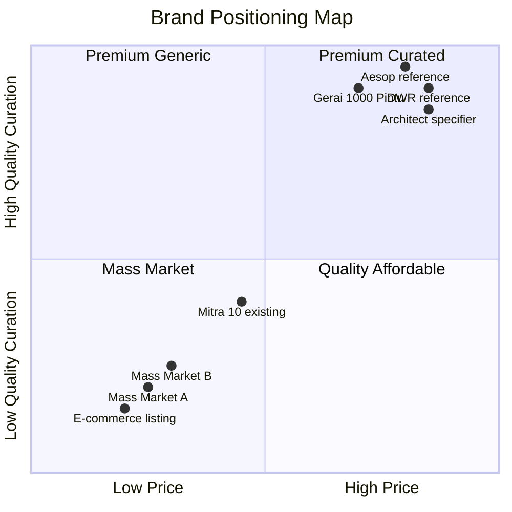
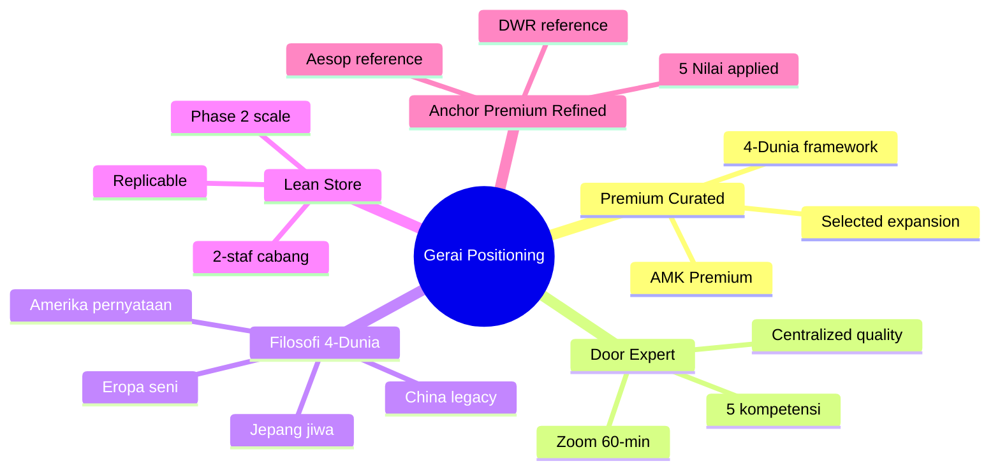

# Brand Positioning Analysis

Analyze brand positioning Gerai 1000 Pintu di market Balikpapan + Indonesia: vs competitor toko pintu, vs anchor reference Aesop + DWR, perceptual map, differentiation, claim ownership.

## Triggers

Primary:
- "brand positioning"
- "competitive positioning"
- "perceptual map"

Secondary:
- "USP analysis"
- "differentiation"

## Input Required

| Field | Type | Required | Default |
|---|---|---|---|
| market_scope | enum | yes | (Balikpapan / Kaltim / Indonesia) |
| competitor_set | array | no | (default: top 5 local + 3 national) |
| time_horizon | string | no | (current / 2027 / Phase 2) |

## Output Template

```markdown
# Brand Positioning Analysis: {Gerai 1000 Pintu}

**Market scope:** {Geography + segment}
**Reference period:** {Date}
**Anchor north star:** Aesop + Design Within Reach

## Core Positioning Statement

> Gerai 1000 Pintu adalah tempat curated premium pintu yang menyajikan filosofi 4-Dunia 
> (Jepang jiwa, Eropa seni, Amerika pernyataan, China legacy) dengan layanan konsultasi 
> Door Expert remote yang hangat dan refined. Bukan toko pintu, bukan e-commerce mass-market. 
> Anchor: Aesop + Design Within Reach for premium curated retail experience.

### Tagline Options (locked)
- "Tempat impian dimulai dari pintu yang tepat"
- "Pintu yang menemani tempat hidup Anda"
- "Curated by Door Expert, untuk tempat yang bermakna"

## Positioning Pillars (LOCKED)

### Pillar 1: Premium Curated (not mass-market)
- Curation philosophy: 4-Dunia archetype framework
- Quality threshold: AMK Premium + selected brand expansion
- Price tier: Mid-to-high (Rp 5-50jt per pintu)

### Pillar 2: Door Expert Consultation (not order-taker)
- 5 kompetensi konsultan (katalog + industri + Indonesia/feng shui + soft skill + aftersales)
- Remote Zoom consultation (innovation Lean Store)
- 60-min depth conversation (not 5-min transaction)

### Pillar 3: Filosofi 4-Dunia (not generic product catalog)
- Jepang jiwa (minimalist soul)
- Eropa seni (craftsmanship art)
- Amerika pernyataan (statement scale)
- China legacy (timeless heritage)

### Pillar 4: Lean Store (not big-box retail)
- 2-staf cabang model (intimate scale)
- Centralized Door Expert (consistency quality)
- Replicable Phase 2 (scalable without dilution)

### Pillar 5: Anchor Premium Refined (not aggressive sales)
- Aesop + DWR reference for retail experience
- Premium hangat tone (calm + warm hospitality)
- 5 Nilai Gerai (Inspirasi, Keahlian, Pelayanan Nyaman, Inovasi, Aftersales)

## Competitive Landscape

### Local Competitor (Balikpapan + Kaltim)
| Competitor | Position | Strength | Weakness vs Gerai |
|---|---|---|---|
| Toko Pintu Generic A | Mass market, price-led | Wide product, cheap | No curation, aggressive sales, no expert consultation |
| Toko Pintu Generic B | Mid-market | Local trust, fast delivery | No brand story, transactional, no Indonesia/feng shui depth |
| Mitra 10 (existing partner) | Mid market | Established relationship | Less premium curation, no philosophy |
| {Local competitor 3} | {detail} | {detail} | {detail} |
| {Local competitor 4} | {detail} | {detail} | {detail} |

### National Competitor (Online/Pure-play)
| Competitor | Position | Strength | Weakness vs Gerai |
|---|---|---|---|
| Tokopedia / Shopee pintu listing | E-commerce mass | Convenience, price | No consultation, no curation, no aftersales depth |
| Marketplace pintu national | Online catalog | Variety | No expert, no philosophy, no physical experience |
| {National competitor 3} | {detail} | {detail} | {detail} |

### Architect + Designer Channel
| Player | Position | Relationship |
|---|---|---|
| Arsitek Senior (Kaltim) | Specifier high-end | Potential partner (Mitra Arsitek persona) |
| Interior Designer freelance | Project-based | Collaboration opportunity |
| Kontraktor besar | Bulk procurement | Mitra Dagang persona |

## Perceptual Map

### Dimension 1: Quality vs Price
```
High Quality
     |
     |  • Gerai 1000 Pintu (premium curated)
     |       
     |  • Aesop reference (anchor)
     |  
     |  • DWR reference (anchor)
     |
     |________________________
                              High Price
                              
Low Price                                Low Quality
     |
     |  • Toko Pintu Generic A (mass)
     |  • E-commerce listing
```

### Dimension 2: Service Depth vs Transaction Speed
```
High Service Depth
     |
     |  • Gerai 1000 Pintu (Door Expert konsultasi)
     |  • Architect specifier (advisory)
     |
     |  • Mitra 10 (mid)
     |
     |________________________
                              High Transaction Speed
                              
Low Service Depth                         Low Transaction Speed
     |  • Tokopedia pintu (self-service)
     |  • Generic toko pintu
```

## Differentiation Matrix

### Vs Mass-Market Toko Pintu
| Attribute | Mass-market | Gerai 1000 Pintu |
|---|---|---|
| Approach | Sales agresif komisi | Curated konsultasi hangat |
| Product | Wide volume | Curated 4-Dunia |
| Staff | Sales target | Door Expert 5 kompetensi |
| Experience | Functional transaksi | Sensory journey |
| Brand voice | Loud commercial | Premium hangat refined |
| Customer rel | One-off | Long-term aftersales |

### Vs E-commerce Pure-play
| Attribute | E-commerce | Gerai 1000 Pintu |
|---|---|---|
| Touch | Digital only | Physical + remote consultation |
| Decision support | Self-research | Door Expert guidance |
| Risk | Buyer beware | Curated trust |
| Customization | Catalog standard | Project-specific |
| Aftersales | Marketplace dispute | Direct accountability |

### Vs Architect Specifier
| Attribute | Architect | Gerai 1000 Pintu |
|---|---|---|
| Audience | High-end project only | All persona spectrum |
| Cost to customer | Fee-based | Free consultation |
| Inventory | Spec only | Curated stocked |
| Speed | Slow (multi-month design) | Quick (60-min consultation) |
| Partnership | Complement | Complement (Mitra Arsitek persona) |

## Claim Ownership

### What Gerai 1000 Pintu owns (defensible position)
1. **"Door Expert"** terminology + 5 kompetensi framework (trademark-worthy)
2. **"Filosofi 4-Dunia"** philosophy framework (proprietary)
3. **"Tempat impian"** language (vocabulary locked)
4. **Aesop + DWR anchor** retail experience (vocabulary + visual)
5. **Lean Store + remote consultation** model (operational innovation)
6. **AMK Premium curated** product line (vendor exclusivity Kaltim)

### What Gerai 1000 Pintu does NOT claim
- ❌ "Murah / cheapest" (price-led race-to-bottom)
- ❌ "Variety terlengkap" (curated by definition narrow)
- ❌ "Fast delivery" (premium = patience worthwhile)
- ❌ "Instant install" (craftsmanship requires time)
- ❌ "DIY-friendly" (Door Expert-led required)

## Persona-Specific Positioning

### For Retail Customer (6 Persona Retail)
"Tempat untuk Anda yang sedang mempersiapkan hunian impian dengan refleksi yang dalam. 
Door Expert dampingi Anda gratis 60 menit via Zoom."

### For Mitra Dagang
"Partner kurasi yang membantu Anda memberi customer Anda standar premium yang konsisten. 
Margin yang sehat, kualitas terjamin, brand yang bertumbuh."

### For Developer Project
"Specifier curated untuk project Anda. AMK Premium + selected brand expansion. 
Door Expert dampingi spec hingga handover."

### For Arsitek/Designer
"Resource curation untuk vision Anda. Filosofi 4-Dunia framework yang dapat 
Anda gunakan untuk klien Anda. Collaboration warm + professional."

### For Kontraktor
"Supplier curated yang scalable + reliable. PO standardisasi, QC consistent, 
aftersales accountable."

### For Aplikator
"Mitra teknis dengan AMK Premium yang fitting akurat. Training + support tersedia. 
Referral system yang fair."

## Wave 1 Launch Positioning Message

### Hero Headline (locked)
"Tempat impian dimulai dari pintu yang tepat."

### Sub-headline
"Curated philosophy. Door Expert hangat. Refined experience yang menemani perjalanan Anda."

### CTA
"Konsultasi gratis 60 menit. Booking via WhatsApp atau gerai.mahewwork.com"

### Anchor reference visible
- Storefront photography style: Aesop minimal
- Catalog layout: DWR editorial
- Tone copy: Kinfolk magazine warmth + Wabi-sabi appreciation

## Brand Health Metric (track quarterly)

| Metric | Target Year 1 | Target Year 2 |
|---|---|---|
| Aided brand awareness Balikpapan | 30% | 60% |
| Unaided recall "premium pintu" | 5% | 20% |
| Brand attribute "curated" association | 40% | 65% |
| Brand attribute "premium" association | 50% | 75% |
| NPS (Net Promoter Score) | 40+ | 60+ |
| Anchor reference (Aesop/DWR) recognition | 15% | 35% |
```

## Visual Output

Perceptual map:



Positioning pillar hierarchy:



## Knowledge Dependency

- BP Chapter 5-6 (Brand Positioning + Competitive)
- Brand Canon (vocabulary locked)
- 6 Persona spec
- Filosofi 4-Dunia
- Anchor Aesop + DWR
- 5 Nilai Gerai

## Mode

Default: EXECUTION
Switch: DISCUSSION jika positioning challenge debate

## Tools Required

- file-search
- web-search (competitor update)
- artifacts (perceptual map + mindmap)

## Validation Criteria

- Core positioning statement clear
- 5 pillar locked
- Competitor analysis min 5 local + 3 national
- Differentiation matrix per category
- Persona-specific message
- Wave 1 launch hero message
- Brand health metric measurable
- Perceptual map visual
- Anchor Aesop + DWR explicit
- Claim ownership specific (defensible)

## Sample I/O

**Input:** "Brand positioning analysis Gerai 1000 Pintu vs Balikpapan competitor untuk Wave 1 launch"

**Output summary:**
- Position: Premium curated + Door Expert konsultasi + Filosofi 4-Dunia + Lean Store + Anchor Aesop/DWR
- 5 pillar locked dengan defensible differentiation
- Competitor: 4 local mass-market + 3 e-commerce + Architect channel mapped
- Perceptual map: Gerai di top-right (High Quality + Premium Price) bersama Aesop/DWR
- Differentiation matrix: vs mass-market (curated > sales), vs e-commerce (consultation > self), vs architect (accessible > exclusive)
- Persona message tailored: Retail (impian), Mitra (margin sehat), Developer (specifier), Arsitek (collaboration), Kontraktor (scalable), Aplikator (mitra teknis)
- Hero message: "Tempat impian dimulai dari pintu yang tepat"
- Brand health targets Year 1: 30% awareness Balikpapan + NPS 40+
- Perceptual map + pillar mindmap embedded

## Handoff

- brand-architecture (master + sub-brand)
- brand-audit (compliance check vs positioning)
- CMO Gerai (messaging + content strategy)
- brand-storytelling (narrative arc 4-Dunia)
