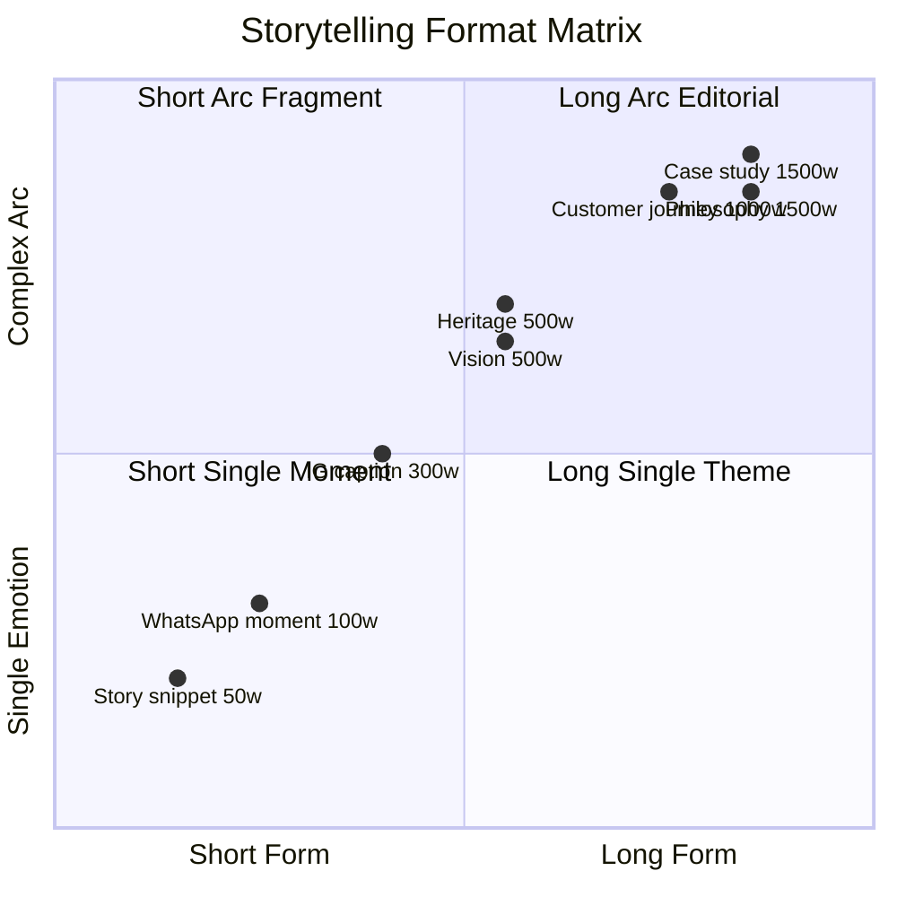

# Brand Storytelling (Filosofi Dunia Pintu (4-negara cultural context) Narrative Arc)

Build + maintain brand storytelling Gerai 1000 Pintu: filosofi Dunia Pintu (4-negara cultural context: Jepang jiwa, Eropa seni, Amerika pernyataan, China gerbang rezeki — BUKAN mandatory archetype) sebagai narrative spine. Story templates, character arc, atmospheric writing.

## Triggers

Primary:
- "brand storytelling"
- "narrative arc"
- "story 4-negara cultural reference"

Secondary:
- "brand narrative"
- "filosofi storytelling"

## Input Required

| Field | Type | Required | Default |
|---|---|---|---|
| story_type | enum | yes | (philosophy / customer-journey / heritage / vision / case) |
| dunia_focus | enum | no | (Jepang / Eropa / Amerika / China / all) |
| length | enum | no | (short 150w / medium 500w / long 1500w) |

## Output Template

```markdown
# Brand Story: {STORY TYPE}

**Type:** {Philosophy / Customer journey / Heritage / Vision / Case}
**Length:** {N word}
**Anchor reference:** BP Latest reference + Indonesian editorial poetic

## Filosofi Dunia Pintu (4-negara cultural context) Story Spine

### The Premise
Pintu adalah ambang. Ambang adalah refleksi tempat yang dibangun bersama yang kita cintai. 
Empat dunia menyimpan empat karakter. Mana yang menemani Anda?

### The Worlds (LOCKED narrative)

#### Jepang — Jiwa (The Soul)
**Essence:** Wabi-sabi. Imperfect beauty. Ritual yang lembut.

**Character:** Pintu yang menyelipkan ketenangan. Material yang menahan sentuhan tahun. 
Tatami yang menahan langkah. Shoji yang menyaring cahaya pagi.

**For whom:** Yang mencari ritus pagi. Yang menghargai keheningan. Yang melihat ketidaksempurnaan sebagai keindahan.

**Visual:** Tight detail, natural light, restraint, monochrome refined

**Vocabulary:** "menyaring", "menahan", "ritus", "keheningan", "lembut"

#### Eropa — Seni (The Art)
**Essence:** Craftsmanship art. Detail Art Nouveau. Brass yang berbicara.

**Character:** Pintu yang menyimpan karya tangan. Brass yang dipoles bertahun-tahun. 
Pola yang menari di permukaan. Sejarah yang menyentuh setiap detail.

**For whom:** Yang mencintai karya. Yang melihat pintu sebagai object d'art. Yang menghargai history dalam detail.

**Visual:** Close-up detail, ornament refined, brass focal, warm tone

**Vocabulary:** "karya", "pola", "menari", "menyimpan sejarah", "polished"

#### Amerika — Pernyataan (The Statement)
**Essence:** Bold scale. Dramatic presence. Confident character.

**Character:** Pintu yang berbicara dengan tegas. Skala yang tidak gentar. 
Material yang menunjukkan kepercayaan diri. Architecture yang berbicara tentang siapa Anda.

**For whom:** Yang membangun statement. Yang mengundang dengan kebanggaan. Yang melihat pintu sebagai pernyataan diri.

**Visual:** Wide environmental, scale dramatic, lighting hero, confident composition

**Vocabulary:** "tegas", "berbicara", "kepercayaan diri", "statement", "skala"

#### China — Legacy (The Heritage)
**Essence:** Timeless heritage. Auspicious symbolism. Long-term harmony.

**Character:** Pintu yang menyimpan berkah. Bentuk yang dipilih dengan kesadaran. 
Detail yang menemani lintas generasi. Warna yang menyimpan harapan.

**For whom:** Yang membangun untuk anak cucu. Yang menghargai tradisi. Yang melihat pintu sebagai pewarisan.

**Visual:** Symmetry intentional, gold-rich detail, harmonious composition

**Vocabulary:** "berkah", "pewarisan", "harapan", "tradisi", "lintas generasi"

## Story Templates

### Template 1: Philosophy Introduction (1500 word)

**Title:** "Empat Dunia dalam Satu Tempat"

**Structure:**
1. **Opening (200 word):** Sensory invitation — pagi di Balikpapan, suara, cahaya, sentuhan
2. **The Premise (300 word):** Pintu adalah ambang. Ambang adalah refleksi.
3. **The Four Worlds (800 word):** 200 word per dunia, vivid sensory + character
4. **Application (200 word):** Untuk Anda — mana yang menemani perjalanan?

**Tone:** Editorial premium hangat, Indonesian editorial warmth, anchor reference visible

**Sample opening:**
> Pagi itu, seseorang menggenggam brass yang dingin sejenak. Pintu terbuka. Sinar 
> mengetuk lantai. Sebuah hari dimulai. Apa yang Anda rasakan ketika ambang pertama 
> terbuka?

### Template 2: Customer Journey Story (1000 word)

**Title:** "{Customer Name}: Cerita Tempat Bapak/Ibu"

**Structure:**
1. **Profile sensitive (150w):** Anonymized OR consented, brief context
2. **Starting point (200w):** Tempat sebelum, vision yang dibangun
3. **The encounter (200w):** First meeting dengan Gerai, what stood out
4. **The exploration (300w):** Konsultasi journey, 4-negara cultural reference consideration, decision
5. **The realization (150w):** Pintu di tempat, first morning

**Tone:** Narrative warm + visual + respectful customer voice

**Sample:**
> Saat pertama datang ke showroom Gerai 1000 Pintu, Bapak Anton tidak datang untuk 
> beli pintu. Dia datang untuk memahami. "Saya sedang membangun tempat baru untuk 
> keluarga," ujarnya. "Saya ingin pintu yang lebih dari sekedar masuk dan keluar."

### Template 3: Heritage Story (500 word)

**Title:** "Asal Cerita Gerai 1000 Pintu"

**Structure:**
1. **Origin question:** Kenapa Gerai 1000 Pintu hadir?
2. **The observation:** Apa yang Matthew (founder) lihat di pasar Balikpapan
3. **The aspiration:** BP Latest reference sebagai reference apa retail bisa rasakan
4. **The commitment:** Apa yang Gerai berjanji untuk customer
5. **Forward:** Ajakan mulai perjalanan

**Tone:** Founder voice + sincere + premium hangat

### Template 4: Vision Story (500 word)

**Title:** "Tempat yang Bertumbuh"

**Structure:**
1. Wave 1 sebagai start
2. Phase 2 vision (Samarinda + Bontang)
3. Phase 3 vision (Jawa expansion)
4. Long-term cultural ambition (Indonesia premium tetapi inklusif)

**Tone:** Aspirational + grounded + warm

### Template 5: Project Case Study (1500 word)

**Title:** "Project {Name}: {Insight Hook}"

**Structure:**
1. Project context (architect/customer/site)
2. Vision starting point
3. Konsultasi journey (Door Expert collaboration)
4. Filosofi Dunia Pintu (4-negara cultural context) application
5. Decision narrative
6. Outcome + reflection
7. Insight untuk reader serupa

## Narrative Voice Principles

### Voice characteristics
- **Calm refined** — no rush, no urgency, no shouting
- **Warm intimate** — like sitting across table with old friend
- **Sensory rich** — visual, tactile, auditory, olfactory detail woven
- **Respect of audience** — they are smart, they appreciate subtlety
- **Anchored** — BP Latest reference + Indonesian editorial + Indonesia poetic literacy

### Sentence rhythm
- Mix short + medium + longer for natural flow
- Read-aloud test (does it feel natural Indonesian)
- Avoid monotony

### Vocabulary palette
**Verbs (storytelling):**
- "menemani", "menyaring", "menahan", "menari", "berbicara", "menyimpan", "menyelipkan", "mengetuk", "membuka", "mengundang"

**Nouns (atmospheric):**
- "ambang", "ritus", "tempat", "perjalanan", "karya", "refleksi", "berkah", "warisan", "detail"

**Adjectives (refined):**
- "lembut", "hangat", "tenang", "tegas", "timeless", "bermakna", "tangguh", "intim"

### Avoid in storytelling
- ❌ Corporate jargon ("solusi", "produk premium berkualitas")
- ❌ Marketing cliche ("terbaik di kelasnya", "kualitas tanpa kompromi")
- ❌ Generic emotion ("Anda akan senang!", "Anda akan puas!")
- ❌ Em-dash habit
- ❌ Mixing English-Indonesia random

## Character Archetypes (for storytelling)

### The Door Expert
- Refined konsultan
- 5 kompetensi mastered
- Hangat + listening
- Bukan sales

### The Customer (across persona)
- Retail seeker (build tempat impian)
- Mitra Dagang (curator partner)
- Developer (specifier scale)
- Arsitek (peer collaboration)
- Kontraktor (reliability anchor)
- Aplikator (technical partner)

### Matthew (Founder)
- Visionary + grounded
- Sees what others miss
- Quietly building BP Latest reference for Indonesia
- Long-term player

### The Craftsman (background)
- Hand at work
- Detail respected
- Tradition + craft

### The Tempat (setting)
- Living entity
- Reflection of dwellers
- Sacred ordinary

## Story Application per Channel

### Long-form (Website Blog, Manuscript)
- Full templates 1000-1500w
- Editorial pacing
- Image rich

### Mid-form (Instagram caption, Facebook post)
- Condensed 200-300w
- Hook strong
- Narrative arc compact

### Short-form (Story, Reel caption)
- Fragment 50-100w
- Single emotional beat
- Visual paired

### Conversation (Konsultasi script, WhatsApp)
- Adaptive
- Personal touch
- Sensory micro-moment

## Storytelling Workflow

### Step 1: Story brief
- What story we tell + why
- Audience + emotional target
- Channel + length

### Step 2: Story spine
- Filosofi Dunia Pintu (4-negara cultural context) angle
- Character + setting
- Conflict / discovery moment
- Resolution / invitation

### Step 3: Draft
- Opening sensory hook
- Build through narrative arc
- Closing emotional beat
- CTA soft

### Step 4: Brand canon validate
- Tone check (premium hangat)
- Vocabulary check
- Em-dash check
- Anchor reference check

### Step 5: Editorial polish
- Sentence rhythm
- Sensory richness
- Read-aloud test
- Trim fluff

### Step 6: Distribution
- Per channel adaptation
- Image pairing direction
- Schedule

## Anti-pattern Storytelling

### Avoid
- ❌ Self-congratulatory ("Kami yang terbaik di kelasnya")
- ❌ Sales-driven narrative ("Beli ini sekarang!")
- ❌ Overly aspirational ("Hidup mewah dengan pintu kami")
- ❌ Generic philosophy ("Pintu adalah jendela jiwa" cliche)
- ❌ Emotional manipulation (fear, guilt, urgency)
- ❌ Trendy reference (skip cultural moment cliche)

### Embrace
- ✅ Subtle confident (let work speak)
- ✅ Customer-first narrative (their story we serve)
- ✅ Grounded aspirational (achievable beauty)
- ✅ Specific philosophy (Dunia Pintu framework yours)
- ✅ Honest emotion (real moments matter)
- ✅ Timeless reference (BP Latest reference reverence, Editorial Indonesian warmth)

## Sample Story Snippet Library

### Snippet 1: Morning Ritual (Jepang)
> Pagi di Balikpapan. Embun masih menahan jejak. Anda menggenggam pintu Jepang yang 
> Anda pilih. Brass yang dingin. Kayu yang lembut. Ambang yang terbuka. Sebuah hari 
> dimulai dengan ritus yang Anda susun sendiri.

### Snippet 2: Brass Detail (Eropa)
> Brass ini ditempa dengan tangan. Pola Art Nouveau yang menari di permukaan. Setiap 
> lekukan menyimpan jam-jam pekerjaan. Bertahun-tahun dari sekarang, brass ini akan 
> memiliki patina yang menemani Anda. Sebuah karya yang bertumbuh bersama Anda.

### Snippet 3: Statement Entry (Amerika)
> Pintu ini tinggi. Skala yang tidak gentar. Ketika Anda mengundang tamu, pintu ini 
> sudah berbicara sebelum Anda. "Selamat datang. Inilah tempat yang saya bangun."

### Snippet 4: Family Heritage (China)
> Pintu ini akan menahan langkah anak Anda. Akan menyambut menantu Anda. Akan 
> menemani cucu Anda. Sebuah pintu bukan sekedar pintu. Ini warisan kecil yang 
> Anda susun untuk yang akan datang.

### Snippet 5: Door Expert moment
> Door Expert kami tidak datang untuk menjual. Mereka datang untuk mendengar. Apa 
> yang Anda bangun? Apa yang Anda rasakan tentang tempat Anda? Empat dunia menunggu 
> untuk menemani perjalanan Anda. Mari kita berbicara.
```

## Visual Output

4-negara cultural reference radial:

```mermaid
mindmap
  root((Filosofi Dunia Pintu (4-negara cultural context)))
    Jepang Jiwa
      Wabi-sabi
      Ritus pagi
      Keheningan
      Imperfect beauty
    Eropa Seni
      Craftsmanship
      Art Nouveau
      Brass berbicara
      Polish bertahun
    Amerika Pernyataan
      Statement scale
      Bold confident
      Dramatic presence
      Self-expression
    China Legacy
      Auspicious
      Lintas generasi
      Berkah warisan
      Harmony tradition
```

Story type matrix:



## Knowledge Dependency

- Filosofi Dunia Pintu (4-negara cultural context, BUKAN mandatory archetype) full content
- Brand Canon
- editorial-style-guide
- copywriting-framework
- long-form-writer
- audience-emotional-mapping (paired)
- Anchor BP Latest reference

## Mode

Default: EXECUTION (generate story per brief)
Switch: DISCUSSION jika archetype angle debate

## Tools Required

- file-search
- artifacts (story preview + mindmap)
- web-search (anchor reference inspiration)

## Validation Criteria

- 4-negara cultural narrative spine locked
- Per dunia: essence + character + audience + visual + vocabulary
- 5 story templates (philosophy, journey, heritage, vision, case)
- Narrative voice principles
- Vocabulary palette atmospheric
- Character archetypes 5
- Channel application (long/mid/short/conversation)
- Storytelling workflow 6-step
- Anti-pattern + embrace pattern
- Sample snippet library

## Sample I/O

**Input:** "Brand storytelling philosophy introduction 4-negara cultural reference 1500w untuk website blog Wave 1 launch"

**Output summary:**
- Title: "Empat Dunia dalam Satu Tempat"
- Length: 1500w editorial
- Structure: Sensory opening (Balikpapan morning) → Premise (pintu = ambang refleksi) → 4 worlds (200w per dunia) → Application invitation
- Voice: Calm refined, Editorial warmth, anchor BP Latest reference visible
- Sensory rich: sight (cahaya morning), touch (brass cold), sound (engsel embun), smell (kayu lembut)
- Vocabulary palette: ambang, ritus, refleksi, menemani, karya, warisan
- Character involvement: Customer (Anda), Tempat (setting), Door Expert (background)
- Anti-pattern avoided: no corporate jargon, no marketing cliche, no em-dash
- CTA soft closing: "Mana yang menemani perjalanan Anda? Door Expert kami menanti."
- 4-negara cultural reference mindmap + format matrix embedded

## Handoff

- long-form-writer (production)
- caption-generator (social adaptation)
- audience-emotional-mapping (paired)
- testimonial-curation (customer story format)
- brand-canon-enforcer (validation)
