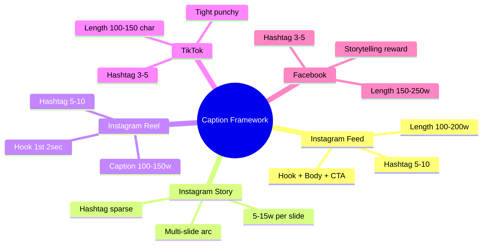
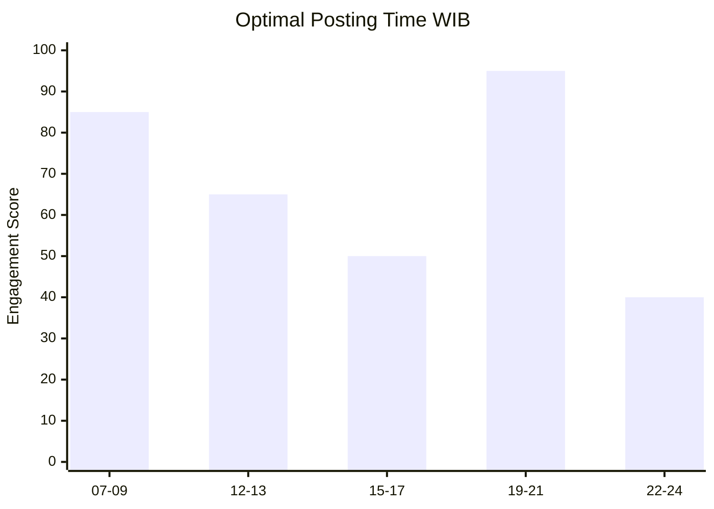

# Caption Generator (Social Media)

Generate caption Instagram, TikTok, Facebook Gerai 1000 Pintu: hook → story → CTA → hashtag canon-compliant. Premium hangat tone, brand canon strict.

## Triggers

Primary:
- "caption Instagram"
- "social caption"
- "tulis caption"

Secondary:
- "TikTok caption"
- "Facebook copy"

## Input Required

| Field | Type | Required | Default |
|---|---|---|---|
| platform | enum | yes | (Instagram/TikTok/Facebook) |
| post_type | enum | yes | (feed/story/reel/carousel/live) |
| visual_subject | string | yes | (apa yang ada di image/video) |
| campaign | string | no | (Wave 1 launch / 4-Dunia series / dll) |
| persona | enum | no | (default Retail) |

## Output Template

```markdown
# Caption: {Platform} {Post Type} — {Visual Subject}

**Campaign:** {Name}
**Target:** {Persona}
**Length:** {Word count actual}
**Hashtag count:** {N}

## Generated Caption (3 option)

### Option 1 (Recommended) — Story-driven

[Caption text]

#hashtag1 #hashtag2 #hashtag3 #hashtag4 #hashtag5

### Option 2 — Question/engagement open

[Caption text]

#hashtag1 #hashtag2 #hashtag3 #hashtag4 #hashtag5

### Option 3 — Philosophy/sensory

[Caption text]

#hashtag1 #hashtag2 #hashtag3 #hashtag4 #hashtag5

## Caption Frameworks per Platform

### Instagram Feed (Square 1:1 or Portrait 4:5)

**Length:** 100-200 word ideal (max 2200 char hard limit)

**Structure:**
```
[Hook 1 sentence — capture attention before "see more"]

[Body 2-3 sentence — story/insight/philosophy]

[Soft CTA 1 sentence]

—
[Hashtag 3-7 brand canon]
```

**Example:**
```
Pagi yang tenang di Balikpapan. Sentuhan brass yang hangat membuka cerita 
hari Anda.

Pintu adalah ambang. Ambang adalah refleksi tempat yang Anda susun bersama 
yang Anda cintai. Di Gerai 1000 Pintu, kami dampingi Anda menemukan 
karakter yang tepat untuk setiap langkah masuk.

Door Expert kami siap untuk konsultasi yang hangat. Booking via 
gerai.mahewwork.com

#Gerai1000Pintu #FilosofiPintu #TempatImpian #BalikpapanPremium #DoorExpert
```

### Instagram Story (9:16 vertical)

**Length:** 5-15 word per slide (multiple slide acceptable)

**Structure:**
- Slide 1: Hook tease
- Slide 2-3: Story/insight
- Slide 4: CTA + swipe up / link sticker
- Slide 5 (optional): Brand mark fade

**Example:**
```
Slide 1: "Pagi pertama di tempat baru."
Slide 2: "Apa yang membuat Anda berhenti sejenak?"
Slide 3: "Untuk kami, itu detail brass yang hangat."
Slide 4: "Konsultasi dengan Door Expert kami. Link di bio."
```

### Instagram Reel (9:16 vertical, video)

**Length:** Hook + 100-150 word caption

**Structure:**
```
[Hook 1 sentence — first 2 sec viewer attention]

[Body 2-3 sentence — sync video story]

[CTA + link]

#hashtag 5-10
```

**Example:**
```
Sentuhan pertama. Reaksi yang jujur.

Lihat momen Bapak Anton membuka pintu Jepang yang dia pilih untuk tempat 
barunya. Filosofi 4-Dunia bukan sekedar kata. Ini soal karakter yang 
menemani Anda.

Konsultasi gratis dengan Door Expert kami. Link di bio.

#Gerai1000Pintu #4Dunia #PintuJepang #ProjectStory #DoorExpert #BalikpapanPremium #FilosofiPintu
```

### Instagram Carousel (multi-slide)

**Length:** Caption 200-300 word menjelaskan carousel arc

**Structure:**
- Caption opening hook
- Reference per slide
- Closing reflection + CTA

### TikTok Caption

**Length:** 100-150 char (very tight)

**Structure:**
```
[Hook 1 short sentence]
[Mini insight]
[CTA + hashtag]
```

**Example:**
```
Apa yang membuat sebuah tempat terasa milik Anda?
Detail. Kurasi. Pintu yang tepat.
Konsultasi gratis link bio. #Gerai1000Pintu #TempatImpian #PintuPremium
```

### Facebook Post

**Length:** 150-250 word (Facebook reward longer storytelling)

**Structure:**
```
[Hook story 1-2 sentence]

[Body 3-5 sentence — narrative arc]

[Soft CTA + URL]

[Hashtag 3-5]
```

## Hashtag Strategy

### Brand-canon hashtags (locked)

**Primary brand:**
- `#Gerai1000Pintu`
- `#GeraiPintu`
- `#DoorExpert`

**Philosophy:**
- `#Filosofi4Dunia`
- `#4DuniaPintu`
- `#TempatImpian`
- `#FilosofiPintu`

**Geography:**
- `#BalikpapanPremium`
- `#BalikpapanInterior`
- `#KaltimDesign`

**Persona-relevant:**
- `#ProjectArsitek`
- `#DesainInterior`
- `#ProjectKontraktor`
- `#PintuPremium`

**Category / topic:**
- `#PintuKayu`
- `#PintuBrass`
- `#KurasiPintu`
- `#CraftsmanshipDoor`

### Hashtag count guideline

| Platform | Hashtag Count |
|---|---|
| Instagram feed | 5-10 |
| Instagram Reel | 5-10 |
| Instagram Story | 1-3 (sparingly) |
| TikTok | 3-5 |
| Facebook | 3-5 |

### Hashtag anti-pattern (jangan)

- ❌ `#sale` `#promo` `#diskon` (commercial mass)
- ❌ `#bestquality` `#nomor1` (boast claim)
- ❌ Generic trending unrelated (`#fyp` di Indonesia mass tag)
- ❌ Misleading (`#furniture` kalau bukan furniture)
- ❌ Excessive (>15 hashtag spam)
- ❌ Acronym tidak jelas (`#G1P` customer-facing)

## Caption Voice per Campaign

### Wave 1 Launch (14 Nov 2026)
- Tone: Anticipation + warm welcome
- Vocabulary: "menyambut", "dimulai", "cerita pertama"
- Hashtag: #GrandOpeningGerai #Gerai1000Pintu #14NovBPN

### 4-Dunia Series
- Tone: Educational + philosophical
- Vocabulary: "filosofi", "karakter", "refleksi"
- Hashtag: #Filosofi4Dunia + per dunia (#PintuJepang etc.)

### Door Expert Story
- Tone: Human-centric + warm
- Vocabulary: "menemani", "konsultasi", "ritual"
- Hashtag: #DoorExpert #KonsultasiPremium

### Project Showcase
- Tone: Narrative + visual
- Vocabulary: "tempat", "transformasi", "perjalanan"
- Hashtag: #ProjectStory #TempatImpian #BalikpapanPremium

### Behind-the-Scene
- Tone: Personal + craftsmanship
- Vocabulary: "pengrajin", "proses", "detail"
- Hashtag: #BehindTheCraft #CraftsmanshipDoor

## Engagement Optimization

### Hook formats (first 1-2 sentence critical)

**A. Question warm**
"Apa yang membuat tempat Anda terasa bermakna?"

**B. Sensory open**
"Sentuhan brass yang hangat. Tekstur kayu yang lembut."

**C. Story start**
"Pagi di Balikpapan. Sinar matahari menemukan brass yang Anda pilih."

**D. Philosophy fragment**
"Empat dunia. Empat karakter."

**E. Customer focus**
"Anda sedang menyiapkan tempat baru?"

**F. Insight statement**
"Pintu adalah ambang. Ambang adalah refleksi."

### Engagement tactic
- Ask question → invite comment
- Tag relevant (max 2-3)
- Share-worthy insight → shareable
- Story tension → keep reading

### Posting time guideline (Balikpapan + Indonesia)
- Morning: 07:00-09:00 WIB (commute + cafe)
- Lunch: 12:00-13:00 WIB
- Evening: 19:00-21:00 WIB (golden hour engagement)
- Weekend: 09:00-11:00 + 16:00-19:00 WIB

## Brand Canon Compliance (mandatory)

Every caption MUST:
- [ ] No em-dash
- [ ] "tempat" not "rumah" customer-facing
- [ ] "Gerai 1000 Pintu" lengkap (first mention)
- [ ] Premium hangat tone
- [ ] Anchor Aesop + DWR vocabulary
- [ ] CTA non-aggressive
- [ ] Hashtag brand canon
- [ ] Persona resonance (kalau target specified)
- [ ] Length appropriate per platform

## Common Mistake & Correction

### Mistake 1: Em-dash slip
- ❌ "Konsultasi premium — gratis 60 menit"
- ✅ "Konsultasi premium gratis 60 menit"
- ✅ "Konsultasi premium. Gratis 60 menit."

### Mistake 2: Aggressive CTA
- ❌ "BURUAN! SLOT TERBATAS!"
- ✅ "Slot konsultasi minggu ini terbuka. Booking via link bio."

### Mistake 3: Generic copy
- ❌ "Pintu kualitas terbaik harga terjangkau"
- ✅ "Pintu yang dikurasi untuk tempat impian yang bermakna"

### Mistake 4: Mass hashtag
- ❌ `#sale #murah #promo #diskon #fyp #viral`
- ✅ `#Gerai1000Pintu #Filosofi4Dunia #BalikpapanPremium #DoorExpert`

### Mistake 5: No CTA
- ❌ Caption ends "Itu saja dari kami hari ini"
- ✅ Caption ends "Mari mulai dari konsultasi. Link di bio."

## Caption Library Sample

### Wave 1 Launch Day Post
```
14 November 2026. Cerita pertama dimulai.

Setelah bulan-bulan kurasi, hari ini Gerai 1000 Pintu hadir di Balikpapan. 
Tempat untuk Anda yang sedang menyusun rangkaian impian dengan refleksi 
yang dalam. Filosofi 4-Dunia menemani perjalanan Anda. Door Expert kami 
siap berkonsultasi.

Datang berkunjung ke showroom kami atau booking konsultasi via 
gerai.mahewwork.com.

#Gerai1000Pintu #GrandOpening14Nov #Filosofi4Dunia #BalikpapanPremium 
#DoorExpert #TempatImpian
```

### 4-Dunia Series — Jepang
```
Jepang membawa jiwa.

Tatami yang menahan langkah. Shoji yang menyaring cahaya. Pintu Jepang 
bukan hanya soal masuk dan keluar. Ini soal ritus yang lembut, perjalanan 
yang penuh kesadaran.

Di Gerai 1000 Pintu, kami menyiapkan koleksi yang refleksi filosofi ini.

Mari kita berbicara tentang tempat Anda.

#Filosofi4Dunia #PintuJepang #WabiSabi #Gerai1000Pintu #FilosofiPintu #TempatImpian
```

### Door Expert Story
```
Apa yang membuat Door Expert berbeda dari sales biasa?

Lima kompetensi. Katalog mendalam. Industri konstruksi. Indonesia + feng 
shui. Soft skill yang hangat. Aftersales yang menemani.

Bukan tentang menjual pintu. Tentang menemani Anda menemukan karakter 
yang merefleksikan tempat Anda.

Konsultasi 60 menit. Gratis. Via Zoom dari kenyamanan tempat Anda. Booking 
via gerai.mahewwork.com.

#DoorExpert #KonsultasiPremium #Gerai1000Pintu #FilosofiPintu #BalikpapanPremium
```
```

## Visual Output

Caption framework per platform:



Engagement timing:



## Knowledge Dependency

- copywriting-framework
- editorial-style-guide
- brand-canon-enforcer
- 6 Persona spec
- Filosofi 4-Dunia
- 4 Marketing Plan (A/B/C/D)
- visual-identity-system (photography pairing)

## Mode

Default: EXECUTION (generate 3 option)
Switch: NEED_CLARIFICATION jika visual context ambigu

## Tools Required

- file-search (hashtag library)
- artifacts (caption preview)

## Validation Criteria

- 3 option per request
- Platform-specific framework (Instagram feed/Story/Reel/Carousel + TikTok + Facebook)
- Hashtag strategy with locked brand library
- Caption voice per campaign
- Engagement tactic + timing
- Brand canon compliance built-in
- Common mistake + correction
- Sample caption library

## Sample I/O

**Input:** "Caption Instagram feed untuk Wave 1 launch day 14 November 2026, visual storefront showroom Balikpapan"

**Output:**

**Option 1 — Story-driven (Recommended):**
"14 November 2026. Cerita pertama dimulai. 

Setelah bulan-bulan kurasi, Gerai 1000 Pintu hadir di Balikpapan. Tempat untuk Anda yang sedang menyusun impian dengan refleksi yang dalam. Door Expert kami menyambut dengan secangkir kopi dan konsultasi yang hangat.

Datang berkunjung. Booking konsultasi di gerai.mahewwork.com.

#Gerai1000Pintu #GrandOpening14Nov #Filosofi4Dunia #BalikpapanPremium #DoorExpert #TempatImpian"

Brand canon: ✅ All compliant. Length 125w. Hashtag 6.

## Handoff

- brand-canon-enforcer (validation)
- visual-identity-system (visual pairing)
- content-calendar-strategy (scheduling)
- CMO Gerai (campaign deployment)
