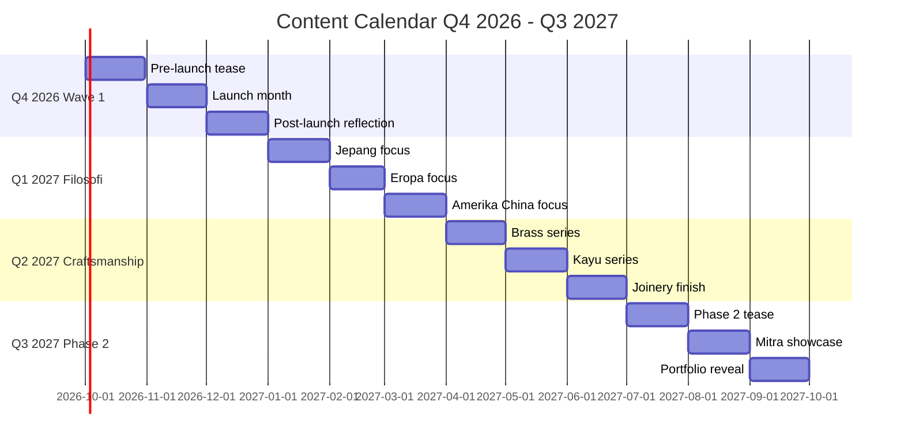
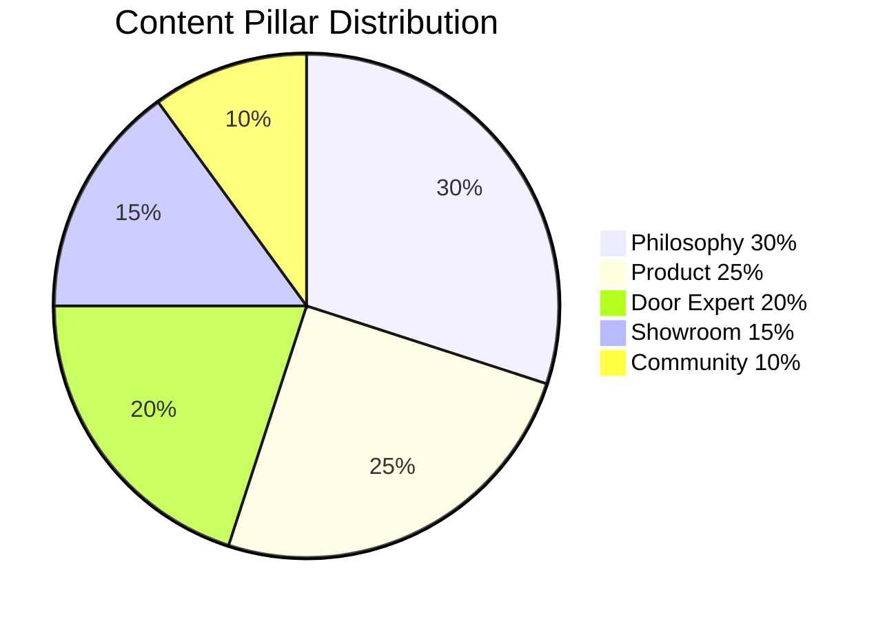
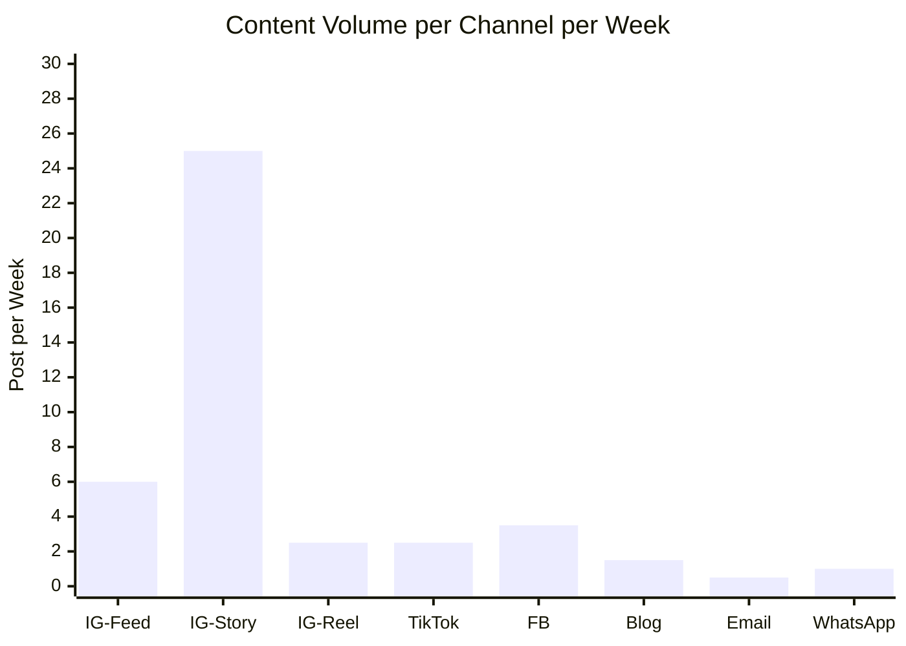

# Content Calendar Strategy

Design content calendar Gerai 1000 Pintu: pillar content, cadence per channel, theme rotation, campaign integration. Quarterly view + monthly + weekly granularity.

## Triggers

Primary:
- "content calendar"
- "kalender konten"
- "publishing strategy"

Secondary:
- "editorial planning"
- "content roadmap"

## Input Required

| Field | Type | Required | Default |
|---|---|---|---|
| period | enum | yes | (quarterly / monthly / weekly) |
| campaigns_active | array | no | (campaigns running concurrently) |
| channels | array | no | (default all: IG, FB, TikTok, Web, Email, WA) |

## Output Template

```markdown
# Content Calendar Strategy: {PERIOD}

**Period:** {Start - End date}
**Campaigns active:** {List}
**Channel scope:** {List}
**Theme rotation:** {monthly pillar focus}

## Content Pillar Framework

### Pillar 1: Filosofi & Philosophy (30% weight)
- Topic: 4-Dunia archetype deep dive
- Topic: Material philosophy (kayu, brass, etc.)
- Topic: Tempat sebagai refleksi
- Goal: Position thought leadership + brand depth
- Frequency: 2-3 post/week

### Pillar 2: Door Expert Story (20% weight)
- Topic: 5 kompetensi in practice
- Topic: Konsultasi behind-the-scene
- Topic: Customer journey narrative
- Goal: Humanize service + trust building
- Frequency: 1-2 post/week

### Pillar 3: Product & Craftsmanship (25% weight)
- Topic: AMK Premium detail showcase
- Topic: Brass + kayu detail close-up
- Topic: Project completed case study
- Goal: Quality positioning + visual desire
- Frequency: 2-3 post/week

### Pillar 4: Showroom & Experience (15% weight)
- Topic: Showroom Balikpapan atmosphere
- Topic: Material wall touch
- Topic: Konsultasi pod setup
- Goal: Physical presence + invitation
- Frequency: 1-2 post/week

### Pillar 5: Community & Culture (10% weight)
- Topic: Aesop + DWR reference cultural piece
- Topic: Indonesia design heritage
- Topic: Customer culture (Persona vignette)
- Goal: Cultural anchor + belonging
- Frequency: 1 post/week

## Channel-Specific Cadence

### Instagram Feed (5-7 post/week)
| Day | Pillar | Type |
|---|---|---|
| Monday | Philosophy | Editorial caption + photography |
| Tuesday | Product | Detail close-up |
| Wednesday | Door Expert | Story / testimony |
| Thursday | Showroom | Atmosphere |
| Friday | Project | Completed case study |
| Saturday | Community | Cultural |
| Sunday | Reflection | Weekly recap soft |

### Instagram Story (Daily 3-5 slides)
- Behind-the-scene moments
- Quick tip / micro education
- Customer Q&A
- Polls + engagement
- Story highlight monthly anchor

### Instagram Reel (2-3 reel/week)
| Day | Theme |
|---|---|
| Monday | 4-Dunia explainer (30-60 sec) |
| Wednesday | Door Expert konsultasi snippet |
| Friday | Project transformation reveal |

### TikTok (2-3 video/week)
- Short philosophy clip (15-30 sec)
- Showroom tour fragment
- Material detail satisfying close-up
- Customer reaction (with consent)

### Facebook (3-4 post/week)
- Long-form caption (more storytelling)
- Project case study cross-post
- Community group engagement
- Event/announcement

### Website Blog (1-2 article/week)
- Educational long-form (Pillar 1)
- Project case study (Pillar 3)
- Cultural editorial (Pillar 5)

### Email Newsletter (1-2/month)
- Curated digest premium hangat
- Featured project + insight
- Showroom event invitation
- Personal letter dari Matthew quarterly

### WhatsApp Broadcast (1/week)
- Curated update untuk subscriber
- New project preview
- Konsultasi slot reminder

## Quarterly Theme Rotation

### Q4 2026 (Oct-Dec): Wave 1 Launch
**Macro theme:** "Cerita Pertama Dimulai"
- Oct: Pre-launch tease, philosophy primer, showroom progress
- Nov: Launch day, opening ritual, Door Expert intro
- Dec: First project case study, year-end reflection

### Q1 2027 (Jan-Mar): Filosofi Deep Dive
**Macro theme:** "Empat Dunia Empat Cerita"
- Jan: Jepang fokus
- Feb: Eropa fokus
- Mar: Amerika + China fokus

### Q2 2027 (Apr-Jun): Craftsmanship Spotlight
**Macro theme:** "Detail yang Bermakna"
- Apr: Brass detail series
- May: Kayu solid mastery
- Jun: Joinery + finish

### Q3 2027 (Jul-Sep): Phase 2 Scale Tease
**Macro theme:** "Perjalanan Bertumbuh"
- Jul: Phase 2 prep tease (Samarinda/Bontang)
- Aug: Mitra Dagang showcase
- Sep: Project portfolio big reveal

## Campaign Integration

### Active Campaign Slot

#### Wave 1 Launch (Oct-Nov 2026)
- Frequency: 5-7 post/week dedicated
- Hashtag: #GrandOpening14Nov #Gerai1000Pintu
- Distribution: All channel
- Budget: Marketing allocated

#### 4-Dunia Series (Q1 2027)
- Frequency: 3-4 dedicated post/week
- Hashtag: #Filosofi4Dunia + per dunia
- Format: Reel + Feed + Story arc

#### Door Expert Testimonial (Year-round)
- Frequency: 1 testimonial post/week
- Format: Customer story (with consent)
- Distribution: Multi-channel

#### Mitra Dagang Showcase (Q3 2027)
- Frequency: Special launch + sustained 1 post/week
- Format: Partner spotlight + project

## Weekly Production Workflow

### Monday: Plan
- Review last week metric
- Confirm this week content list
- Brief writer + designer + photographer

### Tuesday-Wednesday: Production
- Draft caption (CCO copywriting)
- Visual asset prep (designer brief)
- Photography shoot kalau perlu
- Brand canon validate

### Thursday: Review + Schedule
- Editorial review
- Schedule via Later / Buffer
- WhatsApp + email queue

### Friday: Launch
- Live post moderation
- Engagement reply
- Story daily content
- Reel publishing

### Saturday-Sunday: Engagement
- Comment response (Door Expert + MA + Matthew)
- DM personal touch
- Soft moderation

## Cadence Math Per Quarter

### Total content output (Q baseline)
| Channel | Post/Week | Q3-Month Total |
|---|---|---|
| Instagram Feed | 6 | 78 |
| Instagram Story | 25 | 325 |
| Instagram Reel | 2.5 | 32 |
| TikTok | 2.5 | 32 |
| Facebook | 3.5 | 45 |
| Website Blog | 1.5 | 19 |
| Email | 0.5 | 6 |
| WhatsApp | 1 | 13 |
| **Total** | **~42 piece/week** | **~550 piece/quarter** |

### Production capacity required
- Copywriter equivalent: 1.5 FTE
- Designer: 1 FTE
- Photographer: 0.5 FTE
- Video editor: 0.5 FTE
- Coordinator + scheduler: 0.5 FTE
- **Total Tim Pusat content:** ~4 FTE

## Content Anti-Pattern (jangan)

### Avoid these patterns
- ❌ Repost same caption multi-channel verbatim (adapt per platform)
- ❌ Schedule + forget (no engagement reply)
- ❌ Stock photo cliche (handshake, "smile at camera")
- ❌ Trend chasing (TikTok dance, Reels meme tidak fit brand)
- ❌ Promotional dominance (every post = CTA push)
- ❌ Holiday post generic ("Selamat Hari X" tanpa angle)
- ❌ Engagement bait ("Komen YES kalau setuju")

## Performance Tracking

### KPI per pillar
| Pillar | Engagement Target | Reach Target |
|---|---|---|
| Philosophy | 5%+ | 30K+ monthly |
| Door Expert | 7%+ | 25K+ |
| Product | 6%+ | 35K+ |
| Showroom | 5%+ | 20K+ |
| Community | 4%+ | 15K+ |

### Weekly metric review
- Top 3 performing post (analyze why)
- Bottom 3 performing post (analyze why)
- Engagement rate trend
- Follower growth
- Click-through to website
- Booking konsultasi from social

### Monthly retrospective
- Pillar balance check (30/20/25/15/10 ratio maintained?)
- Campaign performance vs target
- Channel growth (which growing fastest)
- Audience insight (persona engagement)
- Content gap identified

## Editorial Calendar Visual Format

### Sample Week View
```
| Day | Time | Channel | Pillar | Topic | Status |
|---|---|---|---|---|---|
| Mon 10:00 | IG Feed | Philosophy | 4-Dunia Jepang | ✅ Scheduled |
| Mon 12:00 | IG Story | Engagement | Q&A | ✅ Live |
| Mon 19:00 | TikTok | Showroom | Walk-thru 30sec | Draft |
| Tue 09:00 | IG Reel | Door Expert | Konsultasi snippet | Pending |
| Tue 14:00 | FB Post | Project | Case study cross-post | Scheduled |
| ... | ... | ... | ... | ... | ... |
```

## Crisis Content Protocol

Kalau crisis emerge (refer COO contingency-plan):
- Pause scheduled content immediately
- CCO + CMO + Matthew alignment on response
- Brand canon strict on crisis communication
- Resume normal cadence post-resolution dengan sensitivity

## Brand Canon Compliance (continuous)

Every content piece WAJIB:
- [ ] Brand canon validate (em-dash, vocabulary, brand name)
- [ ] Tone premium hangat
- [ ] Anchor Aesop + DWR reflected
- [ ] Persona resonance
- [ ] Visual identity compliant
- [ ] Hashtag canon
- [ ] CTA non-aggressive
```

## Visual Output

Quarterly content calendar Gantt:



Pillar distribution:



Channel volume distribution:



## Knowledge Dependency

- copywriting-framework
- caption-generator
- long-form-writer
- editorial-style-guide
- brand-canon-enforcer
- 4 Marketing Plan (CMO)
- Filosofi 4-Dunia
- 6 Persona spec
- 12 Sprint reverse calendar (S1-S12)

## Mode

Default: EXECUTION (build calendar from input)
Switch: DISCUSSION jika pillar weighting debate

## Tools Required

- file-search
- artifacts (Gantt + pie + distribution)
- web-search (industry benchmark)

## Validation Criteria

- 5 pillar dengan weight + frequency
- Channel-specific cadence (IG/TikTok/FB/Blog/Email/WhatsApp)
- Quarterly theme rotation
- Campaign integration slot
- Weekly production workflow
- Production capacity calculation
- KPI per pillar + monthly review
- Anti-pattern explicit
- Brand canon compliance loop
- Calendar visual format

## Sample I/O

**Input:** "Content calendar Q4 2026 Wave 1 launch period"

**Output summary:**
- Period: 1 Oct - 31 Dec 2026
- Campaign active: Wave 1 Launch (dominant), 4-Dunia primer
- Pillar weight: 30% Philosophy + 25% Product + 20% Door Expert + 15% Showroom + 10% Community
- Channel total: ~42 piece/week → ~550 piece quarter
- Theme month: Oct Pre-launch tease, Nov Launch day + opening, Dec First case study reflection
- Production: 4 FTE Tim Pusat content (writer + designer + photographer + video + coordinator)
- KPI: Philosophy 5%+ engagement, Door Expert 7%+, Product 6%+
- Workflow: Mon plan, Tue-Wed produce, Thu review, Fri launch, weekend engage
- Anti-pattern: no repost verbatim, no trend chase, no promo dominance
- Quarterly Gantt + pillar pie + channel volume embedded

## Handoff

- caption-generator (post production)
- long-form-writer (article production)
- visual-identity-system (asset spec)
- CMO Gerai (campaign alignment)
- COO weekly-ops-report (content shipping tracking)
