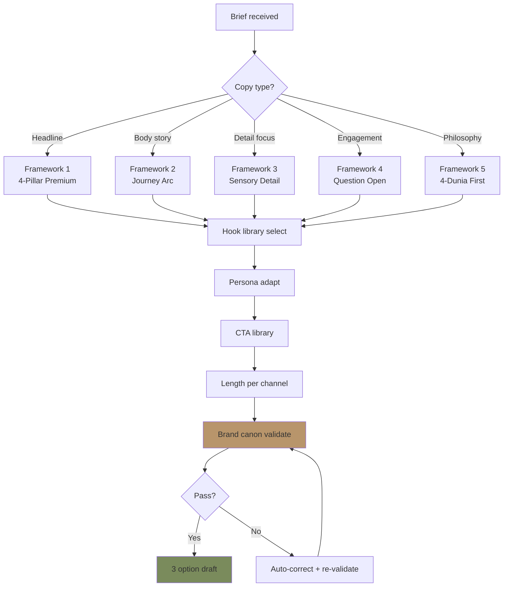
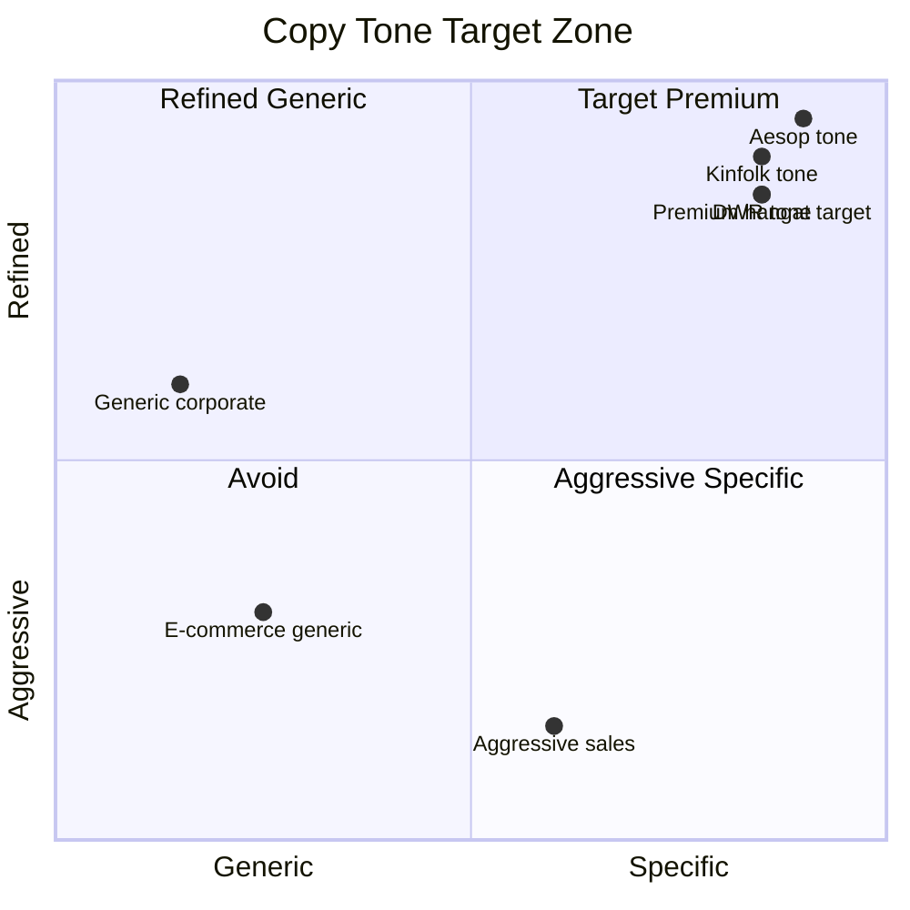

# Copywriting Framework (Premium Hangat)

Framework copywriting Gerai 1000 Pintu: hook, structure, CTA, persona-specific. Reference Aesop + DWR + Kinfolk. All output premium hangat tone, brand canon strict.

## Triggers

Primary:
- "copywriting"
- "tulis copy"
- "draft copy"

Secondary:
- "headline generator"
- "CTA copy"

## Input Required

| Field | Type | Required | Default |
|---|---|---|---|
| copy_type | enum | yes | (headline / sub / CTA / body / tagline / hashtag) |
| context | string | yes | (channel + purpose) |
| persona | enum | no | (Retail/Mitra/Developer/Arsitek/Kontraktor/Aplikator) |
| word_count | number | no | - |

## Output Template

```markdown
# Copywriting: {COPY TYPE} for {CONTEXT}

**Target:** {Persona/Audience}
**Channel:** {Where copy appears}
**Word count:** {N}
**Tone:** Premium hangat (canon strict)

## Generated Copy Options

### Option 1 (Recommended)
{Copy text}

**Rationale:**
- Hook: {how opens attention}
- Anchor reference: {Aesop/DWR/Kinfolk element}
- Persona resonance: {why this persona connect}
- Brand canon: {compliance check passed}

### Option 2 (Alternative)
{Copy text}

**Rationale:** {detail}

### Option 3 (Bolder variant)
{Copy text}

**Rationale:** {detail}

## Copywriting Frameworks

### Framework 1: 4-Pillar Premium

**Structure:** {Promise} → {Anchor} → {Experience} → {Invitation}

**Example (Hero Headline):**
- Promise: "Tempat impian dimulai dari pintu yang tepat."
- Anchor: "Curated dengan filosofi 4-Dunia."
- Experience: "Door Expert siap menemani perjalanan Anda."
- Invitation: "Konsultasi gratis 60 menit, booking via gerai.mahewwork.com"

### Framework 2: Journey Arc

**Structure:** {Where you are} → {Where you want to be} → {How we accompany}

**Example:**
- Where: "Sedang menyusun tempat yang merefleksikan karakter Anda?"
- Want: "Pintu yang tepat menjadi bagian penting dari perjalanan itu."
- Accompany: "Door Expert Gerai 1000 Pintu siap menemani Anda."

### Framework 3: Sensory Detail

**Structure:** {Sensory open} → {Meaning} → {Connection}

**Example:**
- Sensory: "Sentuhan brass yang hangat. Tekstur kayu yang lembut."
- Meaning: "Setiap detail menyimpan refleksi tempat yang Anda bangun."
- Connection: "Kami menyajikan pilihan yang dikurasi untuk Anda."

### Framework 4: Question Open

**Structure:** {Honest question} → {Reframe} → {Path forward}

**Example:**
- Question: "Apa yang membuat sebuah tempat terasa milik Anda?"
- Reframe: "Detail. Refleksi. Pintu yang tepat di setiap langkah masuk."
- Path: "Mari mulai dengan konsultasi yang hangat."

### Framework 5: Philosophy First (4-Dunia)

**Structure:** {Philosophy intro} → {Translation} → {Apply}

**Example:**
- Philosophy: "Empat dunia. Empat karakter pintu."
- Translation: "Jepang membawa jiwa. Eropa membawa seni. Amerika membawa pernyataan. China membawa legacy."
- Apply: "Manakah yang menemani tempat Anda? Door Expert kami siap mendampingi."

## Hook Library

### Opening hook patterns

**Pattern A: Question warmth**
- "Apa yang membuat tempat Anda terasa bermakna?"
- "Pintu pertama yang Anda buka setiap pagi. Bagaimana rasanya?"

**Pattern B: Sensory invitation**
- "Sentuhan brass yang hangat membuka cerita pagi Anda."
- "Tekstur kayu yang lembut. Karya yang menemani Anda bertahun-tahun."

**Pattern C: Philosophy fragment**
- "Empat dunia. Empat karakter."
- "Pintu adalah ambang. Ambang adalah refleksi."

**Pattern D: Customer-first opening**
- "Anda sedang menyiapkan tempat baru?"
- "Project Anda membutuhkan kurasi yang sesuai?"

**Pattern E: Quote / wisdom**
- "Sebuah tempat menjadi rumah ketika setiap detail merefleksikan Anda."
- (Quote attributed to anchor reference dengan elegant frame)

**Pattern F: Visual narrative**
- "Pagi di Balikpapan. Sinar matahari mengetuk brass yang Anda pilih."
- "Sore yang tenang. Pintu Eropa Anda menyambut tamu yang datang."

### Avoid these hooks
- ❌ "MURAH MERIAH! Bahan kualitas tinggi!" (commercial)
- ❌ "Promo gila-gilaan minggu ini!" (aggressive)
- ❌ "Solusi pintu terbaik di Balikpapan!" (corporate generic)
- ❌ "Klik sekarang sebelum kehabisan!" (urgency push)
- ❌ "Bingung pilih pintu? Kami punya jawabannya!" (problem-solution cliche)

## CTA Library

### Premium hangat CTA examples

**Booking konsultasi:**
- ✅ "Booking konsultasi via gerai.mahewwork.com"
- ✅ "Sediakan waktu untuk konsultasi hangat dengan Door Expert kami"
- ✅ "Mulai perjalanan Anda. Hubungi kami."

**Showroom visit:**
- ✅ "Datang berkunjung ke tempat kami di Balikpapan"
- ✅ "Showroom kami menunggu Anda dengan secangkir kopi"

**Catalog / browse:**
- ✅ "Jelajahi kurasi pintu di gerai.mahewwork.com"
- ✅ "Mari telusuri pilihan yang kami sajikan"

**Contact:**
- ✅ "Hubungi Door Expert kami via WhatsApp"
- ✅ "Kami menunggu kabar dari Anda"

### Avoid these CTAs
- ❌ "BELI SEKARANG!"
- ❌ "Daftar segera!"
- ❌ "Jangan lewatkan!"
- ❌ "Limited offer!"

## Structure Templates

### Instagram Caption (1-3 paragraph)
```
[Hook 1 sentence]

[Body 2-3 sentence — story / insight / philosophy]

[Soft CTA 1 sentence]

[Hashtag 3-5 brand canon-compliant]
```

**Word count:** 100-200 word caption

### Website Hero (landing page)
```
H1: [Hero headline 5-10 word]
H2: [Sub-headline 10-20 word]
Body: [Paragraph 2-3 sentence value prop]
CTA Button: [Action 3-5 word]
```

### Email Subject Line
- Length: 30-50 char
- Pattern: Curiosity OR personal address OR insight tease
- Avoid: emoji excessive, ALL CAPS, generic "Newsletter"

**Examples:**
- ✅ "Pintu pertama. Cerita pertama tempat Anda."
- ✅ "{Nama Customer}, slot konsultasi minggu ini terbuka"
- ✅ "4 dunia. Mana yang menemani Anda?"

### WhatsApp Opening Message
```
Selamat {pagi/siang/sore}, {Bapak/Ibu Nama}.

[Personal touch — kalau sudah kenal]

[Value statement 1 sentence]

[Soft invitation / question]

Salam hangat,
{Name}, Door Expert Gerai 1000 Pintu
```

### Press Release Opening
```
Balikpapan, {Date} — Gerai 1000 Pintu, [position 1 sentence], 
{news angle}.

[Quote leadership 2 sentence]

[Context paragraph 3-4 sentence]

[Detail paragraph + data]

[Closing invitation + contact]
```

## Persona-Specific Adaptation

### For Retail Customer
- Tone: Warm + inspiring + accessible
- Focus: "tempat impian" + journey + emotion
- Vocabulary: "menemani", "perjalanan", "refleksi"
- Length: Medium (educate + invite)

### For Mitra Dagang
- Tone: Professional + warm + collaborative
- Focus: Partnership + margin healthy + quality
- Vocabulary: "kurasi", "standar", "konsisten"
- Length: Concise (busy partner)

### For Developer Project
- Tone: Confident + factual + premium
- Focus: Spec + timeline + scale capability
- Vocabulary: "specifier", "scale", "delivery"
- Length: Concise (executive)

### For Arsitek/Designer
- Tone: Peer-level + intellectual + refined
- Focus: Philosophy + craftsmanship + collaboration
- Vocabulary: "filosofi", "framework", "kurasi"
- Length: Substantial (depth appreciated)

### For Kontraktor
- Tone: Pragmatic + reliable + warm
- Focus: Reliability + standardization + support
- Vocabulary: "konsisten", "standar", "aftersales"
- Length: Direct (action-oriented)

### For Aplikator
- Tone: Respectful + technical + warm
- Focus: Fitting + training + support
- Vocabulary: "presisi", "teknis", "mitra"
- Length: Direct + technical

## Length Guideline per Channel

| Channel | Optimal Length |
|---|---|
| Instagram caption | 100-200 word |
| Instagram Story | 5-15 word |
| Website hero H1 | 5-10 word |
| Website hero sub | 10-20 word |
| Email subject | 30-50 char |
| Email body | 150-300 word |
| WhatsApp message | 50-150 word |
| Press release | 400-600 word |
| Long-form article | 1500-2500 word |
| Tagline | 5-10 word |
| Hashtag (per use) | 1-5 word |

## Brand Canon Compliance Check (built-in)

Every copy generated MUST pass:
- [ ] No em-dash
- [ ] "tempat" not "rumah" customer-facing
- [ ] "Gerai 1000 Pintu" lengkap first mention
- [ ] Premium hangat tone
- [ ] Anchor Aesop + DWR vocabulary present
- [ ] CTA non-aggressive
- [ ] Length appropriate per channel
- [ ] Persona resonance (kalau persona specified)

## Iteration Process

### Step 1: Draft
Generate 3 option dengan framework variation.

### Step 2: Brand canon check
Auto-validate dengan brand-canon-enforcer.

### Step 3: Tone polish
Refine kalau drift toward generic / aggressive.

### Step 4: Persona alignment
Adjust vocabulary + structure per persona.

### Step 5: Final review
Editorial Reviewer agent or CCO oversight.

### Step 6: A/B test (kalau possible)
Trial 2 option, measure engagement, learn.
```

## Visual Output

Copywriting framework decision tree:



Tone target spectrum:



## Knowledge Dependency

- editorial-style-guide (foundation rules)
- brand-canon-enforcer (validation)
- 6 Persona spec (adaptation)
- Filosofi 4-Dunia (vocabulary)
- Anchor Aesop + DWR + Kinfolk reference

## Mode

Default: EXECUTION (generate copy)
Switch: NEED_CLARIFICATION jika persona/context ambigu

## Tools Required

- file-search (reference + history)
- artifacts (option display)
- web-search (anchor reference inspiration)

## Validation Criteria

- 5 framework templates explicit
- 6 hook pattern library
- CTA library premium hangat
- Structure template per channel
- Persona-specific adaptation 6 persona
- Length guideline per channel
- Brand canon compliance built-in
- Iteration process 6-step
- Anti-pattern explicit
- 3 option default output

## Sample I/O

**Input:** "Headline Instagram launch Wave 1 Cabang Balikpapan grand opening 14 Nov 2026"

**Output:**

**Option 1 (Recommended) — 4-Pillar Premium:**
"14 November. Cerita pertama dimulai. Door Expert Gerai 1000 Pintu menyambut Anda di Balikpapan."

**Option 2 — Journey Arc:**
"Tempat impian Anda menunggu kurasi yang tepat. 14 November 2026, Gerai 1000 Pintu hadir di Balikpapan."

**Option 3 — Philosophy fragment:**
"Empat dunia. Satu tempat. Gerai 1000 Pintu hadir di Balikpapan, 14 November 2026."

Brand canon: ✅ No em-dash | ✅ Tempat | ✅ Gerai 1000 Pintu lengkap | ✅ Premium hangat | ✅ Anchor refined

## Handoff

- brand-canon-enforcer (validation)
- long-form-writer (article extension)
- caption-generator (social variant)
- CMO Gerai (campaign deployment)
