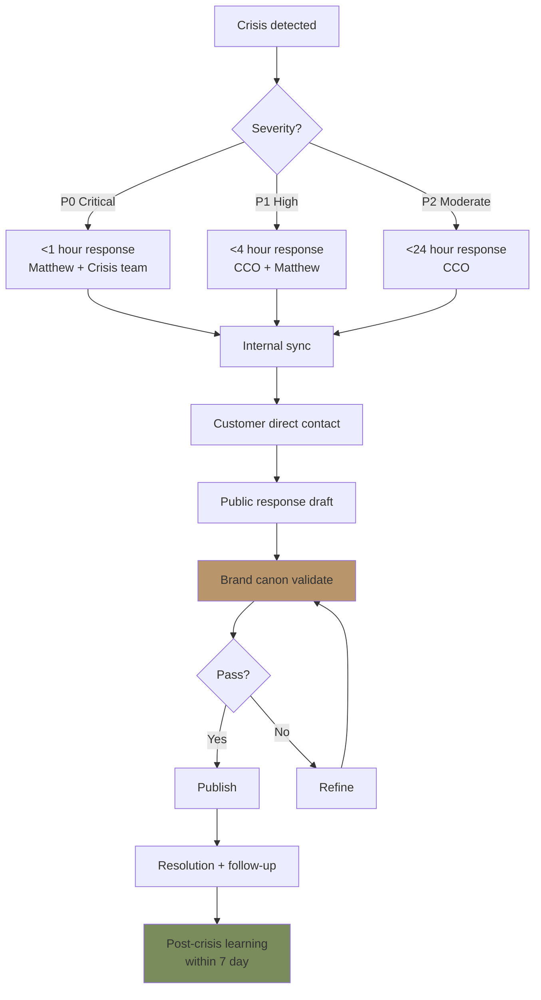
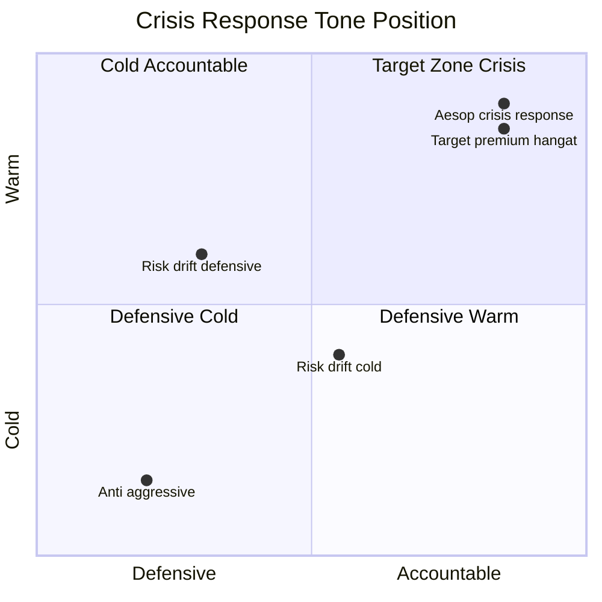

# Crisis Communication (Brand Voice di Crisis)

Communicate Gerai 1000 Pintu position di crisis: customer issue viral, brand canon violation, operational disruption, public misunderstanding. Premium hangat tone preserved + transparent + accountable.

## Triggers

Primary:
- "crisis communication"
- "krisis komunikasi"
- "PR crisis"

Secondary:
- "negative review response"
- "public statement"

## Input Required

| Field | Type | Required | Default |
|---|---|---|---|
| crisis_type | enum | yes | (customer-complaint / operational / brand-violation / public-misunderstanding / partner) |
| severity | enum | yes | (P0/P1/P2 — refer COO contingency-plan) |
| channel_affected | array | no | (where crisis emerges) |

## Output Template

```markdown
# Crisis Communication: {CRISIS TYPE}

**Severity:** {P0 Critical / P1 High / P2 Moderate}
**Detected:** {Date + time}
**Affected channel:** {List}
**Response window:** {Per severity — P0 <1h, P1 <4h, P2 <24h}
**Communication owner:** {CCO + Matthew approval}

## Crisis Communication Principles (LOCKED)

### Core Values di Crisis
1. **Truth-first:** Never lie, never deflect
2. **Customer-first:** Their experience matters more than our defense
3. **Accountability:** Own what we did wrong
4. **Calm:** Premium hangat tone preserved (no panic, no defensiveness)
5. **Action:** Statement paired with concrete action
6. **Learning:** Communicate improvement publicly

### NEVER do
- ❌ Defensive ("Tapi sebenarnya...", "Customer tidak paham...")
- ❌ Blame customer
- ❌ Block / delete negative comment (unless harassment / spam)
- ❌ Generic non-apology ("We're sorry if you felt that way")
- ❌ Silence (no response is response — bad)
- ❌ Aggressive legal threat as first response
- ❌ Em-dash slip in stress
- ❌ Off-brand tone (cold corporate OR overly emotional)

### ALWAYS do
- ✅ Acknowledge specific issue (not generic)
- ✅ Apologize sincerely (kalau salah)
- ✅ Explain what happened (transparent)
- ✅ State action concrete (what we do now)
- ✅ Offer resolution direct (private if appropriate)
- ✅ Follow through visibly
- ✅ Premium hangat tone (calm + warm + accountable)

## Crisis Type Playbooks

### Type 1: Customer Issue Viral (Negative Review / Social Post)

**Symptom:** Customer post 1-star review OR social complaint with engagement

**Severity:** Usually P1 (High, 4-hour response)

**Step 1: Internal sync (within 1 hour)**
- CCO + CMO + Matthew alignment
- Verify customer + project legitimate
- Assess validity of complaint
- Decide tone (apology / explanation / both)

**Step 2: Customer direct contact (within 2 hour)**
- Door Expert OR Matthew reach customer privately
- Listen first (DO NOT defend)
- Understand specific issue
- Offer resolution

**Step 3: Public response (within 4 hour)**
- Reply to review/post publicly
- Premium hangat tone strict
- Acknowledge + apology + action statement
- Direct to private resolution

**Public response template:**
```
{Customer Name},

Terima kasih atas masukan Anda. Pengalaman yang Anda sampaikan
tidak sesuai dengan standar pelayanan yang kami susun.

[Specific acknowledgment kalau ada detail tertentu]

Tim kami akan menghubungi Anda secara personal untuk memahami
detail lebih dalam dan mencari resolusi yang tepat. Ini hal
yang kami pelajari dengan serius.

Salam hangat,
{Name}
Gerai 1000 Pintu
```

**Step 4: Resolution + follow-up**
- Concrete resolution (refund / replace / extra service)
- Customer confirms satisfaction
- Document case + learning
- Optional: Customer testimonial post-resolution (with consent)

### Type 2: Operational Disruption (Showroom fire/flood, system down)

**Symptom:** Service interruption affecting customer experience

**Severity:** P0-P1 depending scale (refer COO contingency-plan)

**Customer communication template:**
```
Tempat Gerai 1000 Pintu sementara tidak dapat dikunjungi karena
{peristiwa spesifik tanpa over-share}.

Door Expert kami tetap melayani konsultasi via Zoom seperti biasa.
Kami akan update progress kepada Anda via WhatsApp atau email.

Terima kasih atas pengertian Anda.

Salam hangat,
Gerai 1000 Pintu
```

**Public statement (kalau perlu social):**
- Brief explanation
- Reassurance service continuity
- Timeline expectation
- Contact for question

### Type 3: Brand Canon Violation Public

**Symptom:** Caption / press / signage error yang publik (em-dash, "rumah", aggressive tone)

**Severity:** P2 (Moderate, 24-hour response)

**Step 1: Internal acknowledgment**
- Identify error specifically
- Determine scope (1 post / batch / longstanding)
- Plan correction

**Step 2: Quick correction**
- Edit / replace content quietly (kalau minor)
- Public correction statement (kalau major + noticed)
- Internal training refresh

**Public correction template (kalau perlu):**
```
Kami mencatat ada inkonsistensi dalam komunikasi kami di {channel + content}.
Ini telah kami perbarui untuk mengikuti standar editorial kami.

Terima kasih kepada {community / commenter kalau notice} yang sudah membantu
kami menjaga konsistensi.

Salam hangat,
Gerai 1000 Pintu
```

### Type 4: Public Misunderstanding (Brand Position / Pricing / Policy)

**Symptom:** Discussion online mengandung mispersepsi tentang Gerai 1000 Pintu

**Severity:** P2-P1 tergantung amplitude

**Approach:**
- Verify scope first (1 person vs sustained narrative)
- Choose: ignore (kalau isolated) vs engage (kalau spreading)
- Tone: educational, not defensive

**Engagement template:**
```
Terima kasih atas pertanyaan / diskusi yang menarik tentang
{topic specific}.

[Penjelasan singkat factual — 2-3 sentence]

Untuk konteks lebih dalam, silakan kunjungi {URL relevant content}
atau ajak Door Expert kami berdiskusi langsung.

Salam hangat,
Gerai 1000 Pintu
```

### Type 5: Partner / Vendor Crisis

**Symptom:** Mitra Dagang / vendor / Door Expert situation impacting Gerai reputation

**Severity:** P1-P2

**Approach:**
- Separation of issue (their issue vs ours)
- Communicate transparent without throwing under bus
- Action concrete on our side
- Customer reassurance

## Tone Maintenance Under Pressure

### Stress slip risk
Stress + urgent response often triggers:
- Em-dash slip
- Generic corporate tone
- Defensive language
- Over-apology

### Tone discipline
- **Slow down draft:** Even di P0, draft 15 min vs 5 min reduces error
- **Multiple eye:** CCO + Matthew minimum 2 review before public
- **Read-aloud test:** Does it sound calm + warm + accountable?
- **Brand canon validator:** Auto-check before publish

### Voice in crisis (preserve premium hangat)
- "Kami pahami..."  not "Kami sangat menyesal sekali..."
- "Ini hal yang kami pelajari..." not "Kami akan berusaha lebih baik..."
- "Tim kami akan..." not "Sales kami akan..."
- "Salam hangat" closing maintained (not "Best regards" cold)

## Channel-Specific Adaptation

### Instagram comment thread
- Reply directly to comment (visible accountability)
- Move to DM for resolution detail
- Edit pinned comment kalau major (transparent edit history)

### Google review response
- Reply within 24 hour
- Premium hangat tone
- Specific to issue
- Direct to private resolution

### WhatsApp customer direct
- Personal touch
- Empathetic listening first
- Resolution-oriented
- Follow-up commitment

### Press inquiry (kalau media catch crisis)
- Statement prepared
- Spokesperson designated (CCO or Matthew)
- Off-record discussion possible
- No "no comment" (always thoughtful response)

### Internal team announcement
- WhatsApp group "Gerai Operations"
- Honest about situation
- Clear roles + action
- Tone calm + supportive

## Stakeholder Communication Map

### Customer affected (Priority 1)
- Channel: WhatsApp direct
- Timing: Within 2 hour (P0) / 4 hour (P1)
- Tone: Empathetic + accountable + action-oriented

### Customer general (Priority 2)
- Channel: Instagram + website
- Timing: 4-24 hour
- Tone: Reassuring + transparent

### Press / Media (Priority 3)
- Channel: Press statement + direct response
- Timing: Per inquiry
- Tone: Factual + premium hangat

### Internal team (Priority 1)
- Channel: WhatsApp group
- Timing: Immediate
- Tone: Honest + supportive + clear

### Vendor / Partner (Priority 3)
- Channel: Direct call / WhatsApp
- Timing: As impacts them
- Tone: Professional + transparent

## Post-Crisis Learning

### Within 7 day post-resolution
- **Timeline review:** What happened when
- **Communication audit:** Did our message work
- **Stakeholder feedback:** How did affected parties feel
- **Process gap:** What broke
- **Improvement actions:** Specific + owner + deadline
- **Playbook update:** Add learning to crisis playbook

### Long-term
- Quarterly crisis playbook review
- Annual crisis simulation drill (CCO + CMO + Matthew)
- Customer post-resolution NPS check

## Sample Crisis Response Library

### Sample 1: Customer 1-star Google review

**Original review:**
> "Saya kecewa dengan pelayanan di sini. Promised konsultasi gratis tapi dibilang 
> harus deposit dulu. Bermasalah komunikasi banget."

**Response (within 4 hour):**
```
Pak Andi,

Terima kasih atas masukan Anda. Pengalaman komunikasi yang Anda sampaikan
tidak sesuai dengan standar yang ingin kami tawarkan.

Konsultasi Door Expert kami memang gratis, tanpa deposit. Jika ada
miscommunication, ini hal yang harus kami perbaiki.

Tim kami akan menghubungi Anda hari ini untuk memahami detail dan
membuat ini benar. Mohon kesempatannya untuk berbicara langsung.

Salam hangat,
Matthew W.
Founder Gerai 1000 Pintu
```

### Sample 2: Showroom closure unexpected

**Public statement:**
```
Tempat showroom Gerai 1000 Pintu sementara tidak dapat dikunjungi 
untuk hari ini karena {peristiwa spesifik}.

Door Expert kami tetap melayani konsultasi via Zoom seperti biasa.
Jika Anda sudah memiliki appointment hari ini, tim kami akan
menghubungi Anda untuk konfirmasi alternatif.

Update progress kami akan sampaikan via Instagram + WhatsApp.

Salam hangat,
Gerai 1000 Pintu
```

### Sample 3: Em-dash slip in published article

**Internal action (not public):**
- Quietly update article remove em-dash
- Audit other articles untuk same writer
- Training refresh

**Public statement (kalau ada notice external):**
```
Terima kasih telah membantu kami menjaga standar editorial.
Konten telah diperbarui untuk mengikuti style guide kami.

Salam hangat,
Gerai 1000 Pintu
```

## Brand Canon Compliance Under Pressure

### Per crisis response
- [ ] Em-dash absent
- [ ] "tempat" not "rumah"
- [ ] "Gerai 1000 Pintu" lengkap di formal context
- [ ] Tone calm + warm + accountable
- [ ] Specific (not generic)
- [ ] Action concrete
- [ ] CCO + Matthew approve minimum
- [ ] Read-aloud test pass
```

## Visual Output

Crisis communication decision tree:



Tone target zone in crisis:



## Knowledge Dependency

- COO contingency-plan (severity scenario)
- brand-canon-enforcer
- editorial-style-guide
- Brand voice premium hangat LOCKED
- press-release-writer (kalau press involved)
- 6 Persona spec (customer affected understanding)

## Mode

Default: EXECUTION (draft crisis response)
Switch: NEED_CLARIFICATION + escalate jika P0 ambiguity

## Tools Required

- file-search (precedent + canon)
- artifacts (response draft)

## Validation Criteria

- Core principles LOCKED (truth, customer, accountable, calm, action, learning)
- 5 crisis type playbook (customer / operational / brand-violation / misunderstanding / partner)
- Tone discipline under pressure
- Channel-specific adaptation
- Stakeholder communication map
- Post-crisis learning protocol
- Sample response library
- Brand canon compliance under pressure
- Decision tree + tone target visual

## Sample I/O

**Input:** "Crisis communication response untuk 1-star Google review customer kecewa komunikasi konsultasi gratis"

**Output summary:**
- Severity: P1 High (4-hour response)
- Type: Customer issue viral
- Internal sync: CCO + CMO + Matthew (1 hour)
- Customer direct: Matthew personal WA within 2 hour
- Public response: Within 4 hour reply Google review
- Tone: Premium hangat preserved + accountable + specific
- Apology: Acknowledged komunikasi gap + commit to make right
- Action: Direct contact today + resolution
- Follow-up: Resolution within 48 hour + optional testimonial post-resolution
- Brand canon: ✅ No em-dash + Gerai 1000 Pintu lengkap + "tempat" + warm closing
- Decision tree + tone quadrant embedded

## Handoff

- brand-canon-enforcer (validation)
- COO contingency-plan (incident protocol)
- CMO Gerai (campaign pause kalau perlu)
- Matthew (executive approval P0/P1)
- Post-crisis: testimonial-curation (kalau resolved well)
