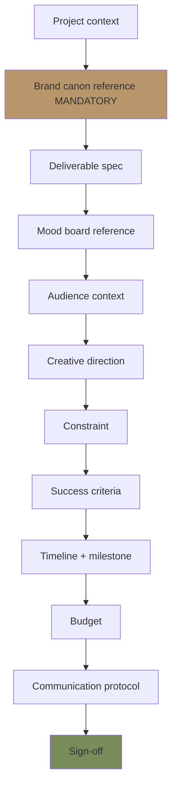
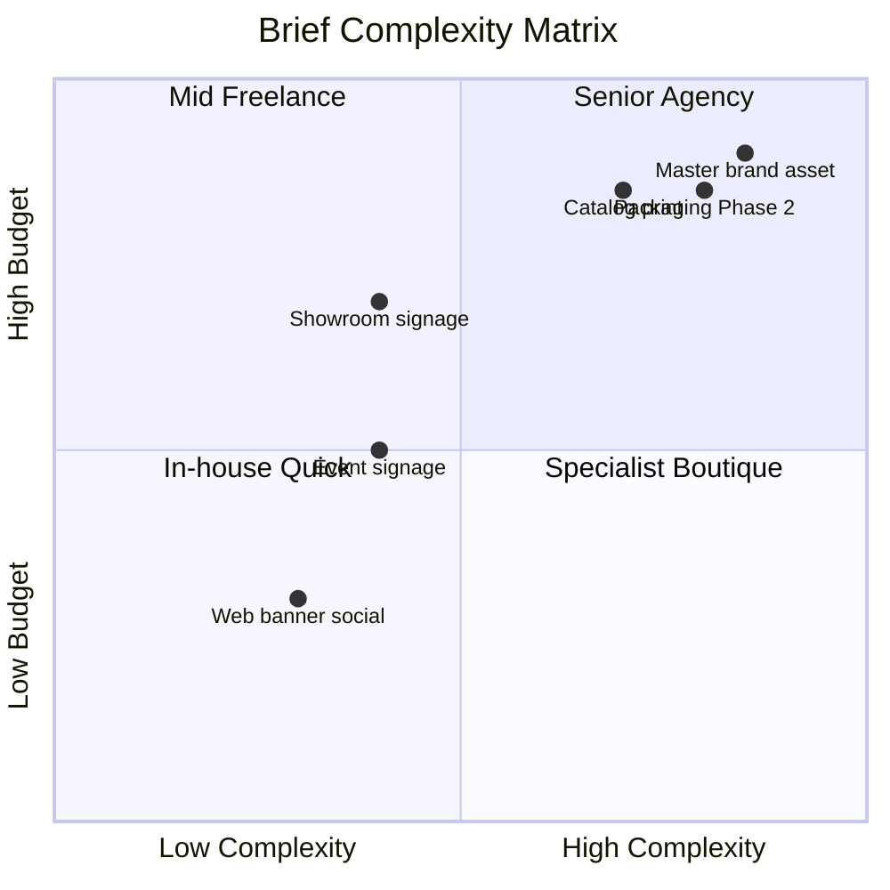

# Design Brief Generator

Generate design brief untuk vendor designer / agency / freelancer / internal designer: project context, objective, brand canon, deliverable, timeline, success criteria. Premium hangat tone, BP Latest reference anchor.

## Triggers

Primary:
- "design brief"
- "brief designer"
- "creative brief"

Secondary:
- "vendor design"
- "art direction brief"

## Input Required

| Field | Type | Required | Default |
|---|---|---|---|
| project | string | yes | (e.g., "Showroom signage", "Catalog 2027") |
| deliverable | string | yes | (specific output expected) |
| timeline | string | yes | - |
| budget | number | no | Rp |
| designer_type | enum | no | (in-house / freelance / agency) |

## Output Template

```markdown
# Design Brief: {PROJECT NAME}

**Brief #:** GERAI-DB-{YYYY}-{NNN}
**Date:** {Date}
**Project owner:** {Internal contact}
**Designer:** {Vendor / Designer name kalau sudah assigned}
**Timeline:** {Start - Delivery}
**Budget:** Rp {amount}

## Project Context

### Background
{Project context narrative — what we're doing, why now, where it fits}

### Strategic Context
- Phase: {Wave 1 launch / Phase 2 scale / Steady ops}
- Campaign aligned: {kalau ada}
- Channel target: {where will deliverable live}

### Objective (specific + measurable)
{What this design should achieve — not just what it looks like}

## Brand Canon Reference (MANDATORY)

### Visual Identity LOCKED
- **Palette:**
  - Brass `#B8956B` (focal 10% area)
  - Charcoal `#1F1A14` (text dominant 60%)
  - Ivory `#FAF8F4` (background 30%)
- **Typography:**
  - Display: Playfair Display (serif)
  - Body: Inter (sans-serif)
- **Photography:** BP Latest reference

### Brand Tone
- Premium hangat (calm + warm + refined)
- BP Latest reference anchor
- NOT commercial loud
- NOT trendy seasonal

### 7 Editorial Rules (kalau copy involved)
1. No em-dash
2. "tempat" not "rumah" customer-facing
3. "Gerai 1000 Pintu" lengkap first mention
4. Premium hangat tone
5. No drop shadow / 3D / gradient flashy
6. Anchor BP Latest reference vocabulary
7. Playfair serif + Inter sans typography

### Anti-pattern (jangan)
- ❌ Rainbow palette / saturated color
- ❌ Drop shadow heavy
- ❌ 3D bevel
- ❌ Gradient flashy
- ❌ Glossy reflection artificial
- ❌ Sans-serif decorative headline
- ❌ Generic stock photo cliche
- ❌ All-caps body text

## Deliverable Specification

### Format
- File format: {SVG / AI / Figma / PDF / etc.}
- Resolution: {requirement spec}
- Color mode: {CMYK print / RGB digital}
- Variants required: {responsive size, dark/light, etc.}

### Specific Deliverable
1. {Item 1 dengan spec detail}
2. {Item 2 dengan spec detail}
3. {Item 3 dengan spec detail}

### Source File
- ✅ Source file editable required (Figma / AI / etc.)
- ✅ Asset library separate per layer
- ✅ Naming convention follow (gerai_{category}_{variant}_{size})

## Mood Board Reference

### Inspiration sources (study + adapt, do NOT copy)
1. **BP Latest reference** — store interior + brand identity + product shot
2. **BP Latest reference** — catalog editorial + photography
3. **premium editorial publication** — typography + composition + tone
4. **Nendo studio** — minimal craftsmanship
5. **Tadao Ando / Kengo Kuma** — Japanese material reverence
6. **{Project-specific reference}**

### Mood board curated link
{Pinterest board / Notion / Figma reference}

## Audience Context

### Primary persona
- Persona: {Retail/Mitra/Developer/Arsitek/Kontraktor/Aplikator}
- Demographic: {age, geography, role}
- Psychographic: {value, aspiration, pain}

### Emotional outcome target
- What customer should FEEL: {warmth, calm, aspiration, trust}
- What customer should THINK: {curated, premium, refined, accessible}
- What customer should DO: {konsultasi, visit, share}

## Creative Direction

### Concept (kalau pre-defined)
{1-paragraph concept narrative — what this design says}

### Layout Principle
- White space generous (50%+)
- Hero focal 1 element
- Hierarchy clear
- Alignment grid 12-column
- Margin consistent

### Photography Direction (kalau photo involved)
- Subject: {Product detail / Tempat environment / Human craft / Showroom}
- Mood: {Morning natural / Evening warm / Studio neutral}
- Composition: {Detail tight / Wide environmental / Editorial}
- Color grade: {Warm neutral, brass enhanced}

### Typography Hierarchy
- H1: Playfair Display 64-96px Regular
- H2: Playfair Display 40-48px Regular
- Body: Inter 16-20px Regular
- Caption: Inter 14px Medium

## Constraint

### Hard constraint (non-negotiable)
- Brand canon 100% compliance
- Budget Rp {amount}
- Timeline {date deadline}
- Format spec {detail}

### Soft constraint (flexible)
- Concept variations: 2-3 explore OK
- Photography source: stock acceptable kalau brand-aligned
- Iteration: 2 round revision included

## Success Criteria

### Deliverable quality
- Brand canon validation 100% pass
- Source file editable + organized
- Hi-res + low-res variants
- Asset naming convention

### Creative quality (qualitative)
- Refined premium hangat feel achieved
- BP Latest reference anchor visible
- Photography compelling editorial
- Typography hierarchy elegant
- Layout breathing space generous

### Business quality
- Audience resonance per persona
- CTA clear (kalau applicable)
- Brand canon strict
- Cross-channel adaptability (kalau master file)

## Timeline & Milestone

| Milestone | Date | Deliverable |
|---|---|---|
| Brief kickoff | {date} | Brief signed + Q&A session |
| Concept exploration | {date} | 2-3 concept direction |
| Concept selected | {date} | 1 direction confirmed |
| First draft | {date} | Initial design |
| Revision Round 1 | {date} | Refined design |
| Revision Round 2 | {date} | Final draft |
| Final delivery | {date} | Source + variant + asset |
| Project close | {date} | Handoff complete |

## Budget Breakdown

| Item | Cost Rp |
|---|---|
| Design fee | {amount} |
| Photography (kalau ada) | {amount} |
| Stock asset license | {amount} |
| Revision overhead | {amount} |
| **Total** | **Rp {amount}** |

## Communication Protocol

### Decision Authority
- Concept approval: CCO
- Creative detail: CCO + Project owner
- Brand canon: Editorial Reviewer agent auto-validate
- Budget approval: CFO + CCO
- Final sign-off: Matthew (kalau master / hero asset)

### Meeting Cadence
- Kickoff: Week 1
- Concept review: Week 2
- Draft review: Week 4
- Revision review: Week 5-6
- Final review: Week 7
- Communication async: Notion + WhatsApp

## Designer Onboarding Quick Reference

### Brand Canon Quick Hit
- 60% Charcoal #1F1A14 (text + structure)
- 30% Ivory #FAF8F4 (background)
- 10% Brass #B8956B (focal)
- Playfair serif + Inter sans
- BP Latest reference
- Premium hangat tone
- NO em-dash, drop shadow, 3D, gradient flashy

### Knowledge Resource Links
- Brand Canon full document: {Notion link}
- Visual identity system: {file link}
- Asset library: {Figma / cloud link}
- Photography library: {link}
- Editorial style guide: {link}
- Anchor reference mood board: {Pinterest / link}

## Project-Specific Note

{Any unique context, constraint, history}

## Sign-Off

Designer:
- Name: ___________________
- Date: ___________________
- Acknowledge brand canon: ☐

Project owner:
- Name: ___________________
- Date: ___________________

CCO oversight:
- Approval: ☐
- Date: ___________________
```

## Brief Template Variants

### Template 1: Showroom Signage Brief
- Material: Brass nameplate
- Typography: Playfair Display engraved
- Size: spec per signage type (storefront, directional, section)
- Installation: spec
- Vendor: signage fabricator local

### Template 2: Catalog Print Brief
- Format: A4 / square / custom
- Page count: typically 16-32 page
- Photography: Category A (product detail) dominant
- Editorial: Long-form caption Inter body
- Print spec: matte / uncoated paper, debossed cover (premium feel)

### Template 3: Digital Asset Brief (Web/Social)
- Asset: Social template, web banner, story template
- Source file: Figma master + export variant
- Responsive: desktop + tablet + mobile
- Adaptation: per channel resize

### Template 4: Packaging Brief (Phase 2+)
- Form factor: Wrapping / box / sleeve
- Material: kraft / brass-foil stamped / minimal
- Print: 2-color max
- Sustainability consideration

### Template 5: Event / Showroom Decor Brief
- Context: Grand opening / event / display refresh
- Element: Banner / standee / table card / signage
- Reusability: Multi-event vs one-off

## Visual Output

Brief structure flow:



Designer brief decision matrix:



## Knowledge Dependency

- visual-identity-system (canon reference)
- brand-canon-enforcer
- editorial-style-guide
- Brand Canon LOCKED full document
- Anchor BP Latest reference
- 6 Persona spec

## Mode

Default: EXECUTION (generate brief from input)
Switch: NEED_CLARIFICATION jika project scope ambigu

## Tools Required

- file-search
- artifacts (brief document)

## Validation Criteria

- Brand canon reference mandatory section
- Deliverable spec detailed
- Mood board reference BP Latest reference
- Audience context + persona
- Creative direction (layout + photography + typography)
- Constraint hard + soft
- Success criteria measurable
- Timeline milestone
- Budget breakdown
- Communication protocol
- Designer onboarding quick reference
- Sign-off section
- 5 template variant ready

## Sample I/O

**Input:** "Design brief untuk Catalog 2027 cetak A4 32 halaman launch Q2 2027"

**Output summary:**
- Project: Catalog 2027 print A4 32 page
- Owner: CCO + Marketing Lead
- Budget: Rp 60jt (design Rp 35jt + photography Rp 15jt + print first batch Rp 10jt)
- Timeline: Brief Mar 2027 → Concept Apr → Draft Jun → Final Aug → Print Sep
- Deliverable: 32-page catalog Figma source + PDF print-ready + asset library
- Brand canon: 60/30/10 ratio, Playfair + Inter, BP Latest reference+Indonesian editorial reference, no em-dash, "tempat"
- Photography: Category A (product detail) dominant + Category B (tempat environment) accent
- Editorial: Long-form caption per page, sectioned per 4-negara cultural reference + Persona spotlight
- Print spec: matte uncoated paper, brass-foil stamped cover, debossed brand mark
- Success: Brand canon 100% + BP-aligned editorial premium + 6 persona resonance
- Sign-off: Designer + Project owner + CCO + Matthew final
- Brief flow + brief matrix embedded

## Handoff

- visual-identity-system (canon source)
- brand-canon-enforcer (validation per deliverable)
- photography-direction (kalau photo involved)
- CFO Gerai (budget approval)
- COO vendor-onboarding (kalau new designer vendor)
