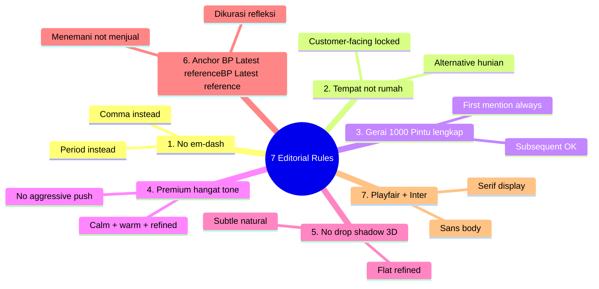
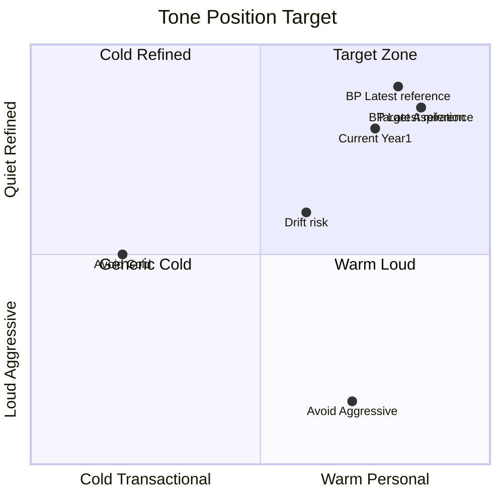

# Editorial Style Guide

Comprehensive editorial style guide Gerai 1000 Pintu: 7 rules locked, voice + tone, vocabulary, punctuation, grammar, formatting. Reference untuk semua content writer + agent.

## Triggers

Primary:
- "editorial style guide"
- "writing standard"
- "style reference"

Secondary:
- "tone of voice guide"
- "copy rules"

## Output Template

```markdown
# Editorial Style Guide Gerai 1000 Pintu

**Status:** 🔒 LOCKED canon
**Last update:** 2026-05-27
**Mandatory for:** All content creator (internal + freelance) + all agent

## 7 Editorial Rules (LOCKED — non-negotiable)

### Rule 1: NO em-dash (` — `)
**Status:** 🔒 LOCKED

**Reason:** Em-dash typographic creates pause yang too aggressive for premium hangat tone. Use period or comma instead.

**Pattern detection:**
- ` — ` (em-dash with spaces)
- `—` (em-dash standalone)
- `--` (double hyphen often auto-converts)

**Replacement:**
- Period: "Konsultasi gratis. Tunggu Anda di showroom."
- Comma: "Konsultasi gratis, kami tunggu Anda."
- Restructure: "Konsultasi gratis yang kami sediakan untuk Anda."

**Examples:**
- ❌ "Konsultasi premium — gratis 60 menit"
- ✅ "Konsultasi premium. Gratis 60 menit."

### Rule 2: "tempat" not "rumah"
**Status:** 🔒 LOCKED

**Reason:** "Tempat" lebih luas dan refined. "Rumah" trigger asosiasi kasual + mass-market. Premium retail butuh vocabulary yang membuka imajinasi (rumah, ruko, villa, hunian apapun).

**Application:**
- Customer-facing: SELALU "tempat"
- Internal admin: "rumah" allowed kalau spesifik teknis
- Alternative kalau context perlu spesifik: "hunian", "kediaman", "ruangan"

**Examples:**
- ❌ "Pintu untuk rumah impian Anda"
- ✅ "Pintu untuk tempat impian Anda"
- ✅ "Tempat tinggal yang bermakna"
- ✅ "Hunian yang refleksi karakter Anda"

### Rule 3: "Gerai 1000 Pintu" lengkap (first mention)
**Status:** 🔒 LOCKED

**Reason:** Brand name lengkap build recall + premium feel. Shortening "Gerai" alone weakens brand recognition.

**Rules:**
- First mention dalam any communication: "Gerai 1000 Pintu" lengkap
- Subsequent mention same paragraph: "Gerai" OK kalau context jelas
- Formal context (press, contract, header): SELALU lengkap
- Casual context (WhatsApp casual back-and-forth): subsequent "Gerai" acceptable

**Internal abbreviation (NOT customer-facing):**
- "G1P" OK internal docs
- "Gerai" alone OK internal team chat

**Examples:**
- First mention: ✅ "Selamat datang di Gerai 1000 Pintu. Kami senang Anda berkunjung."
- Subsequent: ✅ "Di Gerai, Door Expert siap menemani Anda."
- Formal header: ✅ "Press Release Gerai 1000 Pintu — Wave 1 Launch"

### Rule 4: Tone premium hangat (calm + warm + refined)
**Status:** 🔒 LOCKED

**Components:**
1. **Calm:** No urgency push (jangan "BURUAN!", "JANGAN SAMPAI!", excessive CAPS)
2. **Warm:** Audience-first (Anda focus, bukan kami sombong)
3. **Refined:** BP Latest reference vocabulary anchor (curated, refined, refleksi, refleksi, etc.)

**Tone scale:**
- ❌ Aggressive (10): "BELI SEKARANG! TERBATAS!"
- ❌ Pushy (8): "Jangan lewatkan kesempatan ini!"
- ⚠️ Neutral (5): "Kami menawarkan produk premium."
- ✅ Warm (3): "Kami sediakan konsultasi yang hangat untuk Anda."
- ✅ Refined (1): "Sebuah perjalanan yang kami susun bersama Anda."

**Target:** Always between Warm (3) and Refined (1).

### Rule 5: No drop shadow / 3D / gradient flashy (visual)
**Status:** 🔒 LOCKED

**Reason:** Premium tetapi inklusif retail = flat refined aesthetic. Drop shadow + 3D = commercial cheap feel.

**Allowed:**
- Solid color flat
- Subtle gradient (Brass to slightly lighter brass within 5% tone difference)
- Photography natural shadow (organic light)

**Forbidden:**
- Drop shadow heavy
- 3D bevel effect
- Rainbow gradient
- Glow effect
- Glossy reflection artificial

### Rule 6: Anchor BP Latest reference vocabulary
**Status:** 🔒 LOCKED reference

**Premium-inspired vocabulary:**
- "menemani" (accompany) — instead of "menjual" (sell)
- "dikurasi" (curated)
- "refleksi" (reflection)
- "bermakna" (meaningful)
- "ritual" (ritual)
- "perjalanan" (journey)

**BP Latest-inspired vocabulary:**
- "tempat" (place)
- "modern timeless" (modern timeless)
- "craftsmanship" (selectively English OK)
- "kurasi" (curation)
- "design intentional" (selectively English OK)

**Indonesia premium hangat:**
- "hangat" (warm)
- "tersedia" (available, gentle)
- "menyiapkan" (preparing)
- "bersama" (together)

### Rule 7: Serif + sans typography pair (visual)
**Status:** 🔒 LOCKED

**Primary:**
- Display: Playfair Display (serif)
- Body: Inter (sans-serif)

**Detail:** refer visual-identity-system skill

## Voice & Tone Framework

### Brand Voice (consistent always)
- **Persona:** Door Expert yang refined + hangat + knowledgeable + patient
- **Like talking to:** Senior konsultan BP Latest reference/BP Latest reference yang care about you
- **NOT like:** Sales pushy, generic call center, e-commerce listing copy

### Tone Variation per Context

| Context | Tone Specific |
|---|---|
| Customer first interaction | Welcoming + curious + refined |
| Konsultasi session | Engaged + listening + educating |
| Aftersales follow-up | Caring + accountable + warm |
| Crisis communication | Calm + responsible + transparent |
| Internal team | Professional + warm + collaborative |
| Press / formal | Refined + factual + premium |
| Social media | Inspiring + accessible + still premium |

## Vocabulary Library

### Verbs (preferred → avoid)
| Use | Avoid |
|---|---|
| menemani | menjual / push |
| menyiapkan | offering (English random) |
| menyajikan | providing (corporate) |
| mendampingi | servicing |
| menjawab | responding |
| menemukan | finding (transactional) |

### Nouns (preferred → avoid)
| Use | Avoid |
|---|---|
| tempat | rumah (customer) |
| perjalanan | proses |
| konsultasi | meeting (generic) |
| Door Expert | sales / staff |
| kurasi / curation | selection (basic) |
| filosofi | philosophy (English alt) |

### Adjectives (preferred → avoid)
| Use | Avoid |
|---|---|
| hangat | nyaman (generic) |
| refined | elegant (overused) |
| premium | mahal (priced) |
| bermakna | bagus (generic) |
| timeless | trendy / kekinian |
| craftsmanship | quality (basic) |

### Connectors (style)
- "Karena" (gentle) > "Sebab" (formal stiff)
- "Yang" (flow) > "Mana" (formal)
- "Dengan" > "Bersama" (kalau context tepat)
- "Untuk Anda" (always Anda focus)

## Punctuation Standard

### Period (.)
- Always end sentences (no ellipsis dramatic)
- After abbreviation: Mr., Mrs., Dr.

### Comma (,)
- Series: A, B, dan C (Oxford comma optional, prefer consistent within doc)
- Subordinate clause: "Ketika Anda berkunjung, Door Expert akan menemani."

### Colon (:)
- List introduction
- Quote attribution
- Definition

### Semicolon (;)
- Rare use, only complex structure
- Prefer split into 2 sentences if possible

### Dash
- ❌ Em-dash ( — ) FORBIDDEN
- ✅ En-dash (–) acceptable for date range "2026–2027"
- ✅ Hyphen (-) for compound "Door-Expert" (rare, prefer space)

### Quote
- Indonesian style: kutipan langsung pakai " " (double curly preferred di typography premium)
- Single ' ' untuk nested quote

### Ellipsis (...)
- Used sparingly (only for genuine pause or thought trailing)
- Never aggressive marketing ("Limited stock...")

## Grammar Conventions

### Capitalization
- Sentence case dominant (not Title Case Aggressive)
- Brand: "Gerai 1000 Pintu" (proper)
- Role: "Door Expert" (proper noun, locked)
- Section heading: Sentence case OK, Title Case for hero only

### Bold + Italic
- **Bold:** key term / emphasis sparingly (premium = less is more)
- *Italic:* foreign phrase ("wabi-sabi"), book title, accent
- ❌ Underline forbidden (commercial signal)
- ❌ ALL CAPS body (only labels max 3 word)

### Number formatting
- Spell out 1-10: "Satu" / "satu"
- Numeral 11+: "11", "100"
- Exception: technical spec (always numeral "5 cm", "1000 unit")
- Currency: "Rp 10.000.000" (period thousand separator)

### Date format
- Full: "14 November 2026"
- Short: "14 Nov 2026"
- ISO machine: "2026-11-14"
- NOT US format "11/14/2026"

### Time
- 24-hour preferred: "14:00 WIB"
- 12-hour acceptable: "2:00 siang WIB"
- Always include zone "WIB"

## Formatting Standard

### Headings
- H1: Page hero
- H2: Section major
- H3: Sub-section
- H4: rare, sparse

### List
- Bullet: tight ordering not implied (•)
- Number: sequential (1, 2, 3)
- Mixed: not preferred

### Paragraph
- Length: 2-4 sentence ideal (web readable)
- Line break: every paragraph
- Indent: not used (web), tab OK print

### Hyperlink
- Underline natural
- Color: Brass #B8956B kalau brand context
- Text descriptive: "Booking konsultasi" not "click here"

### Code / technical
- Monospace font for code
- Inline `code` OK
- Block code triple backtick

## Pronoun + Address

### Customer
- "Anda" (formal warm) — dominant choice
- "kamu" (casual) — only if context very informal (rare di Gerai)
- "Bapak / Ibu" — opening formal communication

### Self-reference (Gerai)
- "Kami" (we) — most situations
- "Gerai 1000 Pintu" — formal third-person
- ❌ Avoid "saya" personal (kecuali konsultasi 1-on-1 Door Expert)

### Door Expert in conversation
- Self: "Saya, Door Expert Anda"
- Pronoun: Indonesian formal "Saya"

## SEO + Accessibility

### SEO consideration
- Title tag: include "Gerai 1000 Pintu" + keyword
- Meta description: 150-160 char, premium hangat tone
- H1 unique per page
- Alt text descriptive Indonesia (image accessibility)

### Accessibility
- Heading hierarchy logical (no skip H1→H3)
- Color contrast minimum WCAG AA
- Alt text descriptive (not "image1.jpg")
- Link text descriptive

## Common Mistakes & Corrections

### Mistake 1: Mix English-Indonesia random
- ❌ "Kami offer best service untuk customer Anda"
- ✅ "Kami menyediakan pelayanan terbaik untuk Anda"

### Mistake 2: Aggressive CTA
- ❌ "DAFTAR SEKARANG! SLOT TERBATAS!"
- ✅ "Booking konsultasi Anda di gerai.mahewwork.com"

### Mistake 3: Generic corporate
- ❌ "Solusi terbaik untuk kebutuhan pintu Anda"
- ✅ "Kurasi pintu yang refleksi karakter tempat Anda"

### Mistake 4: Em-dash habit (writer slip)
- ❌ "Konsultasi gratis — booking via WhatsApp"
- ✅ "Konsultasi gratis. Booking via WhatsApp."

### Mistake 5: Over-emphasis
- ❌ "PREMIUM!! TERBAIK!! BERKUALITAS!!"
- ✅ "Kurasi premium yang menemani Anda"

## Editorial Review Process

### Pre-publish checklist
- [ ] 7 rules compliance (em-dash, tempat, Gerai lengkap, tone, visual, anchor, typography)
- [ ] Vocabulary aligned
- [ ] Tone in target range (warm-refined)
- [ ] Punctuation correct (no em-dash)
- [ ] Brand name first-mention lengkap
- [ ] Anchor BP Latest reference vocabulary reflected
- [ ] Premium hangat throughout

### Review escalation
- Auto-validation: brand-canon-enforcer agent
- Manual review: Editorial Reviewer (CCO function)
- Final approval (formal/press): CCO + Matthew
```

## Visual Output

7 Rules visual reminder card:



Tone target zone:



## Knowledge Dependency

- Brand Canon LOCKED full document
- brand-canon-enforcer (auto-validation pair)
- visual-identity-system (visual rule extension)
- Anchor BP Latest reference

## Mode

Default: REFERENCE (provide guide)
Switch: EXECUTION kalau rewrite request

## Tools Required

- file-search
- artifacts (visual reminder)

## Validation Criteria

- 7 rules locked + detailed
- Voice + tone framework
- Vocabulary library (verb + noun + adjective + connector)
- Punctuation standard explicit
- Grammar convention
- Formatting standard
- Pronoun + address rule
- SEO + accessibility
- Common mistakes + correction
- Editorial review process + checklist

## Sample I/O

**Input:** "Editorial style guide reference untuk Marketing freelance writer baru"

**Output summary:**
- 7 rules locked: em-dash NO, tempat YES, Gerai 1000 Pintu lengkap first, premium hangat tone, no drop shadow, BP Latest reference/BP Latest reference anchor, Playfair + Inter
- Voice: Door Expert refined + hangat + knowledgeable + patient
- Tone variation 7 context (customer/konsultasi/aftersales/crisis/internal/press/social)
- Vocabulary 4-category (verb/noun/adjective/connector) preferred vs avoid
- Punctuation: NO em-dash, period + comma preferred
- Grammar: sentence case, "Anda" formal warm
- Format: paragraph 2-4 sentence, list bullet, hyperlink Brass
- 5 common mistake + correction
- Pre-publish checklist 7 item
- Visual mindmap + tone quadrant embedded

## Handoff

- brand-canon-enforcer (validation pair)
- All content creator + agent (reference)
- training-curriculum COO (refresher module)
