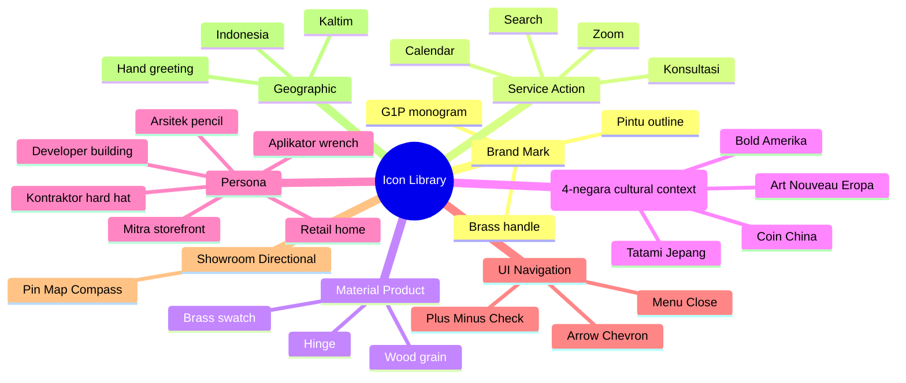
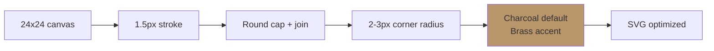

# Iconography System

Design + maintain icon library Gerai 1000 Pintu: minimal linear style, Premium-inspired refinement, brand canon palette. Library curated untuk UI, web, signage, print.

## Triggers

Primary:
- "iconography"
- "icon system"
- "icon library"

Secondary:
- "icon design"
- "pictogram"

## Input Required

| Field | Type | Required | Default |
|---|---|---|---|
| icon_purpose | string | yes | (e.g., "navigation web", "showroom directional") |
| icon_count | number | no | - |
| context | string | no | - |

## Output Template

```markdown
# Iconography System: {PROJECT/CONTEXT}

**Style:** Minimal linear, Premium-inspired
**Palette:** Charcoal #1F1A14 default, Brass #B8956B accent
**Status:** 🔒 LOCKED style guide

## Style Specification

### Line Weight
- Standard: 1.5px (24px icon canvas)
- Bold variant: 2px (rare use, accent)
- Hairline: 1px (small icon <16px)

### Stroke
- Round cap end
- Round join
- No flat / square cap (avoid harsh)

### Corner Radius
- Slight 2-3px radius (refined)
- NOT sharp 90° (harsh)
- NOT heavily rounded (cartoon)

### Fill vs Outline
- Default: Outline (line-art)
- Filled variant: Available for selected high-emphasis icon (CTA buttons)
- Avoid: Mixed fill + outline same icon

### Canvas
- Standard: 24x24 px (web UI)
- Variants: 16, 24, 32, 48, 64 px
- Bounding box: 1-2px padding inside canvas

## Core Icon Library (Curated)

### Category 1: Brand Mark Variant
| Icon | Use | Variant |
|---|---|---|
| Pintu outline | Brand mark | Primary + favicon |
| Brass handle | Premium signal | Accent |
| G1P monogram | Internal mark | Rare use |

### Category 2: Service / Action
| Icon | Use | Where |
|---|---|---|
| Chat bubble | Konsultasi | Web CTA, WhatsApp |
| Calendar | Schedule | Booking page |
| Video camera | Zoom session | Konsultasi pod |
| Search | Catalog browse | Web nav |
| Heart | Favorite product | Web wishlist |
| Document | Catalog / PDF | Download CTA |
| Email envelope | Newsletter | Footer |
| Phone | Hotline | Contact |
| WhatsApp logo | Direct message | Contact + footer |

### Category 3: Material / Product
| Icon | Use |
|---|---|
| Wood grain pattern | Material category |
| Brass swatch | Material category |
| Hinge detail | Component |
| Lock cylinder | Hardware |
| Door swing | Functional spec |

### Category 4: Filosofi Dunia Pintu (4-negara cultural context)
| Icon | Dunia | Symbol |
|---|---|---|
| Tatami pattern | Jepang | Simplified mat grid |
| Floral motif | Eropa | Art Nouveau curve |
| Bold cross | Amerika | Statement geometric |
| Coin / circle pattern | China | Auspicious geometry |

### Category 5: Persona Indicator
| Icon | Persona |
|---|---|
| Home outline | Retail |
| Storefront | Mitra Dagang |
| Building cluster | Developer |
| Pencil ruler | Arsitek |
| Hard hat | Kontraktor |
| Wrench | Aplikator |

### Category 6: UI / Navigation
| Icon | Use |
|---|---|
| Hamburger menu | Mobile nav |
| Close X | Modal dismiss |
| Arrow left/right | Navigation |
| Chevron down | Expand |
| Plus | Add |
| Minus | Remove |
| Check | Confirm |
| Info circle | Information |
| Warning triangle | Alert |

### Category 7: Showroom Directional
| Icon | Use |
|---|---|
| Tempat marker | Location pin |
| Map outline | Find showroom |
| Compass | Direction |
| Footstep | Walk-in welcome |
| Open door | Entrance |

### Category 8: Geographic / Cultural
| Icon | Use |
|---|---|
| Kaltim outline | Region indicator |
| Indonesia archipelago | National scope |
| Hand greeting | Hospitality cultural |

## Color Application Rules

### Default
- Charcoal `#1F1A14` on Ivory background
- Brass `#B8956B` on Charcoal background

### Accent
- Brass `#B8956B` for emphasis (max 10% icons in any view)
- Warm tan `#D4B895` for soft accent rare

### State
- Active: Brass `#B8956B`
- Inactive: Charcoal 60% opacity
- Hover: Brass with subtle scale 1.05x
- Disabled: Charcoal 30% opacity

### Anti-pattern
- ❌ Multi-color icon (gradient, rainbow)
- ❌ Emoji-style colorful
- ❌ Drop shadow on icon
- ❌ Glow effect
- ❌ Outline + fill inconsistent same family

## Naming Convention

```
icon_{category}_{name}_{variant}_{size}.{ext}

Examples:
icon_brand_pintu_outline_24.svg
icon_service_konsultasi_filled_32.svg
icon_persona_arsitek_outline_24.svg
icon_dunia_jepang_pattern_48.svg
```

## File Format Standard

### Primary: SVG
- Optimized + minimized
- Single path preferred (compound paths OK)
- No raster embedded
- ViewBox `0 0 24 24` standard

### Web Icon Font (kalau scale large)
- Custom font generated from SVG library
- Use sparingly (loading consideration)

### Raster Backup
- PNG @1x, @2x, @3x
- For specific use case yang SVG tidak optimal

## Implementation Guidelines

### Web (HTML/CSS)
```html
<svg class="icon" width="24" height="24" viewBox="0 0 24 24" 
  fill="none" stroke="#1F1A14" stroke-width="1.5">
  <!-- path -->
</svg>
```

```css
.icon {
  width: 24px;
  height: 24px;
  stroke: var(--charcoal); /* #1F1A14 */
  transition: stroke 0.2s ease;
}

.icon:hover {
  stroke: var(--brass); /* #B8956B */
}
```

### Print
- SVG vector preferred (scalable)
- Outline stroke 0.5pt minimum
- Color: Charcoal `#1F1A14` solid OR Brass `#B8956B`

### Showroom Signage
- Brass-foil applied OR engraved deep
- Size: 30-50mm typical wayfinding
- Material: Brass plate engraved OR powder-coated steel

## Icon Production Workflow

### Step 1: Concept
- Define purpose + context
- Reference BP Latest reference icon style
- Sketch 3-5 variation

### Step 2: Design Draft
- Figma / Illustrator
- 24x24 canvas standard
- 1.5px stroke
- Round cap + join

### Step 3: Iteration
- Test at min size (16px) for legibility
- Test at max size (48px) for refinement
- Color application test

### Step 4: Production
- SVG export optimized
- Naming convention applied
- Asset library upload (Figma master library)
- Documentation per icon

### Step 5: Approval
- CCO review brand canon
- Brand canon enforcer auto-validate

## Quality Standards

### Per icon
- [ ] Style consistent (linear, 1.5px stroke)
- [ ] Round cap + join
- [ ] Refined corner (2-3px radius)
- [ ] Bounding box 24x24 with padding
- [ ] Legible at 16px minimum
- [ ] Color application correct
- [ ] Naming convention applied
- [ ] SVG optimized + cleaned

### Library consistency
- [ ] All icons same line weight
- [ ] All icons same canvas
- [ ] Style coherent across category
- [ ] No mixed style (line + filled inconsistent)

## Maintenance & Expansion

### Adding new icon
- Brief justification (why new icon needed)
- Style match with existing library
- CCO approval before production
- Documentation update

### Retiring icon
- Sunset notification 30-day
- Replace usage gradually
- Archive (not delete) source file

### Library audit
- Quarterly review
- Usage analytics (which icon most used)
- Identify gap (missing concept)
- Style drift detection

## BP Latest reference Icon Reference

### BP Latest style traits
- Linear minimal
- Refined corner
- Generous padding inside canvas
- Sparing brass accent

### BP Latest style traits
- Mid-century geometric inspiration
- Clean line craftsmanship
- Functional clarity

### Adaptation Gerai
- Combine BP Latest refinement + clarity
- Indonesia cultural element (subtle: tatami, art nouveau, etc.)
- Avoid Western-only cultural bias
```

## Visual Output

Icon library overview:



Style spec visual:



## Knowledge Dependency

- visual-identity-system (palette + style)
- brand-canon-enforcer
- Anchor BP Latest reference icon reference

## Mode

Default: EXECUTION
Switch: DISCUSSION jika new icon concept debate

## Tools Required

- file-search (icon library)
- artifacts (icon mockup)

## Validation Criteria

- Style specification (line weight, cap, radius)
- 8 category library (brand, service, material, dunia, persona, UI, directional, geographic)
- Color application rules
- Naming convention
- File format standard (SVG primary)
- Implementation guidelines (web, print, signage)
- Production workflow 5-step
- Quality standards per icon + library
- BP Latest reference adaptation reference

## Sample I/O

**Input:** "Iconography system untuk web navigation gerai.mahewwork.com — 12 icon untuk nav + footer"

**Output summary:**
- 12 icons: Menu, Search, Calendar (konsultasi), Heart (favorite), User (account), Cart, WhatsApp, Email, Phone, Map pin, Instagram, Facebook
- Style: Linear 1.5px stroke, round cap, Charcoal #1F1A14 default, Brass #B8956B hover/active
- Canvas: 24x24 standard, 16x16 mobile compact
- Format: SVG optimized, naming icon_ui_{name}_24.svg
- Implementation: CSS variable `--charcoal` + `--brass`, hover transition 0.2s
- Production: 5-day timeline (concept → draft → iteration → production → approval)
- Quality: 16px legibility test, color application correct, naming convention applied
- Library overview mindmap + style flow embedded

## Handoff

- visual-identity-system (canon source)
- design-brief-generator (per project icon need)
- brand-canon-enforcer (validation)
- Web/print designer (implementation)
