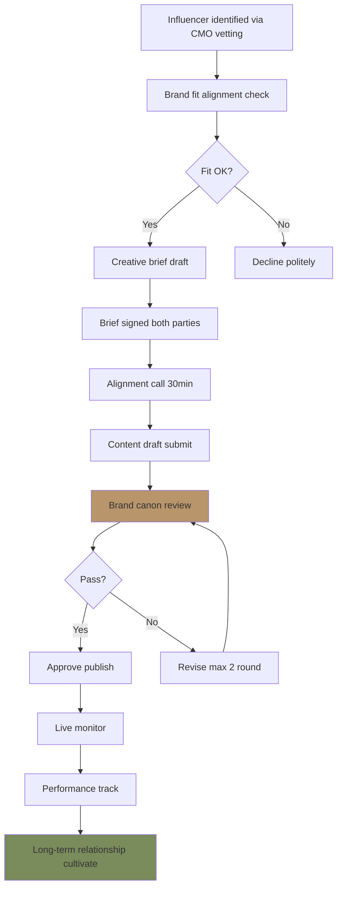
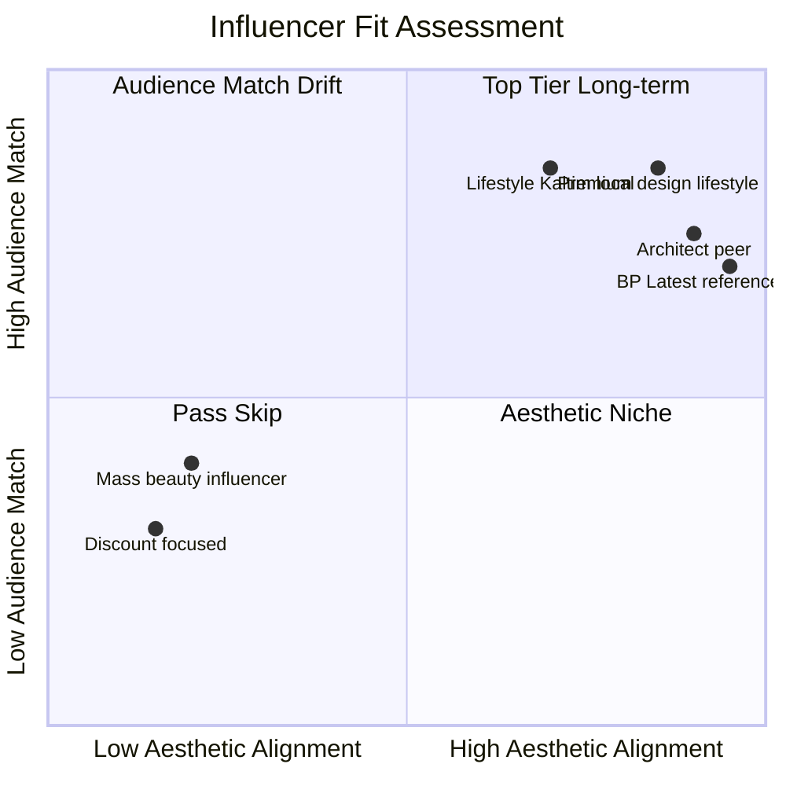

# Influencer Creative Brief

Generate creative brief untuk KOL / influencer / collaborator Gerai 1000 Pintu: brand canon strict, premium hangat tone, deliverable spec, performance criteria. Paired dengan CMO influencer-vetting + influencer-deal-structure.

## Triggers

Primary:
- "influencer brief"
- "KOL brief"
- "creator brief"

Secondary:
- "collab brief"
- "brand partnership brief"

## Input Required

| Field | Type | Required | Default |
|---|---|---|---|
| influencer_name | string | yes | - |
| collab_type | enum | yes | (single-post / series / event / long-term) |
| campaign | string | yes | (e.g., "Wave 1 Launch", "4-negara cultural reference Series") |
| budget | number | no | Rp |
| timeline | string | yes | - |

## Output Template

```markdown
# Influencer Creative Brief: {INFLUENCER} × Gerai 1000 Pintu

**Influencer:** {Name + handle}
**Collab type:** {Single / Series / Event / Long-term}
**Campaign:** {Name}
**Timeline:** {Start - End}
**Budget:** Rp {amount}
**Deliverable count:** {N}

## Why This Collab

### Brand fit alignment
- Influencer aesthetic: {Description vs BP Latest reference}
- Audience match: {Their followers vs our 6 Persona}
- Value alignment: {Premium curated, refined, not aggressive sales}

### Goal
- Awareness: {target reach}
- Engagement: {target engagement rate}
- Conversion: {konsultasi booking / website traffic / brand recall}
- Brand association: {what we want their audience to feel about Gerai}

## Campaign Context

### Brand Brief Quick Reference
**Brand:** Gerai 1000 Pintu — Tempat premium pintu di Indonesia di Balikpapan
**Position:** Premium tetapi inklusif retail with Door Expert konsultasi
**Anchor reference:** BP Latest reference magazine
**Philosophy:** Filosofi Dunia Pintu (4-negara cultural context: Jepang jiwa, Eropa seni, Amerika pernyataan, China gerbang rezeki — BUKAN mandatory archetype)
**Tone:** Premium hangat (calm + warm + refined) — NOT aggressive sales

### Current Campaign
- **Name:** {Campaign}
- **Period:** {Date range}
- **Message arc:** {What we communicating}
- **Target persona:** {Primary persona}

## Creative Direction

### Story Angle (mandatory)
{Specific angle this influencer should tell — NOT generic product placement}

### Sensory + Emotional Target
- **Feel:** Calm + welcomed + curious + aspirational achievable
- **Visual:** BP Latest reference-refined + Editorial warm + natural daylight
- **Verbal:** Premium hangat + Indonesian poetic literacy

### Anchor Reference for Inspiration
- Premium retail destination style
- BP Latest editorial
- Editorial atmosphere
- Indonesian design heritage

### Photography / Video Direction
- Lighting: Natural daylight + golden hour preferred
- Composition: Generous negative space, hero focal subject
- Color grade: Warm neutral, brass tone enhanced
- Subject: Per content type (refer below)

## Deliverable Specification

### Format Options

#### Single Post Collab
- 1 Instagram feed post
- 1 Story series (3-5 slide)
- 1 reel optional
- 1 carousel optional

#### Series Collab (4-negara cultural reference per dunia)
- 4 Instagram feed post (1 per dunia)
- 4 Story series sync
- 1 long reel summary
- Optional: blog feature / TikTok cross-post

#### Event Collab (Wave 1 launch attend)
- 1 announcement pre-event
- 1 live event Story
- 1 post-event feed reflection
- Optional reel of moment

#### Long-term Collab (3-6 month ambassador)
- Monthly Feed post (3-6)
- Bi-weekly Story features
- Quarterly reel deep-dive
- Optional: editorial blog feature

### Per Deliverable Spec
- **Resolution:** Min 1080x1080 (square) / 1080x1920 (vertical)
- **Photography:** Natural light editorial
- **Caption:** 100-200 word per post (Instagram feed)
- **Hashtag:** Brand canon hashtag minimum included (#Gerai1000Pintu + 4-5 supporting)
- **Brand canon:** STRICT compliance
- **Visual brand element:** Pintu OR brass focal must be visible in primary shot

## Caption Guidelines

### MUST include
- "Gerai 1000 Pintu" lengkap (first mention)
- Brand handle tagged "@gerai1000pintu"
- 1-2 anchor vocabulary (curated, refined, menemani, refleksi, hangat, dst)
- Authentic personal voice (NOT corporate)
- Soft CTA (konsultasi / showroom visit / web link bio)

### MUST avoid
- ❌ Em-dash (`—`)
- ❌ "rumah" customer-facing (use "tempat")
- ❌ Aggressive sales language ("BURUAN!", "JANGAN SAMPAI!")
- ❌ Discount-driven framing ("MURAH!", "DISKON!")
- ❌ All-caps body
- ❌ Generic stock phrase ("solusi terbaik", "produk berkualitas")
- ❌ Misleading exaggeration

### Caption Style Sample (for inspiration)

**Sample A: Personal story angle**
```
Saya sempat bingung memilih pintu untuk tempat baru saya.

Sampai berkunjung ke Gerai 1000 Pintu di Balikpapan. Door Expert mereka tidak 
langsung jualan. Mereka tanya cerita tempat saya. Filosofi Dunia Pintu (4-negara cultural context) menarik 
untuk saya pertimbangkan.

Saya pilih archetype Jepang untuk ruang utama. Brass yang hangat membuka 
pagi saya sekarang.

Konsultasi gratis tersedia di link bio @gerai1000pintu

#Gerai1000Pintu #Filosofi4Dunia #BalikpapanPremium #DoorExpert
```

**Sample B: Visual narrative angle**
```
Pagi di tempat baru.

Sinar pertama menemukan brass yang saya pilih. Detail Art Nouveau yang 
ditempa tangan. Saya berdiri sejenak. Pintu ini akan menemani saya 
bertahun-tahun.

Berkunjung ke Gerai 1000 Pintu di Balikpapan dan menemukan filosofi 
4-negara cultural reference membantu saya memahami karakter tempat saya.

@gerai1000pintu

#Gerai1000Pintu #PintuEropa #Filosofi4Dunia
```

## Brand Canon Quick Hit (One-pager untuk Influencer)

### Visual (mandatory)
- Palette OK: warm neutral, brass focal, ivory background
- Palette AVOID: rainbow saturated, gradient flashy, drop shadow heavy
- Photography style: BP Latest reference
- Photography AVOID: stock photo cliche, overlit harsh

### Verbal (mandatory)
- NO em-dash
- "tempat" not "rumah"
- "Gerai 1000 Pintu" lengkap (first mention)
- "Door Expert" preserved
- Premium hangat tone

### Anchor Vocabulary (suggested woven naturally)
- menemani, refleksi, kurasi, refined, hangat, ritual, perjalanan
- timeless, craftsmanship, bermakna, intim

## Approval Workflow

### Pre-shoot
1. Creative brief signed by influencer + Gerai
2. Brand canon reference shared
3. Story angle alignment call (30 min)
4. Photography mood board confirm

### Content draft review
1. Influencer submit draft (caption + visual)
2. Gerai CCO review brand canon compliance
3. Revision round (max 2 round)
4. Final approve before publish

### Post-publish
1. Live monitoring
2. Engagement reply (influencer + Gerai)
3. Performance tracking
4. Long-term relationship cultivation

## Performance Criteria

### Engagement KPI
- Engagement rate: ≥3% (industry benchmark) or per their baseline
- Save rate: Track (indicator of value)
- Share rate: Track
- Comment quality: Authentic engagement (not bot)

### Brand KPI
- Konsultasi booking from collab: tracked via UTM or unique code
- Website traffic spike: 24-48h post-publish
- Brand mention quality: positive sentiment
- Follower growth: brand account (kalau applicable)

### Quality KPI
- Brand canon compliance: 100%
- Aesthetic alignment: BP Latest reference visible
- Authentic voice maintained
- Long-term reputation alignment

## Anti-Pattern

### Avoid (influencer mistakes to prevent)
- ❌ Generic product placement (looks paid + lazy)
- ❌ Forced CTA every sentence
- ❌ Off-brand aesthetic (trendy filter, decorative font)
- ❌ Em-dash habit
- ❌ "Rumah" usage
- ❌ Discount-driven framing
- ❌ Misleading claim
- ❌ Overpromise (e.g., "Pasti bagus!")

### Embrace
- ✅ Authentic personal voice
- ✅ Story-driven content
- ✅ Sensory rich
- ✅ Premium hangat tone
- ✅ Subtle brand integration
- ✅ Long-term partnership feel

## Contract Quick Reference

### Standard terms (refer CMO influencer-deal-structure)
- Payment terms: 50% upfront, 50% post-publish
- Usage rights: 6-12 month standard
- Exclusivity: Non-exclusive (no compete brand pintu 3-month)
- Content ownership: Joint (both can repost)
- Disclosure: #ad #sponsored mandatory (transparency)

### Cancellation / dispute
- Brand canon violation: Required revise or contract void
- Performance below threshold: Discussion + adjustment
- Reputation issue (either party): Exit clause within 7 day

## Communication Channel

### Pre-collab
- Email formal proposal
- WhatsApp follow-up
- Zoom call alignment

### During collab
- WhatsApp working group (CCO + CMO + Influencer)
- Notion shared (asset + content draft)
- Approval via signed Doc

### Post-collab
- WhatsApp continued (relationship building)
- Quarterly check-in
- Future collab discussion

## Sample Brief Library

### Brief A: Single Post Launch Day
- Influencer: Lifestyle Kaltim @{handle}
- Format: 1 Feed + 3 Story slide
- Story angle: Visit experience first impression
- Photography: Storefront + product detail + konsultasi pod
- Caption: Personal voice narrative 150 word
- Hashtag: #Gerai1000Pintu #GrandOpening14Nov #BalikpapanPremium
- Budget: Rp 5jt
- Timeline: 14-21 Nov 2026

### Brief B: 4-negara cultural reference Series Long-term
- Influencer: Premium Indonesia design @{handle}
- Format: 4 Feed posts (1 per dunia) + 4 Story sync + 1 long reel summary
- Story angle: Filosofi Dunia Pintu (4-negara cultural context) exploration + personal selection
- Photography: Per dunia archetype embodied
- Caption: 200 word per post + summary 300 word
- Hashtag: #Filosofi4Dunia + per dunia tag
- Budget: Rp 25jt
- Timeline: Jan-Apr 2027 (1 per month)

### Brief C: Event Wave 1 Attend
- Influencer: Multi (3-5 influencer attend)
- Format: Pre-event tease + Live event Story + Post-event reflection
- Story angle: Witness BP-aligned launch Indonesia
- Photography: Event candid + venue refined
- Caption: Real-time + summary post-event
- Budget: Rp 15jt total (Rp 3-5jt per influencer)
- Timeline: 12-16 Nov 2026
```

## Visual Output

Influencer brief workflow:



Influencer fit quadrant:



## Knowledge Dependency

- visual-identity-system
- brand-canon-enforcer
- editorial-style-guide
- copywriting-framework
- caption-generator
- CMO influencer-vetting (paired)
- CMO influencer-deal-structure (paired)
- Filosofi Dunia Pintu (4-negara cultural context)
- 6 Persona spec

## Mode

Default: EXECUTION (generate brief)
Switch: DISCUSSION jika influencer fit ambigu (consult CMO vetting)

## Tools Required

- file-search
- artifacts (brief document)
- web-search (influencer aesthetic reference)

## Validation Criteria

- Brand fit alignment justified
- Goal explicit (awareness/engagement/conversion/association)
- Brand brief quick reference
- Creative direction (story + sensory + anchor)
- Deliverable spec per format option (single/series/event/long-term)
- Caption guidelines (MUST include + MUST avoid)
- Brand canon quick hit one-pager
- Approval workflow
- Performance criteria (engagement + brand + quality)
- Anti-pattern + embrace pattern
- Contract quick reference
- Sample brief library

## Sample I/O

**Input:** "Influencer brief untuk Premium Indonesia design influencer @{handle} Dunia Pintu series long-term Q1 2027 budget Rp 25jt"

**Output summary:**
- Influencer: Premium Indonesia design @{handle} (200K follower, aesthetic BP Latest reference-aligned)
- Type: Long-term series (3 month, 1 per dunia)
- Campaign: 4-negara cultural reference Series Q1 2027
- Budget: Rp 25jt total (Rp 5jt × 4 month + Rp 5jt bonus completion)
- Format: 4 Feed posts (1 per dunia) + 4 Story sync + 1 long reel summary + optional blog feature
- Story angle: Personal exploration filosofi Dunia Pintu (4-negara cultural context)
- Photography: Per archetype embodied (Jepang minimalist, Eropa craftsmanship, Amerika statement, China heritage)
- Caption: 200 word personal voice per post + 300 word reflection summary
- Hashtag: #Filosofi4Dunia + per dunia tag (#PintuJepang dst.) + #Gerai1000Pintu
- Brand canon: STRICT (no em-dash + "tempat" + Gerai 1000 Pintu lengkap + BP Latest reference + premium hangat)
- Approval: Each post review CCO before publish
- Performance KPI: 4%+ engagement, 50+ konsultasi inquiry, brand sentiment positive
- Contract: Non-exclusive 6 month, usage rights joint, disclosure mandatory
- Workflow + fit quadrant embedded

## Handoff

- CMO influencer-vetting (paired prior)
- CMO influencer-deal-structure (contract terms)
- brand-canon-enforcer (validation)
- caption-generator (caption draft)
- content-calendar-strategy (slot integration)
